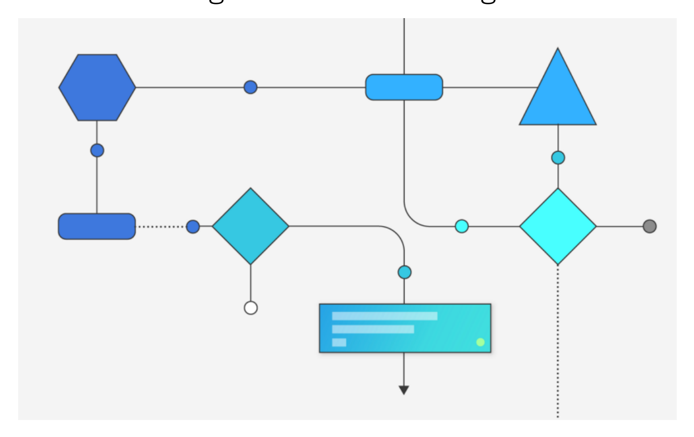
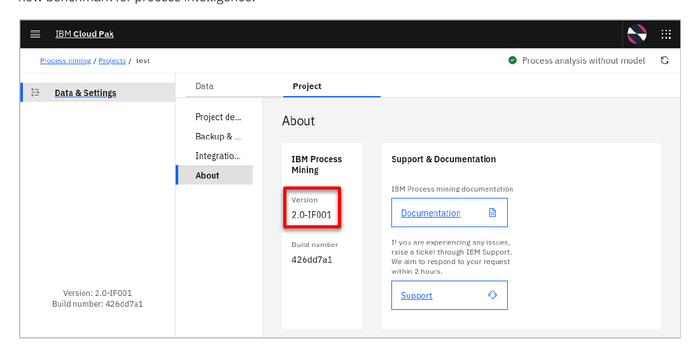

# Process Mining Level 4 실습 가이드

*실습 가이드 – Jira 티켓팅*

---

## 탐색

- [실습 1. 데이터 가져오기 및 프로세스 구성](11_Exercise1.md)
- [실습 2. 프로세스 발견 및 초기 분석](12_Exercise2.md)
- [실습 3. 대시보드 및 상황별 분석](13_Exercise3.md)
- [실습 4. What-if 분석 및 시뮬레이션](14_Exercise4.md)
- [실습 5. 운영 우수성 모니터링](15_Exercise5.md)
- [실습 요약](16_Summary.md)

**Level 4 – Process Mining**
**실습 가이드 – Jira 티켓팅**

### 고지 사항

이 정보는 미국에서 제공되는 제품 및 서비스를 위해 개발되었습니다. IBM은 이 문서에서 논의된 제품, 서비스 또는 기능을 다른 국가에서 제공하지 않을 수 있습니다. 현재 해당 지역에서 이용 가능한 제품 및 서비스에 대한 정보는 해당 지역 IBM 담당자에게 문의하십시오.

IBM 제품, 프로그램 또는 서비스에 대한 언급은 해당 제품, 프로그램 또는 서비스만 사용할 수 있음을 명시하거나 암시하는 것이 아닙니다. IBM의 지적 재산권을 침해하지 않는 범위에서 기능적으로 동등한 타 제품, 프로그램 또는 서비스를 사용할 수 있습니다. 단, 비IBM 제품의 운영을 평가하고 검증하는 것은 사용자의 책임입니다.

IBM은 이 문서에 설명된 주제와 관련하여 특허 또는 특허 출원이 있을 수 있습니다. 이 문서의 제공이 해당 특허에 대한 라이센스를 부여하는 것은 아닙니다. 라이센스 문의는 아래 주소로 서면 제출하십시오:

> IBM Director of Licensing, IBM Corporation
> North Castle Drive, MD-NC119, Armonk, NY 10504-1785, United States of America

### 상표 (Trademarks)

IBM, the IBM logo, and ibm.com are trademarks or registered trademarks of International Business Machines Corp., registered in many jurisdictions worldwide. Other product and service names might be trademarks of IBM or other companies.

© Copyright International Business Machines Corporation 2026.

---

## 소개

### 목차

- [이 실습에 대하여](#이-실습에-대하여)
- [실습 시나리오](#실습-시나리오)
- [사전 요건](#사전-요건)

---

### 이 실습에 대하여

IBM Process Mining 2.0.0은 사용자 인터페이스를 전면 개편하여 사용자 경험을 크게 향상시켰습니다. `What-if`, `Action Hub`, `Data & Settings` 등 새롭게 추가된 탭과 개선된 인터페이스를 통해 작업 흐름이 보다 선형적이고 일관성 있게 구성되었습니다. 또한 고급 AI 기능, 유연한 객체 중심 데이터 모델, 재설계된 시뮬레이션 도구를 바탕으로 프로세스 인텔리전스의 새로운 기준을 제시합니다.

이 실습에서는 IBM Process Mining을 활용하여 Jira 티켓팅 프로세스를 분석하는 전체 수명 주기를 단계별로 학습합니다. 데이터 가져오기 및 프로세스 구성부터 시작하여, 모델 뷰 분석, 처방적 마이닝 보고서 비교, 적합성 검사를 수행합니다. 이어서 대시보드를 활용한 성능 분석과 What-if 시뮬레이션을 진행하며, 모든 위젯을 직접 구성하여 대시보드를 처음부터 구축하는 방법도 익힙니다. 마지막으로 운영 대시보드를 통해 인사이트를 실제 행동으로 연결하는 흐름을 경험합니다. 이 실습은 IBM Process Mining 2.0을 기반으로 하며, 처방적 프로세스 마이닝(Prescriptive Process Mining) 등 최신 기능을 포함합니다.

이 실습은 다음 5개의 단계로 구성됩니다:

1. 데이터 가져오기 및 프로세스 구성
2. 프로세스 발견 및 초기 분석
3. 대시보드 및 상황별 분석
4. What-if 분석 및 시뮬레이션
5. 운영 우수성 모니터링

### 실습 시나리오

#### 배경 — 어떤 회사의 이야기인가

한 IT 회사의 **고객 지원팀**이 반복되는 운영 문제로 고민하고 있습니다.

- 고객과 약속한 **응답·해결 시간(SLA)을 자꾸 놓친다.**
- 담당자들이 **같은 티켓을 여러 번 다시 건드린다.**
- 비슷한 유형의 문제에 **지원 인력이 과도하게 투입되고 있다.**

현업 관리자들은 "뭔가 비효율적이다"라고 느끼지만, 정확히 **어느 단계에서 / 누구에게 / 얼마만큼** 낭비가 생기는지는 모릅니다. 여러분은 이 회사의 프로세스 분석가 역할로, **이벤트 로그 데이터로 문제를 진단하고 개선안의 효과를 사전 검증한 뒤, 위반 발생 시 실시간 알림까지 돌리는 전체 과정**을 5단계로 직접 수행합니다.

---

#### 분석 대상 — Jira 티켓 처리 프로세스란

이 실습의 데이터는 **Jira 티켓팅 시스템**에서 추출한 실제 이벤트 로그입니다. Jira는 전 세계 많은 IT 조직이 사용하는 이슈·업무 관리 도구로, 고객 요청·장애 신고·기능 요구 등을 "티켓(ticket)" 단위로 관리합니다. 각 티켓은 접수부터 종료까지 아래와 같은 **활동(activity)**을 거칩니다.

**정상 흐름 (Happy Path)**

1. **Open** — 고객(또는 내부 사용자)이 티켓을 접수해 생성
2. **First assigned** — 지원 담당자가 최초로 배정됨
3. **In progress** — 담당자가 작업 수행 중
4. **Resolved** — 담당자가 "해결 완료"로 표시
5. **Waiting for validation** — 고객의 해결 확인 대기
6. **Closed** — 티켓 최종 종료

**예외·재작업 흐름 (문제의 원인)**

실제 데이터에는 정상 흐름에 없는 활동이 자주 섞여 들어옵니다. 이것들이 **이 실습의 분석 대상**입니다.

- **Waiting for user** — 담당자가 사용자 응답을 기다리느라 프로세스가 멈춤
- **Change in request type** — 티켓의 요청 유형이 중간에 바뀜 (접수 시 분류를 잘못한 결과)
- **Change in person assigned** — 담당자가 중간에 다른 사람으로 교체됨 (첫 배정이 적절하지 않았다는 신호)
- **Change in priority · Change in incidence type** — 우선순위·이슈 유형 재조정
- **Resolution Rejected** — 고객이 해결 확인을 거부해 다시 처리로 돌아감

특히 주목해야 할 두 활동은 **Change in request type**과 **Change in person assigned**입니다. 둘 다 실제로는 "접수 시점의 잘못된 분류·배정"이 원인이며, 실습 2~4에 걸쳐 반복적으로 등장하는 **핵심 범인**입니다.

---

#### 알아 두어야 할 용어 3가지

프로세스 마이닝이 처음이어도 아래 세 용어만 알면 이 실습을 따라갈 수 있습니다.

- **SLA (Service Level Agreement)** — 고객과 맺은 **시간 약속**. 이 실습에서는 우선순위별로 다음 두 기한을 정의합니다.
  - 첫 응답 기한 : High 1일 · Medium 2일 · Low/Lowest 5일
  - 해결 기한 : High 2일 · Medium 5일 · Low/Lowest 40일
- **재작업 (Rework)** — 한 티켓 안에서 **같은 활동이 두 번 이상 반복**되는 것. "In Progress를 들락날락" 하는 패턴이 전형적이며, 재작업 횟수가 많을수록 비용이 누적됩니다.
- **이탈 (Deviation)** — **정상 흐름에서 벗어난 경로**로 진행된 케이스. 실습 2에서 전체 3,192건의 티켓 중 약 70%가 이탈로 분류되어, 이탈이 "가끔 있는 예외"가 아닌 **구조적 문제**임이 드러납니다.

---

#### 고객이 달성하려는 목표

이 실습의 회사는 아래 두 가지를 이루고 싶어합니다. 모든 분석과 개선안은 이 목표를 지원하는 방향으로 설계됩니다.

- **고객 만족도 향상** — SLA 준수율을 높여 응답·해결 지연으로 인한 불만을 줄임
- **효율성·생산성 개선** — 불필요한 변경(담당자 변경·요청 유형 변경 등)을 최소화하고 담당자 처리 시간을 단축

이 실습의 사용 사례는 Jira 티켓팅이지만, 동일한 접근법은 **구매·송장 처리·보험 청구·고객 온보딩** 등 단계가 있는 모든 업무 프로세스에 그대로 적용할 수 있습니다.

---

#### 무엇을 할 것인가 — 5단계 실습

실습은 5단계를 순서대로 진행합니다. **각 단계는 앞 단계의 출력물을 재료로 사용**하므로 순서를 건너뛸 수 없습니다.

1. **데이터 가져오기 및 프로세스 구성** *(실습 1)*    
   원시 CSV 파일을 프로세스 마이닝이 해석할 수 있는 **이벤트 로그**로 변환하고, 역할별 시간당 비용·자동화 속성 등 비즈니스 맥락을 부여합니다. 이후 분석에서 "건수"가 아닌 <strong>"비용(금액)"</strong>으로 문제를 말할 수 있는 기반을 만듭니다.
   - 데이터 가져오기 및 이벤트 로그 매핑
   - 세부 수준, 설정 및 비즈니스 지표 구성
   - BPMN 참조 모델 도출 및 적용

2. **프로세스 발견 및 초기 분석** *(실습 2)*    
   빈도·시간·비용·재작업 등 **여러 관점으로 같은 프로세스를 교차 분석**해 병목과 낭비가 집중된 활동을 찾아냅니다. "프로세스가 느린 것 같다"라는 감을 <strong>"어느 활동에서 / 얼마의 비용이 / 누구 때문에 생기는가"</strong>로 바꿉니다.
   - 모델 뷰 분석 (Frequency · Duration · Cost · Rework)
   - 적합성 검사 (참조 모델 대비 이탈 정량화)
   - 처방적 AI 보고서 자동 생성

3. **대시보드 및 상황별 분석** *(실습 3)*    
   SLA 준수율·이탈 영향·담당자 현황을 **이해관계자별 관점으로 시각화**합니다. 사전 구성 대시보드 2종을 가져와 분석하고, 현장 관리자용 대시보드 하나를 빈 캔버스에서 **직접 구축**해 봅니다.
   - 프로젝트 백업 가져오기 (사용자 정의 지표 · 필터 템플릿 포함)
   - SLA 성능 및 성능 저하 원인 분석
   - 이탈 및 비용 영향 분석
   - Resource Monitoring 대시보드 직접 구축

4. **What-if 분석 및 시뮬레이션** *(실습 4)*    
   실습 2·3에서 찾은 문제를 해결할 **개선안을 설계**하고, 실제 로그 패턴을 기반으로 **시뮬레이션**을 돌려 그 효과를 실행 전에 검증합니다. 연간 절감액과 투자 회수 기간을 숫자로 산출합니다.
   - 개선 시나리오 설계 (근본 원인 제거형)
   - As-Is 기준선 식별 → To-Be 시뮬레이션 → ROI 계산

5. **운영 우수성 모니터링** *(실습 5)*    
   자동화 시스템이 실제로 배포되기 전까지, **지금 진행 중인 티켓에서 SLA 위반·위험을 실시간으로 감지**하고 담당자에게 자동 알림을 보내는 체계를 만듭니다.
   - 운영 대시보드 가져오기 및 오류 수정
   - 실행 중 티켓 SLA 위반·위험 모니터링
   - Slack 등으로 위반 시 자동 알림 트리거하는 모니터 구성 방법 학습

---

#### 이 실습을 끝내면 손에 남는 것

각 단계가 끝난 뒤 여러분이 확보하게 될 구체적 결과물은 아래와 같습니다.

| 단계 | 결과물 |
|------|--------|
| 실습 1 | 분석 가능한 이벤트 로그 + 비용 모델 + BPMN 참조 모델 |
| 실습 2 | "두 Change 활동이 범인"이라는 **데이터 기반 진단** |
| 실습 3 | 5종 대시보드 · 사용자 정의 지표 · 객체 테이블 |
| 실습 4 | **€19K/년 절감 · 첫해 회수** ROI 비즈니스 케이스 |
| 실습 5 | 위반 시 Slack 자동 호출되는 **실시간 운영 안전망** |

이 결과물들은 Jira 티켓팅에만 쓰이는 것이 아니라 **다른 프로세스(구매·송장·보험 청구 등)에도 재사용 가능한 템플릿**으로 남습니다.

### 사전 요건

실습을 시작하기 전에 다음 사전 요건을 갖추었는지 확인하십시오:

- **IBM Process Mining 2.0 환경**: 실습 환경을 사전에 예약해야 합니다.
- **실습 파일**: 아래 파일들은 `labfiles.zip` 압축 파일에 포함되어 있습니다.
  - 소스 파일
    - `support_ticketing_full.csv`
    - `country_codes.csv`
  - 백업 파일
    - `Jira Ticketing_no dashboards.idp`
    - `Jira Ticketing_Full Backup.idp`
  - 대시보드
    - `Automation simulation.dashboard`
    - `Ticket Deviations.dashboard`
    - `Resource Monitoring.dashboard`
    - `Executive Business Dashboard.dashboard`
    - `Resolution SLA.dashboard`

