[← 소개로 돌아가기](10_Introduction.md)

---

## 실습 1. 데이터 가져오기 및 프로세스 구성

프로세스 마이닝은 세 가지 렌즈로 프로세스를 봅니다.

- **모델(Model) — 현실 지도**: 이벤트 로그에서 자동 발견된 AS-IS 흐름
- **BPMN — 이상 설계도**: "이렇게 돌아가야 한다"는 Should-Be 기준선
- **통계(Statistics) — 차이의 증거**: 현실과 이상의 격차를 숫자로 환산

이 세 렌즈가 있어야 "어디가 문제이고, 고치면 얼마나 좋아지는가"를 정량으로 답할 수 있습니다. 실습 1은 바로 이 세 렌즈가 작동할 **원본 재료**를 만드는 단계입니다. 구체적으로는 (1) Jira 티켓팅 CSV를 **이벤트 로그**로 매핑하고, (2) 시간 데이터에는 없는 **비용 모델**을 정의하며, (3) 현실 데이터에서 **Should-Be BPMN 참조 모델**을 도출합니다.

이 실습을 완료하면 이후 실습에서 수행할 적합성 검사·병목 분석·What-if 시뮬레이션이 모두 "€ 단위"로 말할 수 있게 됩니다.

> **참고:**
> 시작하기 전에 실습 환경을 예약해야 합니다. 환경 예약 및 접근 방법은 Process Mining L4 Environment Access 문서를 참조하십시오.
> 실습 파일을 로컬 디렉토리에 미리 다운로드해 두십시오.

### 목차

- [데이터 가져오기 및 이벤트 로그 매핑](#데이터-가져오기-및-이벤트-로그-매핑)
- [세부 수준, 설정 및 비즈니스 지표 구성](#세부-수준-설정-및-비즈니스-지표-구성)
  - [모델 세부 수준 구성](#모델-세부-수준-구성)
  - [자동화 속성 추가](#자동화-속성-추가)
  - [수동 활동 비용 정의](#수동-활동-비용-정의)
  - [역할 비용 정의](#역할-비용-정의)
  - [활동 작업 시간 정의](#활동-작업-시간-정의)
  - [활동 비용 정의](#활동-비용-정의)
  - [대기 중인 변경 사항 적용 및 분석 업데이트](#대기-중인-변경-사항-적용-및-분석-업데이트)
- [BPMN 참조 모델 도출 및 적용](#bpmn-참조-모델-도출-및-적용)
- [모든 필터 제거](#모든-필터-제거)
- [프로젝트 백업 생성](#프로젝트-백업-생성)
- [요약](#요약)

---

### 데이터 가져오기 및 이벤트 로그 매핑

> 이 섹션에서 하는 일 :    
>  Jira 티켓팅 CSV의 원시 행들을 **이벤트 로그**(케이스 ID + 활동 + 타임스탬프로 구성된 표준 형식)로 변환합니다.

> 왜 필요한가 :   
>  이벤트 로그는 프로세스 마이닝의 유일한 입력입니다. 어떤 열을 Process ID·Activity·Start time으로 삼느냐에 따라 이후 발견되는 프로세스 모델 자체가 달라지므로, 이 매핑이 분석의 품질을 결정합니다.

> 얻는 가치 :   
>  시스템에 흩어진 로그가 **"케이스별 활동 순서"**로 정렬되어, 사람이 인터뷰·보고서 없이도 실제 흐름을 추출할 수 있는 상태가 됩니다.

1. `Create a process-mining project` (A)를 클릭합니다.

   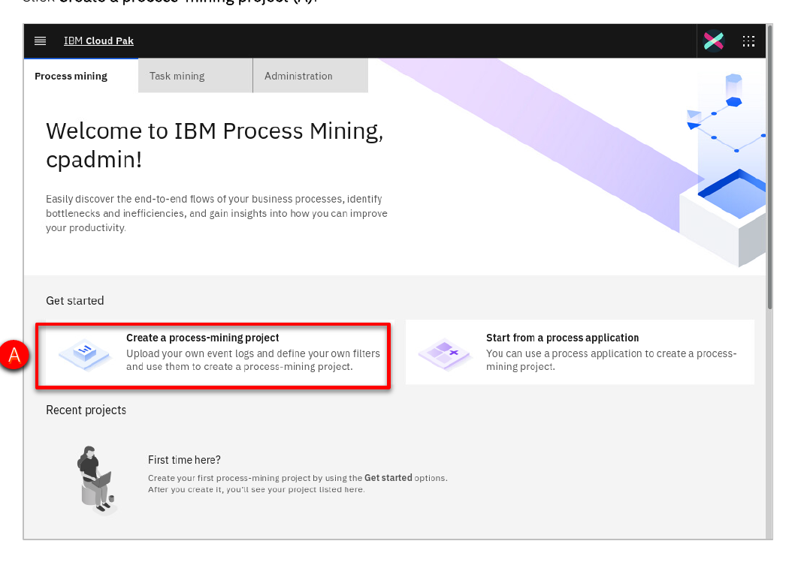

2. `Name`에 **Jira Ticketing** (A)을 입력하고, `Organization name`에서 **local** (B)을 선택한 후 `Create process` (C)를 클릭합니다.

   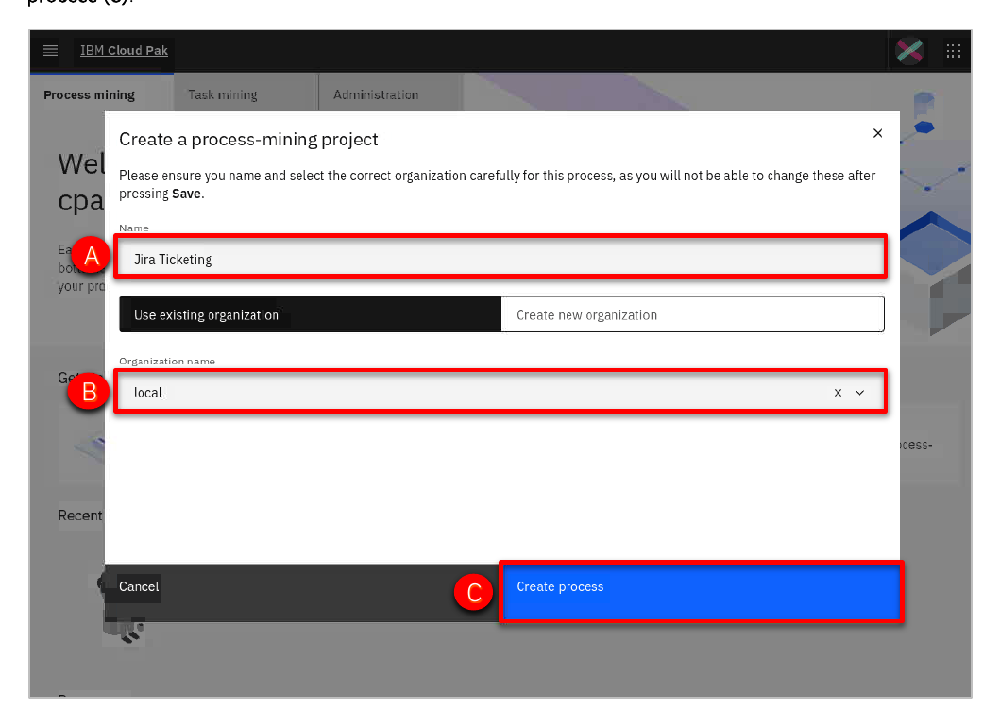

3. 다운로드한 labfiles 폴더에서 `support_ticketing_full.csv` 파일을 업로드 영역 (A)으로 드래그합니다. 파일을 놓을 수 있는 상태가 되면 상자가 파란색으로 강조 표시됩니다. 또는 해당 영역을 클릭하여 파일을 직접 선택할 수도 있습니다.
   파일이 업로드되면 IBM Process Mining에 데이터 매핑 누락 경고 메시지가 표시됩니다.

   > **참고:** 프로세스를 분석하려면 데이터 소스 파일을 업로드해야 합니다. 지원하는 파일 형식은 다음과 같습니다:
   > - .CSV
   > - .XES
   > - .ZIP
   > - .GZ

   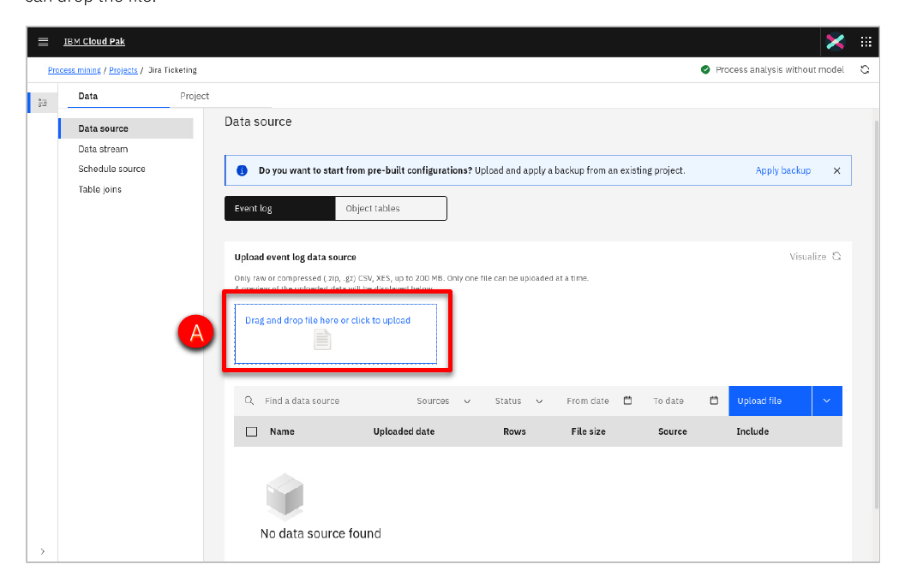

4. `Edit data mapping` (A)을 클릭합니다.
   데이터 과학자는 `case` 필드가 고유 ID를 가장 잘 표현하며 Process ID로 사용하기에 적합하다고 판단했습니다.

   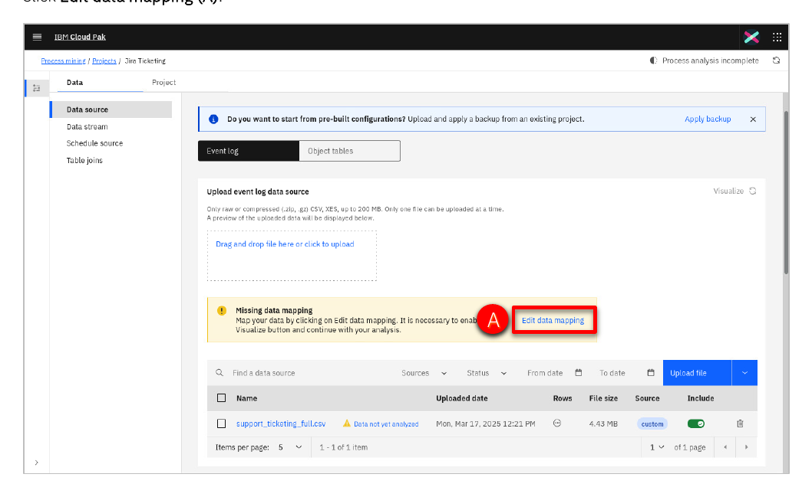

5. 첫 번째 열 필드의 매핑을 설정합니다. `case` 열은 `Process ID` (A), `activity` 열은 `Activity` (B), `startTime` 열은 `Start time` (C)으로 각각 선택합니다. 최소 필드 매핑이 완료되면 `Next` (D) 버튼이 활성화되는 것을 확인합니다. 아직 `Next`를 클릭하지 마십시오.

   > **핵심 3필드의 역할**: Process ID는 "어떤 케이스에 속하는가", Activity는 "무엇을 했는가", Start time은 "언제 했는가"를 결정합니다. 이 셋이 모여 하나의 이벤트를 정의하며, 이벤트들이 시간순으로 이어져 프로세스 흐름이 됩니다.

   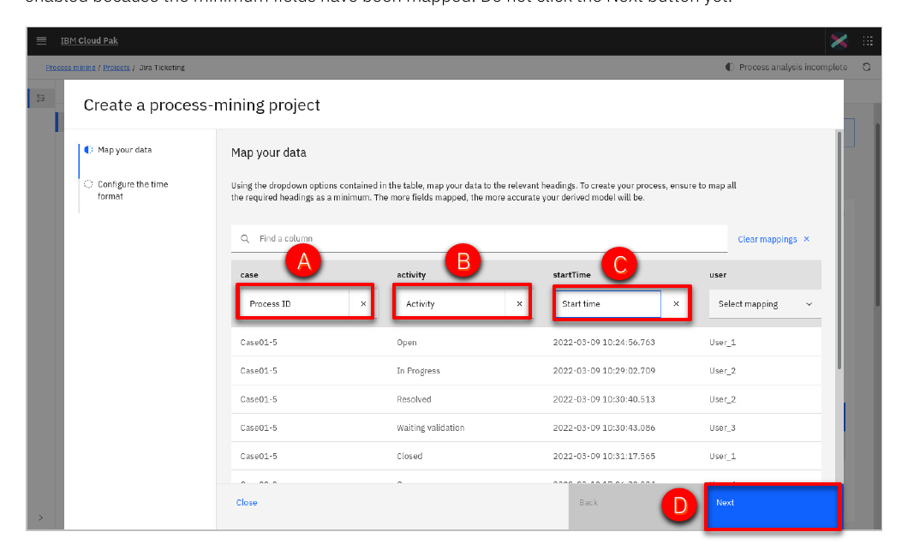

6. 나머지 필드를 매핑하려면 테이블 하단 (A)으로 스크롤하여 가로 스크롤바 (B)를 사용합니다. 헤더와 스크롤바를 동시에 보려면 화면을 최대화하는 것이 편리합니다.

   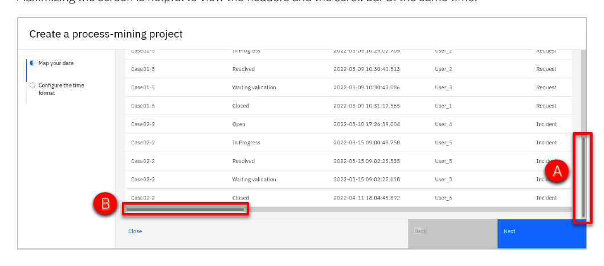

7. 테이블 하단의 스크롤바를 사용하여 아래 표에 따라 나머지 필드를 매핑합니다.

   표: 이벤트 로그 필드 매핑

   | 필드 | 매핑 |
   |------|------|
   | user | Resource |
   | issue_type | Text |
   | request_type | Text |
   | priority | Text |
   | assignee | Text |
   | security | Text |
   | country | Text |
   | company | Text |
   | project | Text |
   | MA | Text |
   | role | Role |

   > **참고:** Text는 영숫자를 포함할 수 있어 범용적으로 사용하기 좋습니다. numeric 또는 integer 등 다른 형식을 선택할 경우 실제 데이터 유형과 일치하는지 반드시 확인하십시오.

   > **왜 부가 필드까지 매핑하는가**: Resource·Role 매핑은 "누가 처리했는가"를 분석 가능하게 만들고(역할별 비용 산정의 입력), `MA`는 이후 자동화 속성의 기반이 되며, priority·country 등은 속성 분석(Attribute Analysis)에서 세분화 축으로 쓰입니다. 지금 매핑해 두지 않으면 뒤에서 해당 관점의 분석이 불가능합니다.

8. 모든 필드를 매핑한 후 `Next` (A)를 클릭합니다.
   IBM Process Mining이 날짜 형식을 자동으로 감지합니다.

   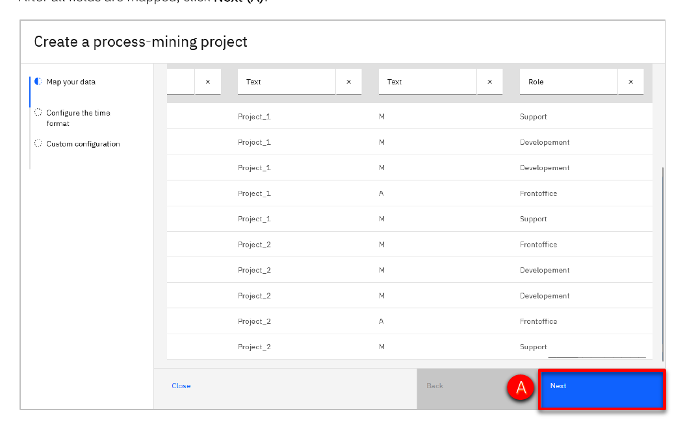

9. `Next` (A)를 클릭합니다.

   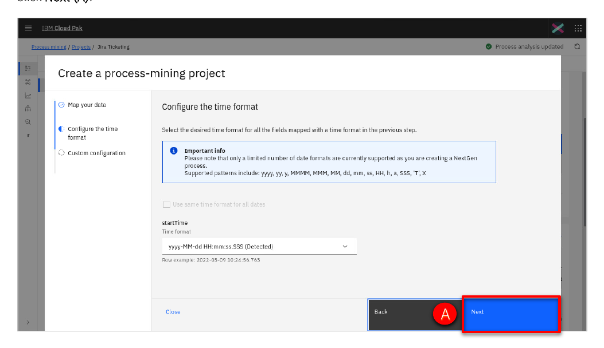

10. `Save` (A)를 클릭합니다.

11. 확인 메시지가 나타나면 `Go to the analysis` (A)를 클릭합니다.
   IBM Process Mining이 `Frequency` 뷰에서 프로세스를 엽니다.   

      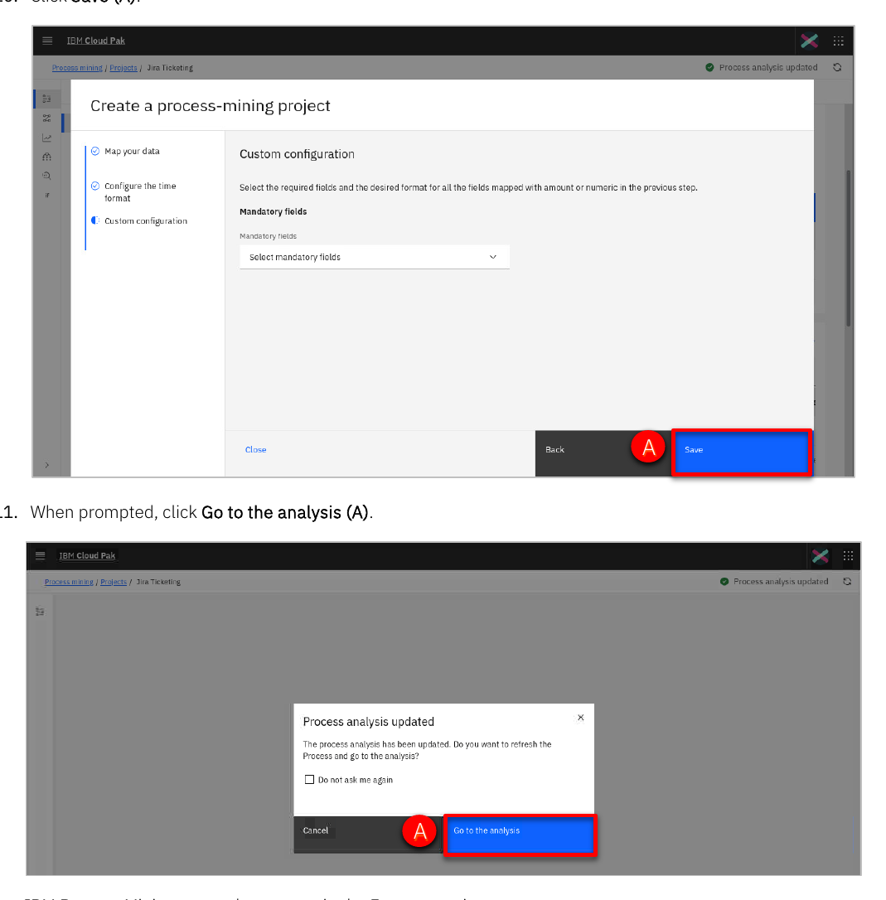

### 세부 수준, 설정 및 비즈니스 지표 구성

이벤트 로그가 만들어졌지만, 이대로는 "빈도 지도"만 있을 뿐입니다. 실질적 개선 근거를 내려면 두 가지를 추가로 해야 합니다: **(a) 모델을 사람이 해석 가능한 수준으로 정리**하고, **(b) 시간 데이터에 없는 "비용"을 입힐 수 있도록 비즈니스 지표를 정의**하는 것.

> **비용 모델 한눈에 보기 — 왜 이 5가지를 설정하는가**
>
> 이벤트 로그에는 **시간 정보만** 있고 **비용 정보는 없습니다.** 그래서 "€26,926 낭비", "연간 €9,770 절감 가능" 같은 금액이 나오려면 사용자가 비용 계산 공식을 부품 단위로 정의해 줘야 합니다.
>
> - **총 비용 = 수동 활동 비용 + 자동 활동 비용**
> - 수동 활동 비용 = **역할 비용(시간당) × 활동 작업 시간**
> - 자동 활동 비용 = **활동 비용(건당 고정)**
> - 수동/자동 구분은 **자동화 속성(MA 필드)**이 담당
>
> 이 구조가 있어야 자동화 ROI, What-if 시뮬레이션(실습 4), 이탈 비용 분석이 모두 작동합니다. 아래 5개 섹션은 이 공식의 부품을 하나씩 채우는 작업입니다.

초기에는 Frequency 모델이 표시됩니다. 초기 상태에서는 불필요한 데이터가 많이 보일 수 있으므로, 오른쪽 상단의 `Model detail` 설정을 조정하여 적절한 수준의 세부 정보만 표시되도록 모델을 조정할 수 있습니다.

#### 모델 세부 수준 구성

> 이 섹션에서 하는 일 :    
>  100%에서는 모든 예외·재작업·드문 경로가 다 그려져 **스파게티 프로세스**가 됩니다. 슬라이더를 내리면 **빈도 낮은 노이즈가 사라지고 Happy Path(정상 흐름)**가 선명해집니다.

> 왜 40%인가 :   
>  단순한 시각 조정이 아니라 **"뒤에서 만들 BPMN 참조 모델의 청사진"**을 미리 드러내는 작업입니다. 40%는 교육 목적의 지정값이며, 실제 현장에서는 30~50% 사이에서 "핵심 흐름이 깨지지 않는 선"을 찾습니다.

1. 오른쪽 상단 탐색 바의 `View mode` (A) 아이콘을 클릭하고 `Model detail` (B)을 펼칩니다.
2. `Model detail` 섹션에서 모델 세부 수준을 **40%** (C)로 설정합니다.

   > **팁:** 슬라이더를 마우스로 선택한 후 키보드 화살표 키를 사용하면 1%씩 세밀하게 조정할 수 있습니다.

   이 수준에서도 대안 경로와 재작업이 표시됩니다. 가독성과 정보의 완전성 사이에는 항상 절충이 필요합니다. 데이터를 가져온 후 가장 먼저 해야 할 일은 프로세스를 잘 표현할 수 있도록 모델의 세부 수준을 조정하는 것입니다.

3. 오른쪽 상단의 `View mode` (A) 아이콘을 다시 클릭하여 `Model details` 섹션을 닫습니다.   

      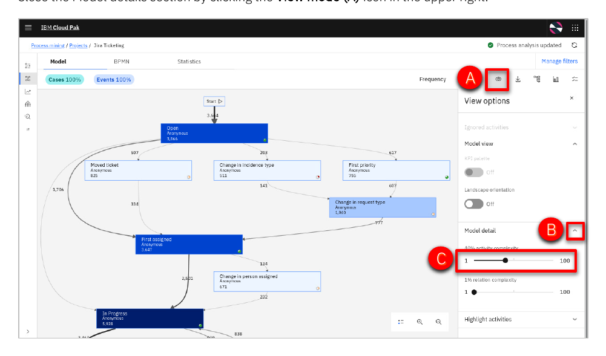

- 아래의 옵션을 설정 하면 Hands-On 문서의 화면과 동일 화면으로 실습을 진행 할 수 있습니다.

   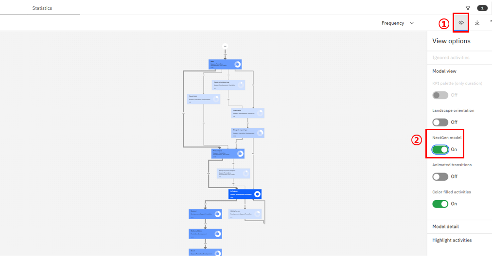

   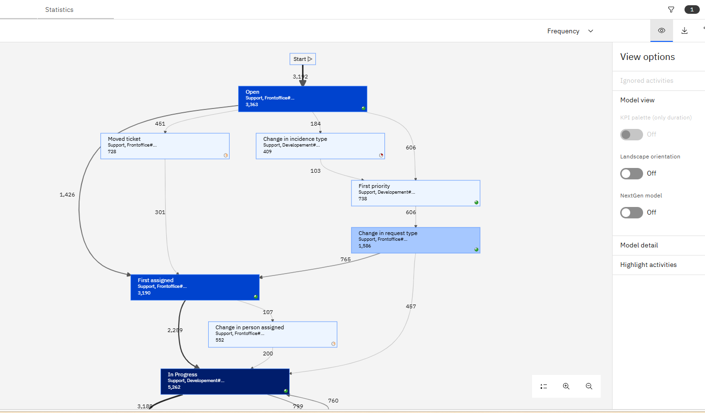

#### 자동화 속성 추가

> 이 섹션에서 하는 일 :    
>  `MA` 필드의 값 **"A"**가 "자동 처리"임을 IBM Process Mining에 알려, 각 이벤트를 **수동(Manual)/자동(Automated)으로 자동 분류**되게 만듭니다.

> 왜 필요한가 :   
>  이 설정이 없으면 모든 이벤트가 수동으로 계산되어 **비용이 과대 계상**되고, "자동화율 13%" 같은 KPI도 나오지 않습니다. 자동화 공백(automation gap) 탐지와 자동화 ROI 계산의 **시작 스위치**입니다.

데이터 과학자에 따르면 `MA` 필드는 리소스가 인적 자원인지 자동화인지를 나타냅니다. 자동화 속성을 생성할 때 자동화를 의미하는 참 값(이 경우 "A")을 `Automated field truth-value`에 입력합니다. 이를 통해 IBM Process Mining이 각 활동의 자동화 수준을 인식하고, 자동화 공백을 파악하는 데 활용할 수 있습니다.

1. 왼쪽 탐색 바에서 `Data & Settings` (A)를 클릭합니다.

2. `Attributes` (A)를 클릭합니다. 그런 다음 `Automation attributes` 섹션에서 `Edit automation attributes` (A)를 클릭합니다.

   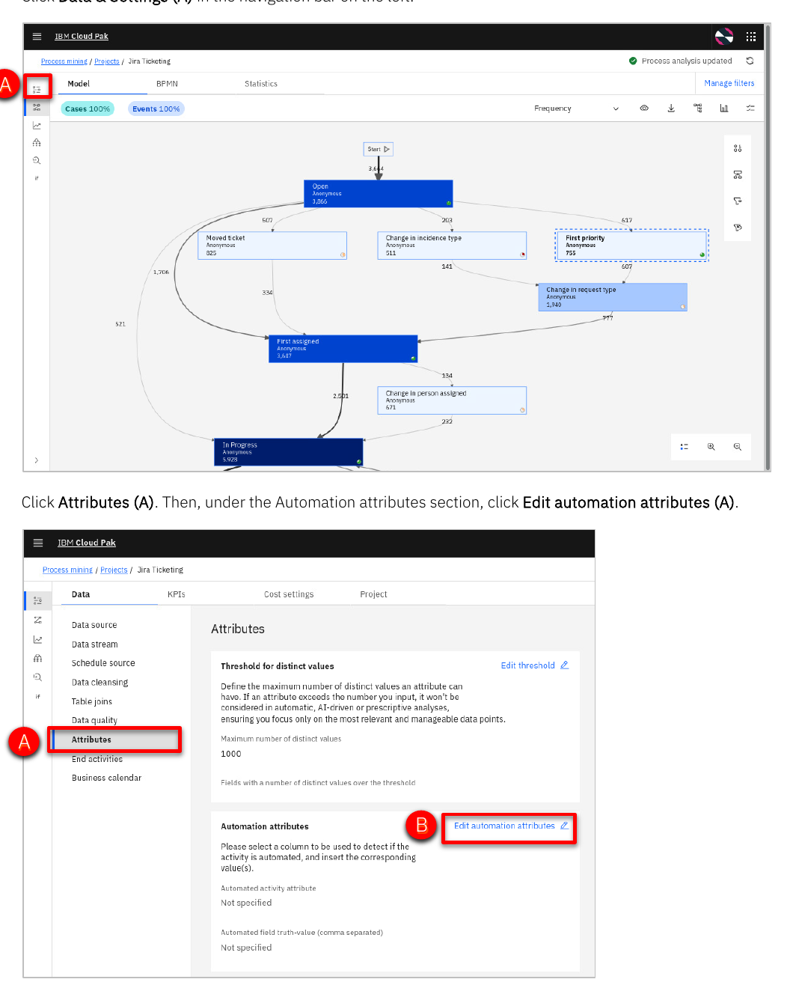

3. `Automated activity attribute`에 **MA** (A)를 선택하고 `Automated field truth-value`에 **A** (B)를 입력한 후 `Save` (C)를 클릭합니다.
   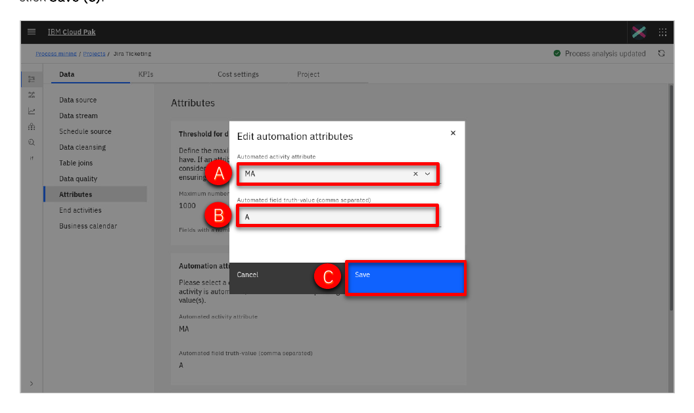

4. IBM Process Mining이 변경 사항을 추적하며 오른쪽에 대기 중인 변경 사항이 2개 (A) 있다고 표시되는 것을 확인합니다.

   프로세스 구성을 마친 후 `Apply`를 클릭하면 대기 중인 변경 사항이 모델에 반영됩니다. 그러나 다음 단계는 비즈니스 지표를 먼저 구성하는 것입니다. 비즈니스 지표는 고객으로부터 수집하는 입력값으로, KPI 임계값을 설정하거나 비용 정보를 입력하는 데 사용됩니다. 프로세스 마이닝은 일반적으로 시간 측면에서의 성능 개선에 활용되며, 비용 분석은 그 또 다른 핵심 측면입니다.
   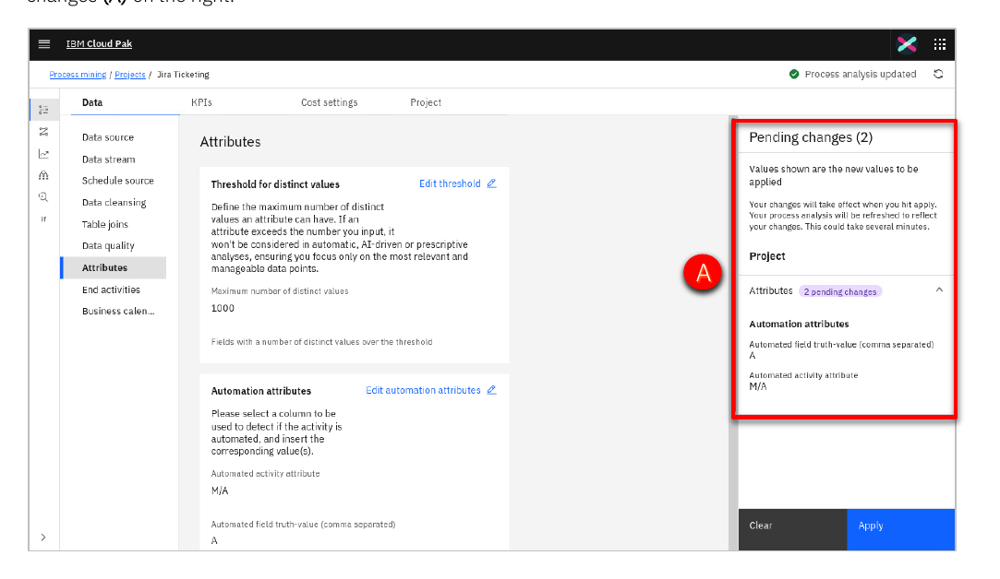

#### 수동 활동 비용 정의

> 이 섹션에서 하는 일 :    
>  수동 활동 비용의 **기본값**(시간당 €20)을 먼저 입력합니다. 아직 역할별 세분화 없이 "일단 Default"로 설정.

> 왜 기본값부터인가 :   
>  실무에서 고객은 HR 비용 데이터를 처음부터 공개하지 않는 경우가 많습니다. 기본값으로 **먼저 분석의 가치를 보여주면** 고객이 자발적으로 정확한 데이터를 제공하도록 유도할 수 있습니다(Progressive Disclosure 컨설팅 기법). 수치가 완벽하지 않아도 **"비용 개선 분석이 어떻게 작동하는지"**가 즉시 시연 가능해집니다.

리소스 및 역할 비용은 고객으로부터 정확한 수치를 얻기 어려운 경우가 많습니다. 이런 경우 처음에는 기본값을 입력하여 비용 개선 분석이 어떻게 작동하는지 고객이 먼저 경험하도록 하는 것이 효과적입니다. 이를 통해 고객이 보다 현실적인 분석을 위해 실제 비용 데이터를 제공하도록 자연스럽게 유도할 수 있습니다.

1. 상단의 `Cost settings` (A) 탭을 클릭합니다.
2. 왼쪽에서 `Resource costs` (B)를 클릭합니다.
3. `Add resource cost` (C)를 클릭합니다.

   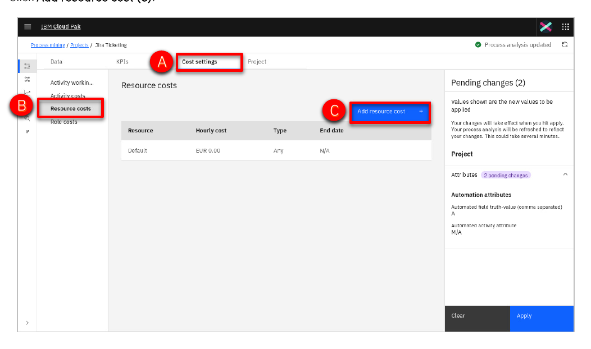

4. `Resource`는 **Default** (A)로 두고, `Hourly cost`에 **20** (B)을 입력하고, `Type`에서 **Manual** (C)을 선택한 후 `Add` (D)를 클릭합니다.
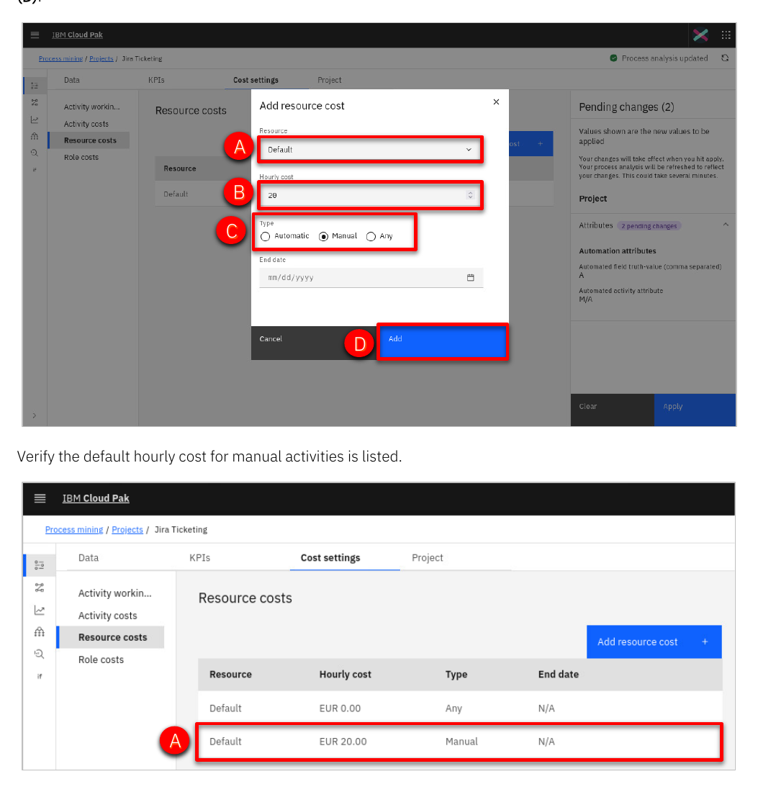

5. 수동 활동에 대한 기본 시간당 비용이 목록에 추가되었는지 확인합니다.

#### 역할 비용 정의

> 이 섹션에서 하는 일 :    
>  역할(Support / Front Office / Development / Dev Leader)별로 시간당 인건비를 차등 정의합니다.

> 왜 필요한가 :   
>  같은 "In Progress" 활동이라도 **사원 €20/h와 팀장 €60/h는 3배 차이**입니다. 누가 처리하느냐에 따른 비용 차이를 반영해야 "팀장이 단순 업무에 투입되고 있다" 같은 **비용 비효율**이 드러납니다. 이 값이 **수동 비용 공식(역할×시간)의 첫 번째 축**입니다.

고객으로부터 역할별 비용 데이터를 제공받았습니다. 이 데이터를 활용하면 모델이 더 정확한 분석 결과를 제공할 수 있습니다.

1. `Role costs` (A)를 클릭한 다음 `Add role cost` (B)를 클릭합니다.

2. `Role`에서 **Support** (A)를 선택하고, `Hourly cost`에 **20** (B)을 입력한 후 `Add` (C)를 클릭합니다.

   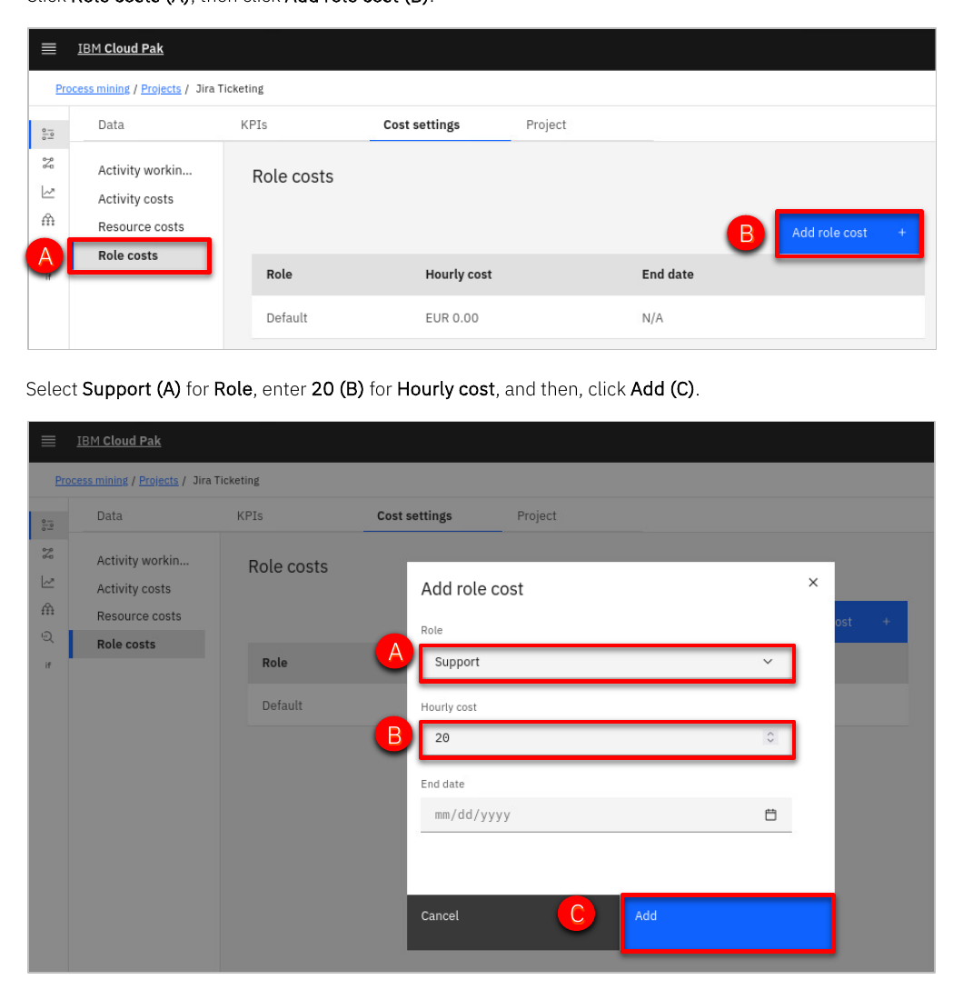

3. 아래 표의 데이터를 참고하여 나머지 역할 비용을 동일한 방법으로 추가합니다.

   표: 역할 비용

   | 역할 | 비용 |
   |------|------|
   | Front Office | 20.00 |
   | Developement | 35.00 |
   | Dev Leader | 60.00 |

4. 네 가지 역할에 대한 비용이 모두 정의되어 있는지 확인합니다 (A).
   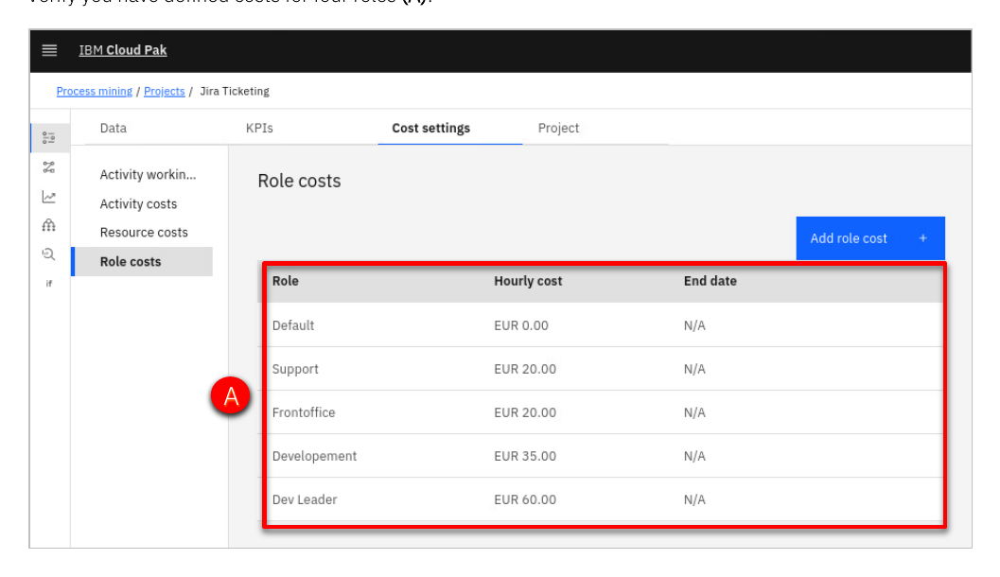

#### 활동 작업 시간 정의

> 이 섹션에서 하는 일 :    
>  수동 활동 1회당 **실제 순수 작업 시간**(10분)을 정의합니다.

> 왜 별도로 정의하는가 :   
>  이벤트 로그의 타임스탬프는 **상태 변경 시점**만 기록합니다. "In Progress 4시간"이어도 그 사이에 점심·회의·타 업무가 섞여 있을 수 있어 **상태 지속 시간 ≠ 실제 작업 시간**입니다. 인건비를 현실적으로 산정하려면 "순수 작업 시간"을 분리해 정의해야 합니다. 이 값이 **수동 비용 공식(역할×시간)의 두 번째 축**입니다.

활동 작업 시간은 역할 비용과 함께 사용되는 값으로, 리소스가 특정 활동에 실제로 투입하는 시간을 의미합니다. 고객으로부터 구체적인 수치를 제공받지 못한 경우에는 기본값을 입력할 수 있습니다. 이 실습에서는 수동 활동을 완료하는 데 평균 10분이 소요된다고 가정합니다.

1. `Activity working time` (A)를 클릭한 다음 `Add default activity working time` (B)를 클릭합니다.
   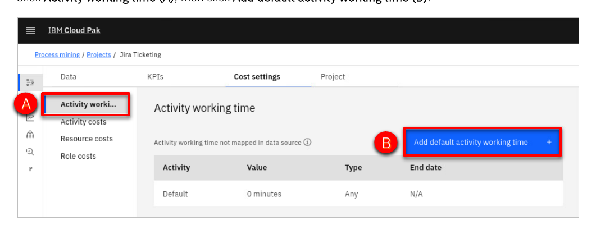

2. `Resource`는 **Default** (A)로 두고, `Value`에 **10** 분 (B)을 입력하고, `Type`에서 **Manual** (C)을 선택한 후 `Add` (D)를 클릭합니다.

   활동 작업 시간은 활동의 전체 소요 시간이 아니라, 리소스가 해당 활동에 실제로 투입한 시간만을 의미합니다. 예를 들어, 소스 시스템에서 두 활동 사이의 경과 시간이 3일로 기록되어 있더라도, 실제 담당자가 해당 활동에 소비한 작업 시간은 10분에 불과할 수 있습니다.

   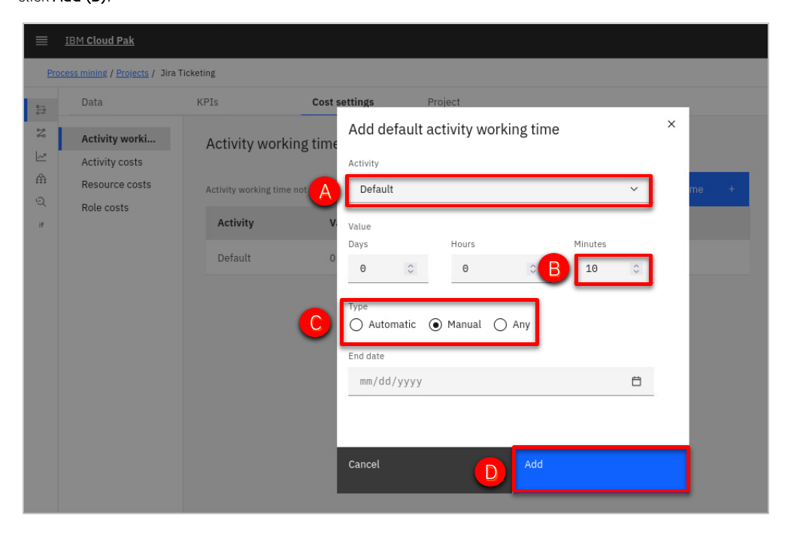

   보다 정확한 수치를 얻으려면 고객이 직접 측정하여 제공해야 합니다. 또는 IBM Task Mining을 활용하면 활동 작업 시간을 추정할 수 있습니다.

3. 수동 활동에 대해 10분의 활동 작업 시간이 정의되어 있는지 확인합니다 (A).
   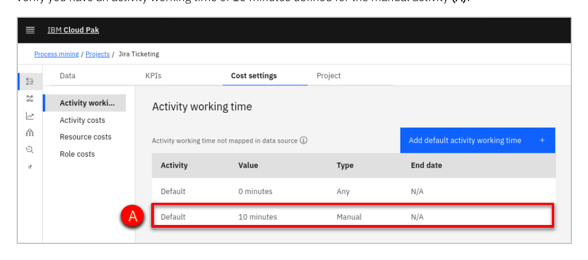

#### 활동 비용 정의

> 이 섹션에서 하는 일 :    
>  자동 활동 1건당 **고정 비용(€1)**을 정의합니다. 시간·수행자와 무관한 건당 단가.

> 왜 필요한가 :   
>  자동화도 공짜가 아닙니다 — 서버·라이선스·RPA 유지보수·API 호출 등 **시간에 비례하지 않는 비용**이 발생합니다. 이걸 반영해야 "수동 €5/건 vs 자동 €1/건" 같은 **현실적 ROI 비교**가 가능해집니다. 이 값이 **자동 비용 공식(건당 고정)**을 완성합니다.

> 역할 비용과의 차이 :   
>  역할 비용은 "시간당 × 작업 시간"(수동), 활동 비용은 "건당 고정"(자동). 둘은 분석 대상이 다른 서로 보완적인 항목입니다.

활동 비용은 활동이 한 번 실행될 때마다 발생하는 고정 비용으로, 담당 리소스나 소요 시간에 관계없이 일정하게 적용됩니다. 주로 자동화 비용을 평가할 때 활용됩니다. 자동화에는 유지 관리 비용이 수반되는데, 인적 자원에 비해 훨씬 낮더라도 비용으로 반영해야 합니다.

1. `Activity costs` (A)를 클릭한 다음 `Add activity cost` (B)를 클릭합니다.

   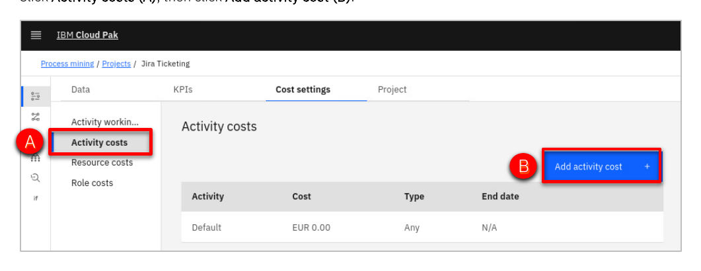

2. `Activity`는 **Default** (A)로 두고, `Cost`에 **1** (B)을 입력하고, `Type`에서 **Automatic** (C)을 선택한 후 `Add` (D)를 클릭합니다.

3. 자동 활동에 대해 1.00 유로의 활동 비용이 정의되어 있는지 확인합니다 (A).
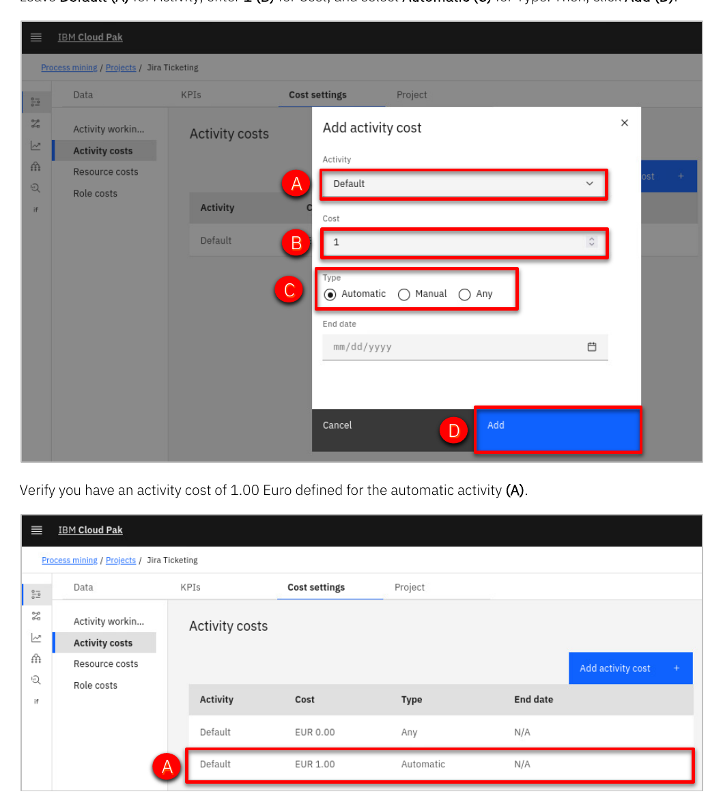

#### 대기 중인 변경 사항 적용 및 분석 업데이트

> 이 섹션에서 하는 일 :    
>  지금까지 입력한 자동화 속성·4종 비용 설정을 **한꺼번에 모델에 반영**합니다. 이 시점 이후부터 Frequency 뿐 아니라 **Cost 뷰**가 의미 있는 숫자를 갖게 됩니다.

프로세스 세부 정보, 설정 및 비즈니스 지표 구성이 완료되었으므로 이제 변경 사항을 모델에 적용할 수 있습니다. 오른쪽 패널에는 적용될 새 값의 요약이 `Project`와 `Business Metrics` 그룹으로 구분되어 표시됩니다.

1. 오른쪽 하단의 `Apply` (A)를 클릭합니다.

2. 확인 메시지가 나타나면 `Go to the analysis` (A)를 클릭합니다.

   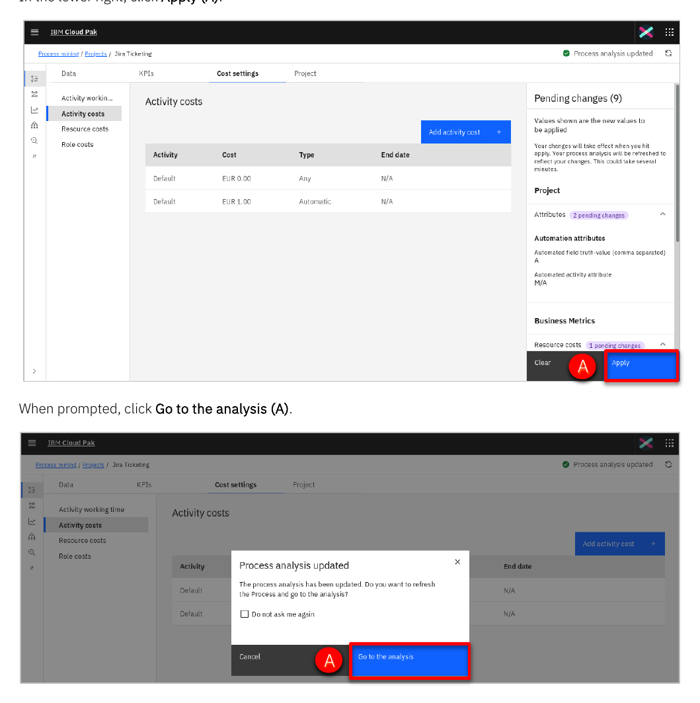

3. IBM Process Mining이 변경 사항을 적용하고 `Frequency` 모델이 열렸는지 확인합니다.

   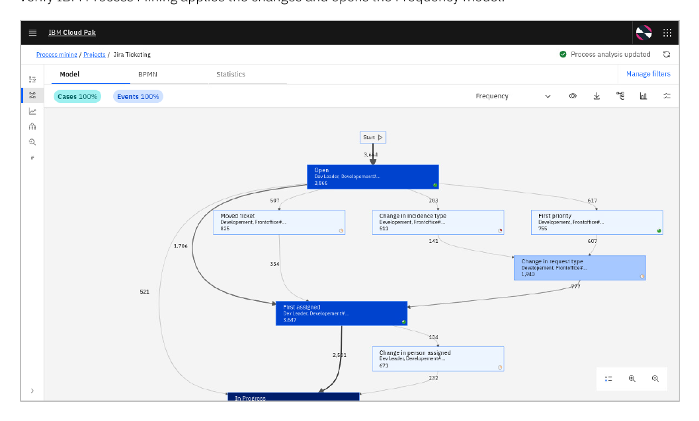

### BPMN 참조 모델 도출 및 적용

> 이 섹션에서 하는 일 :    
>  967개의 실제 경로(variant) 중 **빈도+효율성** 상위 2개를 "정상 경로"로 선언하고, 이를 **Should-Be BPMN**(현재 시스템에서 도달 가능한 최적 흐름)으로 정형화해 참조 모델로 등록합니다.

> 왜 참조 모델이 필요한가 :   
>  적합성 검사(실습 2)는 "실제가 기준에서 얼마나 벗어났는가"를 측정합니다. 기준이 없으면 이탈도 없고, 이탈 비용 정량화도 불가능합니다. 고객은 대개 SOP 문서를 주지 않기 때문에 **실제 데이터에서 역으로 기준을 도출**해야 합니다.

> 왜 상위 2개 variant인가 :   
>  단순히 "빈도 1·2위"가 아니라 **빈도 + 짧은 단계 수 + 합리적 소요시간**을 모두 만족하는 경로를 고릅니다. 재작업·Change 활동이 끼어든 긴 경로는 빈도가 높아도 Happy Path가 아닙니다. 필터링은 **"어떤 경로를 '정상'으로 선언할 것인가"**라는 전략적 의사결정입니다.

참조 모델은 고객이 기대하는 프로세스 동작 방식을 정의한 것으로, 항상 사전에 제공되는 것은 아닙니다. 경우에 따라서는 고객으로부터 직접 받기도 하지만, 대부분은 실제 데이터에서 도출해야 합니다.

참조 모델을 가져오면 IBM Process Mining의 적합성 검사 기능이 활성화되어, 예상 동작과 실제 동작을 비교하고 이탈이 프로세스 KPI에 미치는 영향을 분석할 수 있습니다.

1. 상단 탐색 바에서 `Variants` (A) 아이콘을 클릭합니다.
2. 처음 두 변형 (B, C)의 체크박스를 선택한 후 `Create filter` (D)를 클릭합니다.

   > **관찰 포인트**: 두 variant의 합계 커버리지(약 26%), 단계 수, 평균 소요시간을 먼저 눈으로 확인해 보십시오. B가 단계는 적은데도 C보다 소요시간이 더 길다면, **"단계가 짧다고 반드시 빠른 게 아니다"**라는 인사이트가 나옵니다 — 단계 내부 대기 시간이 길다는 신호입니다. 이런 관찰이 이후 병목 분석의 실마리가 됩니다.

   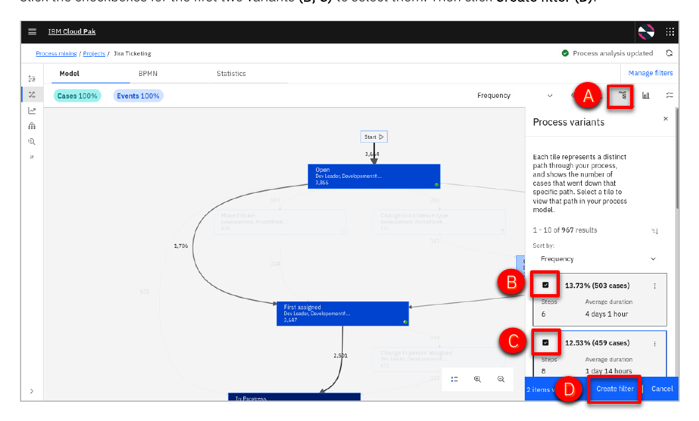

3. 필터 이름 (A)을 입력하고 `Create filter` (B)를 클릭합니다.
   이렇게 하면 가장 빈번한 두 변형을 기반으로 필터가 생성됩니다. 이는 프로세스에서 가장 일반적인 동작을 반영하는 케이스의 하위 집합을 나타냅니다.
   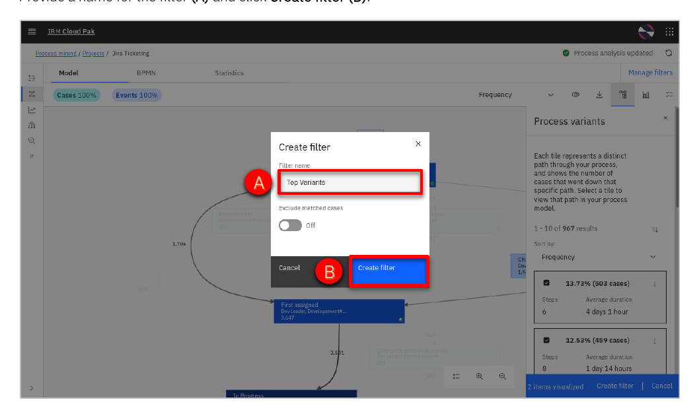

4. 확인 메시지가 나타나면 `Go to the analysis` (A)를 클릭합니다.

   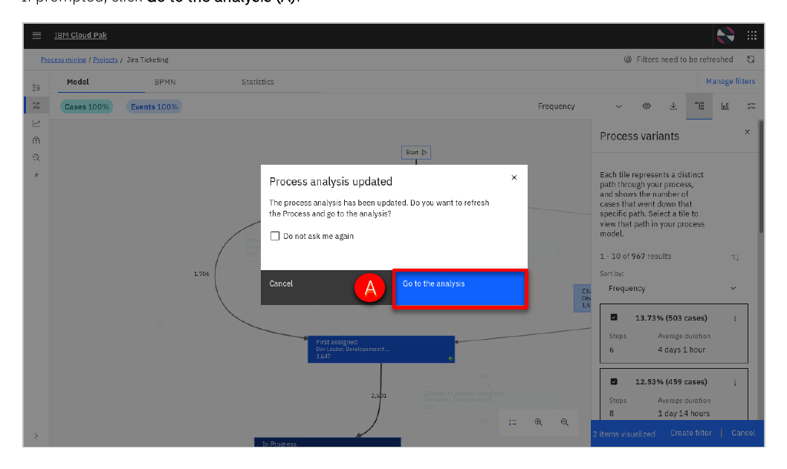   

   IBM Process Mining이 새 필터가 적용된 모델로 새로 고침됩니다. 필터가 생성되었으므로 이제 필터링된 프로세스 변형을 기반으로 BPMN 참조 모델을 생성할 수 있습니다. IBM Process Mining은 현재 시각화된 프로세스 모델에 해당하는 BPMN 모델을 자동으로 생성해 주며, BPMN 또는 XPDL 형식으로 내보낼 수도 있습니다.

5. 탐색 바에서 `BPMN` (A) 탭을 선택합니다.
   IBM Process Mining이 현재 필터링된 모델을 기반으로 BPMN 모델을 표시합니다.

6. 오른쪽의 파란색 아래 화살표 (B)를 클릭하고 `Edit a copy in business repository` (C)를 선택합니다.
   여기서 도출된 BPMN 모델을 고객의 기대 프로세스 동작에 맞게 세부 조정할 수 있습니다. 예를 들어, 선택한 변형에 비준수 경로가 포함되어 있거나 일부 활동이 누락된 경우 BPMN 모델을 편집하여 반영할 수 있습니다. 조정을 마친 후에는 프로세스로 돌아가서 이 BPMN 모델을 참조 모델로 지정합니다.
   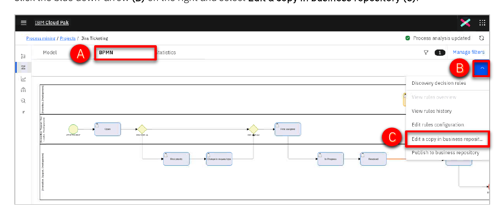

7. `Save` (A)를 클릭합니다. 저장된 로컬 복사본의 이름 (B)을 기록해 둡니다. 이후 단계에서 이 모델을 참조 모델로 등록할 때 사용합니다.
8. 오른쪽 상단 이동 경로에서 `Projects` (C)를 클릭하여 `Business repository`를 종료합니다.

   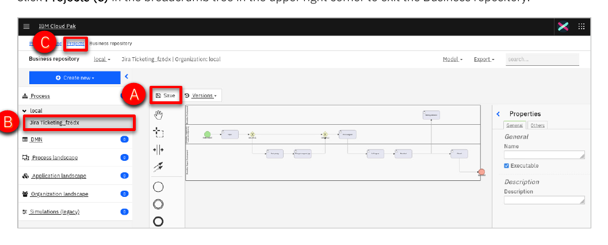

      IBM Process Mining이 원래의 BPMN 모델 화면으로 돌아갑니다.

      > **잠깐 — 왜 "BPA 저장" 후에 또 "Get from BPA"로 등록하나요?**
      >
      > 처음 보면 중복 같지만, 두 단계는 역할이 다릅니다.
      >
      > - **BPA(Business Process Automation)** = 회사 전체가 공유하는 **BPMN 중앙 저장소(도서관)**
      > - **Save to BPA** = 도서관에 책 **기증**
      > - **Get from BPA** = 도서관에서 책 **대출**해 이 프로젝트의 참조 모델로 **확정**
      >
      > 분리 이유: (1) 같은 BPMN을 여러 프로젝트가 재사용, (2) 버전 관리, (3) 거버넌스·권한, (4) RPA·Workflow 등 타 도구와의 공유, (5) "실수로 기준이 바뀌는 것"을 막는 안전장치. 소규모 실습에는 과해 보이지만, IBM Cloud Pak의 엔터프라이즈 설계 원칙입니다.

9. 왼쪽 탐색 바에서 `Data & Settings` (A)를 클릭합니다.
   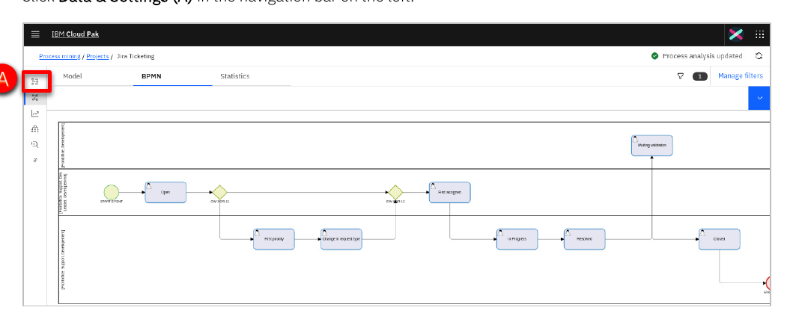

10. 상단의 `Project` (A) 탭을 선택합니다.
11. `Reference model` (B)을 클릭합니다.
12. `Add reference model` (C)을 클릭합니다.   

     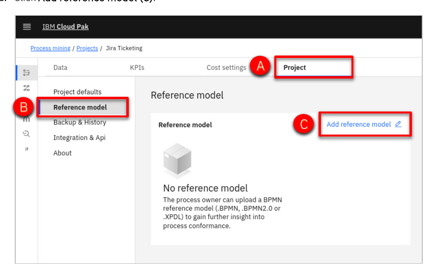

13. `Get from BPA` (A)를 클릭한 다음 앞서 저장한 참조 모델 (B)을 선택하고 `Add reference model` (C)를 클릭합니다.
   비즈니스 저장소에 복사본을 저장해 두었으므로 여기서 바로 불러올 수 있습니다.
   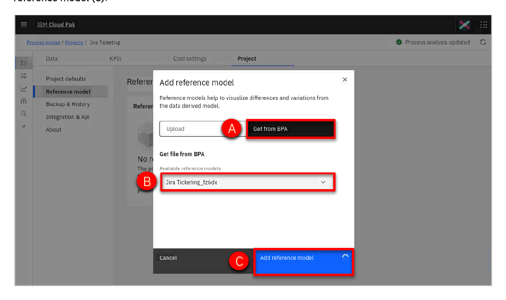

14. 확인 메시지가 나타나면 `Go to the analysis` (A)를 클릭합니다.
   이제 적합성 검사를 위한 참조 모델이 등록되었습니다. 프로세스 소유자가 별도의 참조 모델 파일을 보유하고 있는 경우, 외부 파일로도 업로드할 수 있습니다.    

      다음 단계는 이전에 적용한 필터를 제거하여 기본 상태로 되돌리는 것입니다.   

      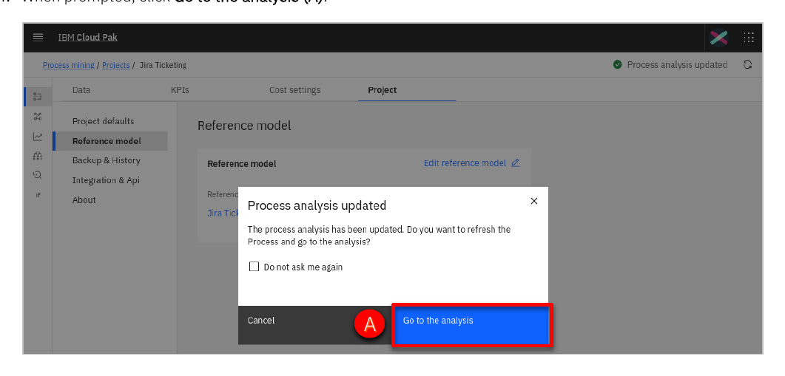   

### 모든 필터 제거

> 왜 필터를 제거하는가 :   
>  상위 2개 variant 필터는 **참조 모델을 만들기 위한 임시 필터**였습니다. 이제 BPMN이 기준으로 확정되었으므로, 이후 실습에서는 **전체 967개 경로**를 놓고 "이 중 얼마나가 기준에 부합하고 얼마나가 이탈하는가"를 측정해야 합니다. 필터를 두면 전체 분석이 불가능하므로 반드시 제거해야 합니다.

1. 오른쪽 상단 모서리에서 `Manage filters` (A)를 클릭합니다.

   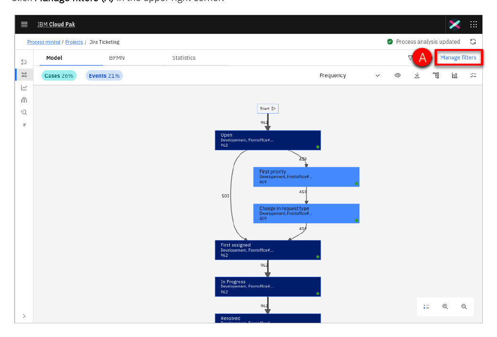

2. `Remove all filters` (A)를 클릭한 후 `Apply` (B)를 클릭합니다. `Remove all filters`를 클릭하면 `Apply` 버튼이 활성화됩니다. 이 화면에서 필터를 하나씩 제거하거나 한 번에 모두 제거할 수 있습니다.

   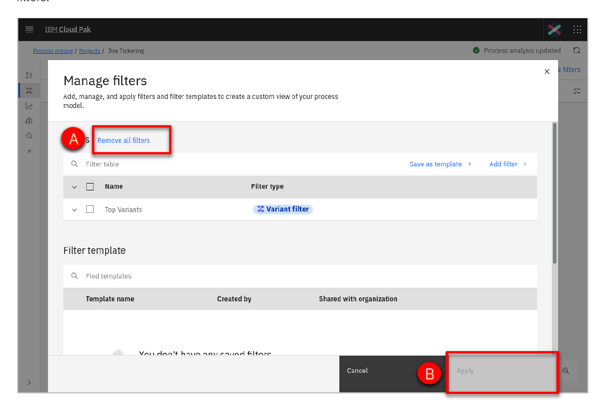

3. 확인 메시지가 나타나면 `Go to the analysis` (A)를 클릭합니다.
   프로세스 구성이 완료되었습니다.
   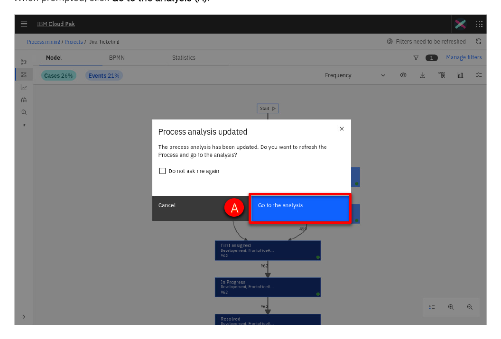

### 프로젝트 백업 생성

> 왜 백업하는가 :   
>  지금까지 구성한 **필드 매핑 + 자동화 속성 + 4종 비용 설정 + 참조 모델**은 이 프로젝트의 "분석 자산"입니다. 유사한 티켓팅 시스템을 분석해야 할 때 이 백업을 불러오면 처음부터 다시 설정할 필요가 없습니다. 또한 실습을 중단했다가 재개할 때 **복구 지점**으로도 사용됩니다.

초기 가져오기, 매핑 및 구성이 완료되었으므로 프로젝트 백업을 생성합니다.

1. 왼쪽 탐색 바에서 `Data & Settings` (A)를 클릭합니다.
2. 상단의 `Project` (B) 탭을 클릭합니다.
3. `Backup & History` (C)를 클릭합니다.
4. `Create backup` (D)를 클릭합니다.

5. 이름 (A)을 입력하고 기본 설정 (B)을 그대로 둔 후 `Create backup` (C)를 클릭합니다.

   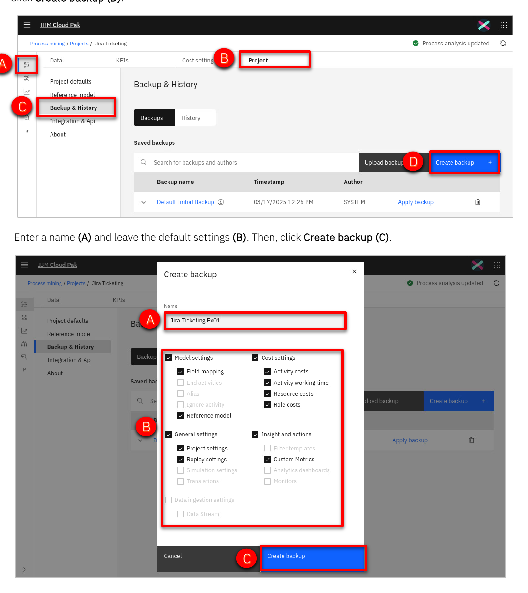

6. 링크 (A)를 클릭하여 백업 파일을 다운로드하고 로컬 컴퓨터에 저장합니다.
   IBM Process Mining이 기본 다운로드 폴더에 파일을 저장합니다.
7. `Process Mining` breadcrumb (A)를 클릭하여 Process Mining 시작 페이지로 돌아갑니다.

   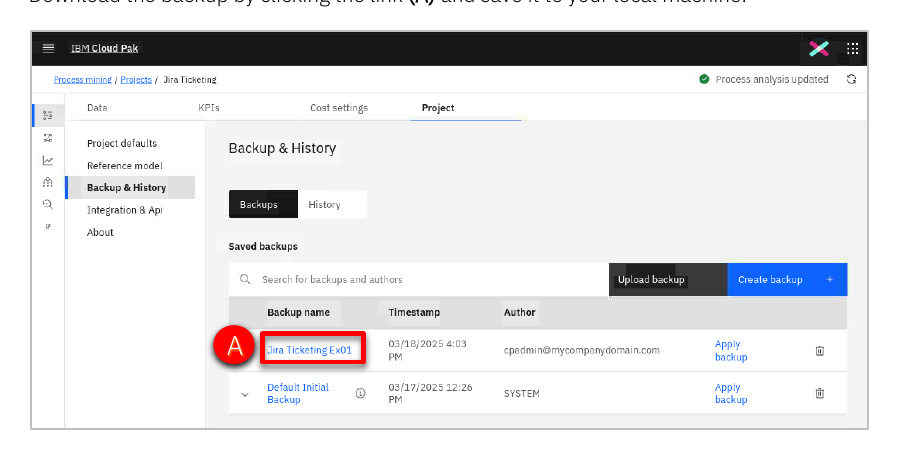

이 실습을 완료했습니다.

### 요약

#### 이 실습이 만든 변화

기업의 업무 프로세스는 ERP·CRM·티켓팅 등 여러 시스템에 흩어져 기록되지만, 원시 로그만 봐서는 "실제로 어떻게 흘러가는지"를 알 수 없습니다. 이 실습은 그 원시 데이터를 **€로 말하는 분석 환경**으로 전환했습니다.

| 구분 | 실습 1 이전 | 실습 1 이후 |
|------|------------|------------|
| **데이터 형태** | 흩어진 CSV 행 | 표준 이벤트 로그 |
| **분석 단위** | 시간·건수 수준 | € 단위 비용, 자동화율, ROI |
| **기준선** | 없음 (비교 불가) | Should-Be BPMN 참조 모델 |
| **작동 렌즈** | 부분적 | Model · BPMN · Statistics 모두 |

> 한 줄로: **"데이터는 있지만 말을 못 하던 상태" → "숫자로 말하는 상태"**

#### 구축한 3가지 자산

**1. 이벤트 로그 (Event Log)**
Jira CSV의 `case`·`activity`·`startTime`을 Process ID·Activity·Start time으로 매핑해 프로세스 마이닝 표준 형식으로 변환했습니다. Resource·Role·MA·priority 등 부가 필드까지 매핑해 역할별·자동화별·속성별 분석의 여지를 함께 확보했습니다.

**2. 비용 모델 (Cost Model)**
`자동화 속성` + `역할 비용` + `활동 작업 시간` + `활동 비용`의 4요소로 "이벤트 로그에 없는 비용"을 계산하는 공식을 완성했습니다.

- 수동 활동 비용 = **역할 비용 × 작업 시간**
- 자동 활동 비용 = **건당 고정 비용**

이 공식이 있어야 "€26,926 낭비", "연간 €9,770 절감 가능" 같은 **정량 ROI**가 계산됩니다.

**3. Should-Be BPMN 참조 모델**
967개 실제 경로 중 상위 2개 variant에서 Happy Path를 뽑아 BPMN으로 정형화하고, BPA에 저장한 뒤 프로젝트에 참조 모델로 등록했습니다. 이로써 현실과 이상을 비교할 **적합성 검사의 기준선**이 확보되었습니다.

또한 이 모든 설정을 **백업 파일**로 내보내, 재사용과 복구 지점까지 마련했습니다.

#### 왜 이 세 자산이 모두 필요한가

셋 중 하나라도 없으면 프로세스 마이닝은 제값을 하지 못합니다.

- **이벤트 로그 없음** → 프로세스 자동 발견 자체가 불가능
- **비용 모델 없음** → 비효율은 보여도 **금액으로 말할 수 없음** → 경영진 설득 실패
- **참조 모델 없음** → 이탈의 기준이 없어 **개선 효과 측정 불가**

세 자산이 모두 있어야 **"이탈률 · 연간 낭비액 · 개선 대상 · 회수액"** 네 요소가 한 문장 안에 모인 완결된 분석 스토리가 만들어집니다. 이 Jira 티켓팅 사례에서는 실습 2~4를 거치며 다음과 같이 채워집니다.

> **"현실이 참조 모델에서 약 70% 벗어나 연간 €9,770(인건비의 10%)을 낭비하고 있고, First Assigned 단계에 자동 할당을 도입하면 연간 약 $18,000을 회수해 $15,000 구현 투자를 첫해 내 회수한다."**

건수·시간 단위 BI 대시보드는 "뭐가 많다/적다"까지만 보여주지만, 프로세스 마이닝은 이처럼 **이탈률 · 낭비 금액 · 개선안 · 회수 금액**을 한 스토리로 이어 붙입니다 — 이것이 일반 BI 도구와 구별되는 지점입니다.

#### 다음 실습에서의 활용

| 다음 실습 | 이 실습의 자산 사용 | 얻게 되는 것 |
|----------|------------------|------------|
| **실습 2** 프로세스 발견·분석 | BPMN 참조 모델 | 전체 3,192건의 **이탈률(≈70%)·이탈 비용**(+$14/티켓) 정량 측정 |
| **실습 3** 대시보드·상황별 분석 | 비용 모델 + 자동화 속성(MA) | 병목·재작업·Change 활동의 **€ 환산** 및 SLA 기준과 결합한 운영 대시보드 |
| **실습 4** What-if 시뮬레이션 | 자동화 속성 + 4종 역할 비용 | "자동화율을 **42% → 80%로 올리면 얼마 절감?**" 같은 **정량 ROI 시나리오**(연간 ≈ $18K) |
| **실습 5** 운영 우수성 모니터링 | 비용 모델 + BPMN 참조 모델 | **SLA 위반 시 € 단위 손실 실시간 계산** 및 이탈 활동 감지 즉시 Slack 알림 |

---

원시 데이터가 분석 환경으로 전환되었습니다. 이제 실습 2에서 이 기반 위에서 **프로세스 발견과 정량 진단**을 시작할 차례입니다.