[← 소개로 돌아가기](10_Introduction.md)

---

## 실습 2. 프로세스 발견 및 초기 분석

실습 1에서 만든 재료(이벤트 로그 · 비용 모델 · BPMN 참조 모델)가 비로소 **"분석"**으로 전환되는 단계입니다. 실습 2는 프로세스 마이닝의 3대 진단 사이클을 그대로 따라갑니다.

- **1단계 모델 뷰 분석 (Descriptive)** — "현실이 어떤가" — Frequency · Duration · Cost · Rework 4개 렌즈로 Jira 티켓팅 프로세스를 다각도로 관찰
- **2단계 적합성 검사 (Diagnostic)** — "기준과 얼마나 다른가" — 실습 1에서 등록한 BPMN 참조 모델 대비 이탈을 **시간·비용으로 정량화**
- **3단계 처방적 마이닝 (Prescriptive)** — "지금 어떻게 해야 하나" — 분석가가 수일 걸리는 작업을 AI가 1분 만에 자동 보고서로 압축하고 Next Best Action까지 제안

이 실습을 완료하면 **"프로세스가 비효율적인 것 같다"**는 막연한 감이 **"Change in Request Type · Change in Person Assigned · Waiting for user가 연간 얼마의 낭비를 만들고 있다"**는 데이터 기반 진단으로 바뀝니다.

### 목차

- [모델 뷰 분석](#모델-뷰-분석)
  - [Frequency](#frequency)
  - [Duration (Average)](#duration-average)
  - [Overall cost](#overall-cost)
  - [Rework](#rework)
  - [진행 중인 케이스 제외](#진행-중인-케이스-제외)
  - [속성 통계](#속성-통계)
- [적합성 검사](#적합성-검사)
- [처방적 프로세스 마이닝](#처방적-프로세스-마이닝)
- [요약](#요약)

---

### 모델 뷰 분석

모델 뷰 분석은 **같은 프로세스 맵에 4개의 다른 렌즈를 갈아 끼우면서** 보는 작업입니다. 같은 지도도 "교통량 지도"·"교통체증 지도"·"통행료 지도"·"사고다발 지도"로 보면 전혀 다른 이야기가 드러나듯, 같은 프로세스도 어떤 관점에서 보느냐에 따라 문제가 달리 드러납니다. **하나의 뷰만 보면 오판하기 쉬우므로 4개를 교차해야 진짜 문제가 식별**됩니다.

#### Frequency

> 이 섹션에서 하는 일 :    
>  색·굵기로 **활동과 경로별 케이스 수**를 표현합니다. 많이 지나간 경로일수록 선이 굵고 진합니다.

> 왜 필요한가 :   
>  "이 프로세스는 어떻게 흘러가는가?" — Happy Path(정상 흐름)와 드문 경로를 한눈에 구분하는 **기본 지형도**입니다. 이후 모든 분석의 출발점.

1. Process Mining 시작 페이지에서 `Jira Ticketing` 타일 (A)을 클릭하여 프로젝트로 돌아갑니다.
   로그아웃한 경우 실습 1의 로그인 지침에 따라 다시 로그인합니다.
   IBM Process Mining이 `Frequency` 모델 뷰를 엽니다.

   Frequency 뷰는 각 활동의 발생 빈도를 기반으로 프로세스 모델을 표시합니다. 각 상자는 프로세스에서 발생한 이벤트 또는 활동을 나타내며, 화살표는 이벤트 로그에 기록된 프로세스 경로를 나타냅니다. 상자 안에는 해당 활동과 연관된 역할이 표시되며, 활동과 화살표 모두 색이 진할수록 발생 빈도가 높다는 것을 의미합니다.

   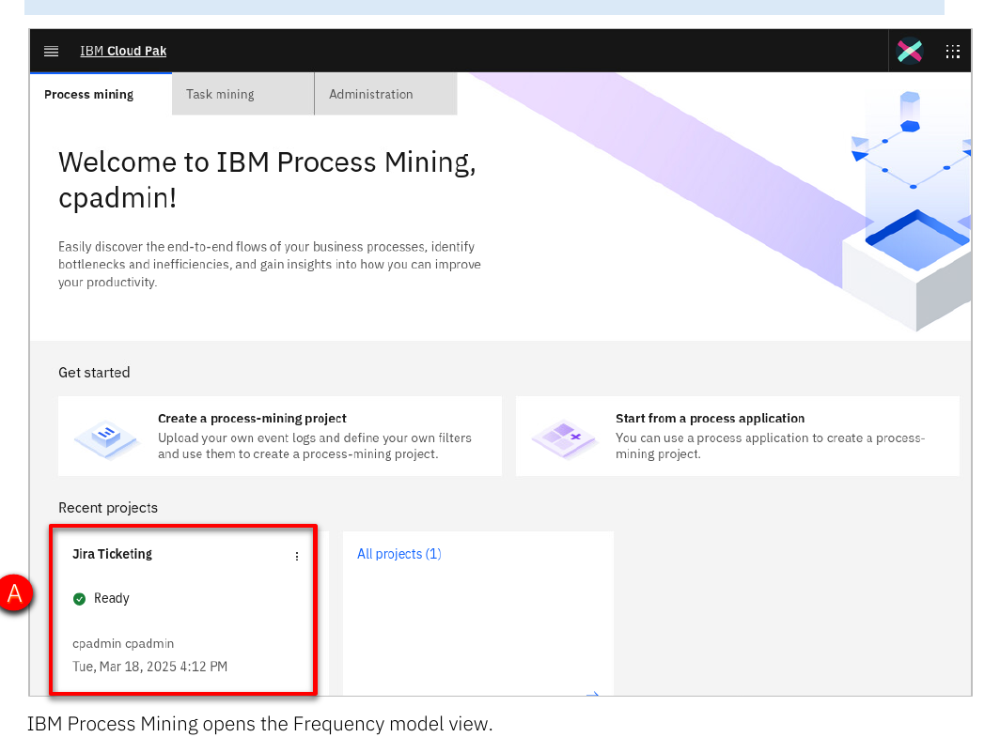

2. `Frequency` 모델에서 Jira 티켓이 가질 수 있는 다양한 상태를 검토합니다.
   - Open (A)
   - First assigned (B)
   - In progress (C)
   - Resolved (D)
   - Waiting for validation (E)
   - Closed (F)

   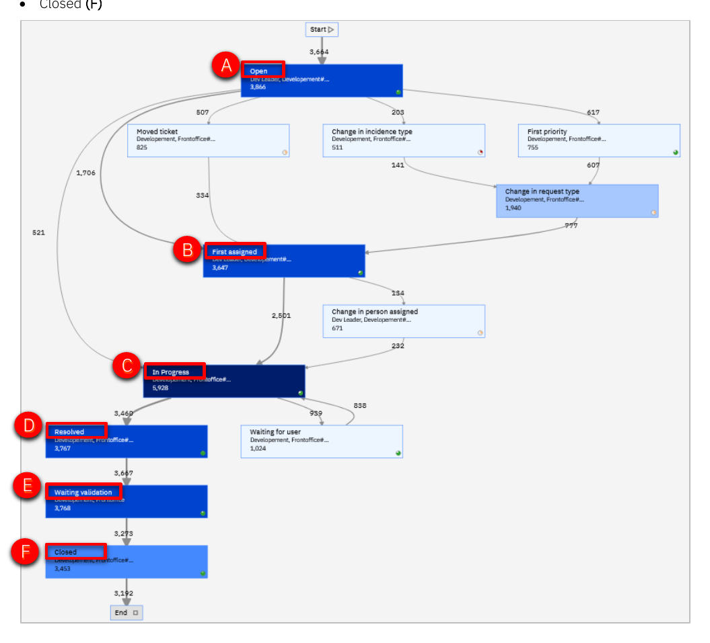

#### Duration (Average)

> 이 섹션에서 하는 일 :    
>  같은 맵을 **"오래 걸리는 구간일수록 빨갛게"** 다시 색칠합니다.

> 왜 필요한가 :   
>  "어디서 막히는가?" — Frequency만으로는 안 보이던 **느린 구간**이 선명해집니다. 굵고 빨간 전환이 곧 **병목(Bottleneck) 후보**이며, 이것이 리드타임의 주범을 찾는 첫 번째 단서입니다.

1. 오른쪽 상단에서 `Frequency` (A)를 클릭하고 `Duration (Average)` (B)를 선택합니다.

   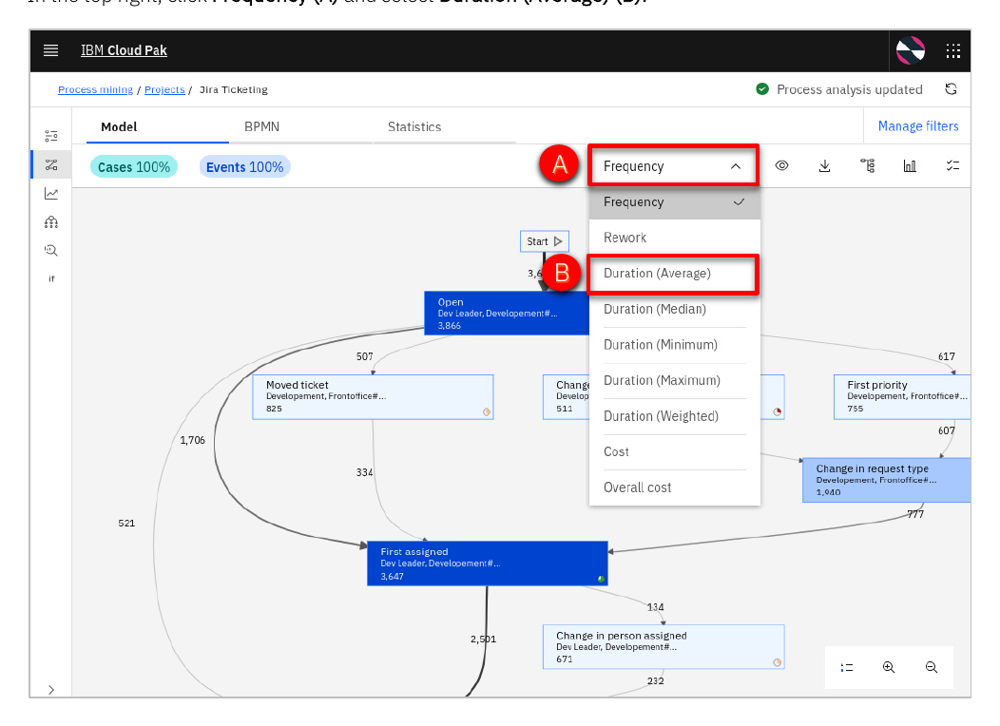

2. 소요 시간이 가장 긴 전환을 평가합니다. Duration 뷰에서 가장 굵은 전환은 사용자 응답 대기(`Waiting for user`) (A)와 담당자 변경(`Change in the person assigned`) (B) 두 경우임을 확인할 수 있습니다. 아직 심층 분석 단계는 아니지만, 이 두 전환은 프로세스의 잠재적 병목 지점을 나타냅니다. 담당자 변경 시 3일 이상 (B)이 소요되는 반면, 티켓을 진행 중으로 전환하는 정상 경로는 14시간 (C)에 불과합니다. 이는 이후 분석에서 중요하게 다뤄질 수 있는 초기 발견입니다.

   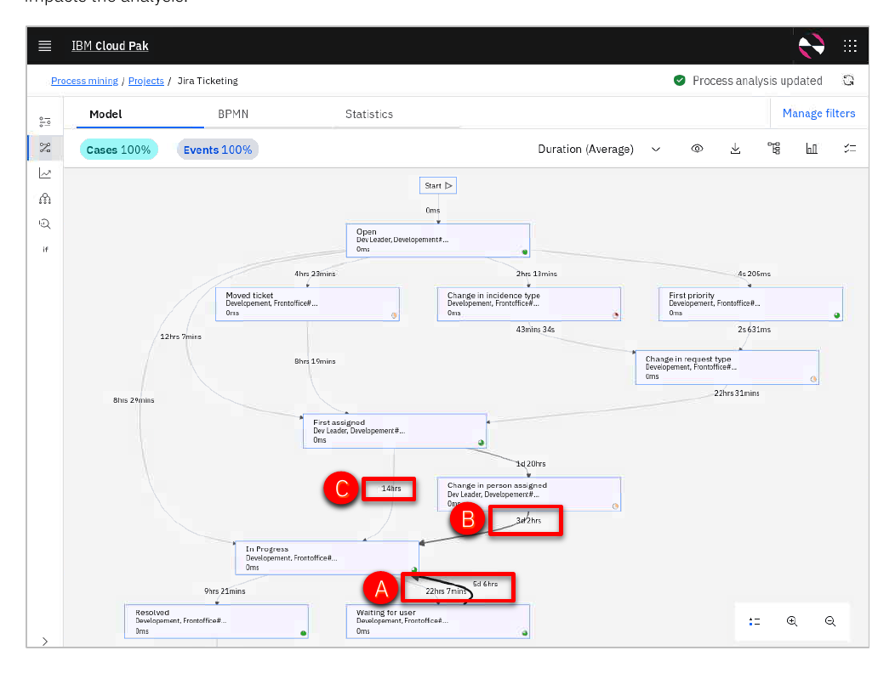

#### Overall cost

> 이 섹션에서 하는 일 :    
>  활동별 **총 비용**(빈도 × 단가)을 색으로 표시합니다. 실습 1에서 설정한 비용 모델이 여기서 처음으로 **"€ 단위 그림"**으로 화면에 드러납니다.

> 왜 필요한가 :   
>  "어디에 돈이 나가는가?" — 개선 ROI가 큰 구간을 찾기 위한 렌즈. 단, 비용 높음이 곧 나쁨은 아닙니다. **"원래 비싼 일인가"** vs **"반복·이탈 때문에 비싼가"**를 구분해야 하며, 이 판별은 Rework 뷰와 교차해야 가능합니다.

1. 오른쪽 상단에서 `Duration (Average)` (A)를 클릭하고 `Overall cost` (B)를 선택합니다.
   `Overall cost` 뷰에서는 비용이 가장 많이 발생하는 활동을 분석할 수 있습니다. 입력한 비용 모델을 기반으로 고객이 리소스 측면에서 가장 많은 비용을 지출하는 영역을 파악할 수 있습니다.

   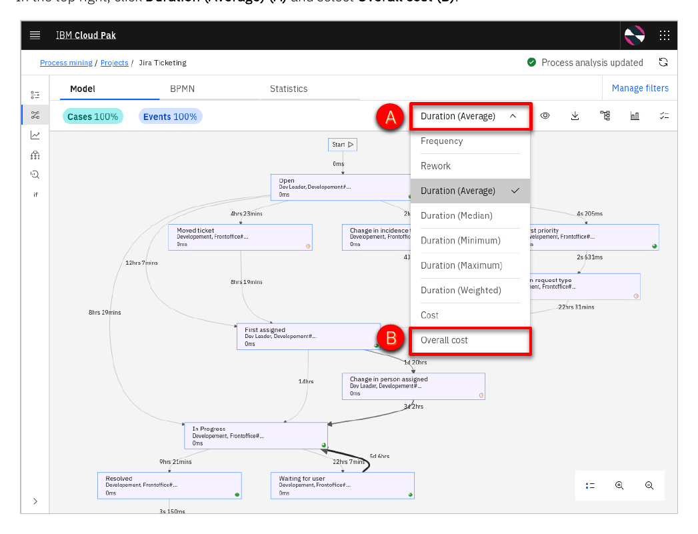

2. 비용이 가장 높은 활동을 평가합니다. 상세 분석 없이도 색상만으로 고비용 활동을 쉽게 파악할 수 있습니다. 모델을 간략히 검토하면 `In Progress` (A) 및 `Waiting for user` (B)와 같은 활동이 비용을 높이는 주요 원인임을 알 수 있으며, 이 활동들로 유입·유출되는 전환도 확인할 수 있습니다.

   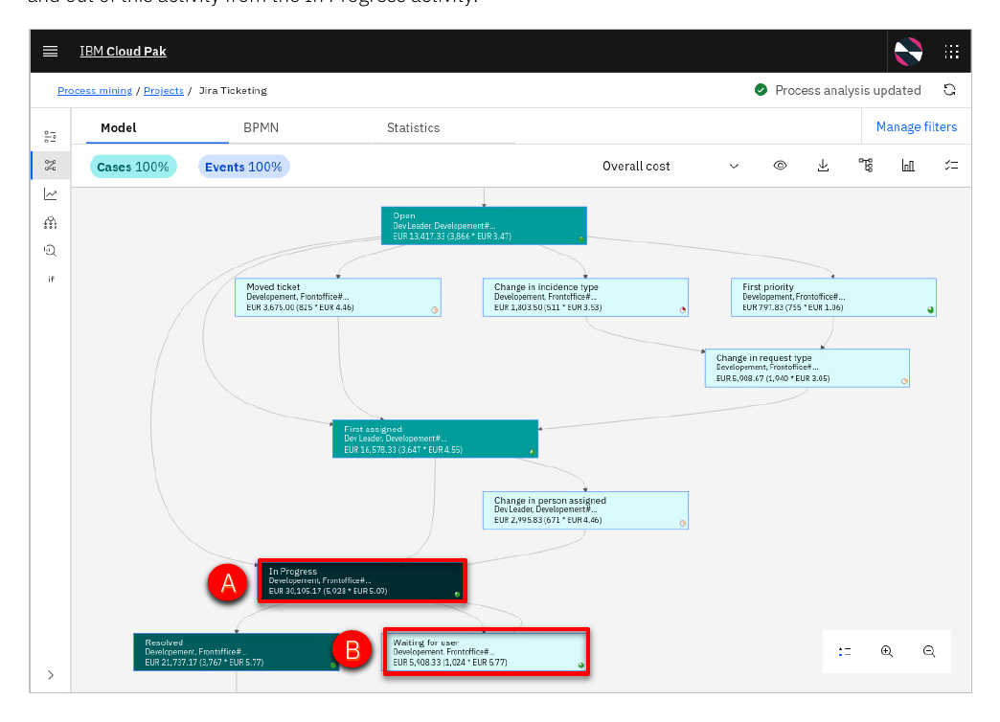

#### Rework

> 이 섹션에서 하는 일 :    
>  한 케이스 안에서 **같은 활동이 여러 번 반복되는지**를 표시합니다. "In Progress 평균 2.5회 반복" 같은 수치가 여기서 나옵니다.

> 왜 필요한가 :   
>  재작업(Rework)은 **숨어 있는 비효율의 가장 큰 증거**입니다. 오류·정보 누락·승인 반려·루프가 모두 여기로 모이며, 이 뷰 하나에서 **"이 활동은 한 번에 끝나야 하는데 평균 2.5번 하고 있다"**는 사실이 드러나고, 곧바로 **"rework 1건 제거 시 약 €10,375 절감"** 같은 정량 추정으로 연결됩니다.

> 교차 분석 포인트 :   
>  Frequency·Duration·Cost·Rework 4개 뷰에서 **모두 경고등**이 켜지는 활동이 진짜 문제입니다. 실습에서 **Change in Request Type**과 **Change in Person Assigned**가 바로 그런 활동이며, 이것이 이번 실습의 **핵심 발견**이 됩니다.

1. 오른쪽 상단에서 `Overall cost` (A)를 클릭하고 `Rework` (B)를 선택합니다.

   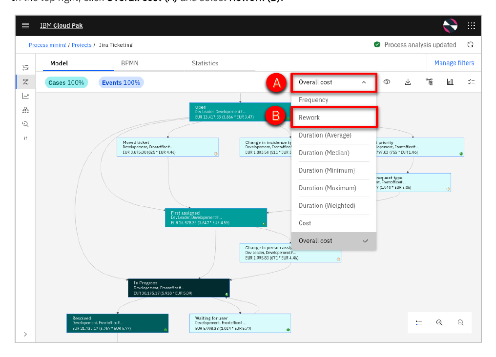

2. 재작업이 가장 많이 발생하는 활동을 평가합니다. `Rework` 뷰에서는 동일 활동이 반복 실행되는지 확인할 수 있습니다. 재작업이 가장 많은 활동은 `In Progress` (A)입니다. 이는 지원 담당자가 사용자 응답을 기다리는 등의 이유로 티켓 상태를 변경했다가 문제가 해결되지 않으면 다시 진행 중으로 되돌리는 패턴을 보여줍니다. 이처럼 동일 티켓에 대해 동일 활동이 두 번 이상 수행되는 것이 재작업입니다.

   이 뷰는 또한 프로세스의 각 활동에 대한 자동화 수준도 함께 표시합니다.

   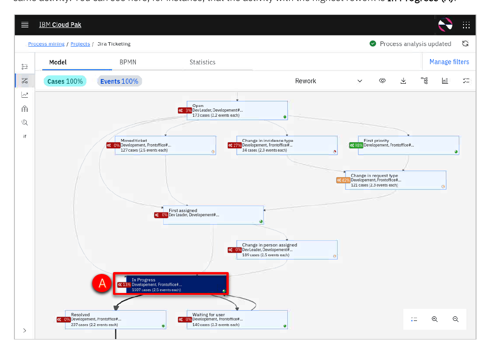

3. Rework 뷰에서 각 활동의 자동화 비율을 확인합니다. 이전 실습에서 구성한 `MA` 필드 덕분에 활동별 자동화 처리 비율이 화면에 함께 표시됩니다. 예를 들어, 우선순위 첫 번째 할당 (A)은 98%가 자동으로 처리되는 반면, 요청 유형 변경 (B)은 42%만 자동화되어 있습니다. 또한 티켓의 첫 번째 담당자 할당 (C)은 거의 항상 수동으로 이루어집니다. 이를 통해 현재 자동화가 어느 정도 적용되어 있는지, 그리고 자동화 개선 여지가 어디에 있는지 파악할 수 있습니다.
   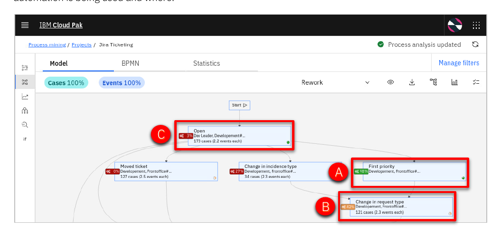

   다음으로는 진행 중인 케이스를 제외하는 필터를 적용하여 완료된 티켓만 분석 대상으로 삼겠습니다. 이를 통해 보다 완전하고 일관된 통계를 확보할 수 있습니다.

#### 진행 중인 케이스 제외

> 이 섹션에서 하는 일 :    
>  아직 완료되지 않은 "진행 중" 케이스를 분석 대상에서 **제외**하는 필터를 적용합니다.

> 왜 필요한가 :   
>  오늘 접수된 케이스를 평균 리드타임 계산에 포함하면 **"아직 안 끝났는데 짧게 잡혀"** 전체 평균이 비정상적으로 낮아집니다. 리드타임·완료율 분석에서는 반드시 제외해야 하며, 많은 분석가가 이 설정을 놓쳐 잘못된 결론에 이릅니다.

> 언제는 포함해야 하는가 :   
>  반대로 "**지금** 업무량은 얼마나?", "**현재** 병목이 어디?"처럼 실시간 현황을 보려면 포함해야 합니다. 분석 의도에 따라 **의식적으로 토글**해야 하는 옵션입니다.

1. 오른쪽 상단에서 `Manage filters` (A)를 클릭합니다.

2. `Add filter` (A)를 클릭합니다.

   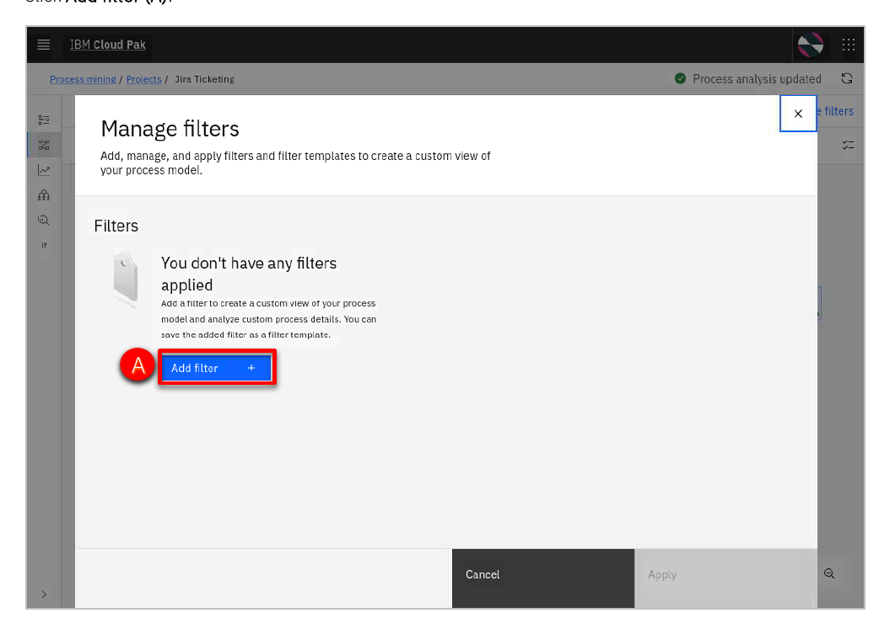

3. 왼쪽에서 필터 유형으로 `Process Flow` (A)를 선택하고, 필터 조건으로 `Completed cases` (B)를 선택한 후 `Add` (C)를 클릭합니다. 완료된 케이스만 유지하는 기본값을 그대로 둡니다.

   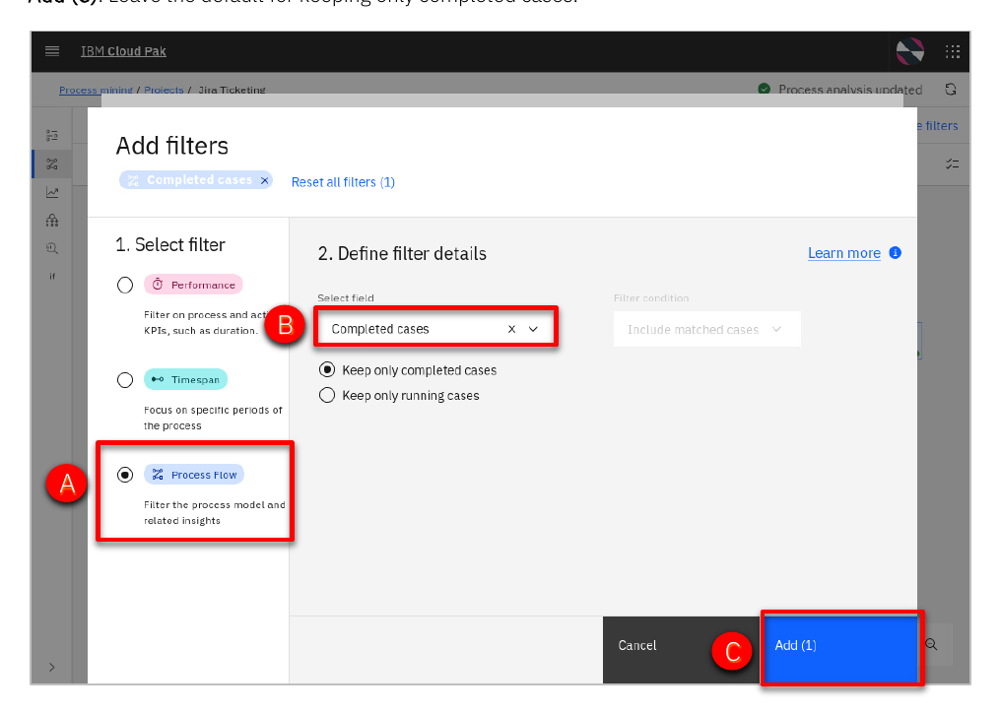

4. `Keep only completed cases` (A) 옆의 체크박스를 클릭하고 `Apply` (B)를 클릭합니다.

   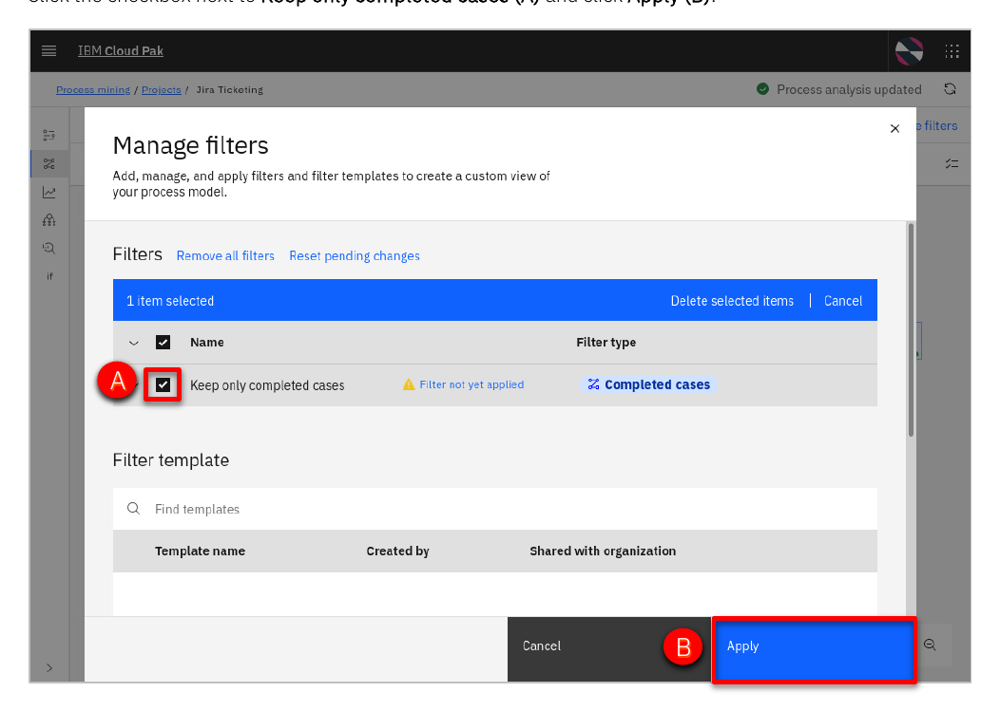

5. 확인 메시지가 나타나면 `Go to the analysis` (A)를 클릭합니다.
   이제 완료된 케이스만 보고 있으며, 전체 프로세스를 보다 정확하게 반영합니다.

   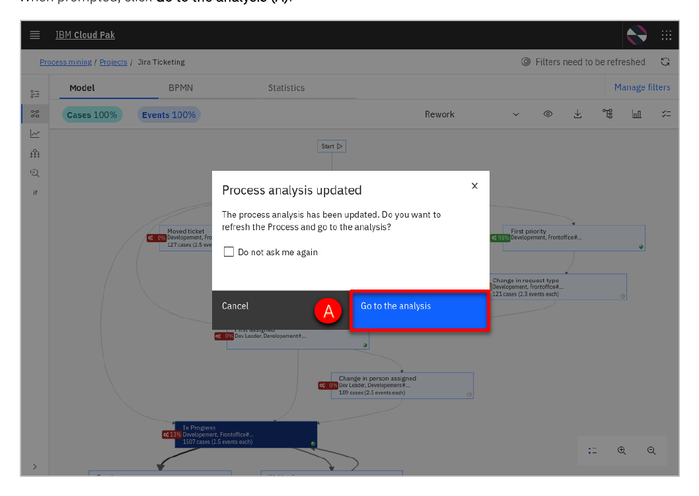

#### 속성 통계

> 이 섹션에서 하는 일 :    
>  모델 뷰는 **"어느 활동이 문제"**까지만 보여줍니다. 속성 통계는 여기에 담당자·우선순위·이슈 유형·지역 등 **속성 축을 추가**해 **"누가 / 어떤 경우에 / 왜"**까지 파고듭니다.

> 왜 필요한가 :   
>  "In Progress에서 재작업이 많다"는 사실만으로는 개선 액션이 나오지 않습니다. **"담당자 3명에게 50% 이상이 몰려 있다"** 또는 **"Incidents 유형에서 Waiting for user가 63% 몰린다"**처럼 **지역화(localize)**되어야 교육·매칭·분류 개선 같은 **구체적 액션**으로 연결됩니다.

> 해석 매트릭스 :   
>  - 빈도 높음 + 리드타임 긺 → **병목 후보**
>  - 빈도 낮음 + 리드타임 긺 → **예외지만 발생 시 심각한 지연**
>  - 빈도 높음 + 리드타임 짧음 → 정상 경로

속성 통계 패널을 사용하면 다양한 속성으로 그룹화된 케이스를 기반으로 프로세스 모델을 시각화할 수 있습니다. IBM Process Mining은 업로드된 데이터 소스에서 속성 목록을 자동으로 가져옵니다.

1. 오른쪽 상단에서 `Statistics` (A) 아이콘을 클릭합니다. 기본적으로 `Activity` (B)가 선택되어 있음을 확인합니다.
2. `Compute statistics` (C)를 클릭합니다.
3. 평균 케이스 리드 타임이 7일 13시간 (D)임을 확인합니다.
   평균 케이스 리드 타임을 기준으로 통계를 정렬하면 처리 완료 시간에 가장 큰 영향을 미치는 활동을 파악할 수 있습니다.

   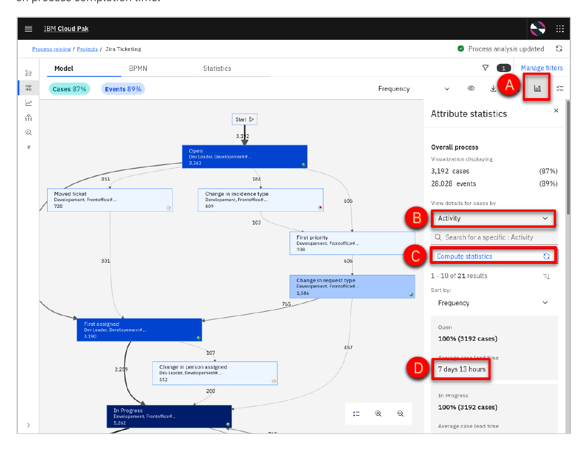

4. `Frequency` (A)를 클릭하고 `Average case lead time` (A)를 선택합니다.

   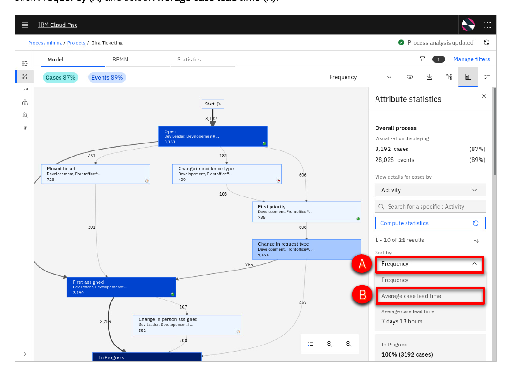

5. `Change in person assigned` 활동 (A)으로 스크롤하여 해당 통계를 살펴봅니다. 이 활동은 전체 케이스의 약 10%에서 발생하며, 이 활동이 포함된 경우 평균 케이스 리드 타임이 19일 (A)로 크게 증가합니다. Duration 뷰에서는 이 활동이 개별 전환 시간에 미치는 영향을 확인했다면, 속성 통계에서는 전체 프로세스 완료 시간에 미치는 누적 영향을 확인할 수 있습니다.

   중요한 동작이 발견되면 이를 "지역화(localize)"하려고 시도해야 합니다. 지역화란 해당 동작이 특정 국가, 이슈 유형, 리소스 등과 연관되어 있는지 조사하는 것입니다. `Change in person assigned`의 경우, 이 활동에 대한 통계를 확인하여 가장 많이 관여하는 사용자를 파악하는 것이 한 가지 방법입니다.

   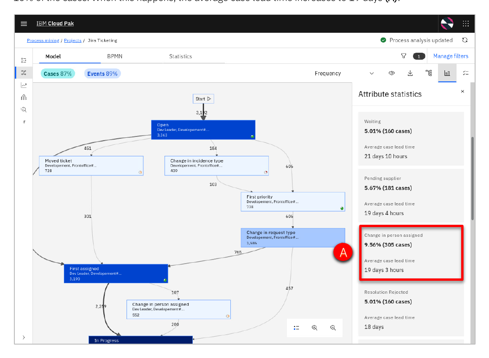

6. 캔버스에서 `Change in person assigned` 활동 (A)을 선택하고 오른쪽 상단의 `Show activity statistics` (B) 아이콘을 클릭합니다.

   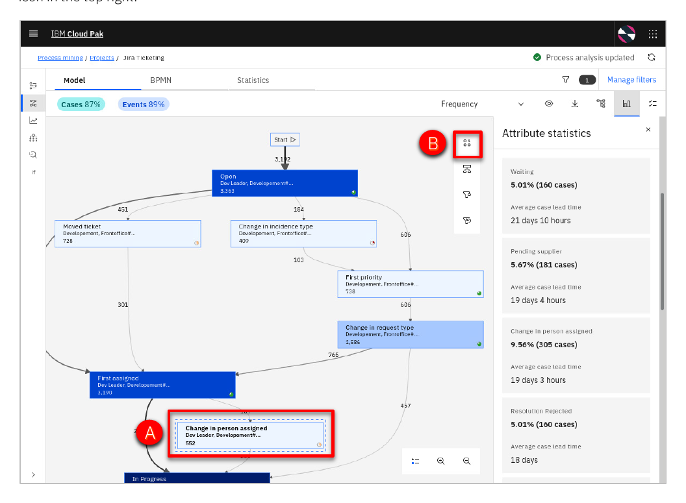

7. `Resource` (A)를 선택하여 이 활동의 리소스 분포를 확인합니다. 3명의 사용자가 담당자 변경의 50% 이상 (B)을 처리하고 있음을 알 수 있습니다. 이는 동작 지역화의 좋은 예입니다. 실제 시나리오에서 프로세스 소유자는 이 3명에게 직접 원인을 파악하고 개선 방안을 찾을 수 있으며, 시스템 데이터만으로는 얻기 어려운 실질적인 인사이트를 수집할 수 있습니다.
8. 데이터를 검토한 후 오른쪽 상단 모서리의 `X` (C)를 클릭하여 창을 닫습니다.
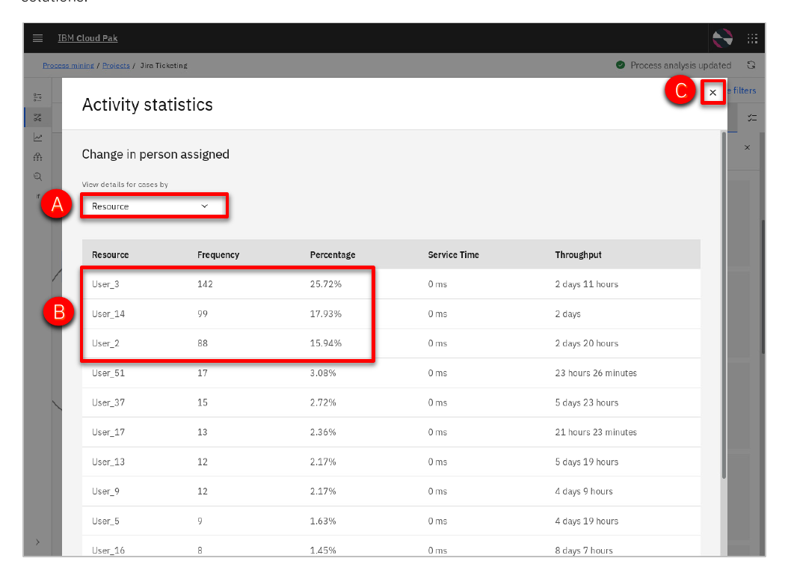

### 적합성 검사

> 이 섹션에서 하는 일 :    
>  실습 1에서 등록한 **BPMN 참조 모델**(Should-Be)을 기준으로, 실제 케이스를 **준수(Compliant)**와 **이탈(Non-compliant)**로 나누고 두 그룹의 KPI를 비교합니다.

> 왜 "감"이 아닌 "숫자"가 중요한가 :   
>  "승인 절차가 좀 복잡한 것 같다"는 감은 경영진에게 반려됩니다. **"이탈 케이스는 평균 +$14 비용, +7일 리드타임, 연간 €Y 손실"** 같은 숫자는 승인됩니다. 적합성 검사는 바로 이 **"숫자 제조기"**입니다.

> 이탈은 "예외"가 아닌 "구조적 문제"임을 증명하는 도구 :   
>  현업은 종종 이탈을 "가끔 일어나는 예외"로 치부합니다. 하지만 이탈 케이스만 모아보면 **"매달 반복되는 거대한 낭비"**임이 드러납니다. 이 실습의 `Waiting for user`가 전체 티켓의 22%를 차지하고 **인시던트 유형에 63% 집중**되어 있다는 발견이 바로 그런 설득의 근거입니다.

다음으로 적합성 검사를 수행합니다. 앞서 적용한 "진행 중인 케이스 제외" 필터는 그대로 유지합니다.

1. 오른쪽 상단 모서리의 `Conformance` (A) 아이콘을 클릭합니다.
2. 적합성 검사 결과 화면에서 수치를 확인합니다. 화면에 참조 모델에서 허용되지 않는 활동과 전환이 빨간색으로 표시됩니다. 예를 들어, `Waiting for user` 활동은 프로세스가 예상대로 수행되는 경우에는 발생하지 않아야 합니다. 오른쪽의 `Conformant cases` 섹션을 보면 962개의 티켓이 참조 모델에 적합하고, 2,230개의 티켓은 그렇지 않습니다 (B).

   평균 케이스 리드 타임 기준으로 적합한 케이스는 약 3일(2일 21시간)이 소요되는 반면, 이탈이 발생한 케이스는 비용이 약 14달러 더 들고 완료 시간이 거의 7일 더 걸립니다 (C). 이는 프로세스가 참조 모델에서 벗어날 때 성능이 크게 저하된다는 것을 보여줍니다.

   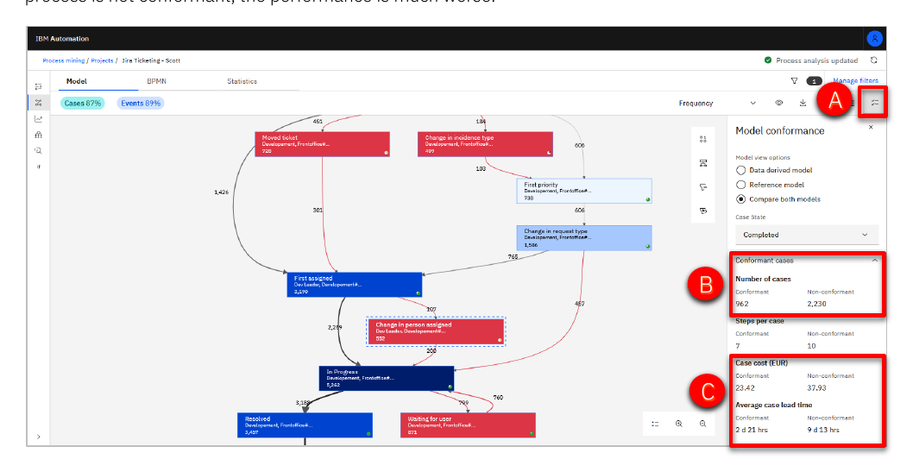

3. `Waiting for user` 활동의 이탈 영향을 평가합니다. 오른쪽의 `Model conformance` 패널에서 `Reference model deviations` (A) 섹션으로 스크롤합니다. 가장 빈번한 이탈과 시간·비용에 미치는 영향을 확인할 수 있습니다. `Waiting for user` (B) 활동은 전체 티켓의 22% 이상에서 발생하며, 이 활동이 포함된 케이스는 평균 비용이 적합 케이스의 거의 두 배에 달하고 평균 완료 시간도 14일 이상으로 적합 케이스의 3일에 비해 크게 늘어납니다. 이 동작을 지역화하기 위해 활동 통계를 확인해 보겠습니다.

4. 프로세스에서 `Waiting for user` (C) 활동을 선택한 후 `Show activity statistics` 아이콘 (D)을 클릭합니다.

   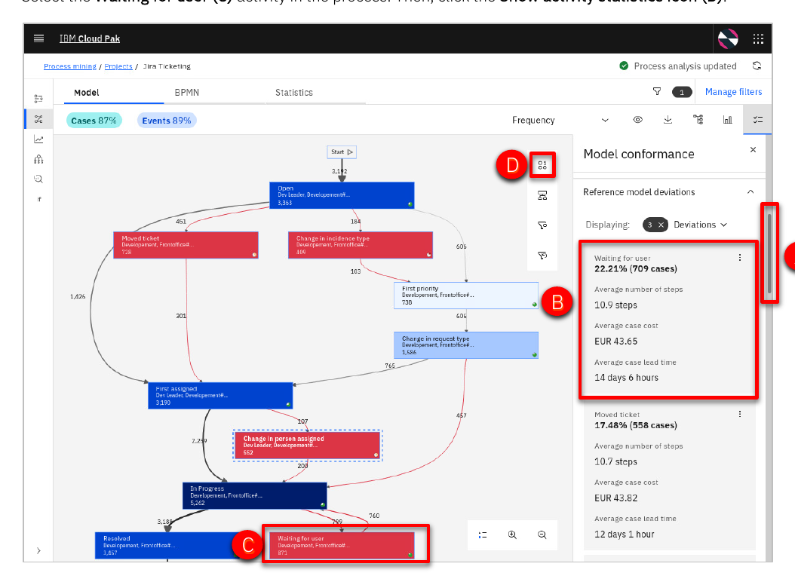

5. 세부 정보로 `issue_type` (A)을 선택합니다. `Waiting for user` 활동 발생의 약 63% (B)가 "incidents"와 연관되어 있음을 확인할 수 있습니다. 따라서 이 활동을 줄이기 위한 개선 방안은 인시던트 처리 과정에서 최종 사용자의 개입 없이 필요한 정보를 수집하고 해결책을 테스트하는 방법에 초점을 맞추어야 합니다.
6. 데이터를 검토한 후 오른쪽 상단 모서리의 `X` (C)를 클릭하여 창을 닫습니다.
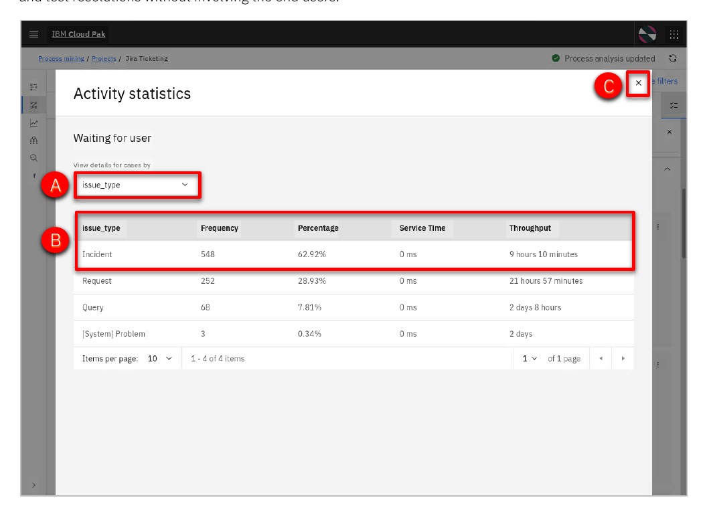  

### 처방적 프로세스 마이닝

> 이 섹션에서 하는 일 :    
>  지금까지 수동으로 발견한 내용(범인 활동 · 담당자 패턴 · 이슈 유형)을 **AI가 1분 내에 자동 재발견**하는 보고서를 생성하고, 문제 담당자에게 보낼 **이메일 초안**까지 제시받습니다.

> 왜 이 기능이 중요한가 :   
>  - **검증**: 분석가가 수일 걸려 찾은 결론을 AI가 즉시 재확인 → 분석 품질 교차 검증
>  - **속도**: 새 프로세스·새 데이터에도 동일 분석을 즉시 반복 가능
>  - **액션 지향**: 단순 발견에 그치지 않고 **"누구에게 무엇을 어떻게"**까지 제시

> 예측적 vs 처방적 — 결정적 차이 :   
>  - 예측: "이 주문은 지연 확률 78%"
>  - 처방: **"지금 A팀에 재할당하면 지연 확률 78% → 12%"**
> 
>  처방적 마이닝은 프로세스 마이닝이 **"분석 도구"에서 "업무 지휘 시스템"으로 진화**한 단계입니다.

동작을 지역화하고 잠재적 원인을 파악하는 또 다른 방법은 처방적 프로세스 마이닝(Prescriptive Process Mining) 기능을 활용하여 근본 원인 분석을 수행하는 것입니다. 처방적 프로세스 마이닝은 프로세스 분석이 완료되면 조사 보고서를 자동으로 생성합니다.

1. 왼쪽 탐색 바에서 `Prescriptive` (A) 아이콘을 클릭합니다.
2. `Build report` (B)를 클릭합니다.

   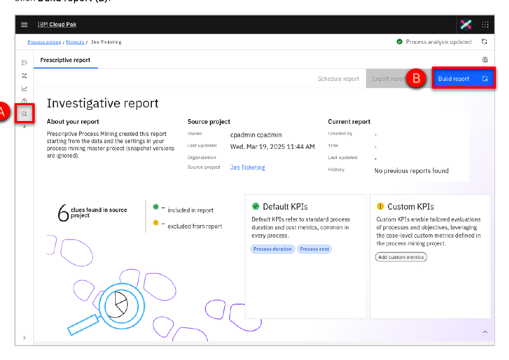

3. 이름 (A)을 입력하고 `Build` (B)를 클릭합니다.
   보고서 생성에 약 1분이 소요될 수 있습니다.

   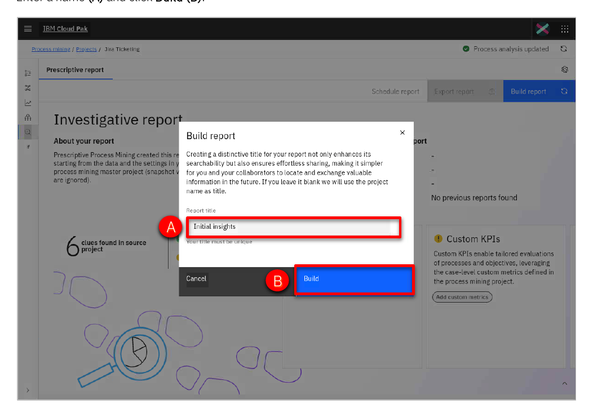

4. 보고서가 완료되면 스크롤을 내려 프로세스 지속 시간 세부 정보 (A)를 확인합니다.
   IBM Process Mining은 프로세스 지속 시간과 비용(기본 KPI 2가지)에 대한 분석 결과를 제시합니다. 앞서 수동으로 분석한 결과와 유사한 내용이 도출되었음을 확인합니다.

   처방적 프로세스 마이닝은 식별된 KPI 영향 요인 각각에 대해 근본 원인 분석을 수행하며, 보고서의 `Insights` 탭에서 이 결과를 확인할 수 있습니다. 여기에는 프로세스 성능 이탈의 근본 원인과 주요 영향 요인이 포함됩니다.

   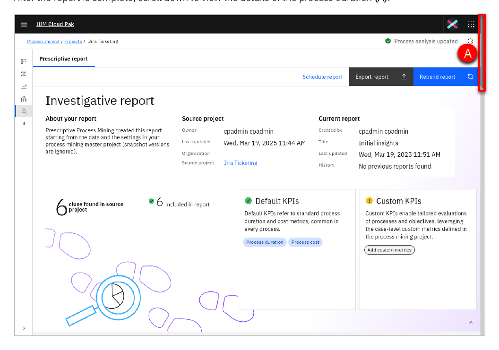

5. COST 통계가 표시되는지 확인합니다 (A), (B).
6. 3가지 활동이 표시되는지 확인합니다 (C).
7. `Key findings` (B)와 함께 평균 COST 차트 (D)도 확인합니다.
8. 스크롤을 내려 프로세스 비용 섹션을 확인합니다.

   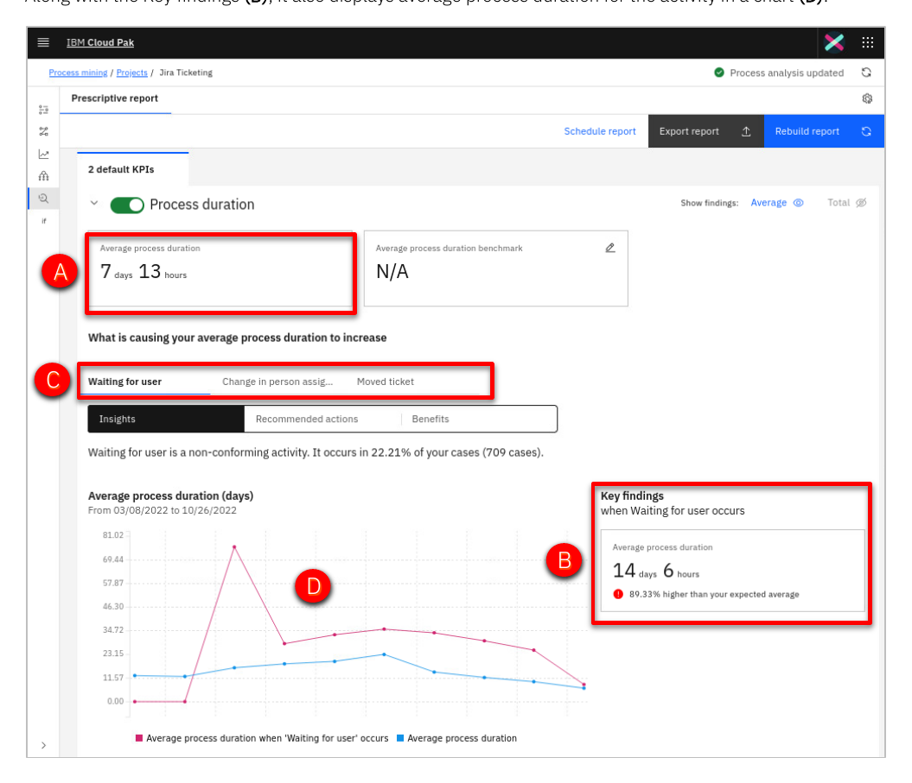

9. `Recommended actions` (A)를 클릭합니다.
   IBM Process Mining이 3가지 권장 사항을 제시합니다. 앞서 수동으로 분석한 결과와 동일한 사용자가 식별되었음을 확인합니다 (B). IBM Process Mining은 해당 사용자에게 초안 이메일을 보낼 것을 권장합니다.

10. `Take action` (C)를 클릭하여 초안 이메일 내용을 확인합니다.   

      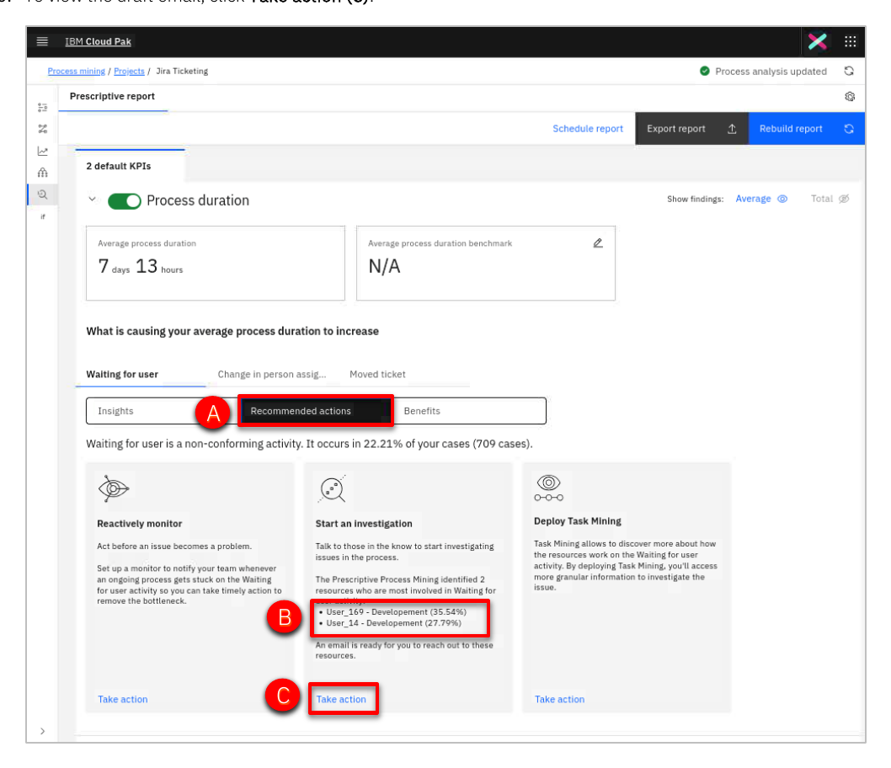

11. IBM Process Mining이 이메일 클라이언트를 열려고 시도합니다. `Cancel` (A)을 클릭합니다.
   로컬 컴퓨터에 Outlook이 구성된 경우, 처방적 보고서에서 제공한 정보로 미리 채워진 새 이메일이 열립니다. 이메일에는 관련 통계 (A), 사용자 (B), 활동 (C) 정보가 포함되어 있으며, 고객과의 심층 논의를 위한 출발점으로 활용할 수 있습니다. IBM Process Mining이 초기 단계에서 이미 실행 가능한 인사이트와 권장 사항을 제공한다는 점은 고객에게 큰 인상을 줄 수 있습니다.   

      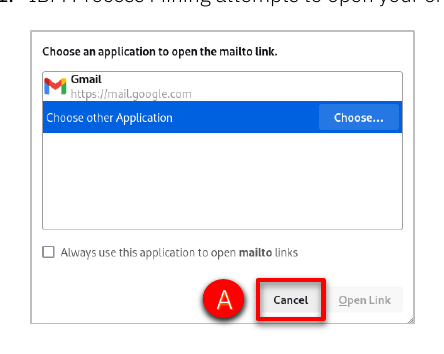

      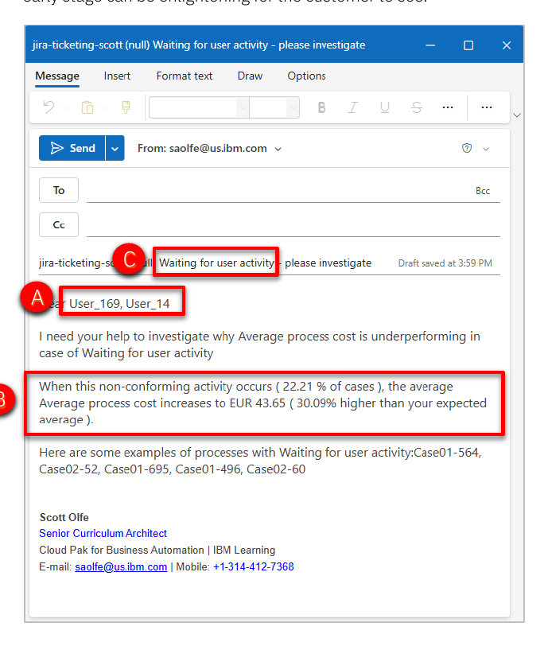

12. 보고서 화면(IBM Cloud Pak 브라우저 탭)으로 돌아갑니다.
13. `Benefits` 탭 (A)을 클릭한 다음 스크롤을 내려 프로세스 비용 섹션의 `Benefits` 탭 (B)도 클릭합니다. 화면을 최대화합니다.   

      `Benefits` 탭은 비준수 활동을 줄이는 시나리오에서 기대할 수 있는 성능 향상 추정치를 제공합니다. 보고서 설정의 `Impact threshold (%)` 값을 조정하여 처방적 프로세스 마이닝이 영향을 추정하는 최소 임계값을 설정할 수 있습니다.

      처방적 마이닝 보고서는 두 가지 기본 KPI를 기준으로 다음 질문에 답합니다:
      - 평균 프로세스 지속 시간이 증가하는 원인은 무엇인가?
      - 평균 프로세스 비용이 증가하는 원인은 무엇인가?

      분석 결과를 바탕으로 권장 사항 (C), (D)도 함께 제시됩니다.

      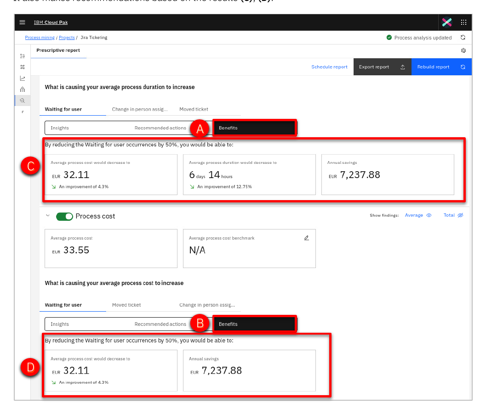

      현재 Hands-On 환경의 버전에서는 아래와 같이 일부 항목 추가 분석 표시가 됩니다.
      
      (Average Resolutions Rejected would decrease to, Average Submitted for Approval would decrease to)
      
      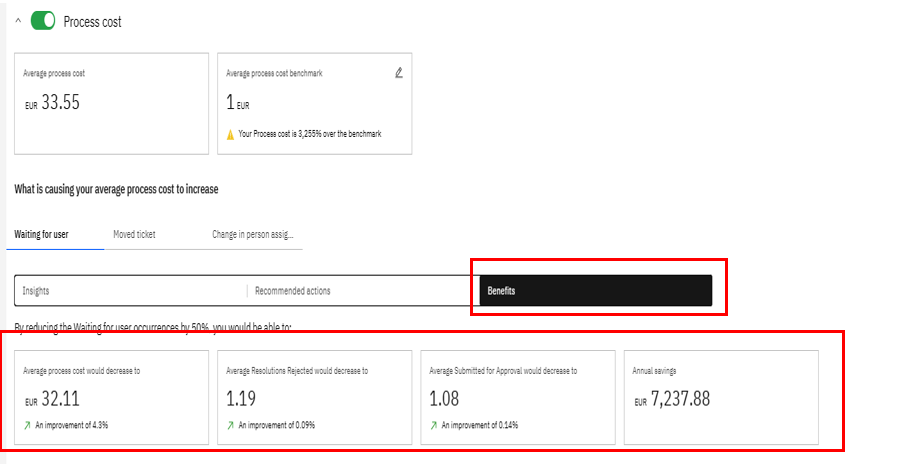
   
14. 이점을 검토한 후 상단으로 다시 스크롤합니다 (A).
15. 필터 템플릿 (B)을 적용하여 추가 조사 범위를 좁힐 수 있음을 확인합니다.

    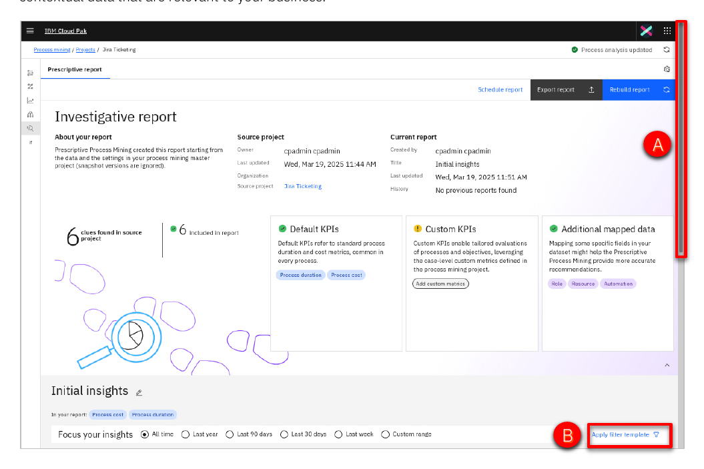

    > 필터 템플릿을 활용하면 특정 케이스 하위 집합에만 집중하여 조사할 수 있습니다. 단, 처방적 프로세스 마이닝에서 필터 템플릿을 사용하려면 프로세스 마이닝 프로젝트에서 미리 생성해 두어야 합니다. 불필요한 활동을 제외하고 관련 데이터에만 집중함으로써 분석의 정확도를 높일 수 있습니다.

16. `Process Mining` breadcrumb (A)를 클릭하여 Process Mining 시작 페이지로 돌아갑니다.
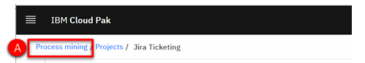

이 실습을 완료했습니다.

### 요약

#### 이 실습이 만든 변화

실습 1이 **"€로 말할 수 있는 환경"**을 만들었다면, 실습 2는 그 환경을 돌려 **"무엇이 / 왜 / 얼마나 문제인지"**를 실제로 추출했습니다.

| 구분 | 실습 2 이전 | 실습 2 이후 |
|------|------------|------------|
| **문제 인식** | "프로세스가 비효율적인 것 같다" (감) | Change in Request Type / Change in Person Assigned / Waiting for user가 범인 (데이터) |
| **근거 형태** | 정성적 관찰 | 이탈 케이스 +$14 비용 / +7일 리드타임 (정량) |
| **분석 속도** | 분석가 수일 소요 | AI 자동 보고서 1분 |
| **다음 액션** | 추측·회의 | 지역화된 대상(담당자 3명 · 인시던트 유형) + 초안 이메일 |

> 한 줄로: **"프로세스가 어딘가 이상하다"에서 "누가 / 어디서 / 얼마를 낭비하는지"로 바뀌었습니다.**

#### 도출한 3가지 진단 자산

##### 1. 모델 뷰 교차 진단 — 6가지 렌즈로 본 현실

Frequency · Duration · Overall Cost · Rework 4개 뷰에 **완료 케이스 필터**와 **속성 통계**를 더한 6가지 관점의 교차 분석.

**핵심 발견**

- **Change in Request Type · Change in Person Assigned** — 4개 뷰 모두에서 경고등 → 재작업·비용 낭비의 **주요 원인**으로 확정
- **담당자 집중** — 변경의 50% 이상이 3명에게 몰림 → 교육·재분배의 **직접 대상**
- **자동화 공백** — 요청 유형 변경은 42%만 자동화 → **즉시 개선 가능한 구간**

**→ 얻은 것** : 문제가 **"2개 활동 · 3명 · 1개 자동화 구간"**으로 지역화되어, 다음 단계에서 개선 액션을 곧바로 설계할 수 있는 상태.

---

##### 2. 적합성 검사 정량 증거 — "감"을 "숫자"로

실습 1에서 등록한 BPMN 참조 모델과 실제 케이스를 비교한 결과.

**측정 결과** (총 3,192건)

| 구분 | 값 |
|------|----|
| 준수 / 이탈 | **962건** / **2,230건** (이탈률 약 70%) |
| 이탈 케이스 페널티 | 평균 **+$14 비용**, **+7일 리드타임** |
| 최대 이탈 활동 | **Waiting for user** — 이탈의 **22%** 차지 |
| 이탈 집중 구간 | `Waiting for user`의 **63%가 인시던트 유형** |

**→ 얻은 것** : 개선 포커스가 **"인시던트 접수 시 정보 수집 자동화"**라는 한 문장으로 좁혀지고, 경영진 설득이 가능한 **정량 근거** 확보.

---

##### 3. 처방적 AI 보고서 — 자동 검증 + Next Best Action

분석가가 수일 걸리는 근본 원인 분석을 AI가 1분 내에 자동 수행한 결과.

**두 가지 가치**

- **검증** — AI가 수동 분석과 **동일한 결론**을 자동 도출 → 분석 품질 교차 검증
- **액션** — 문제 담당자에게 보낼 **이메일 초안** 자동 생성 → 발견이 **즉시 현장 지시**로 전환

**→ 얻은 것** : 프로세스 마이닝이 "분석 도구"에서 **"업무 지휘 시스템"**으로 진화한 증거. 새 프로세스·새 데이터에도 동일 분석을 **즉시 반복 가능**.

#### 왜 이 세 자산이 모두 필요한가

셋은 **"무엇 → 왜 → 어떻게"**의 연쇄입니다. 하나라도 빠지면 사이클이 끊어집니다.

- **모델 뷰 없음** → 어느 활동이 문제인지 모름 → **개선 대상 미정**
- **적합성 검사 없음** → 문제는 보여도 **얼마나 손해인지 말할 수 없음** → 경영진 승인 불가
- **처방적 분석 없음** → 분석은 끝났어도 **"지금 뭘 할지"가 없어** 현장에 전달 안 됨

세 자산이 모두 있어야 **"문제 식별 → 비용 정량화 → 즉시 액션"**의 완전 사이클이 작동합니다. 이것이 프로세스 마이닝이 "예쁜 대시보드"가 아니라 **"조직을 움직이는 언어"**가 되는 지점입니다.

#### 다음 실습에서의 활용

| 다음 실습 | 이 실습의 자산 사용 | 얻게 되는 것 |
|----------|------------------|------------|
| **실습 3** 대시보드·상황별 분석 | 두 Change 활동 진단 + 이탈 지표 | 핵심 KPI를 상시 모니터링하는 **맞춤형 대시보드**(SLA·비용·담당자 뷰) |
| **실습 4** What-if 시뮬레이션 | 이탈 케이스의 **+$14/티켓 · +7일 리드타임** 수치 | "Change 활동을 **50% 줄이면 얼마 절감?**" 같은 **정량 ROI 시나리오**(연간 ≈ $18K) |
| **실습 5** 운영 우수성 모니터링 | 이탈·재작업 감시 대상 활동 목록(Waiting for user · Change 계열) | 범인 활동 발생 즉시 **Slack 자동 호출** |

---

현실 진단이 끝났습니다. 이제 실습 3에서 이 발견을 매일 모니터링할 수 있는 대시보드로 옮기고, 실습 4에서 개선 시나리오의 **금액 효과를 시뮬레이션**할 차례입니다.