[← 소개로 돌아가기](10_Introduction.md)

---

## 실습 3. 대시보드 및 상황별 분석

실습 2가 **"프로세스의 보편적 현실"**을 데이터로 진단했다면, 실습 3은 그 진단을 **"Jira 티켓팅이라는 특정 사용 사례"**의 운영 언어로 번역하는 단계입니다. 범용 분석에서 **사용 사례 맞춤형 운영 분석**으로 전환하는 이 실습은 세 개의 축으로 구성됩니다.

- **1축 사전 구성 대시보드 분석 (Contextualize)** — "우리 맥락에서 어떤 문제인가" — 실습 2에서 확인한 이탈·재작업 문제를 **SLA 준수**라는 고객 언어로 재구성하고, **이탈 → 비용** 영향을 정량화
- **2축 처음부터 대시보드 구축 (Operationalize)** — "현장에서 매일 쓰려면 무엇을 보여야 하나" — Annotation · Filter · Card · Elastic · Table 위젯을 조합해 **담당자 배정·업무량 분배용 운영 대시보드**를 직접 설계
- **3축 객체 테이블 연결 (Extend)** — "이벤트 로그에 없는 데이터를 어떻게 끌어오나" — 국가 코드·벤더·자재 등 **마스터 데이터**를 CSV로 가져와 위젯 분석에 즉시 연결

이 실습을 완료하면 **"문제가 있는 것 같다"**는 실습 2의 일반론이 **"High 우선순위 Request 티켓의 해결 시간이 SLA보다 평균 3일 초과되고, 인적 비용의 10%가 예방 가능한 변경 활동에 묶여 있으며, 현재 Country_1에서 열린 티켓은 Assignee_2에게 배정하는 것이 최적"**이라는 실행 가능한 운영 판단으로 바뀝니다.

IBM Process Mining의 대시보드는 최대 8개의 위젯으로 구성되며, 프로세스 데이터를 다양한 방식으로 시각화·탐색·필터링할 수 있습니다. 단순히 데이터를 표시하는 것을 넘어, 특정 비즈니스 질문에 답하도록 설계된 분석 화면을 구성할 수 있습니다.

#### SLA 분석의 배경 — 이벤트 로그 외부의 기준값

실제 프로젝트에서는 이벤트 로그에 SLA 기준값이 포함되어 있지 않은 경우가 많습니다. 이 시나리오에서도 고객이 SLA 준수 개선을 요청했지만, SLA 값은 이벤트 로그 외부에 별도로 제공되었습니다. 고객이 제공한 SLA 기준은 다음과 같습니다.

**티켓 우선순위별 SLA 기준:**
- 첫 응답 시간(티켓 개설 기준): High 1일, Medium 2일, Low & Lowest 5일
- 해결 시간(티켓 개설 기준): High 2일, Medium 5일, Low & Lowest 40일

이처럼 이벤트 로그에 없는 데이터를 분석에 반영하기 위해 **사용자 정의 지표**를 활용합니다. 이 실습에서는 각 티켓의 우선순위를 기반으로 SLA 임계값을 계산하는 두 개의 사용자 정의 지표가 미리 생성되어 있습니다. 사용자 정의 지표는 케이스 단위로 연결되므로, 각 티켓(process-id)에 Resolution SLA와 First Response SLA가 각각 하나씩 할당됩니다.

### 목차

- [프로젝트 백업 가져오기](#프로젝트-백업-가져오기)
- [사용자 정의 지표 검토](#사용자-정의-지표-검토)
- [대시보드 가져오기](#대시보드-가져오기)
- [전반적인 성능 평가](#전반적인-성능-평가)
- [SLA 성능 및 성능 저하의 잠재적 원인 분석](#sla-성능-및-성능-저하의-잠재적-원인-분석)
- [이탈 및 비용에 미치는 영향 분석](#이탈-및-비용에-미치는-영향-분석)
- [처음부터 대시보드 만들기](#처음부터-대시보드-만들기)
  - [새 대시보드 만들기](#새-대시보드-만들기)
  - [Annotation 위젯 추가](#annotation-위젯-추가)
  - [Filter 위젯 추가](#filter-위젯-추가)
  - [Card 위젯 추가](#card-위젯-추가)
  - [Elastic 위젯 추가 – Pie Chart](#elastic-위젯-추가--pie-chart)
  - [위젯 배치](#위젯-배치)
  - [Elastic 위젯 추가 – Bar Chart](#elastic-위젯-추가--bar-chart)
  - [Elastic 위젯 추가 – Row Chart](#elastic-위젯-추가--row-chart)
  - [Table (Legacy) 위젯 추가](#table-legacy-위젯-추가)
  - [Elastic 위젯 추가 – Row Chart (2)](#elastic-위젯-추가--row-chart-2)
  - [대시보드 시각화](#대시보드-시각화)
  - [객체 테이블 가져오기](#객체-테이블-가져오기)
  - [객체 테이블을 사용하여 위젯에서 데이터 한정](#객체-테이블을-사용하여-위젯에서-데이터-한정)
- [요약](#요약)

---

### 프로젝트 백업 가져오기

> 이 섹션에서 하는 일 :    
>  비용 모델·참조 모델·필터 템플릿·사용자 정의 지표·대시보드 설정이 한 묶음으로 저장된 **프로젝트 백업(.idp)** 을 업로드하여 현재 프로젝트에 적용합니다.

> 왜 필요한가 :   
>  실습 3은 실습 1·2의 기반 위에서 **SLA 분석과 대시보드 구축**을 곧바로 시작해야 합니다. 매번 비용 모델을 재입력하고 필터를 다시 만드는 대신, **완성된 분석 환경을 통째로 복원**하여 다음 분석가·다음 프로젝트로 **재사용 가능한 자산**으로 전환합니다. 백업은 "실습 환경 설정"이 아니라 **프로젝트 자산의 지속성(persistence)** 을 확보하는 메커니즘입니다.

백업에는 비용 모델, 분석 대시보드, 필드 매핑, 참조 모델 및 필터 템플릿과 같은 프로세스 분석의 많은 핵심 요소가 포함됩니다.

백업에는 프로세스 분석의 핵심 자산과 메타데이터가 포함되어 있어, 유사한 사용 사례에서 분석 결과를 재사용할 수 있습니다. 프로젝트를 완료할 때마다 백업을 내보내 두고, 새 프로젝트를 시작할 때는 기존 백업을 활용하면 분석 작업의 효율을 높일 수 있습니다.

1. Process Mining 시작 페이지에서 `Jira Ticketing` (A)을 클릭하여 프로젝트로 돌아갑니다.
   IBM Process Mining이 `Frequency` 모델 뷰를 엽니다.

   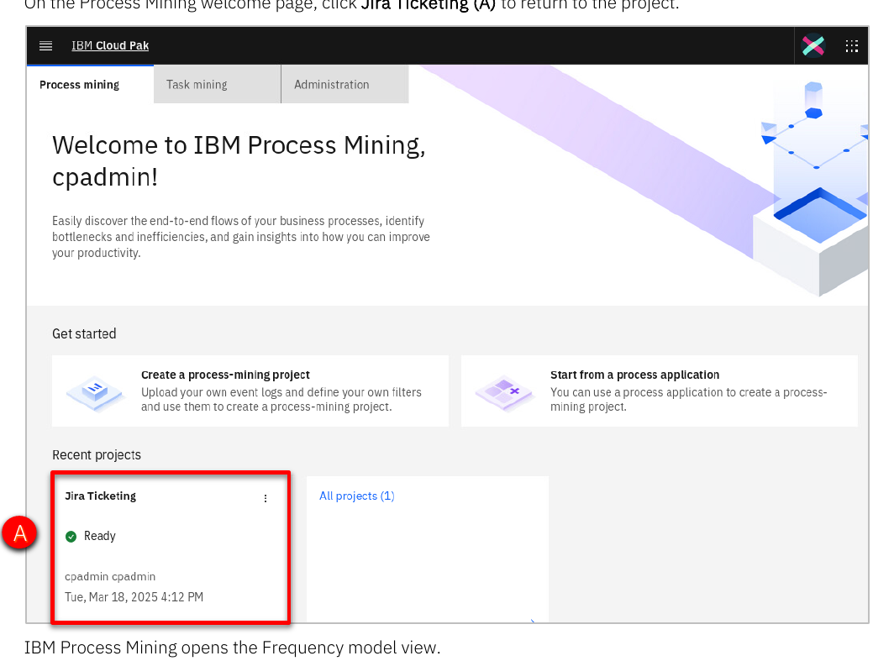

2. 왼쪽 탐색 바에서 `Data & Settings` (A)를 클릭합니다.
3. `Project` 탭 (B)을 선택합니다.
4. `Backup & History` (C)를 선택합니다.
5. `Upload backup` (D)를 클릭합니다.
   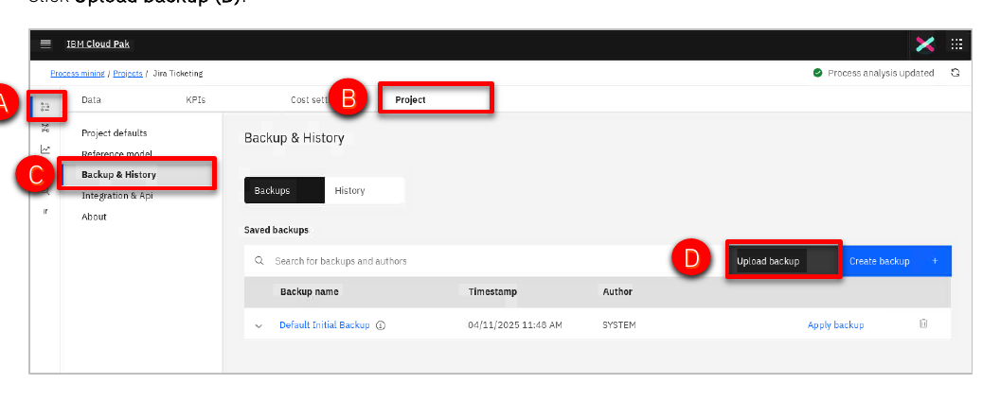

6. `File Upload` 창에서 다운로드한 labfiles 폴더로 이동하여 파일 **Jira Ticketing_no dashboards.idp** (A)를 선택하고 오른쪽 상단 모서리의 `Open` (B)을 클릭합니다.   

   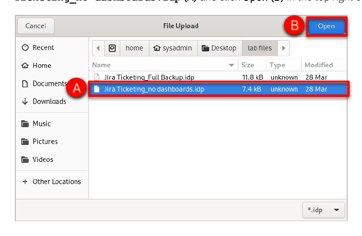

7. 백업이 목록에 있는지 확인하고 `Apply backup` (A)을 클릭합니다.

8. 확인 메시지가 나타나면 `Apply backup` (A)을 클릭합니다.

   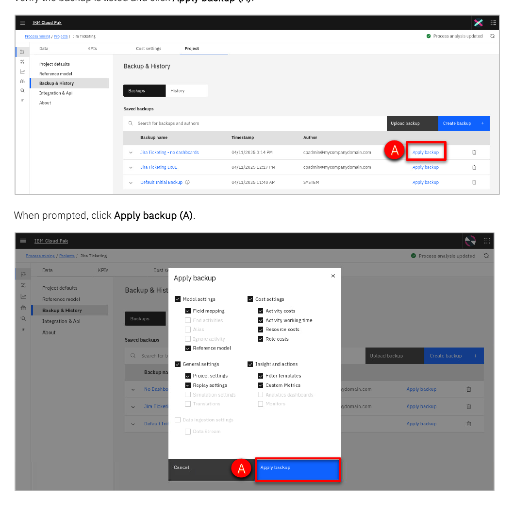

9. 확인 메시지가 나타나면 `Go to the analysis` (A)를 클릭합니다.
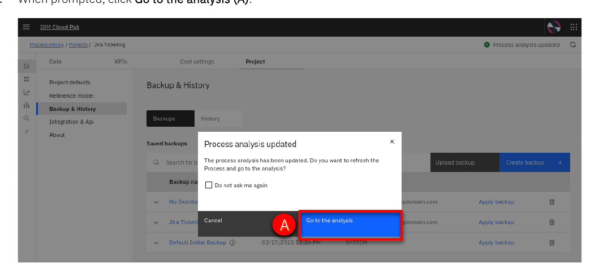

### 사용자 정의 지표 검토

> 이 섹션에서 하는 일 :    
>  백업에 포함된 **사용자 정의 지표(Custom metric)** 중 하나(`Resolutions Rejected`)를 열어 SQL 정의를 확인하고 **Test code**로 샘플 결과를 검증합니다. Dimension이 자동으로 채워지지 않을 때는 각 항목의 Dimension을 수동 지정합니다.

> 왜 필요한가 :   
>  이벤트 로그에는 **SLA 기준값 같은 비즈니스 메타데이터가 존재하지 않습니다**. 이벤트 로그를 재가공하지 않고도 "티켓 우선순위별 SLA", "거부된 해결 횟수"처럼 **케이스 단위의 비즈니스 지표**를 추가하려면 사용자 정의 지표가 필요합니다. 이는 "프로세스 마이닝 = 이벤트 로그만 보는 분석"이라는 한계를 뛰어넘어 **이벤트 로그 + 비즈니스 규칙**을 한 화면에서 분석할 수 있게 해주는 핵심 메커니즘입니다.

사용자 정의 지표는 IBM Process Mining의 기능으로, 프로젝트의 케이스 수준에서 사용자 정의 SQL 쿼리를 적용하여 비즈니스 지표를 생성하는 데 도움이 됩니다. IBM Process Mining에서 사용 가능한 데이터를 사용하여 SQL 쿼리를 작성하고 사용자 정의 결과를 계산할 수 있습니다. 따라서 사용자 정의 지표를 생성하려면 SQL과 IBM Process Mining의 데이터 구조에 대한 충분한 이해가 필요합니다.

> **선택 사항:** 사용자 정의 지표의 예시는 다음 URL에서 확인할 수 있습니다: www.ibm.com/docs/en/process-mining/2.0.0?topic=metrics-examples-custom

이 백업에 정의된 일부 지표는 대시보드에서 사용됩니다. 이 섹션에서는 사용자 정의 지표 중 하나를 검토하고 테스트합니다.

1. Frequency 모델이 표시되면 `Data & Settings` (A)를 클릭합니다. 그런 다음 `KPIs` 탭 (B)을 선택하고 `Custom metrics` (C)가 선택되어 있는지 확인합니다. 테이블 왼쪽 하단에서 페이지당 10개 항목 (D)을 선택합니다.
   IBM Process Mining이 모든 사용자 정의 지표를 나열합니다.

   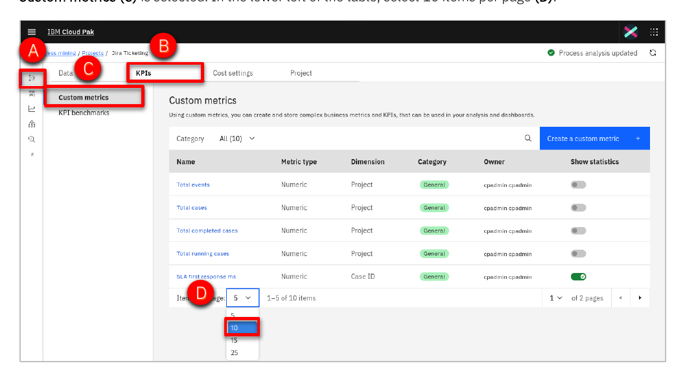

2. 사용자 정의 지표 목록에서 처음 4개 (A)는 IBM Process Mining이 각 새 프로젝트에 포함하는 지표임을 확인합니다. 나머지 사용자 정의 지표는 프로젝트 백업에 특정한 것들입니다.
3. `Resolutions Rejected` (B) 항목 위에 마우스를 올리고 `Edit` 아이콘 (C)을 클릭합니다.

4. `Test code` (B) 버튼이 보일 때까지 스크롤 (A)을 내립니다. `Test code` (B)를 클릭하여 결과 샘플을 봅니다.
   IBM Process Mining이 15개의 샘플을 반환합니다.

   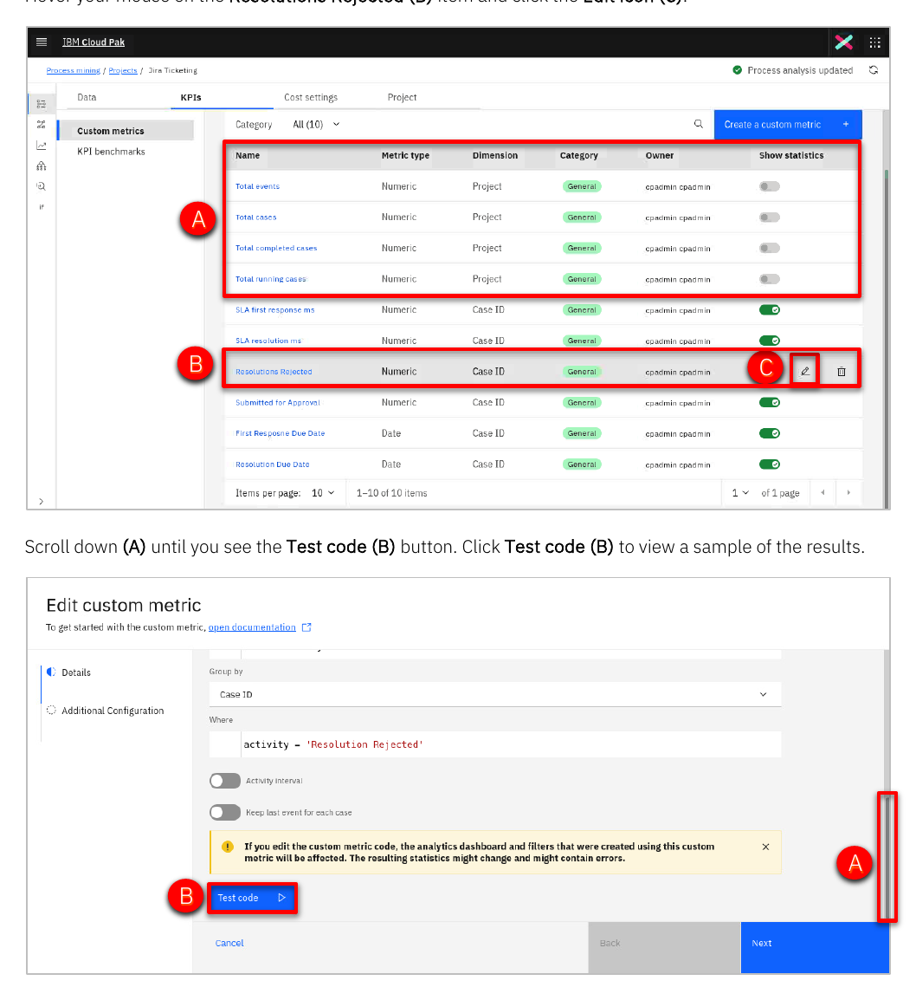
   
- Dimension이 자동으로 채워 지지 않은 경우에는 항목 별 Dimension을 설정해야 합니다.

	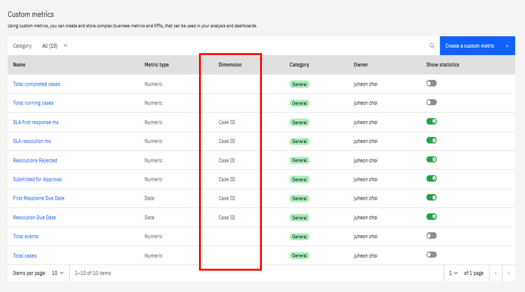

5. 스크롤 (A)을 내려 결과 (B)를 확인합니다.

6. 다시 위로 스크롤 (A)하여 지표 구성을 확인합니다. 이 간단한 사용자 정의 지표는 티켓당 거부된 해결 횟수를 계산합니다.
7. 지표를 검토한 후 왼쪽 하단의 `Cancel` (B)을 클릭합니다.

   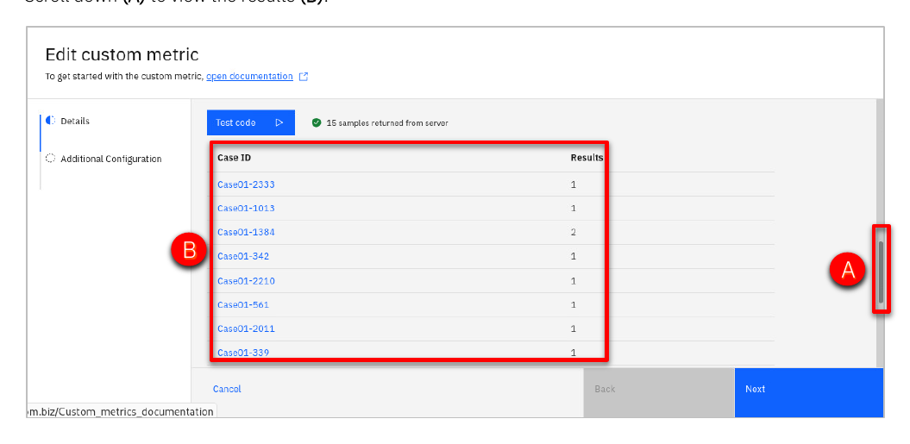

   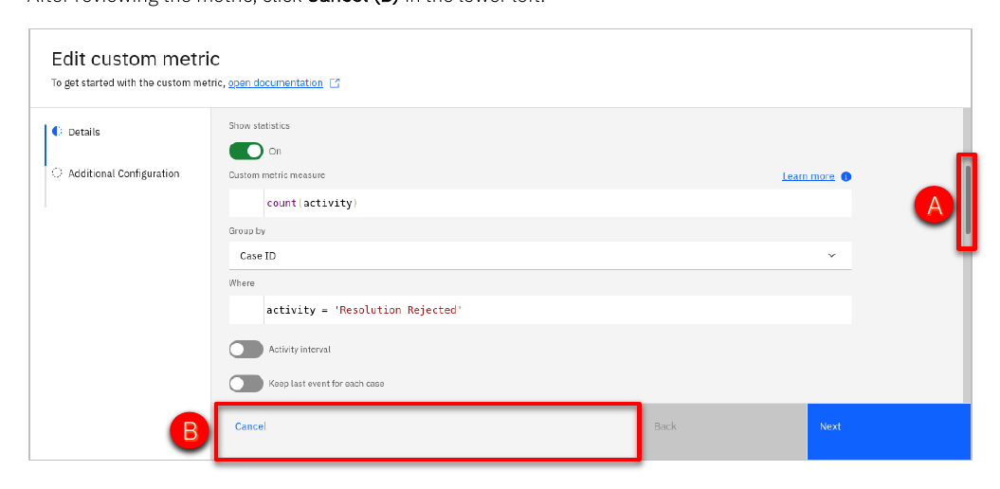

### 대시보드 가져오기

> 이 섹션에서 하는 일 :    
>  사전에 구성된 두 개의 대시보드 파일(**Executive Business Dashboard.dashboard**, **Ticket Deviations.dashboard**)을 `Analytics > Import dashboard`로 업로드합니다.

> 왜 필요한가 :   
>  대시보드를 **처음부터 모두 구축**하면 3시간 이상 걸립니다. 이미 현장에서 검증된 **경영진용 SLA 대시보드**와 **이탈·비용 분석 대시보드**를 가져와 **즉시 분석에 돌입**하고, 다음 섹션인 "처음부터 구축"에서 새로운 관점의 대시보드만 추가합니다. 이는 대시보드가 **재사용 가능한 분석 자산**이라는 점을 보여주는 실습이기도 합니다 — 한 번 잘 설계하면 유사 프로세스·유사 사용 사례에 반복 적용할 수 있습니다.

대시보드를 사용하여 고객이 요청한 특정 KPI와 동작, 특히 SLA 준수 및 프로세스 이탈과 비용을 분석할 수 있습니다. 이 섹션에서는 먼저 전반적인 프로세스 성능을 평가하고 SLA 준수 측면에서 개선 여지가 있는지, 그리고 어디에 문제가 있는지 파악합니다.

1. 왼쪽 탐색 바에서 `Analytics` (A)를 클릭한 후 `Import dashboard` (B)를 클릭합니다.

   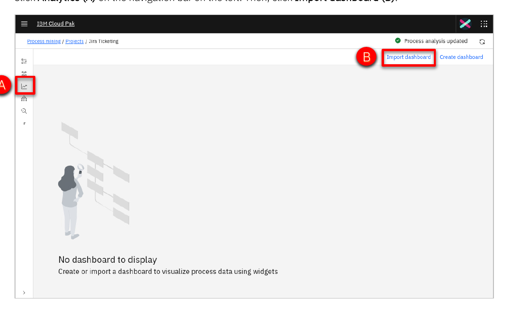

2. `Import dashboard` 대화 상자에서 이름에 **Executive Business Dashboard** (A)를 입력합니다. `Browse` (B)를 클릭하고 **Executive Business Dashboard.dashboard** 파일을 선택하고 `Open`을 클릭한 다음 `OK` (C)를 클릭합니다.
   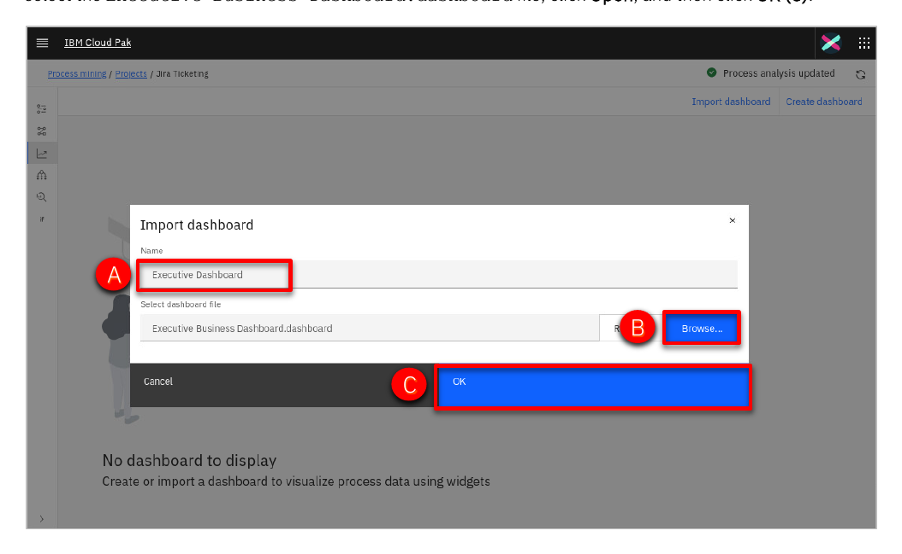

3. 동일한 방법으로 **Ticket Deviations** 대시보드도 가져옵니다.

### 전반적인 성능 평가

> 이 섹션에서 하는 일 :    
>  Executive Dashboard의 필터 템플릿에서 `ClosedandMedHiPriority`를 적용해 **닫힌 중·고 우선순위 티켓**만 남긴 뒤, 대시보드 상단의 주요 KPI(프로세스 성능, 리드타임 주요 활동, 우선순위별 SLA 준수율, 거부된 해결 비율)를 검토합니다.

> 왜 필요한가 :   
>  고객의 SLA는 **닫힌 티켓**에 대해서만 측정됩니다(진행 중 케이스는 아직 기한 위반이 아닐 수도 있음). 또 Low·Lowest 우선순위는 SLA가 40일로 느슨해 평균을 왜곡시킵니다. **"닫힘 + 중·고 우선순위"** 로 범위를 좁히면 **"지금 당장 개선해야 할 범위"** 가 명확해지고, 이후 활동별 분석에서 나오는 수치가 **곧바로 의사결정 가능한 형태**가 됩니다. 필터 템플릿은 특정 분석 질문에 대응하는 **분석 프리셋**의 역할을 합니다.

4. 상단의 탭 (A)을 선택하여 `Executive Dashboard`로 돌아가고 `Manage filters` (B)를 클릭합니다.
   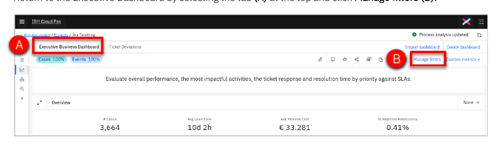

   IBM Process Mining은 대시보드에 적용된 활성 필터 목록과 필터 템플릿 목록을 나열합니다.

   이 백업의 세 가지 필터 템플릿은 다음과 같습니다:
   - `Closed Tickets`
     닫힌 티켓만 있는 케이스를 표시합니다.
   - `ClosedandMedHiPriority`

   닫힌 중간 및 높은 우선순위 티켓만 표시합니다.
   - `Country is Country_1`
   Country_1에 대한 케이스만 표시합니다.
   - `Keep only completed cases`
   완료된 케이스만 표시합니다.

   필터 템플릿은 특정 프로세스 동작을 식별하는 데 사용되는 필터 세트임을 기억하십시오.

5. `ClosedandMedHiPriority` 필터에 대해 `Apply` (A)를 클릭합니다.

   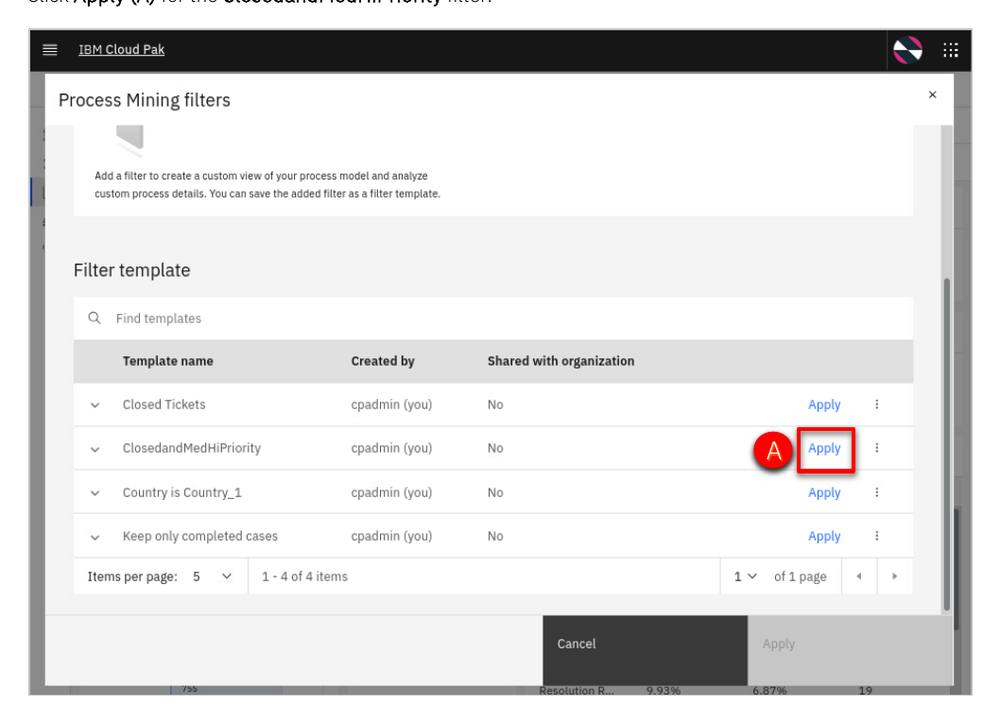

6. 확인 메시지가 나타나면 `Continue` (A)를 클릭합니다.

   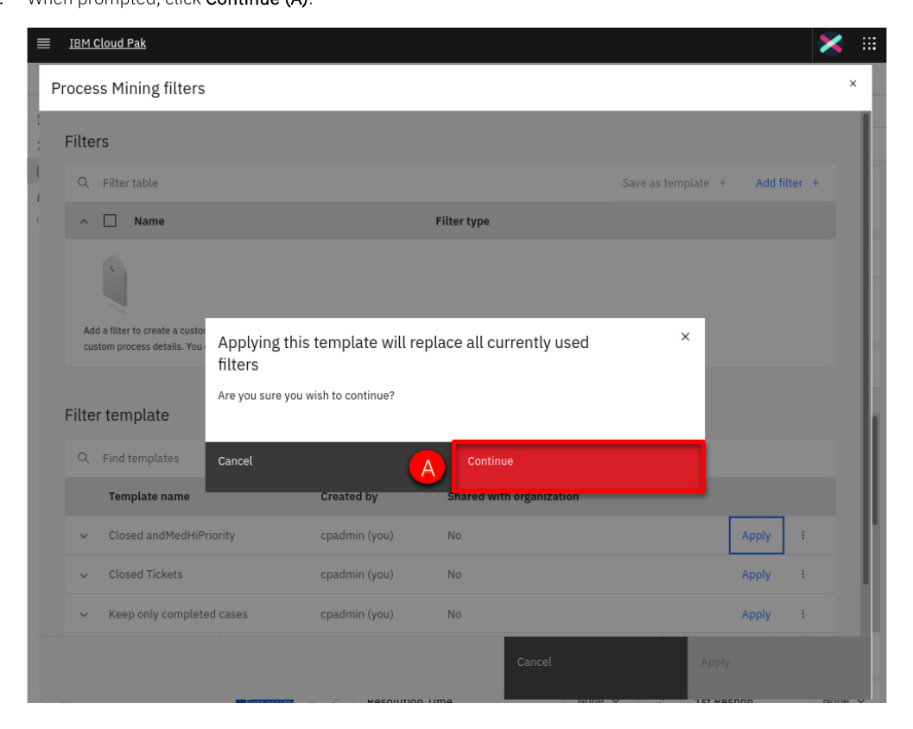

7. 쿼리가 완료되면 `Refresh` (A)를 클릭합니다.
   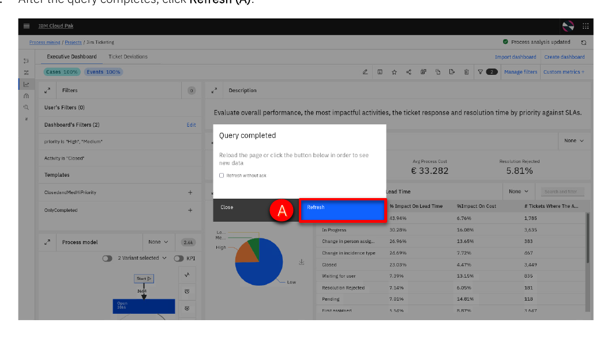

8. 대시보드 상단의 설명을 검토합니다.
   대시보드 상단에 설명을 배치하면 모든 사용자가 대시보드의 목적을 쉽게 파악할 수 있습니다. 이 대시보드는 프로세스 성능, 리드 타임에 가장 큰 영향을 미치는 활동, 우선순위별 SLA 준수 현황을 평가하는 데 사용됩니다. 또한 실제로 해결되지 않았음에도 해결된 것으로 처리된 티켓 비율인 "거부된 해결 비율"도 확인할 수 있습니다.

### SLA 성능 및 성능 저하의 잠재적 원인 분석

> 이 섹션에서 하는 일 :    
>  `Resolution Time` · `First Response Time` 막대 차트에서 **우선순위·티켓 유형별 SLA 초과 시간**을 읽어내고, `Activity Impact on Lead Time` 차트에서 **어떤 활동이 리드타임을 잡아먹는지**를 %로 정량화합니다.

> 왜 필요한가 :   
>  고객의 요청은 "SLA 준수율 개선"이라는 **결과 지표**지만, 개선을 위해서는 **원인 활동**을 찾아야 합니다. 이 섹션에서 두 개의 핵심 숫자가 확정됩니다 — **High Request 티켓 해결 시간 평균 +3일 초과**, **리드타임의 ~40%가 Change in request type, ~35%가 Change in person assigned에 소요**. 이는 실습 2에서 발견한 **"두 Change 활동이 문제"**라는 진단을 **시간 관점에서 재확인**하는 증거이자, 실습 4 What-if 시뮬레이션의 **직접적 입력값**이 됩니다.

1. 외부 스크롤바를 사용하여 대시보드 끝까지 스크롤합니다.
   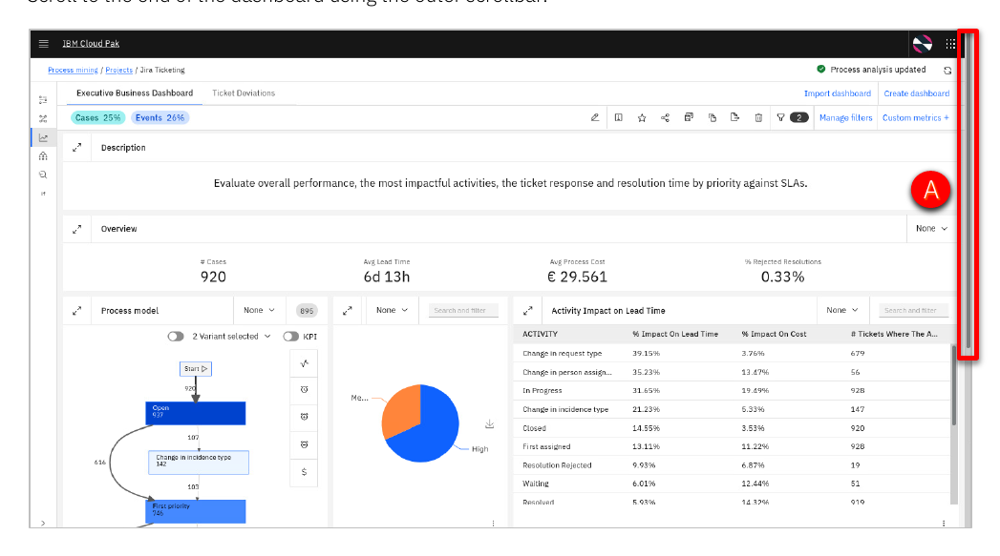

2. `Resolution Time` 막대 그래프에서 우선순위 및 티켓 유형별 해결 시간을 확인합니다. 이 분석의 목적은 고객이 요청한 SLA 성능 저하의 원인을 파악하는 것입니다. 그래프를 보면 높은 우선순위와 중간 우선순위 티켓의 경우 평균적으로 SLA를 준수하지 못하고 있습니다. "Requests"와 관련된 높은 우선순위 티켓은 평균 약 3일(2일 22시간) (A) 지연되고, 중간 우선순위 티켓은 1.5일(1일 15시간) (A) 지연됩니다.
   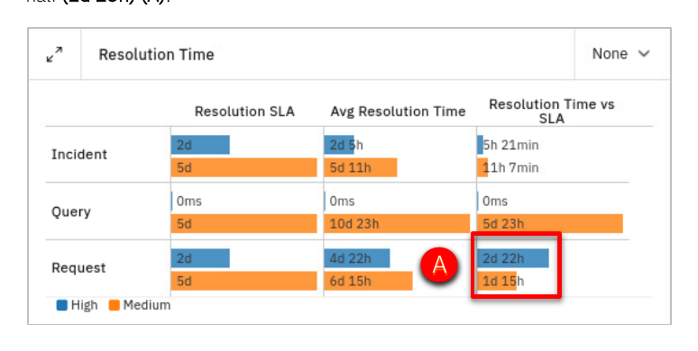

3. `First Response Time` 그래프에서 첫 번째 응답 시간을 확인합니다. "Request" 유형 티켓이 예상보다 며칠 더 걸리는 것을 알 수 있습니다. 이는 성능 개선의 잠재적 기회가 있는 영역을 나타냅니다.   
   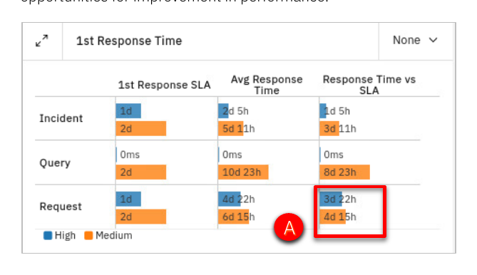

4. `Activity Impact on Lead Time` 차트에서 각 활동이 리드 타임에 미치는 영향을 확인합니다. 요청 유형 변경이 발생한 약 700건의 티켓에서 전체 소요 시간의 약 40%가 이 활동에 집중됩니다 (A). `Change in person assigned` 활동도 마찬가지로, 담당자 변경 시 티켓 소요 시간의 35% 이상 (B)이 해당 활동에 소요됩니다. 이 두 활동이 SLA 준수와 성능 개선을 위한 핵심 집중 영역임을 알 수 있습니다. 다음으로 Ticket Deviations 대시보드를 열어 비용 관점에서 추가 분석을 진행합니다.   
   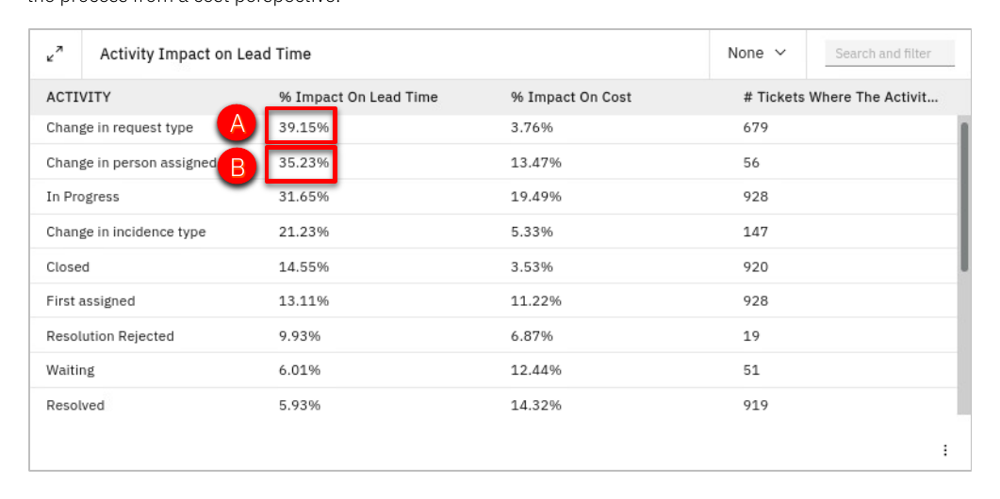

### 이탈 및 비용에 미치는 영향 분석

> 이 섹션에서 하는 일 :    
>  `Ticket Deviations` 대시보드로 전환해 **인적 비용의 약 10% 가 예방 가능한 변경 활동에 집중되는지**를 확인하고, `Changes Statistics` 매트릭스에서 활동별 **발생 건수 / 재작업 비율 / 수동·자동 처리 비용**을 동시에 비교합니다.

> 왜 필요한가 :   
>  SLA 분석은 **"얼마나 늦는가"** 를 알려주지만, 경영진의 투자 의사결정을 위해서는 **"얼마가 낭비되는가"** 라는 금액 근거가 필요합니다. 이 섹션은 SLA 측에서 원인으로 지목된 두 Change 활동이 **비용 측에서도 동일하게 최상위 원인**이라는 **이중 검증**을 완성합니다. 특히 `Change in request type`은 자동화율이 42%나 되는데도 **발생 빈도 자체가 높아** 총 비용이 가장 큽니다 — **"자동화 비율이 높다 = 안전하다"** 는 착각을 깨는 발견이며, 실습 4 What-if의 **"발생 빈도를 줄이면 어떻게 될까"** 시나리오로 자연스럽게 이어집니다.

1. 상단의 탭을 선택하여 `Ticket Deviations` (A) 대시보드를 엽니다.
   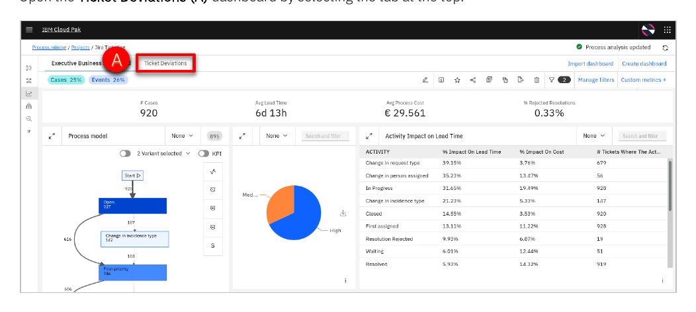

2. 이 대시보드에서 인적 비용의 약 10% (A)가 티켓 변경과 관련된, 즉 예방 가능한 비용임을 확인합니다.
   `Changes Statistics` (B) 매트릭스 차트는 각 활동별로 발생 티켓 수, 티켓당 재작업 비율, 그리고 총 리소스 비용을 나타냅니다. 각 KPI는 수동 실행과 자동 실행으로 구분되어 표시되므로, 예를 들어 총 FTE 비용을 기준으로 자동화 비용과 수동 처리 비용을 분리하여 분석할 수 있습니다.

   변경 사항 가운데 `Change in request type` (B)과 `Change in person assigned` (B)에 가장 높은 비용이 집중됩니다. 이 두 활동은 프로세스 적시성에도 영향을 미치는 동일한 활동들입니다. `Change in request type`은 자동화 비율이 약 42%임에도 불구하고, 발생 빈도가 높아 리소스 비용 관점에서 가장 비싼 변경 사항이 됩니다.
   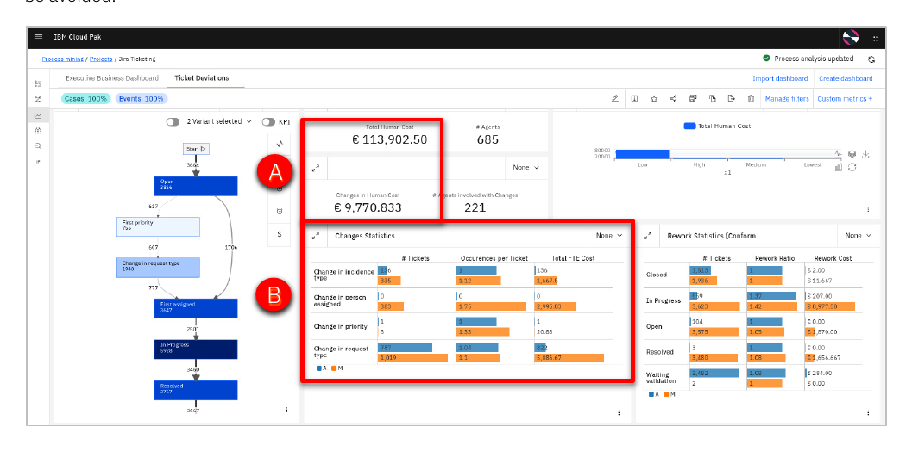

   여기서 더 깊이 분석할 수 있지만, 이 높은 수준에서도 비용과 시간 관점에서 성능 저하의 일부 근본 원인을 파악했습니다. SLA 및 비용 관련 문제와 일부 근본 원인을 식별했으므로 이 시점에서 `Change in Request Type`과 `Change in Person Assigned` 활동에 집중하여 솔루션을 제안할 수 있습니다.

### 처음부터 대시보드 만들기

> 이 섹션에서 하는 일 :    
>  빈 템플릿에서 시작해 **Annotation · Filter · Card · Elastic(Pie/Bar/Row) · Table (Legacy)** 까지 6가지 위젯 유형을 직접 구성하고 배치하며, 과거 성과(`IS_RUNNING = 0`)와 현재 업무량(`IS_RUNNING = 1`)을 한 화면에서 보는 **Resource Monitoring 대시보드**를 만듭니다.

> 왜 필요한가 :   
>  사전 구성 대시보드(Executive · Ticket Deviations)는 **경영진·분석가용 전략 진단**을 위한 것이지만, 현장 관리자에게는 **"지금 이 티켓을 누구에게 줄까"** 라는 운영 질문에 답하는 대시보드가 필요합니다. 이 섹션은 단순히 위젯 사용법을 배우는 것이 아니라, **분석 질문을 위젯 조합으로 분해하는 설계 사고**를 훈련합니다 — "담당자의 과거 경험은 Bar 차트, 국가 분포는 Pie, 이슈 유형은 Row, 현재 열린 티켓은 Table, 현재 업무량은 Row 차트" 식의 매핑. `Keep last event for each case` 옵션과 `IS_RUNNING` 필터 조합은 **"지금 이 순간의 운영 상태"** 를 정확히 반영하는 데 핵심이며, 이는 실시간 모니터링의 기반이 됩니다.

이 섹션에서는 처음부터 자체 대시보드를 구축합니다. 대시보드는 가장 경험 많은 지원 담당자가 국가 및 이슈 유형별로 어떻게 수행되는지 평가할 수 있어야 합니다. 대시보드는 또한 새 티켓이나 SLA 위반을 처리할 담당자를 추천하기 위해 현재 업무량을 모니터링할 수 있어야 합니다. 이를 통해 지원 관리자가 업무량을 더 잘 분배하기 위한 지식 공유 이니셔티브를 평가할 수 있어야 합니다.

> **문제 해결:** 대시보드 구성에 어려움이 있는 경우, `Resource Monitoring` 대시보드를 가져와서 참고할 수 있습니다.

대시보드는 상단에 과거 데이터를 표시하고 하단에 현재 업무량 데이터를 표시합니다. 실행 중인 케이스와 실행 중이 아닌 케이스를 구분하려면 실행 중이 아닌 케이스에는 `IS_RUNNING = 0`, 실행 중인 케이스에는 `IS_RUNNING = 1` 필터를 사용할 수 있습니다.
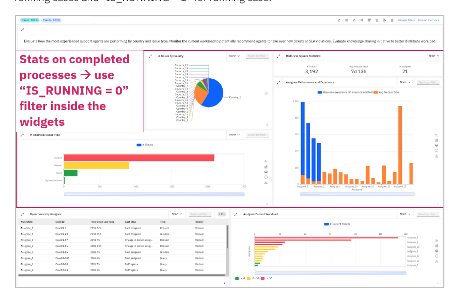

하단 섹션에서 실행 중인 케이스를 표시하려면 `IS_RUNNING = 1` 필터를 사용합니다. 실행 중인 케이스에는 "Keep last" 함수도 함께 활용할 수 있습니다. 이 함수는 각 케이스의 마지막 이벤트 로그 레코드만 유지하여, `case_stats` 테이블의 리드 타임 등을 계산할 때 발생할 수 있는 카디널리티 문제를 방지합니다. `Open Issues by Assignee` 위젯의 경우 `now()` 함수를 사용하여 현재 날짜를 기준으로 계산할 수 있습니다.
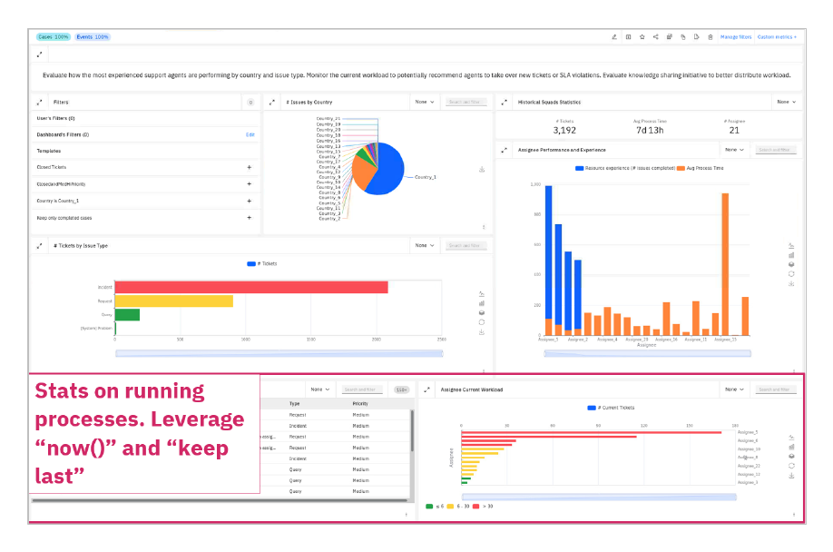

과거 및 실행 중인 티켓을 함께 표시하려면 실행 중이거나 완료된 케이스를 제외하는 대시보드 필터를 적용할 수 없습니다: 위젯 수준에서 처리해야 합니다.

IBM Process Mining은 위젯을 4가지 카테고리로 그룹화합니다:
- **Process 위젯**: 프로세스 위젯은 이벤트 로그 및 프로세스를 기반으로 정보를 표시합니다. 프로젝트가 오브젝트 테이블만을 기반으로 하는 경우 프로세스 위젯을 사용할 수 없습니다.
  - Case KPI summary, Case variants, Lead time distribution, Process model, Social network
- **Chart 위젯**: 차트는 이벤트 로그 및 오브젝트 테이블의 데이터를 시각적으로 표시하는 데 사용할 수 있는 구성 가능한 위젯입니다.
  - Elastic, Matrix (Legacy), Matrix chart (Legacy), Table (Legacy)
- **Card 위젯**: 카드는 수치 데이터를 표시하는 데 사용할 수 있는 구성 가능한 위젯입니다.
  - Annotation, Card, Filters
- **Custom 위젯**: 사용자 정의 위젯은 JavaScript 또는 노코드 구성 옵션을 사용하여 완전히 구성할 수 있습니다.

이 대시보드의 경우 세 가지 다른 `Card` 위젯, 네 개의 `Elastic` 위젯 및 `Table Legacy` 위젯을 만듭니다.

#### 새 대시보드 만들기

> 이 섹션에서 하는 일 :    
>  `Empty` 템플릿으로 빈 캔버스를 연 뒤, 사용할 수 있는 6개 사전 템플릿(`History and Trends`·`Process Overview`·`Automation Analysis`·`Workforce Optimization`·`Operational Excellence`·`Compare Dashboard`)의 쓰임을 검토합니다.

> 왜 필요한가 :   
>  템플릿을 쓰면 빠르지만, 처음 한 번은 **빈 캔버스에서 위젯을 스스로 조합**해봐야 "왜 이 템플릿은 이렇게 생겼는지"를 이해할 수 있습니다. 대시보드 설계는 본질적으로 **분석 질문을 위젯 단위로 분해하는 작업**이며, 템플릿이 없는 상태에서 한번 훈련되면 다음 프로젝트에서는 어떤 템플릿이든 5분 내 커스터마이즈할 수 있는 감이 생깁니다.

1. 오른쪽 상단에서 `Create dashboard` (A)를 클릭하고 **Resource Mapping** (B)과 같은 대시보드 이름을 입력합니다. 템플릿은 `Empty` (C)로 그대로 둡니다. 그런 다음 `OK` (D)를 클릭합니다.
   새 대시보드를 구축하는 데 사용할 수 있는 여러 템플릿이 있습니다:
   - `History and Trends`
     이 대시보드는 시간 및 리소스 할당 관점에서 과거 볼륨과 성능 분석에 집중합니다.
   - `Process Overview`
     이 대시보드에는 볼륨, 시간 및 비용을 포함한 전반적인 프로세스 KPI와 정보가 포함됩니다.
   - `Automation Analysis`
     이 대시보드는 지능형 자동화를 통해 방지할 수 있는 가장 높은 비용과 재작업이 있는 활동을 강조하는 데 집중합니다.
   - `Workforce Optimization`
     이 대시보드는 인력에 집중하여 누가 어떤 활동에 작업 중인지 분석하고 초과 시간에 대한 통찰력을 제공합니다.
   - `Operational Excellence`
     이 대시보드는 진행 중인 프로세스에 집중하여 오랫동안 보류 중인 케이스를 강조합니다.
   - `Compare Dashboard`
     이 대시보드는 두 가지 이상의 다른 동작을 비교하는 데 유용합니다. 다른 위젯에 다른 필터 템플릿을 적용하여 비교를 가능하게 합니다.

   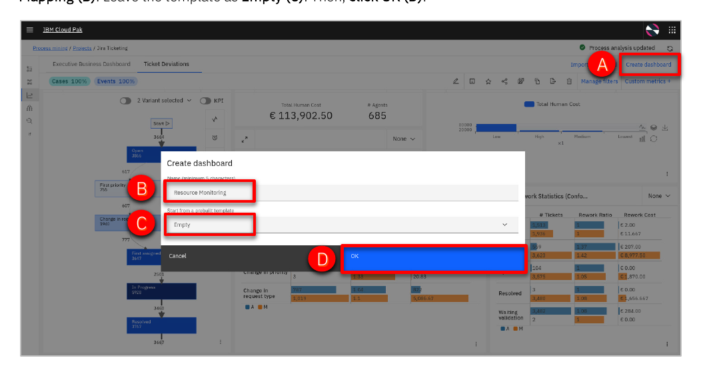

   대시보드 구축에 사용된 논리에 익숙해지기 위해 이 섹션에서는 처음부터 대시보드를 구축하고 각 위젯의 논리를 구성합니다. 이 실습의 목적은 다양한 위젯과 구성 방법에 대한 경험과 지식을 얻는 것입니다.

#### Annotation 위젯 추가

> 이 섹션에서 하는 일 :    
>  대시보드 최상단에 **HTML 설명 카드**를 배치합니다. 대시보드의 목적·사용 시나리오·대상 사용자를 짧게 명시합니다.

> 왜 필요한가 :   
>  대시보드는 만든 사람 혼자 쓰는 것이 아니라 **여러 관리자·팀원이 공유**합니다. 설명이 없으면 1~2주만 지나도 "이 대시보드는 무슨 질문에 답하는 건가?"가 흐려져 **동일 데이터로 엇갈린 해석**이 생깁니다. Annotation 위젯은 대시보드의 **"취급설명서"** 이자, 필터·지표의 의미를 통제하는 **거버넌스 장치**입니다.

이 섹션에서는 대시보드를 설명하는 위젯을 추가합니다. `Annotation` 카드 위젯을 사용합니다. `Annotation` 위젯은 HTML 형식으로 주석과 메모를 구현하는 데 사용할 수 있습니다.
앞서 언급했듯이, 대시보드 상단에 설명을 배치하는 것은 항상 권장됩니다. 이렇게 하면 모든 최종 사용자가 대시보드가 표시하는 내용을 알 수 있습니다. 이미지도 표시할 수 있지만 웹 링크를 통해서만 가능합니다.

1. `Edit` (A)를 클릭하여 대시보드 편집을 시작합니다.

3. `Card` 카테고리를 클릭하고 `Annotation` 위젯 (A)을 선택합니다.
   IBM Process Mining이 위젯을 대시보드 캔버스의 왼쪽 상단에 배치합니다.
   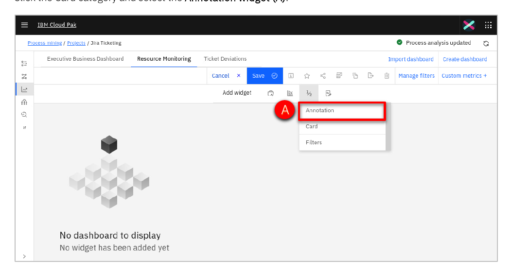

4. 위젯 제목 표시줄의 `Edit` 아이콘 (A)을 클릭합니다.
   IBM Process Mining이 오른쪽에 위젯 구성을 엽니다.

   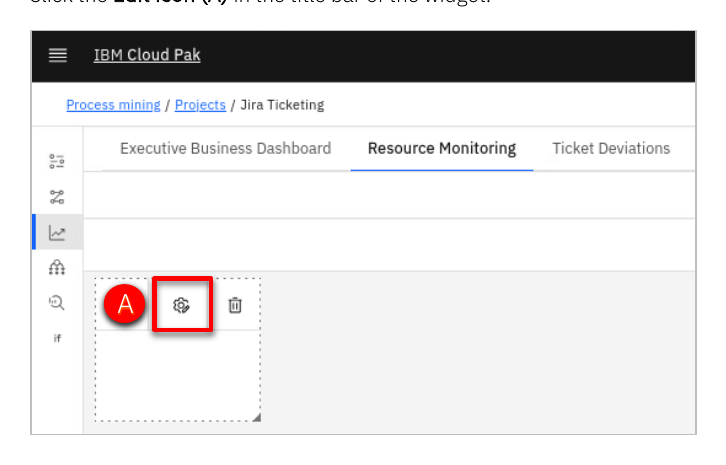

5. 오른쪽 구성 창에서 현재 텍스트를 삭제하고 다음 텍스트를 입력합니다: 가장 경험 많은 지원 담당자가 국가 및 이슈 유형별로 어떻게 수행되는지 평가합니다. 새 티켓이나 SLA 위반을 처리할 담당자를 잠재적으로 추천하기 위해 현재 업무량을 모니터링합니다. 업무량을 더 잘 분배하기 위한 지식 공유 이니셔티브를 평가합니다. (A)
6. `Save` (B)를 클릭하고 `Close` (C)를 클릭합니다.

   제목은 필요하지 않습니다.
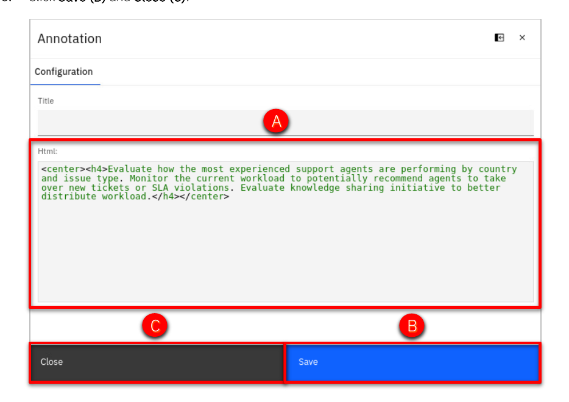

7. 위젯 윤곽선이 파란색으로 바뀔 때까지 위젯을 강조 표시합니다. 커서가 화살표와 선으로 바뀌면 위젯을 대시보드 전체 길이로 늘립니다.
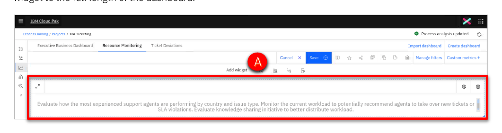

#### Filter 위젯 추가

> 이 섹션에서 하는 일 :    
>  현재 대시보드에 적용된 **모든 필터를 한 곳에 노출**하는 카드를 추가합니다. 여기서 직접 필터를 켜고 끄거나 필터 템플릿을 생성할 수 있습니다.

> 왜 필요한가 :   
>  필터는 **"지금 보고 있는 숫자가 어떤 조건에서 나왔는지"**를 결정합니다. 이 정보가 설정 메뉴 깊이 숨어 있으면 **전체 모수가 아닌 필터된 부분집합의 숫자를 전체로 오해**하는 사고가 발생합니다(예: "완료 케이스만" 필터가 켜진 채로 "전체 티켓 몇 건"을 답변). Filter 위젯은 이 오해를 원천 차단하는 **상시 표시 게이지**입니다.

`Filters` 위젯은 대시보드와 프로젝트에 적용된 모든 필터를 나열합니다. `Filters` 위젯은 구성할 수 없습니다. `Filters` 위젯에서 다음 작업을 수행할 수 있습니다:

- 대시보드 필터 삭제
- 프로젝트 필터 추가 또는 편집
- 대시보드 필터에서 필터 템플릿 생성

1. `Card` 카테고리를 클릭하고 `Filters` 위젯 (A)을 선택합니다.
   필터는 구성할 수 없으므로 위젯을 편집할 필요가 없습니다.
   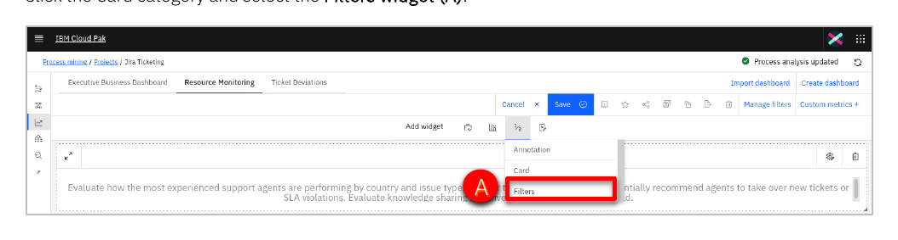

#### Card 위젯 추가

> 이 섹션에서 하는 일 :    
>  **완료된 티켓(IS_RUNNING = 0) 기준**으로 `# Tickets` · `Avg Process Time` · `# Assignee` 세 숫자를 한 줄에 노출하는 `Historical Squads Statistics` 카드를 만듭니다.

> 왜 필요한가 :   
>  차트는 **분포와 비교**에 강하지만, "지금 이 대시보드가 다루는 모수가 얼마인가"라는 **스케일 감각**은 차트로 잘 전달되지 않습니다. 카드 한 줄에 세 지표를 놓으면 "N건을 M명이 평균 L시간에 처리"라는 **프로세스 전체 규모**가 즉시 잡혀, 이후 차트에서 보는 % 숫자가 **체감 가능한 절대량**으로 번역됩니다.

`Card` 위젯은 지표를 표시합니다. 이 위젯에서 티켓 수를 계산하고, 평균 프로세스 시간을 측정하고, 고유한 담당자 수를 계산합니다.

1. `Card` 카테고리를 클릭하고 `Card` 위젯 (A)을 선택합니다.
   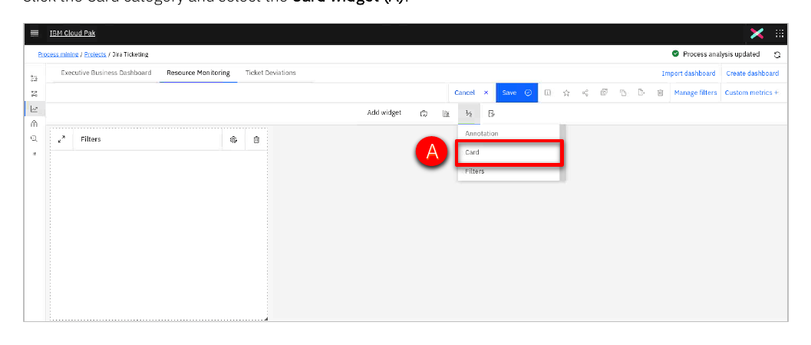

2. 위젯 제목 표시줄의 `Edit` 아이콘 (A)을 클릭합니다.

   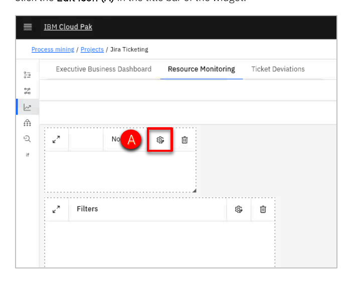

3. `Configuration` 탭에서 다음 정보를 입력합니다:
   - 제목: **Historical Squads Statistics** (A)
   - `From`: **eventlog**와 **case_stats** 모두 선택 (B)
   - `Measures` (C)

      | 이름 | 측정값 | 형식 |
      |------|--------|------|
      | # Tickets | count(distinct(eventlog.caseid)) | Number |
      | Avg Process Time | avg(distinct(leadtime)) | Lead time |
      | # Assignee | count(distinct(assignee)) | Number |

   - `Filters`: IS_RUNNING = 0 (D)

4. `Save` (E)를 클릭한 다음 `Close` (F)를 클릭합니다.

   count(distinct()) 함수는 여기서 고유 엔티티를 계산하는 데 사용됩니다.
   caseid 변수는 eventlog와 case_stats 모두에 존재하기 때문에 한정해야 합니다.

   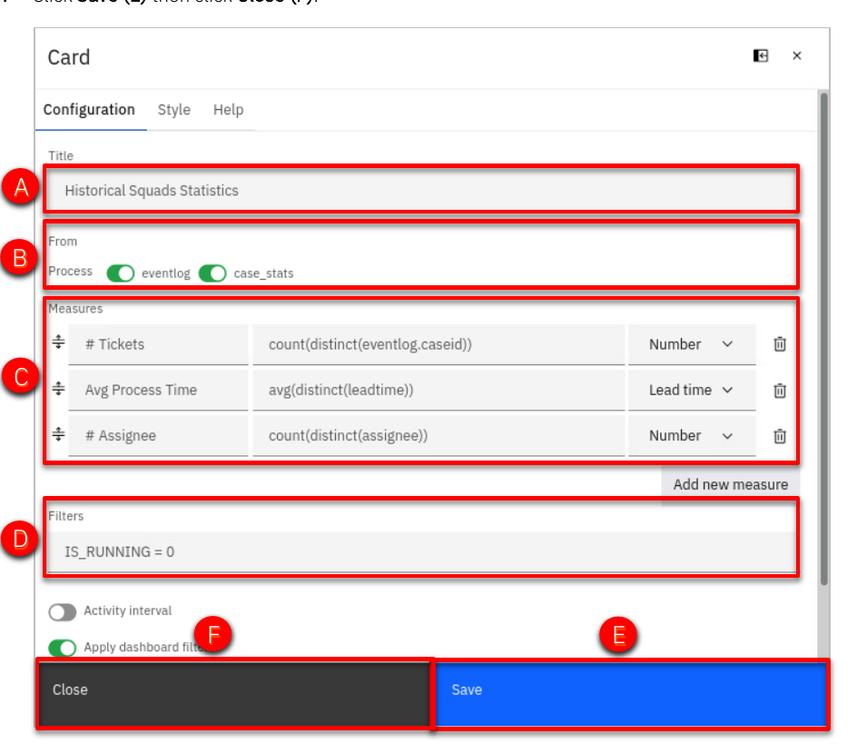

#### Elastic 위젯 추가 – Pie Chart

> 이 섹션에서 하는 일 :    
>  **국가별 티켓 수**를 파이 차트로 표현하는 `Tickets by Country` 위젯을 만듭니다. Dimension은 `COUNTRY`, Measure는 `count(distinct(eventlog.caseid))`.

> 왜 필요한가 :   
>  "어느 지역이 수요 집중 지역인가?"는 담당자 배치·언어 지원·SLA 차등화의 **1차 판단 축**입니다. 파이 차트는 **"전체 대비 비중"**을 직관화하는 표준 형식이며, 대시보드 필터와 연동되어 특정 조각을 클릭하면 나머지 모든 위젯이 그 국가 기준으로 재계산되는 **드릴다운 진입점** 역할도 합니다.

> 참고 :   
>  환경에 따라 파이가 표시되지 않으면 `Style` 탭에서 `Pie` 대신 `Custom`을 선택하세요.

`Elastic` 위젯을 사용하면 데이터를 그래픽으로 시각화할 수 있습니다. 단일 데이터 세트에서 여러 위젯을 만들 수 있습니다. HTML이나 JavaScript를 사용하지 않고 테이블을 만들고 차트로 표시할 수 있습니다.

`Elastic` 위젯은 레거시 위젯을 재생성하는 데 유용합니다.

`Elastic` 위젯에서 다음 차트 유형을 사용할 수 있습니다:
- Line
- Area
- Bar
- Row
- Stacked
- Bubble
- Scatter
- Pie
- Custom

차트 유형은 `Style` 탭에서 구성합니다.

파이 차트 위젯은 국가별 티켓 수를 표시해야 합니다. 국가별 분포를 계산하므로 "Country"를 차원으로 삽입해야 합니다. 한 국가에서 처리하는 티켓 수가 많을수록 파이에서 더 큰 부분을 차지합니다.

1. `Charts` 카테고리를 클릭하고 `Elastic` (A)을 선택합니다.

   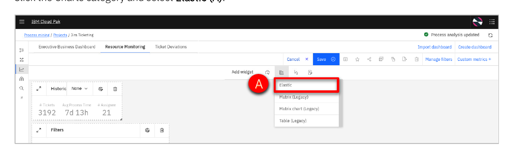

2. 위젯 제목 표시줄의 `Edit` 아이콘 (A)을 클릭합니다.

   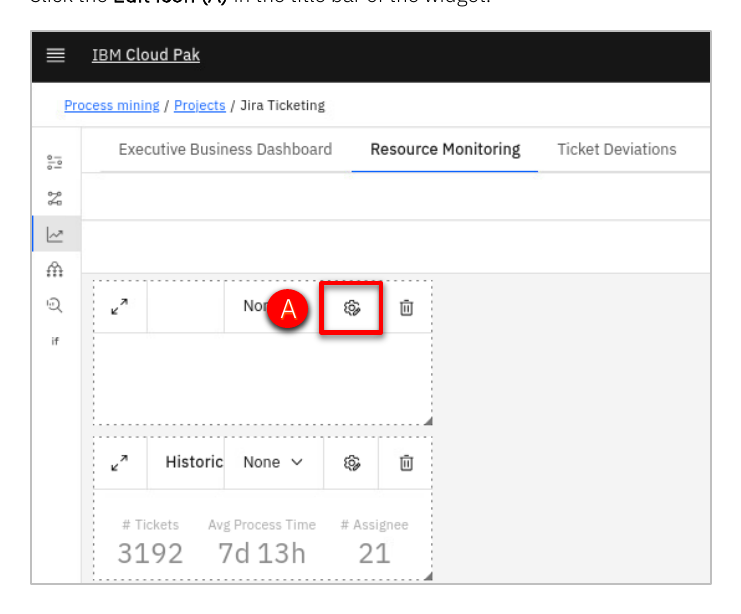

3. `Configuration` 탭에서 다음 정보를 입력합니다:
   - 제목: **Tickets by Country** (A)
   - `From`: **eventlog**와 **case_stats** 모두 선택 (B)
   - `Dimensions`: COUNTRY (C)
   - `Measures` (D)

      | 이름 | 측정값 | 형식 |
      |------|--------|------|
      | # Tickets | count(distinct(eventlog.caseid)) | Number |

   - `Filters`: IS_RUNNING = 0 (E)

4. `Style` 탭 (F)을 선택합니다.

   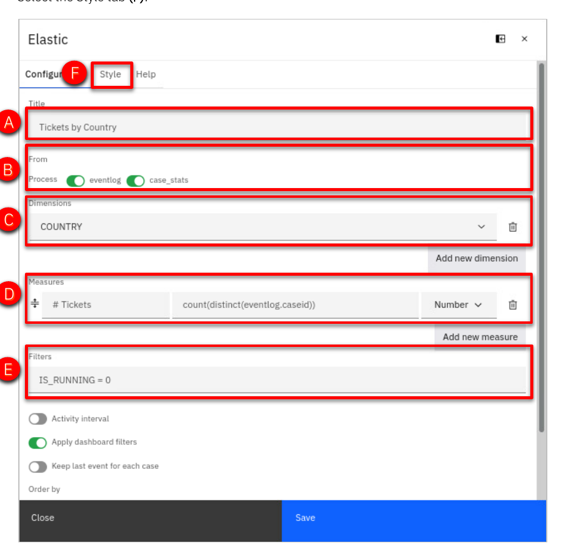
   
   
   현재 Hands-On 환경의 버전에서는 Add new form을 통해 eventlog와 case_stats를 추가 한다.
   
   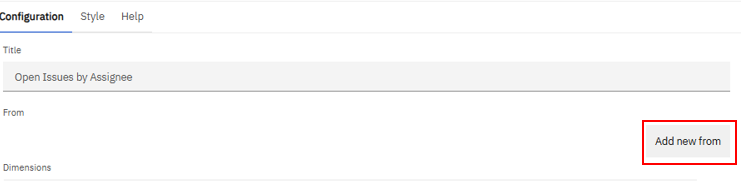
   
   
   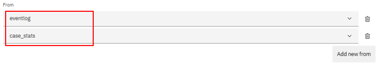
   

5. `Display as a chart` (A)를 클릭하여 활성화한 다음 `Pie` (B) 차트 유형을 선택합니다.
6. `Save` (C)를 클릭한 다음 `Close` (D)를 클릭합니다.
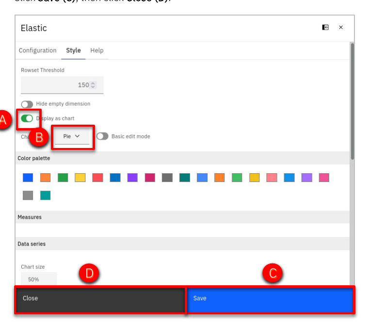

* Pie 대신 Custom을 선택하면 Pie 차트를 확인 할 수 있습니다.

#### 위젯 배치

> 이 섹션에서 하는 일 :    
>  지금까지 만든 위젯(Annotation · Card · Filters · Pie)을 **위 → 아래, 좌 → 우 순서**로 배치하고 대시보드를 한 번 저장합니다.

> 왜 필요한가 :   
>  대시보드의 가독성은 **정보 순서가 90%**입니다. 사용자의 눈이 움직이는 자연스러운 경로(설명 → 현재 필터 → 총량 카드 → 차트)에 맞춰 배치해야 **"보고 → 이해 → 행동"**까지 이어집니다. 순서가 꼬이면 같은 위젯을 놓고도 해석 시간이 2배 이상 걸립니다.

대시보드를 위한 위젯의 절반을 구성했으므로 이제 위젯을 배치하고 진행하기 전에 대시보드를 저장할 수 있습니다.

1. 스크롤을 내려 추가한 첫 번째 `Card` 위젯 (A)을 선택합니다. 위젯 윤곽선이 파란색으로 바뀌고 커서가 십자가 모양으로 바뀌면 위젯을 캔버스 상단으로 드래그합니다.

2. `Filters` 위젯 (A)을 선택합니다. 위젯 윤곽선이 파란색으로 바뀌고 커서가 십자가 모양으로 바뀌면 위젯을 `Card` 위젯 아래로 드래그합니다.

   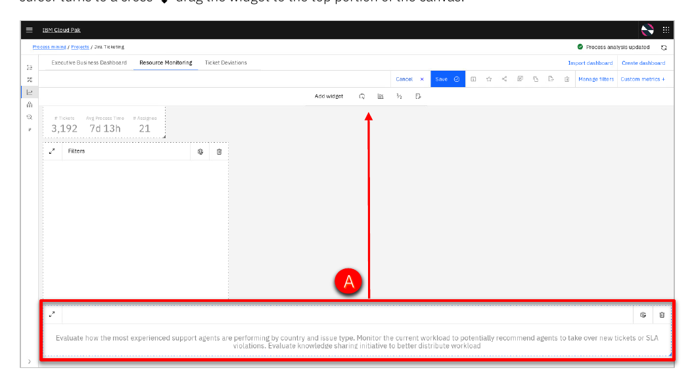

3. `Elastic Pie Chart` 위젯 (A)을 선택합니다. 위젯 윤곽선이 파란색으로 바뀌고 커서가 십자가 모양으로 바뀌면 위젯을 `Filters` 위젯 오른쪽으로 드래그합니다.
   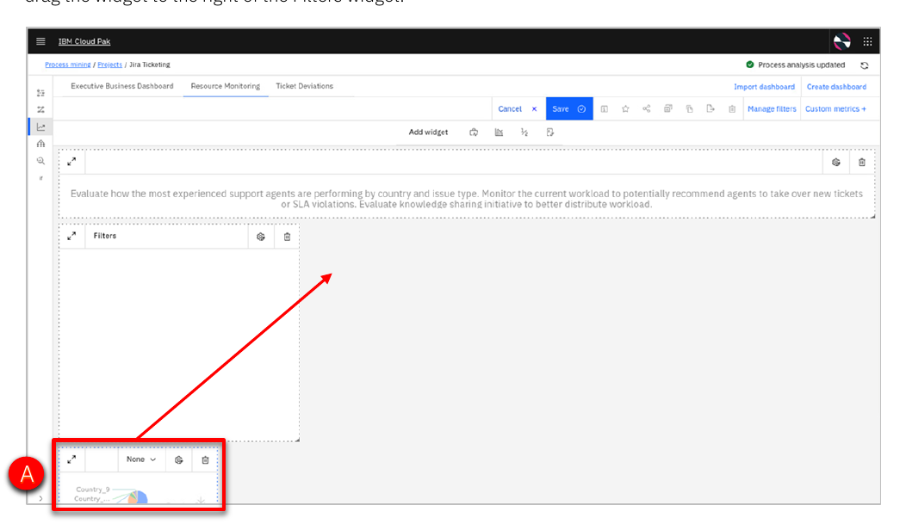

4. `Elastic Pie Chart` 위젯 (A)을 선택합니다. 위젯 윤곽선이 파란색으로 바뀌고 커서가 크기 조절 커서로 바뀌면 위젯을 `Filters` 위젯 높이에 맞게 크기를 조절합니다 (B).
   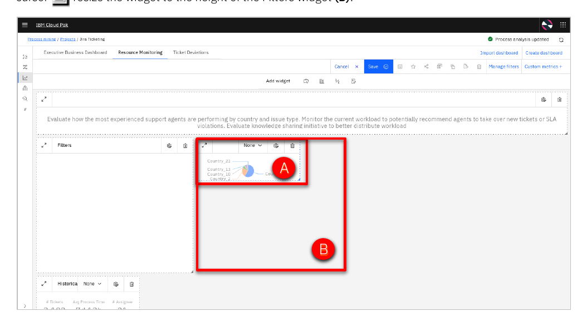

5. `Filters` 위젯 아래에 있는 나머지 `Card` 위젯 (A)을 선택합니다. 위젯 윤곽선이 파란색으로 바뀌고 커서가 십자가 모양으로 바뀌면 `Elastic Filters Pie Chart` 위젯 오른쪽으로 드래그합니다.
   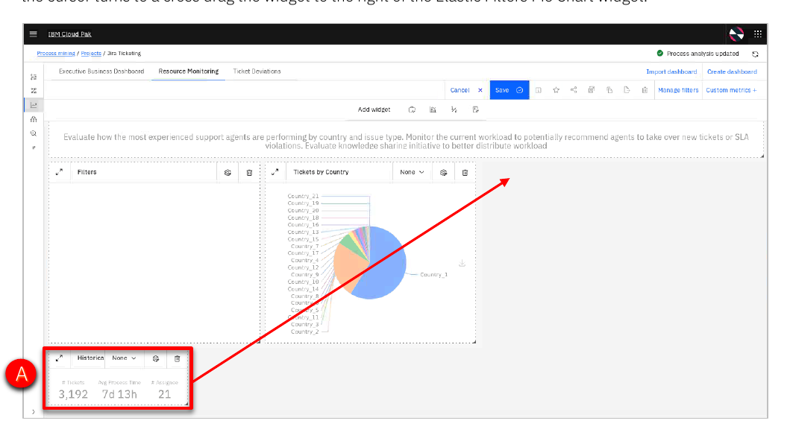

7. `Card` 위젯 (A)을 선택합니다. 위젯 윤곽선이 파란색으로 바뀌고 커서가 크기 조절 커서로 바뀌면 대시보드 전체 너비에 맞게 위젯 크기를 조절합니다.
8. `Save` (B)를 클릭합니다.
   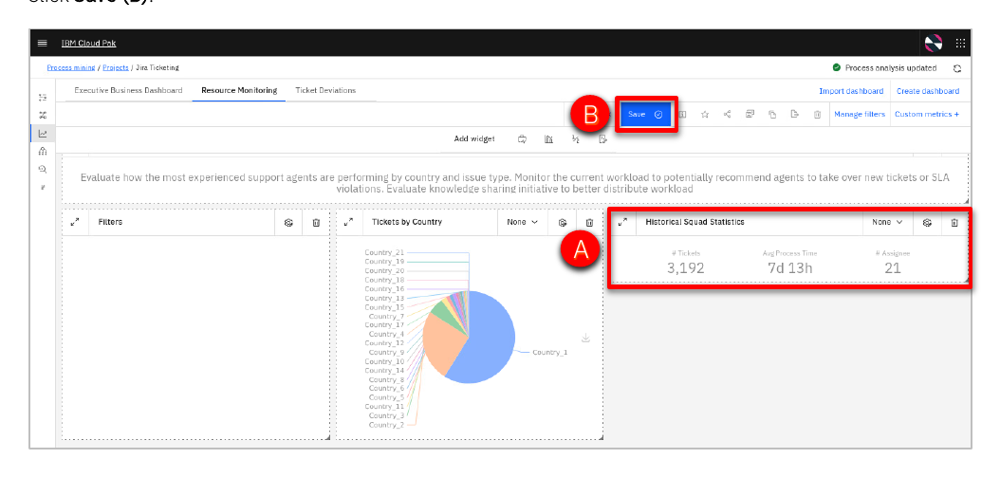

9. 대시보드를 확인합니다. 대시보드는 최대 8개의 위젯을 표시할 수 있습니다. 대시보드 위젯의 절반을 정의했습니다. 대시보드를 확인한 후 `Edit` (A)를 클릭합니다.
   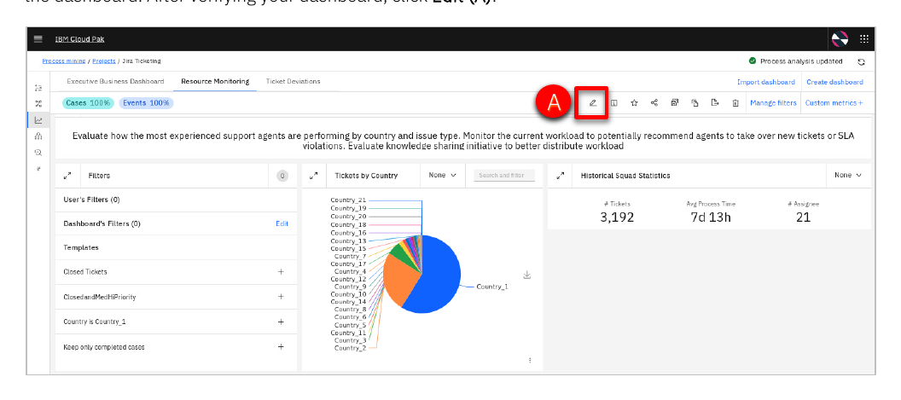

#### Elastic 위젯 추가 – Bar Chart

> 이 섹션에서 하는 일 :    
>  `Assignee Performance and Experience` Stacked Bar 차트를 만듭니다. Dimension = `ASSIGNEE`, Measure 2개(`Resource experience` = 고유 케이스 수, `Avg Process Time` = 평균 리드타임). `Keep last event for each case` 를 반드시 켭니다.

> 왜 필요한가 :   
>  담당자 배정 의사결정은 **"경험(처리한 건수)"**과 **"성능(평균 리드타임)"**을 함께 봐야 나옵니다. 한 차트에 두 축을 겹쳐야 "경험 많은데 느린 사람 vs 경험은 적은데 빠른 사람"이 한눈에 구분됩니다. `Keep last event` 옵션은 **티켓을 최종적으로 마친 담당자**만 카운트하여, 중간에 잠깐 건드린 사람까지 집계되는 오류를 막는 핵심 설정입니다.

담당자별 성능과 경험을 나타내려면 막대 차트를 사용할 수 있습니다. 이 차트의 경우 `ASSIGNEE`를 차원으로 사용합니다. 각 담당자가 처리한 티켓 수를 계산하여 경험을 나타낼 수 있습니다. 그런 다음 각 담당자의 평균 프로세스 시간을 측정하여 성능을 나타낼 수 있습니다.

1. `Charts` 카테고리를 클릭하고 `Elastic` (A)을 선택합니다.
   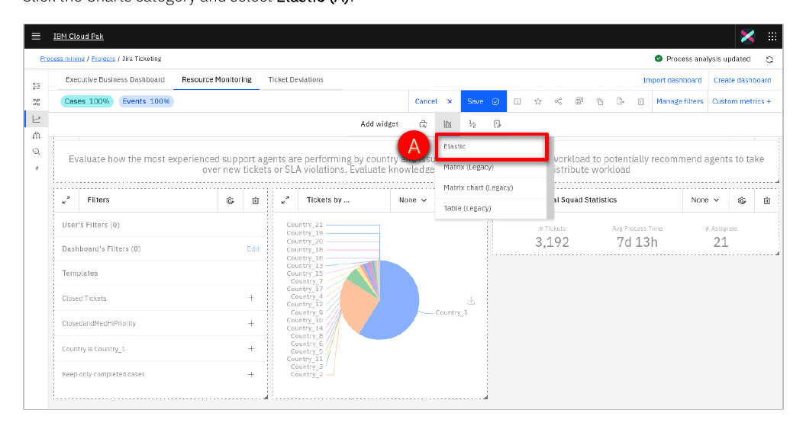

2. `Chart` 위젯 (A)을 선택합니다. 위젯 윤곽선이 파란색으로 바뀌고 커서가 십자가 모양으로 바뀌면 위젯을 `Pie Chart` 위젯 오른쪽으로 드래그합니다.

   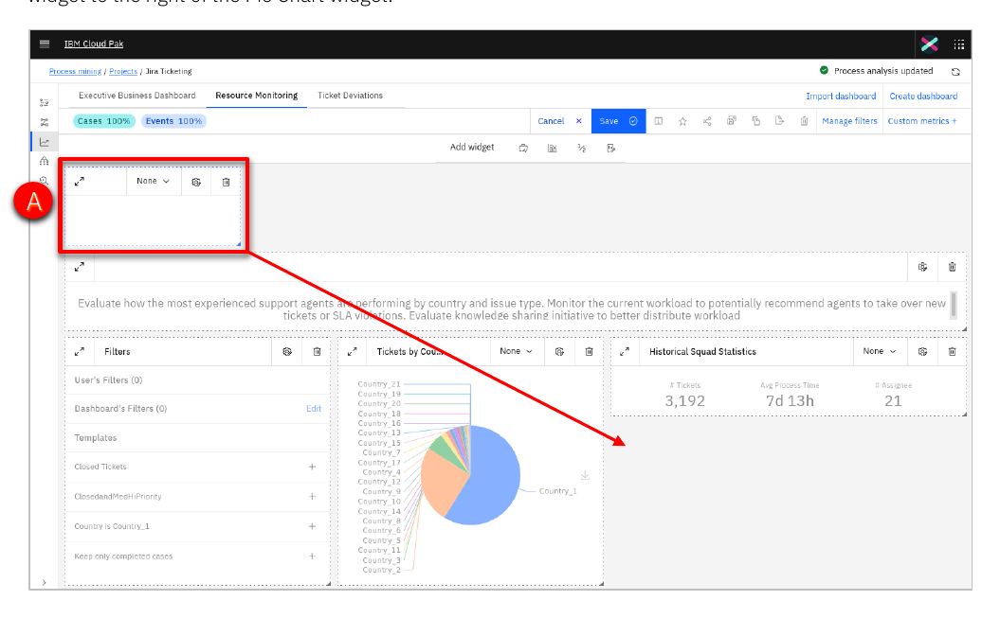

3. `Chart` 위젯 (A)을 선택합니다. 위젯 윤곽선이 파란색으로 바뀌고 커서가 크기 조절 커서로 바뀌면 위젯을 위의 위젯 너비에 맞게 조절하고 높이는 `Pie` 위젯보다 약간 크게 조절합니다 (B).

   > **참고:** 대시보드를 설계하는 동안 위젯의 크기를 조절하고 이동할 수 있습니다. 나중에 조정할 수 있으므로 크기가 정확할 필요는 없습니다.

   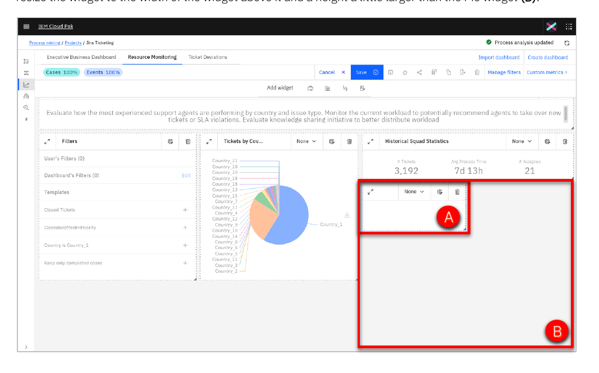

4. 위젯 제목 표시줄의 `Edit` 아이콘 (A)을 클릭합니다.

   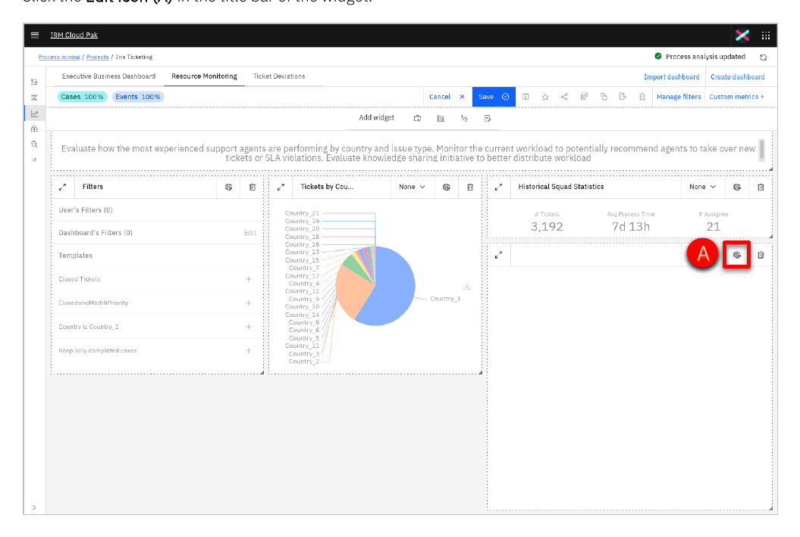

5. `Configuration` 탭에서 다음 정보를 입력합니다:
   - 제목: **Assignee Performance and Experience** (A)
   - `From`: **eventlog**와 **case_stats** 모두 선택 (B)
   - `Dimensions`: ASSIGNEE (C)
   - `Measures` (D)

      | 이름 | 측정값 | 형식 |
      |------|--------|------|
      | Resource experience (# issues completed) | count(distinct(eventlog.caseid)) | Number |
      | Avg Process Time | avg(distinct(leadtime)) | Lead time |

   - `Filters`: IS_RUNNING = 0 (E)
   - `Keep last event for each case` (F)를 선택하여 활성화

6. `Save` (G)를 클릭한 다음 `Style` (H) 탭을 선택합니다.

   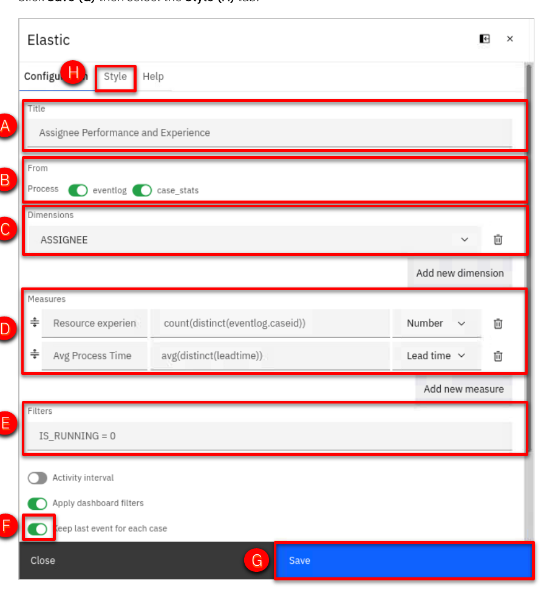

   "Keep last event for each case"를 선택하면 통계 계산 시 각 티켓의 마지막 담당자가 포함됩니다. "IS_RUNNING = 0" 필터와 함께 사용하면 프로세스 종료 활동인 "Closed" 이벤트 시점의 담당자를 기준으로 쿼리가 실행됩니다.

   `Save`를 클릭하면 IBM Process Mining이 위젯을 새로 고치며, 위젯이 테이블 형식으로 표시됩니다. 저장할 때마다 위젯이 최신 구성으로 업데이트되므로 변경 사항의 영향을 바로 확인할 수 있습니다.

7. `Style` 탭에서 `Display as chart` (A)를 선택합니다. 그런 다음 차트 유형으로 `Stacked` (B)를 선택합니다.
8. `Apply suggested configuration` (C)를 클릭합니다. IBM Process Mining이 새 구성을 적용합니다.

   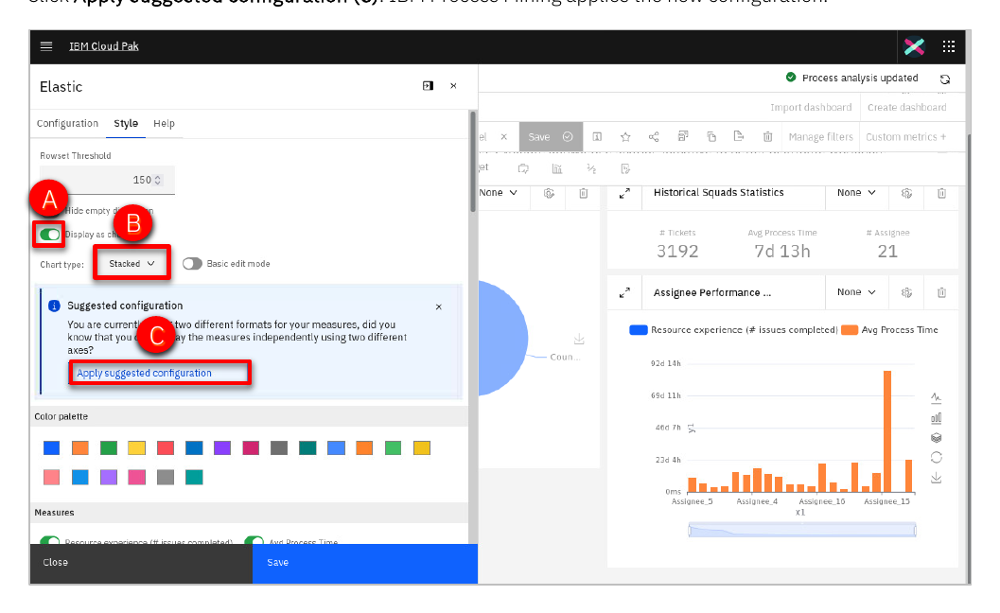

9. 아래로 스크롤하여 축을 구성합니다. X축 이름을 x1에서 **Assignee** (A)로 변경합니다. 그런 다음 `Show axis 2` (B)를 클릭하여 선택 해제합니다. 그런 다음 `Save` (C)를 클릭하고 `Close` (D)를 클릭합니다.
   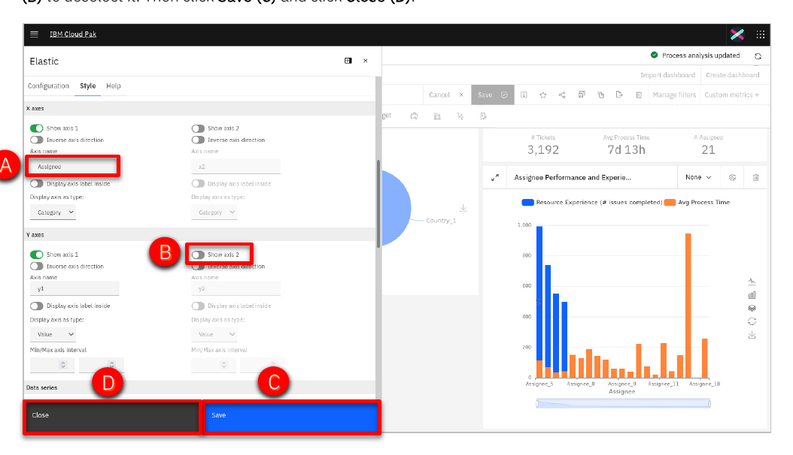

#### Elastic 위젯 추가 – Row Chart

> 이 섹션에서 하는 일 :    
>  `Tickets by Issue Type` Row Chart를 만듭니다. Dimension = `ISSUE_TYPE`(Incident·Query·Request), Measure = 고유 티켓 수. `Enable visual map`으로 값 범위에 색을 입힙니다.

> 왜 필요한가 :   
>  Pie는 **비중**, Row는 **절대량의 정확한 비교**에 강합니다. 티켓 유형이 3~5개 수준일 때는 비중 차이보다 **"몇 건 차이"**가 더 의사결정에 유용합니다(예: Incident가 Query보다 1.5배? vs +300건?). Visual map은 임계치를 색으로 인코딩해 **정상·주의·위험 구간**을 한눈에 구분하게 해 줍니다.

이슈 유형 분포를 나타내려면 행 차트를 사용합니다. `ISSUE_TYPE`을 차원으로 사용하고 고유 티켓을 계산하여 분포를 측정합니다.

1. `Charts` 카테고리를 클릭하고 `Elastic` (A)을 선택합니다.

   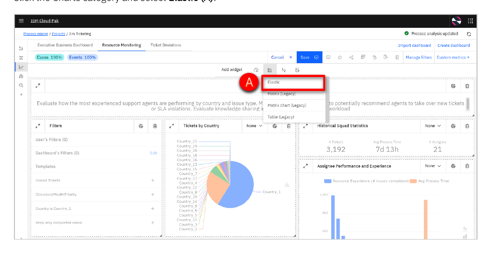

2. `Chart` 위젯 (A)을 선택합니다. 위젯 윤곽선이 파란색으로 바뀌고 커서가 십자가 모양으로 바뀌면 위젯을 `Filters` 위젯 아래로 드래그합니다.
   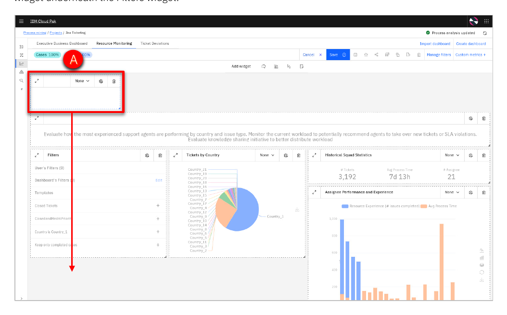

3. `Chart` 위젯 (A)을 선택합니다. 위젯 윤곽선이 파란색으로 바뀌고 커서가 크기 조절 커서로 바뀌면 위젯을 위의 두 위젯 너비에 맞게 조절하고 높이는 오른쪽 위젯과 일치하도록 조절합니다 (B).
   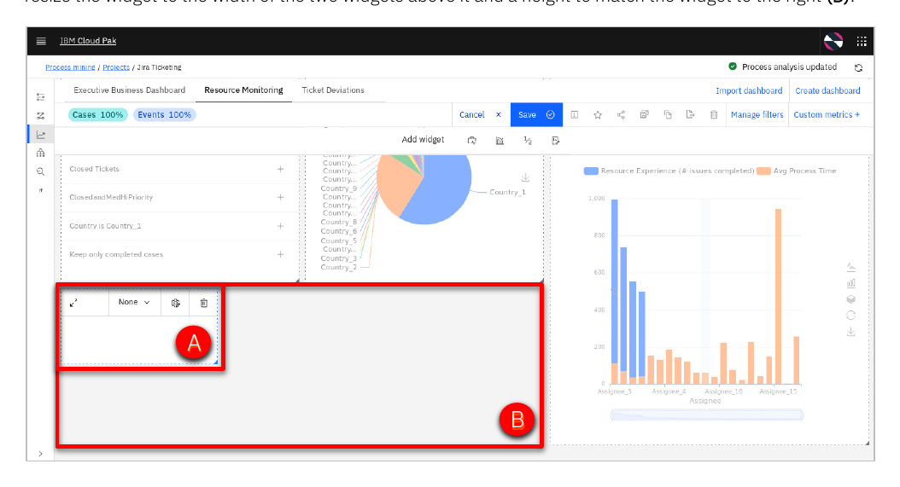

4. 위젯 제목 표시줄의 `Edit` 아이콘 (A)을 클릭합니다.

   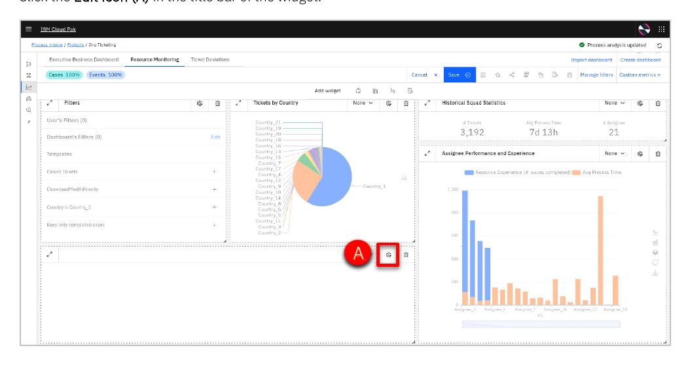

5. `Configuration` 탭에서 다음 정보를 입력합니다:
   - 제목: **Tickets by Issue Type** (A)
   - `From`: **eventlog**와 **case_stats** 모두 선택 (B)
   - `Dimensions`: ISSUE_TYPE (C)
   - `Measures` (D)

      | 이름 | 측정값 | 형식 |
      |------|--------|------|
      | # Tickets | count(distinct(eventlog.caseid)) | Number |

   - `Filters`: IS_RUNNING = 0 (E)

6. `Save` (F)를 클릭한 다음 `Style` (G) 탭을 선택합니다.
   `Save`를 클릭하면 IBM Process Mining이 위젯을 새로 고칩니다. 위젯이 테이블 형식으로 표시됩니다.

   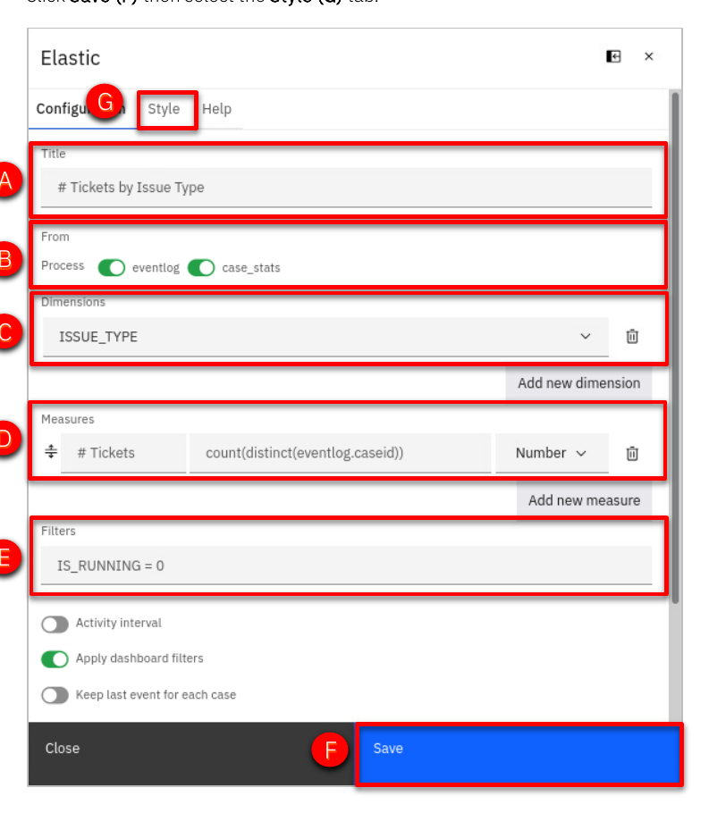

7. `Style` 탭에서 `Display as chart` (A)를 선택합니다. 그런 다음 차트 유형으로 `Row` (B)를 선택합니다. IBM Process Mining이 차트를 새로 고칩니다.

   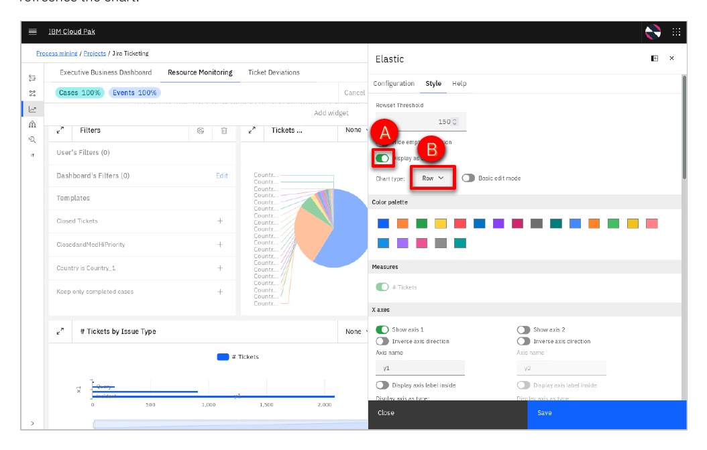

8. X축 섹션에서 `Axis name` (A)을 삭제합니다. Y축에 대해서도 동일한 작업을 수행합니다 (B). `Display axis label inside` (C)를 클릭하여 선택 해제합니다. 행 차트가 업데이트되는 것을 확인합니다 (D).

   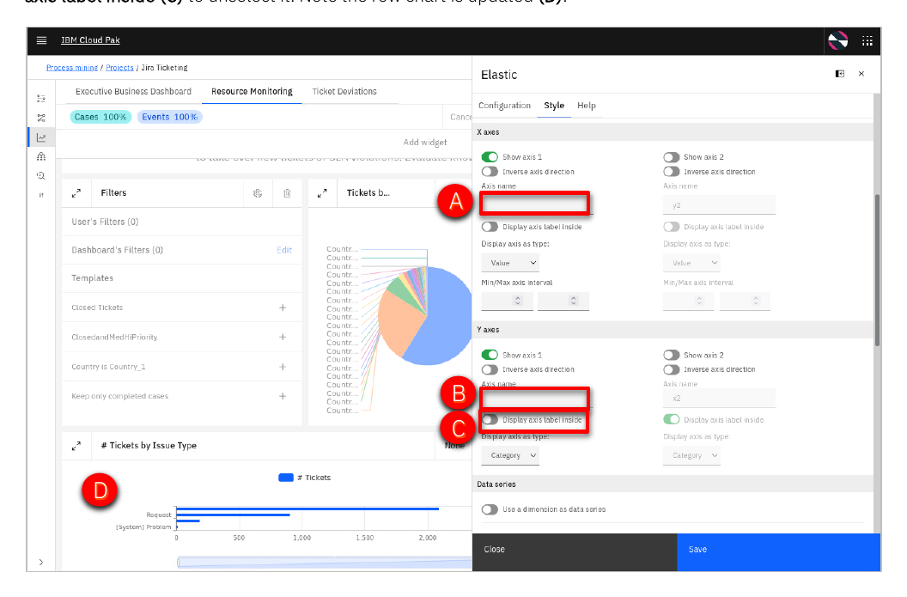

9. 스크롤을 내려 `Data series` 섹션에서 `# Tickets – Ascendant` (A)를 선택하여 데이터를 정렬합니다.
10. `Enable visual map` (B)를 클릭하여 활성화합니다. 그런 다음 색상 범위에 **800** (C)과 **1000** (D)을 입력합니다. 이 숫자는 표시 목적으로만 사용됩니다.
   시각적 매핑(Visual map)은 색상으로 데이터 범위를 구분하여 차트 가독성을 높여줍니다. `Toolbox actions` 섹션 (E)에서는 차트 옆에 표시할 도구 항목을 제어할 수 있습니다.

      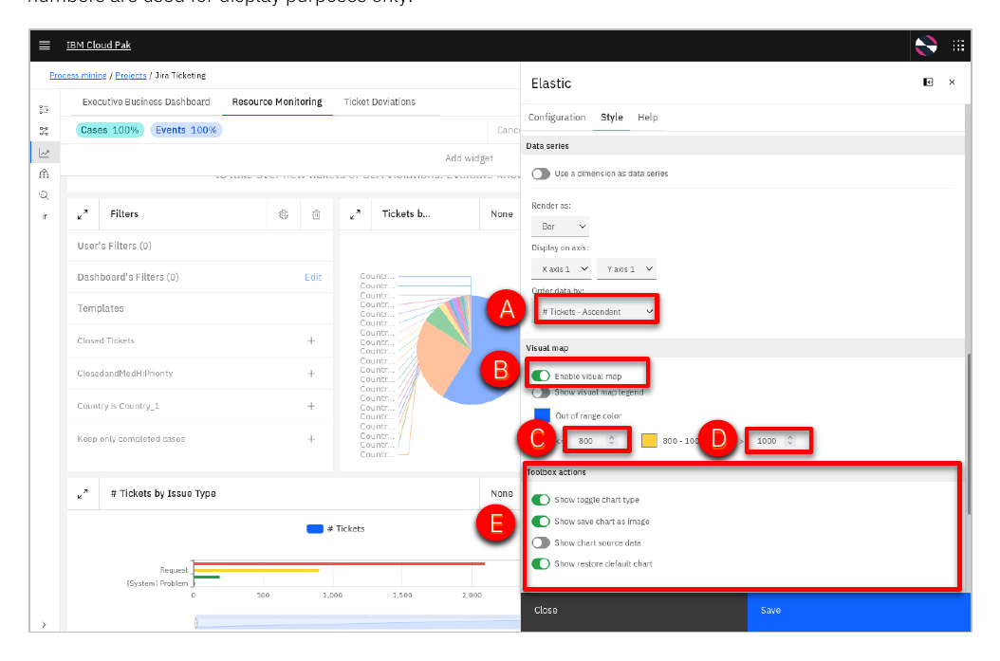

11. 스크롤을 내려 `Grid` 섹션에서 `Show grid borders` (A)를 선택합니다. 위젯은 마우스 스크롤 줌에 동적으로 반응하며, `Zoom inside chart` (B) 옵션으로 이 동작을 켜고 끌 수 있습니다. `Show bottom zoom slider` (C)를 선택하면 차트 하단의 줌 슬라이더를 숨길 수 있습니다.
12. 그런 다음 `Save` (D)를 클릭하고 `Close` (E)를 클릭합니다.

      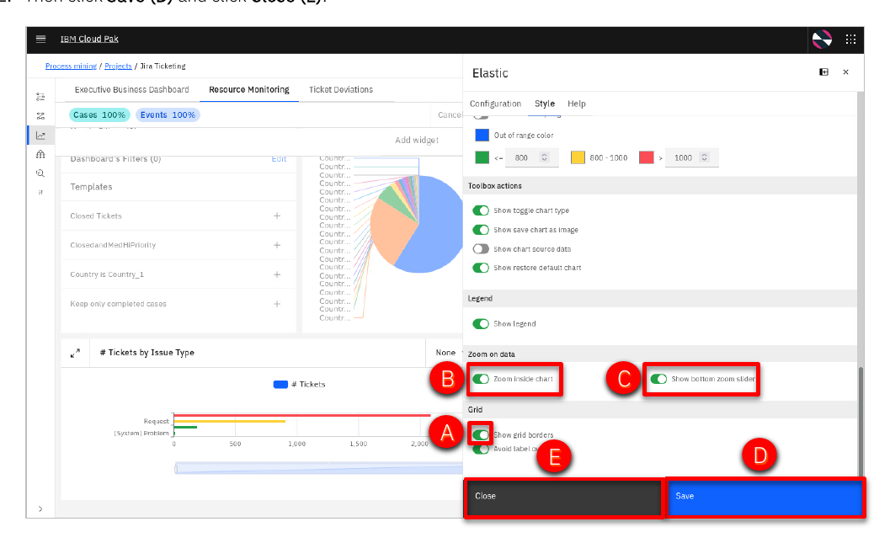

13. `# Tickets by Issue Type` (A) 위젯의 높이를 늘리고 `Assignee Performance and Experience` (B) 위젯과 세로로 정렬되도록 크기를 조절합니다. 그런 다음 `Save` (C)를 클릭합니다.

14. 대시보드를 확인합니다. 그런 다음 `Edit` 아이콘 (A)을 클릭합니다.
   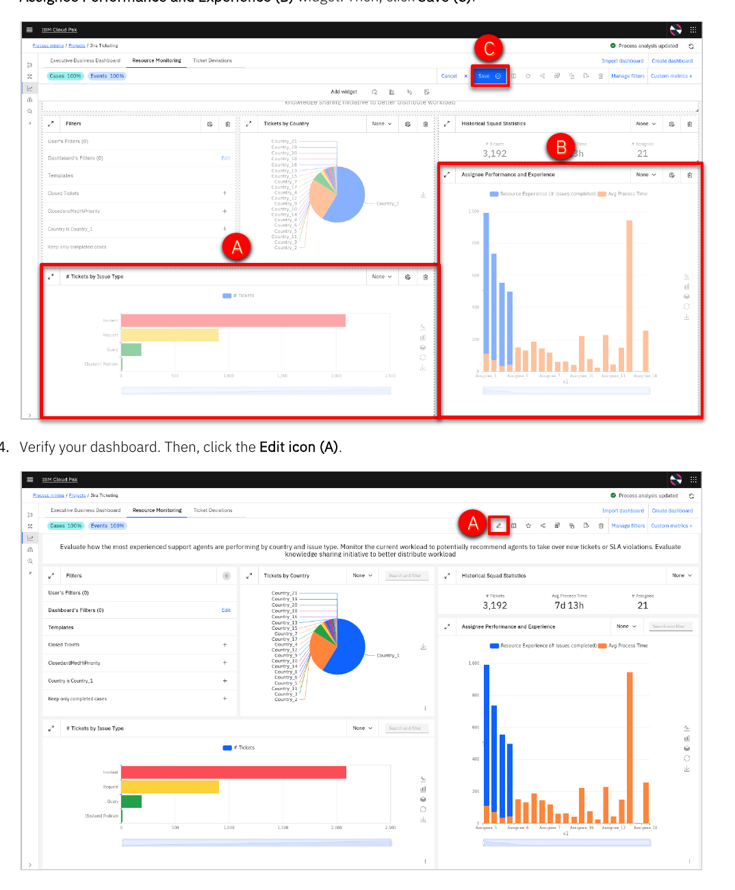

#### Table (Legacy) 위젯 추가

> 이 섹션에서 하는 일 :    
>  **현재 열려 있는 티켓(IS_RUNNING = 1)**을 행 단위로 나열하는 `Open Issues by Assignee` 테이블을 만듭니다. Dimension은 `ASSIGNEE`와 `Case ID`, Measure는 `Time since last step`(= 기준시각 − 마지막 이벤트) · `Last step` · `Type` · `Priority` 4가지.

> 왜 필요한가 :   
>  차트는 **집계/요약**에 강하지만 **"어느 담당자의 어느 티켓이 얼마나 지연됐나"**라는 질문에는 답하지 못합니다 — 이는 **행 단위 원본 데이터**가 있어야만 답할 수 있습니다. 테이블은 차트에서 이상 신호를 감지한 관리자가 **즉시 드릴다운**할 수 있게 하는 **대시보드의 하부 토대**입니다. `1667170800000` 고정 타임스탬프는 교육용 정적 데이터 기준이며, 실시간 운영에서는 `now()`로 교체해 **"지금 이 순간의 경과 시간"**을 계산합니다.

과거 섹션이 이제 완료되었습니다. 이러한 위젯은 과거 데이터(IS_RUNNING = 0)를 반영한다는 것을 기억하십시오. 다음에 구성하는 두 위젯은 활성 케이스(IS_RUNNING = 1)를 표시합니다.

담당자별 열린 이슈를 나타내려면 `Table (Legacy)` 위젯을 구성합니다. 이 위젯의 경우 각 티켓에 대한 관련 통계를 그룹화하기 위해 `Assignee`와 `CaseID` 모두를 차원으로 사용합니다. "Keep Last" 함수를 사용하여 통계를 계산하는 동안 각 티켓에 대해 발생한 마지막 이벤트를 고려합니다.

1. `Charts` 카테고리를 클릭하고 `Table (Legacy)` (A)를 선택합니다.

   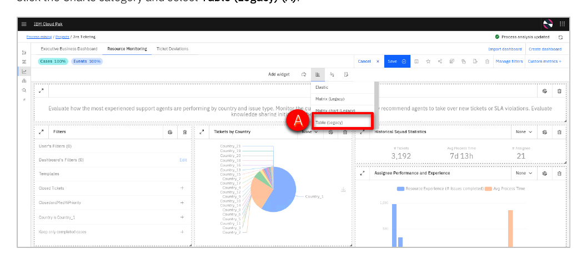

2. `Chart` 위젯 (A)을 선택합니다. 위젯 윤곽선이 파란색으로 바뀌고 커서가 십자가 모양으로 바뀌면 위젯을 `# Tickets by Issue Type` 위젯 아래로 드래그합니다.

   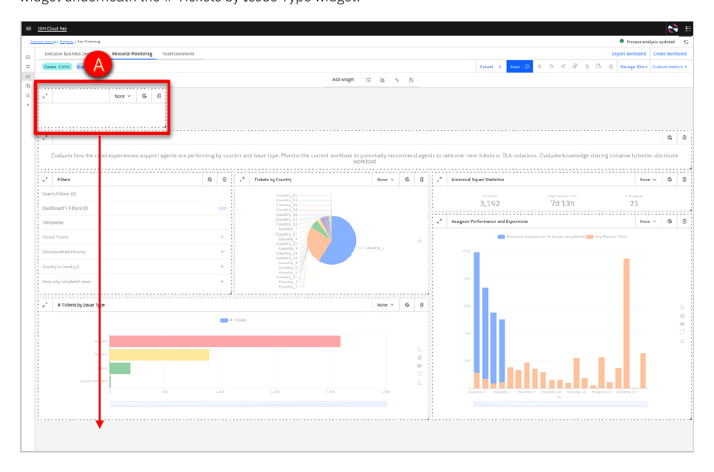

3. `Chart` 위젯 (A)을 선택합니다. 위젯 윤곽선이 파란색으로 바뀌고 커서가 크기 조절 커서로 바뀌면 위젯을 대시보드 너비의 절반으로 조절합니다 (B).

   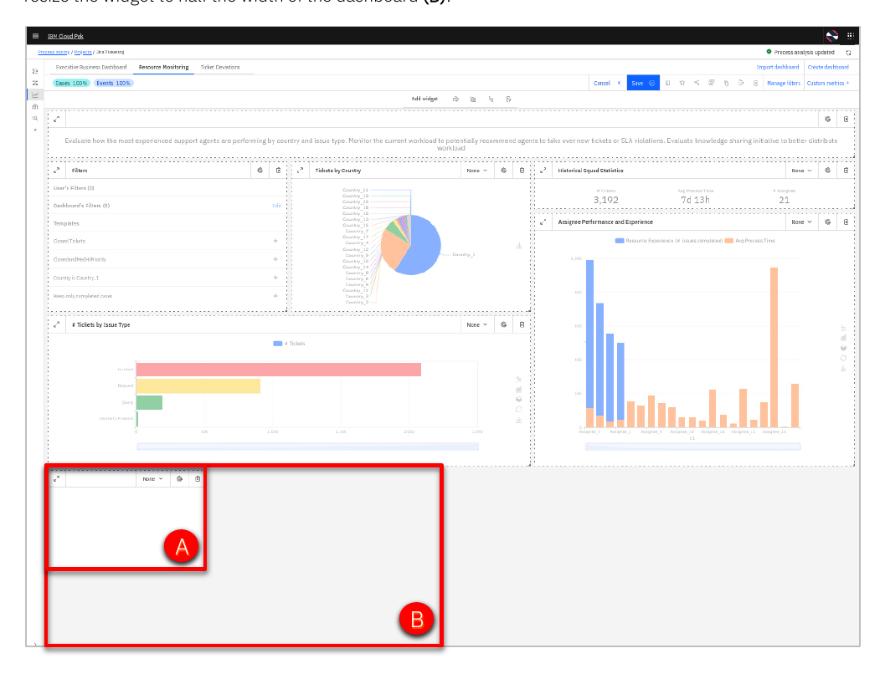

4. 위젯 제목 표시줄의 `Edit` 아이콘 (A)을 클릭합니다.
   실시간 데이터를 사용하는 프로젝트라면 `now()` 함수로 현재 날짜와 비교할 수 있습니다. 이 실습에서는 수년 전의 정적 데이터를 사용하므로, 값 `1667170800000`으로 과거의 특정 날짜를 나타냅니다. 실시간 데이터라면 이 값 대신 `now()`를 사용하면 됩니다.

   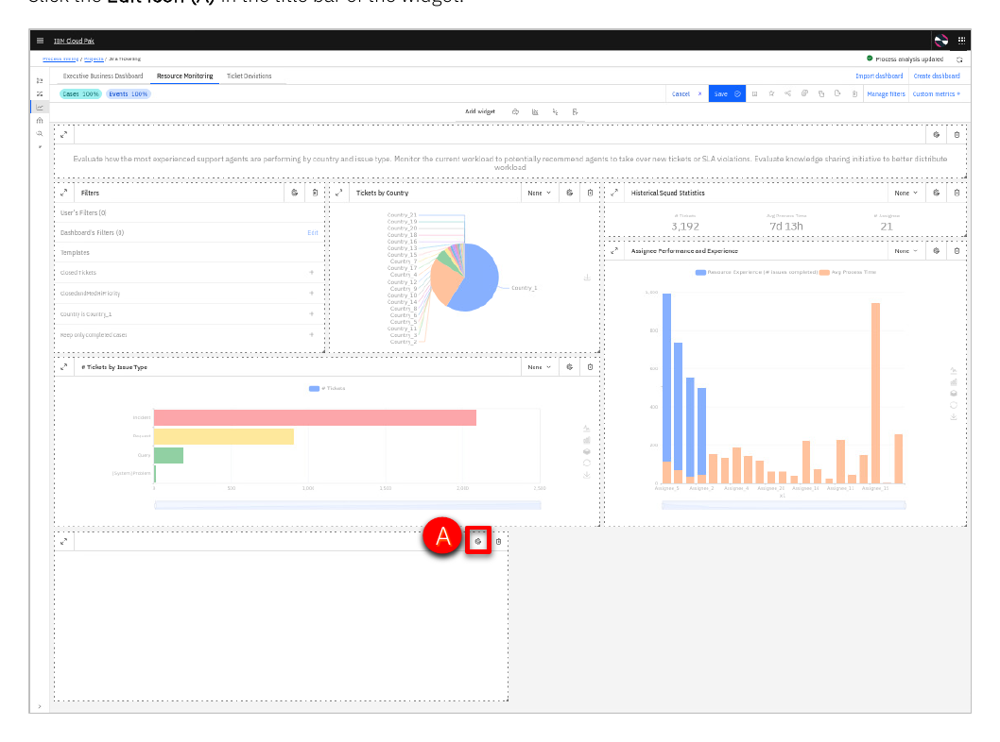

5. `Configuration` 탭에서 다음 정보를 입력합니다:
   - 제목: **Open Issues by Assignee** (A)
   - `From`: **eventlog**와 **case_stats** 모두 선택 (B)
   - `Dimensions`: ASSIGNEE, Case ID (C)
   - `Measures` (D)

      | 이름 | 측정값 | 형식 |
      |------|--------|------|
      | Time since last step | 1667170800000-eventlog.starttime | Lead time |
      | Last step | activity | Text |
      | Type | issue_type | Text |
      | Priority | priority | Text |

   - `Filters`: IS_RUNNING = 1 (E)
   - `Keep last event for each case` (F)를 선택하여 활성화

6. `Save` (G)를 클릭한 다음 `Close` (H)를 클릭합니다.

   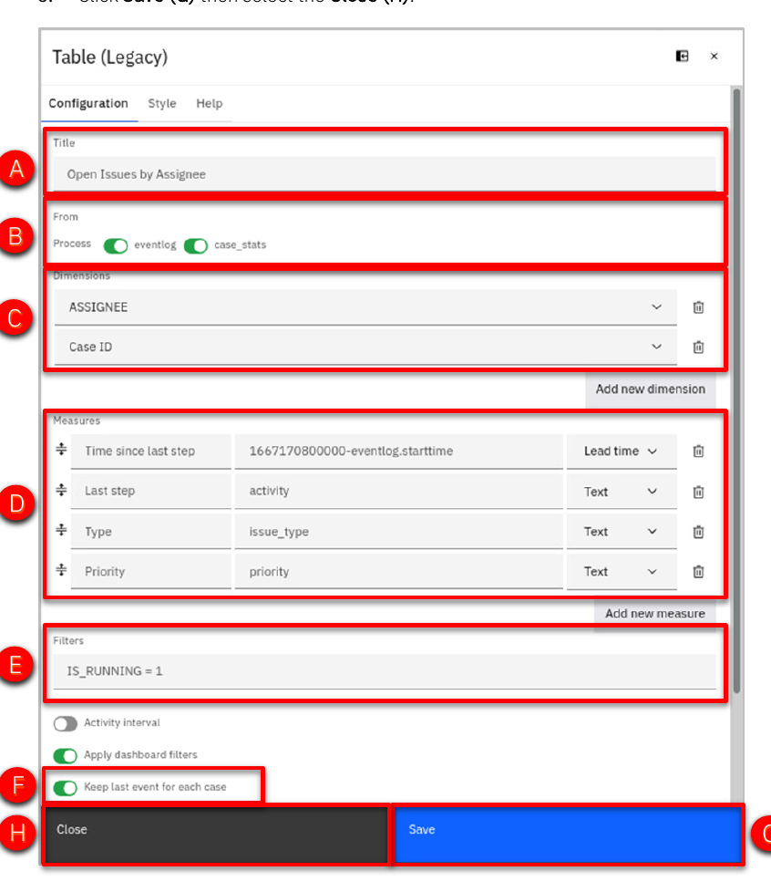

#### Elastic 위젯 추가 – Row Chart (2)

> 이 섹션에서 하는 일 :    
>  `Assignee Current Workload` Row Chart를 만듭니다. IS_RUNNING = 1 필터 + `Keep last event for each case` + Visual map 색상 범위(10·30)로 **지금 이 순간 각 담당자에게 열려 있는 티켓 수**를 한눈에 봅니다.

> 왜 필요한가 :   
>  **과거 경험(Bar Chart)**과 **현재 업무량(Row Chart)**을 나란히 두지 않으면 "경험 많은 사람에게 더 주는 게 맞는가, 아니면 이미 과부하인가"를 판단할 수 없습니다. Visual map의 10/30 임계치는 **정상·주의·위험**을 색으로 인코딩해 관리자가 숫자를 읽지 않고도 **배정 대상 후보**를 즉시 좁힐 수 있게 해 줍니다. 이 위젯이 완성되는 순간, 대시보드는 "과거 분석용"에서 **"실시간 배정 도구"**로 성격이 바뀝니다.

마지막 위젯의 경우 행 차트를 사용하여 현재 담당자 업무량을 나타냅니다. 이 차트는 현재 각 담당자에게 할당된 티켓 수를 나타냅니다.

1. `Charts` 카테고리를 클릭하고 `Elastic` (A)을 선택합니다.

   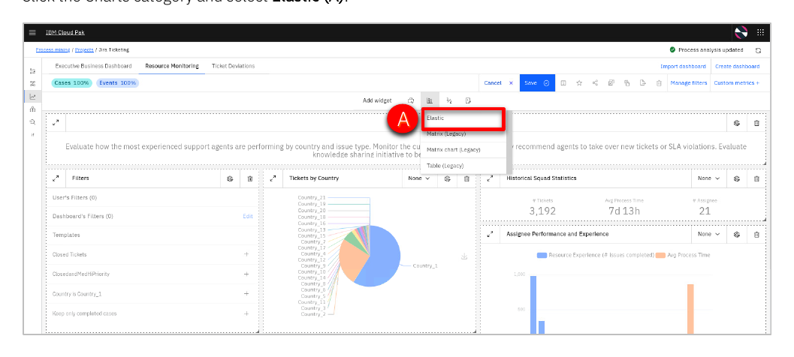

2. `Chart` 위젯 (A)을 선택합니다. 위젯 윤곽선이 파란색으로 바뀌고 커서가 십자가 모양으로 바뀌면 위젯을 마지막으로 구성한 위젯 오른쪽으로 드래그합니다.

   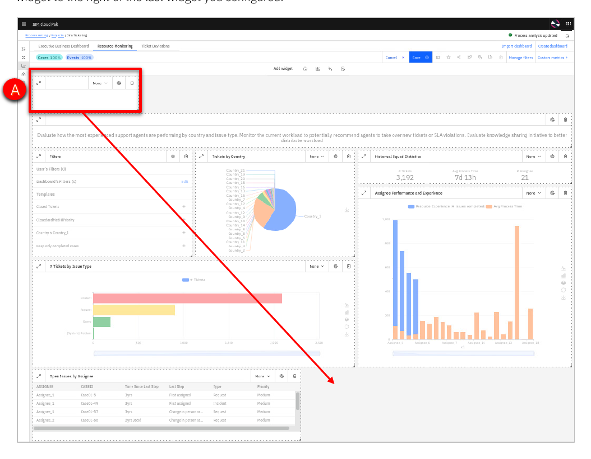

3. `Chart` 위젯 (A)을 선택합니다. 위젯 윤곽선이 파란색으로 바뀌고 커서가 크기 조절 커서로 바뀌면 위젯을 대시보드 전체 너비로 조절합니다 (B).

   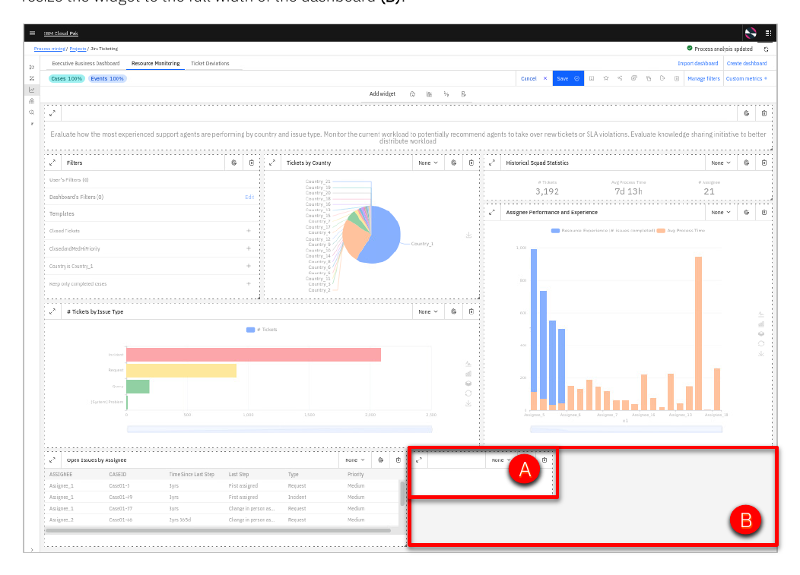

4. 위젯 제목 표시줄의 `Edit` 아이콘 (A)을 클릭합니다.

   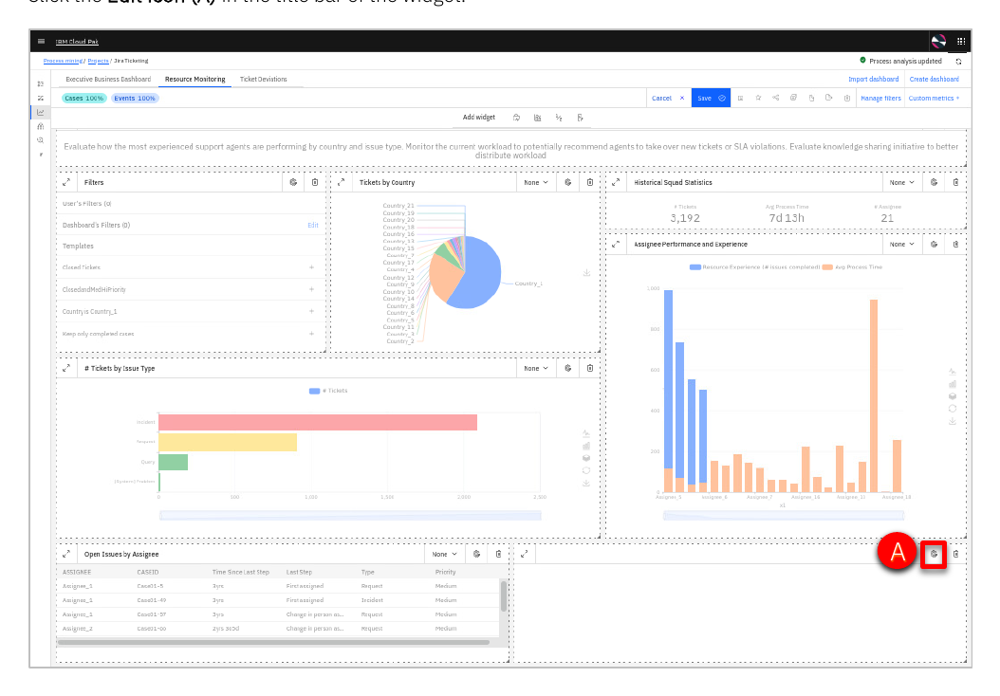

5. `Configuration` 탭에서 다음 정보를 입력합니다:
   - 제목: **Assignee Current Workload** (A)
   - `From`: **eventlog**와 **case_stats** 모두 선택 (B)
   - `Dimensions`: ASSIGNEE (C)
   - `Measures` (D)

      | 이름 | 측정값 | 형식 |
      |------|--------|------|
      | # Current Tickets | Count(distinct(eventlog.caseid)) | Number |

   - `Filters`: IS_RUNNING = 1 (E)
   - `Keep last event for each case` (F)를 선택하여 활성화
   - `Order by`: # Current Tickets | Ascending (G)

6. `Save` (H)를 클릭한 다음 `Style` (I) 탭을 선택합니다.

   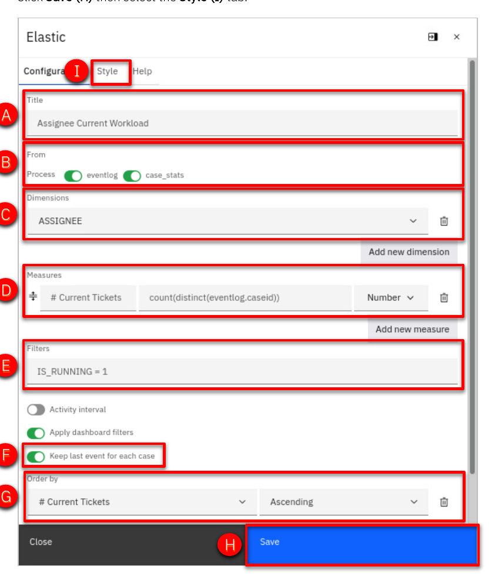

   `Save`를 클릭하면 IBM Process Mining이 위젯을 새로 고칩니다. 위젯이 테이블 형식으로 표시됩니다.

7. `Display as a chart` (A)를 클릭하여 활성화한 다음 `Row` (B) 차트 유형을 선택합니다. IBM Process Mining이 위젯을 새로 고칩니다.

   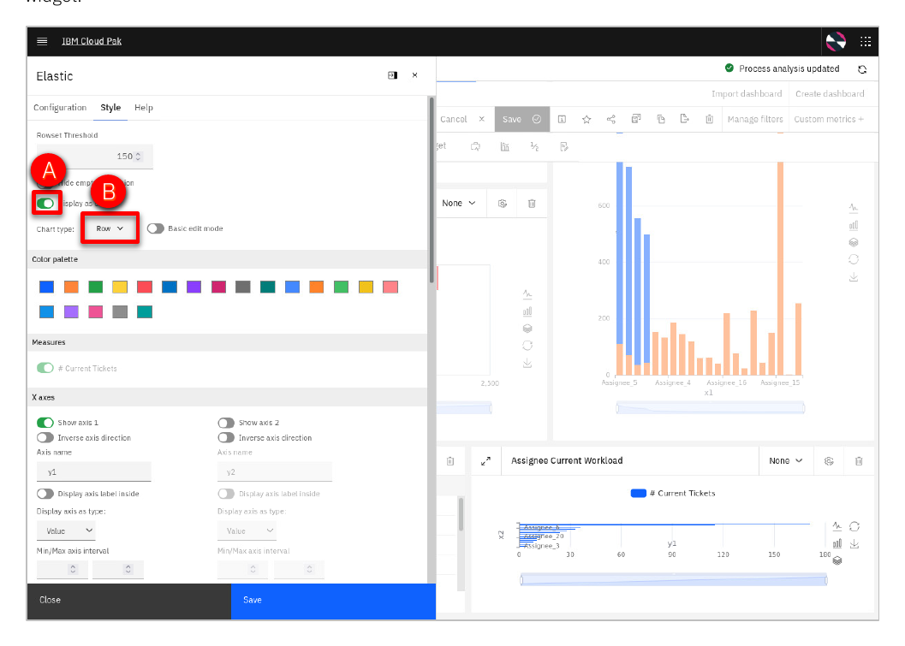

8. X축 섹션에서 `Axis name` (A)을 삭제합니다. 그런 다음 Y축 섹션에서 `Axis name`에 **Assignee** (B)를 입력합니다. IBM Process Mining이 행 차트 (C)를 새로 고칩니다.
9. Y축 섹션에서 `Display axis label inside` (D)를 클릭하여 활성화합니다.

   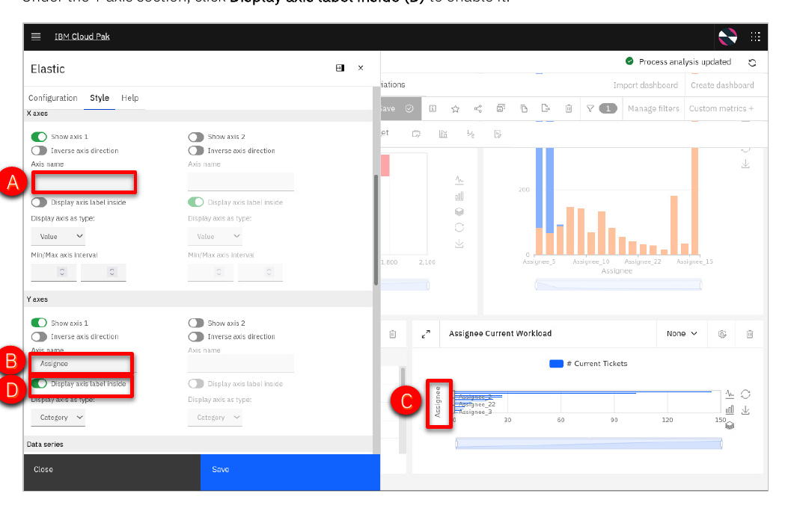

10. `Enable visual map` (A)를 클릭하여 활성화하고 `Show visual map legend` (A)를 클릭하여 활성화합니다. 색상 범위 값이 표시되지 않으면 **10** (B)과 **30** (C)을 입력합니다. 이 숫자는 표시 목적으로만 사용됩니다.
11. `Grid` 섹션에서 `Show grid borders` (D)를 선택하여 활성화합니다.
12. 위젯을 구성한 후 `Save` (E)를 클릭하고 `Close` (F)를 클릭합니다.

13. 상단의 `Save` (A)를 클릭하여 대시보드를 저장합니다.
   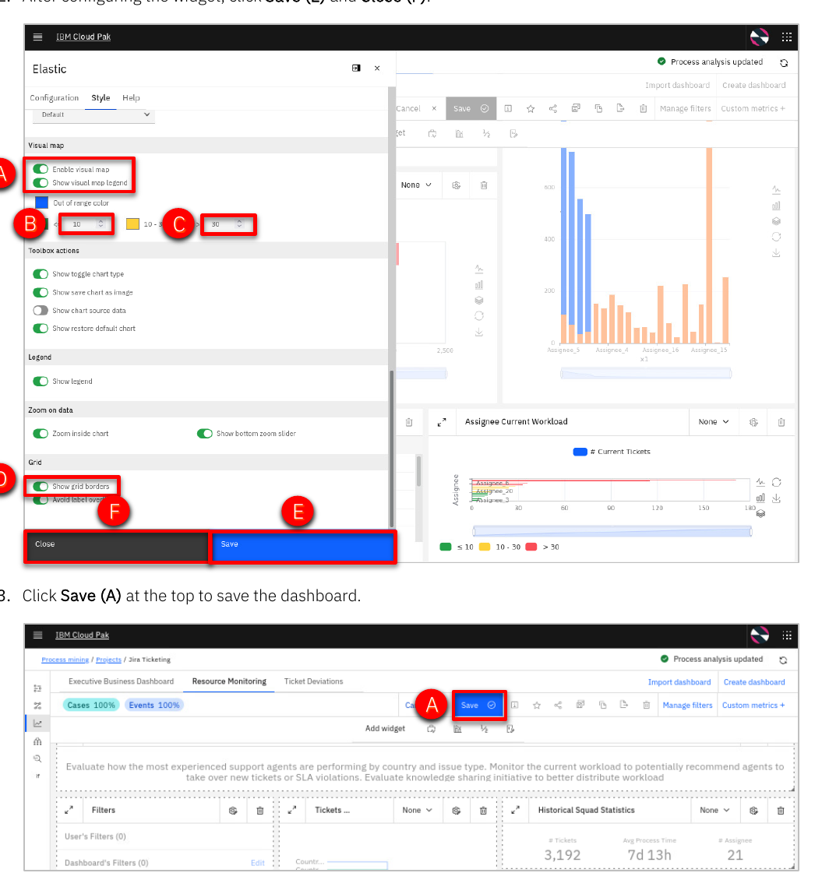

14. 대시보드를 확인합니다. 대시보드가 표시된 것과 정확히 같을 필요는 없습니다. 이 실습의 목적은 대시보드를 구축하고 위젯을 구성하는 경험을 제공하는 것입니다.

#### 대시보드 시각화

> 이 섹션에서 하는 일 :    
>  가상 시나리오 — "**Country_1에서 새 티켓 접수**" — 를 대시보드로 시뮬레이션합니다. `Country is Country_1` 필터 템플릿을 켠 뒤, **경험(Bar) + 현재 업무량(Row) + 열린 티켓 상세(Table)** 를 교차 조회하여 최적 담당자를 판단합니다.

> 왜 필요한가 :   
>  대시보드는 **만든 결과물**이 아니라 **매일 쓰는 도구**입니다. 이 시뮬레이션은 관리자의 실제 루틴을 한 번 돌려보는 훈련 — Assignee_5·Assignee_1은 경험 많지만 이미 **과부하**, Assignee_2는 경험이 조금 적지만 **여유 있음 + 현재 열려있는 티켓이 대부분 Low 우선순위**라 신규 High 티켓을 처리할 여력 있음. 이 판단은 **세 위젯을 동시에 교차 조회**해야만 도출되며, 바로 이것이 대시보드가 **"예쁜 시각화"가 아니라 "운영 의사결정 장치"**인 이유입니다.

이 섹션에서는 구축한 대시보드를 활용하여 특정 국가의 현재 업무량을 모니터링합니다. Country_1에서 지원 티켓이 접수된다고 가정하고, 해당 국가 티켓에 대한 필터를 적용하여 어떤 담당자가 처리하기에 가장 적합한지 평가해 보겠습니다.

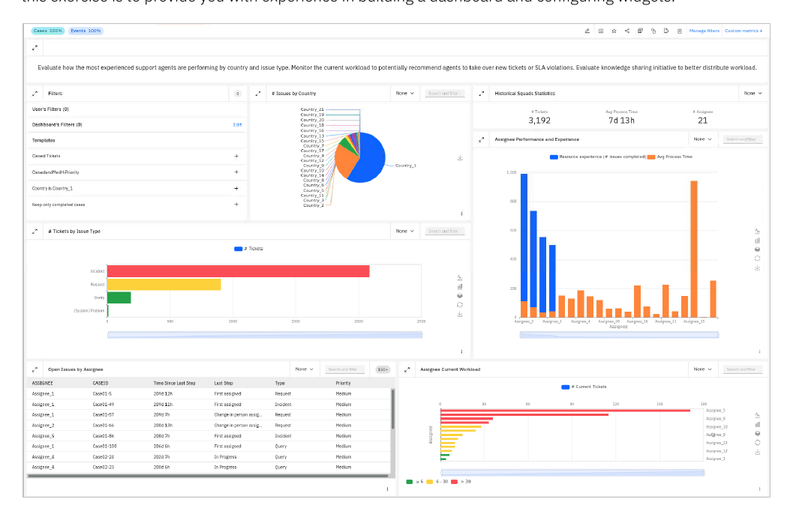

1. `Filters` 위젯의 필터 옆에 있는 더하기 기호 (A)를 클릭하여 `Country is Country_1` 필터를 실행합니다. `Filters` 위젯을 사용하면 대시보드에서 직접 필터를 실행할 수 있습니다. 또는 `Manage filters` (B)를 클릭하여 새 대시보드 필터 또는 필터 템플릿을 적용할 수 있습니다.

2. 쿼리가 완료되면 `Refresh` (A)를 클릭합니다.

   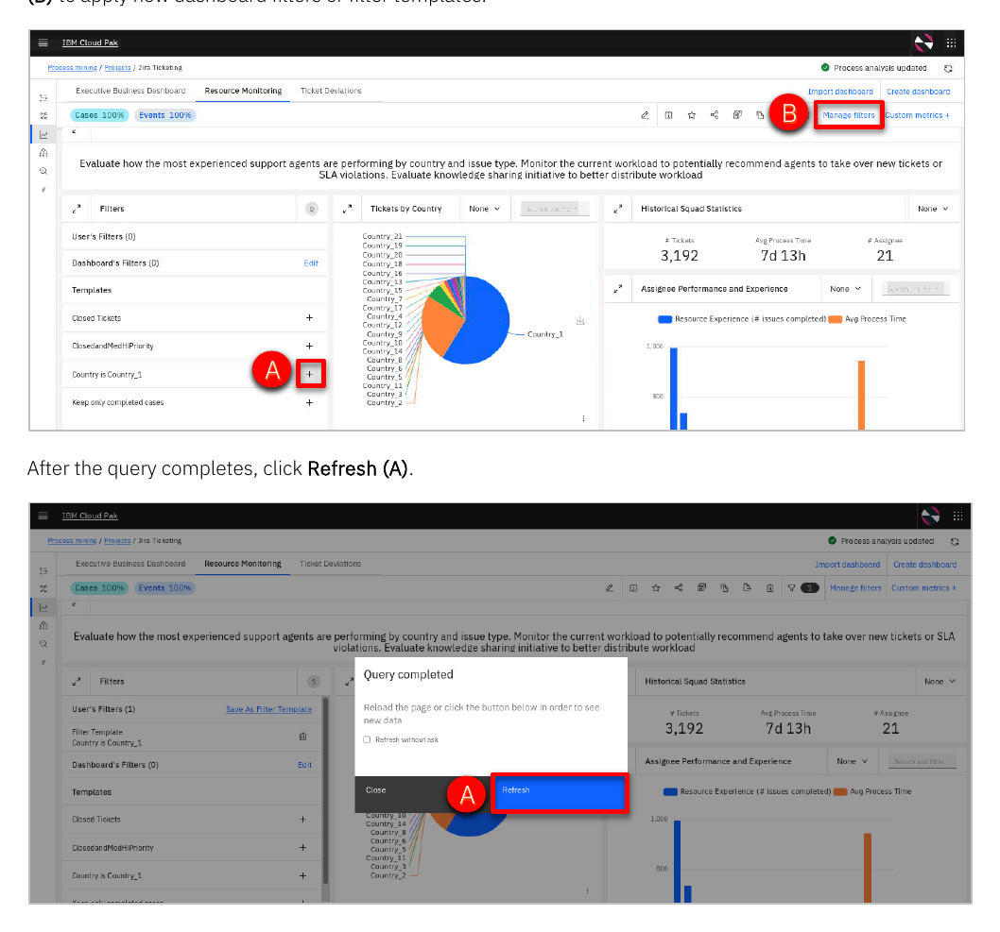

3. 필터가 적용된 대시보드가 새로 고침된 것을 확인합니다. 대시보드에 적용된 필터 수는 오른쪽 상단 도구 모음 (A)과 `Filters` 위젯 (B)에 표시됩니다.
   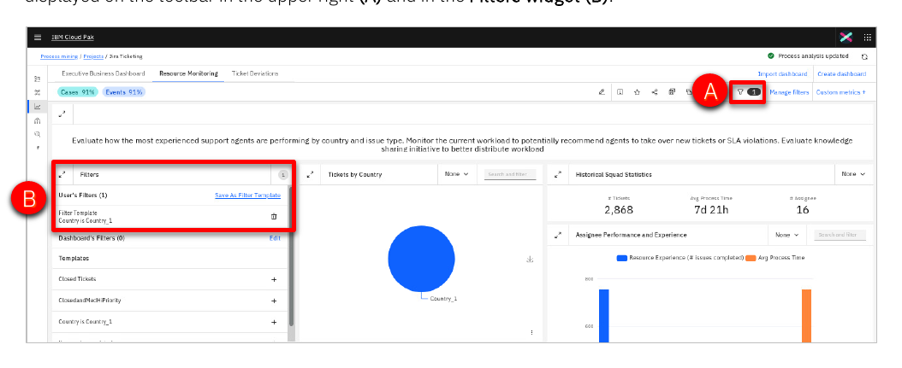

4. 이제 대시보드에 Country_1의 티켓에 대한 데이터 하위 집합이 표시됩니다. 최종 사용자는 이 대시보드를 사용하여 Country_1의 티켓에 대해 어떤 담당자가 가장 경험이 많은지 평가할 수 있습니다. `Assignee Performance and Experience` 막대 그래프 (A)에 마우스를 올리면 상위 3명의 담당자가 Assignee_5, Assignee_1, Assignee_2임을 볼 수 있습니다. Assignee_2가 Assignee_5 또는 Assignee_1보다 경험이 적다는 것을 알 수 있습니다.

   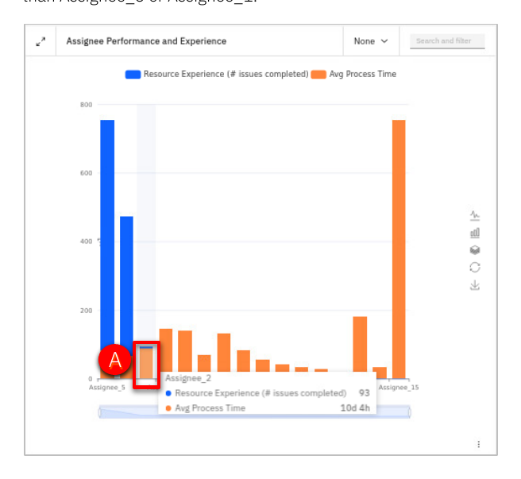

5. 그러나 `Assignee Current Workload` (A) 막대 차트에 마우스를 올리면 세 담당자의 현재 업무량을 볼 수 있으며 Assignee_2가 현재 Assignee_5 또는 Assignee_1보다 훨씬 적은 티켓을 보유하고 있음을 알 수 있습니다.
   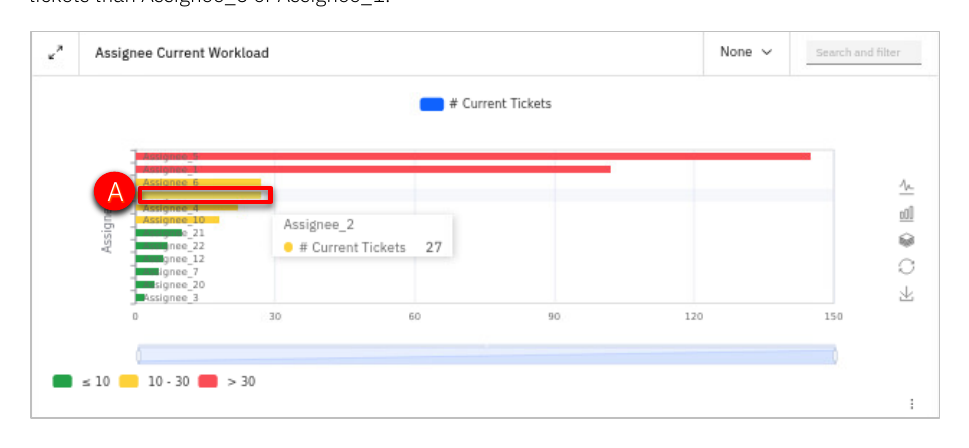

6. 분석을 한 단계 더 나아가 `Open Issues by Assignee` 테이블을 사용하여 담당자별 열린 이슈를 보고 Assignee_2의 항목 우선순위를 확인할 수 있습니다. 이를 위해 먼저 열을 클릭하여 `Assignee` (A)별로 정렬한 다음 오른쪽에서 티켓의 우선순위를 볼 수 있습니다. 대부분의 티켓이 낮은 우선순위이므로 높은 우선순위 티켓을 처리하기 위해 연기할 수 있습니다.
   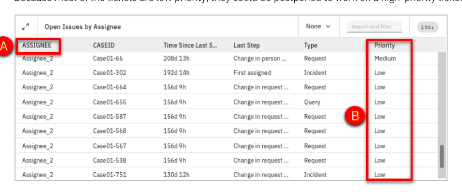

7. `Tickets by Issue Type`도 SLA를 충족하는 티켓 유형을 추가로 분석하는 데 사용할 수 있습니다. 위젯을 보면 인시던트가 가장 많은 티켓 수를 보유하고 있음을 알 수 있습니다.
   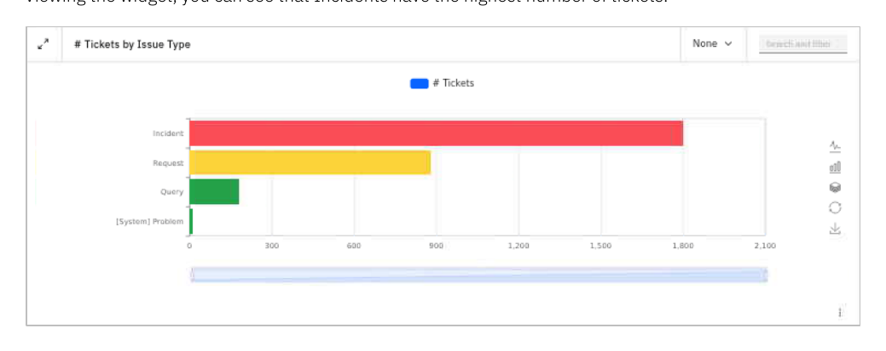

8. 시간이 허용되면 대시보드를 탐색하고 컨트롤에 익숙해집니다. 예를 들어, 차트의 레이아웃과 범위를 변경할 수 있습니다. 오른쪽의 컨트롤을 사용하여 `Stack` (A)을 두 번 클릭하여 스택 기능을 끕니다. 이제 막대 차트가 두 값을 독립적으로 표시합니다. 차트 하단의 줌 슬라이더 (B)를 사용하여 표시되는 데이터의 범위를 변경할 수 있습니다.   
   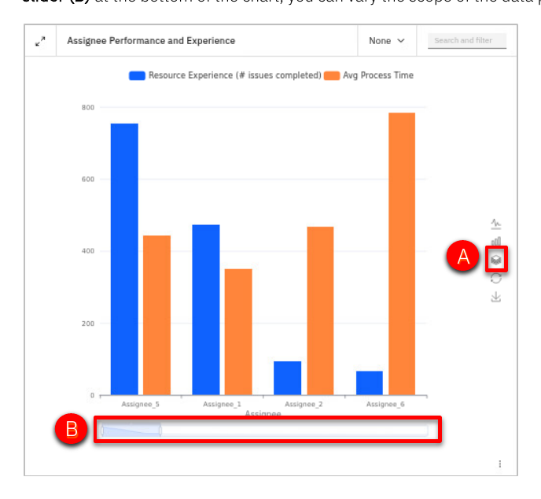

9. 시간이 허용되면 대시보드를 탐색하고 최종 사용자와 상호 작용하는 방식에 익숙해집니다.

10. 대시보드를 검토한 후 필터 템플릿 옆의 휴지통 (A)을 클릭하여 필터링을 재설정합니다.
   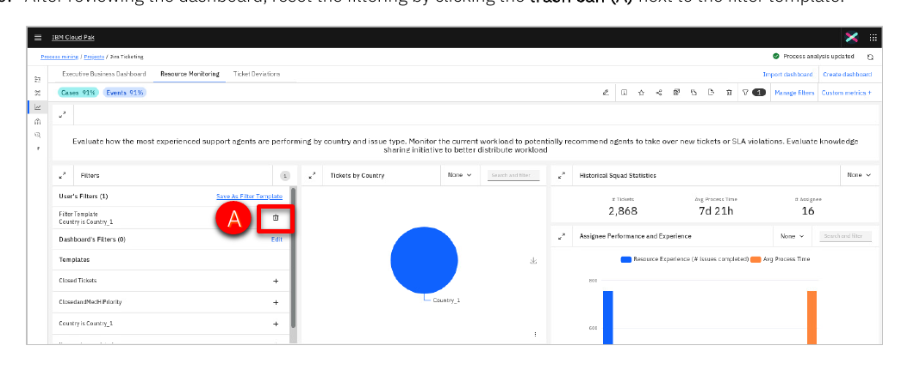

11. 확인 메시지가 나타나면 `Refresh`를 클릭합니다.

### 객체 테이블 가져오기

> 이 섹션에서 하는 일 :    
>  **country_codes.csv** 를 객체 테이블로 업로드하고 데이터 매핑(COUNTRY·COUNTRY CODE를 Text로), 기본 키(COUNTRY CODE) 지정을 거쳐, `Table joins`에서 이벤트 로그의 `country` 컬럼과 조인한 뒤 `Apply`로 적용합니다.

> 왜 필요한가 :   
>  이벤트 로그에는 **"Country_1, Country_2…"** 같은 코드만 남아 있을 때가 많고, 실제 국가명·지역·법인 정보는 **별도의 마스터 시스템**(ERP, 인사 DB 등)에 있습니다. 객체 테이블은 **이벤트 로그를 건드리지 않고** 이런 외부 마스터 데이터를 **분석 시점에 즉시 결합**할 수 있게 합니다. 이는 IBM Process Mining 2.0의 **객체 중심 데이터 모델**의 핵심 기능으로, 같은 원리로 **벤더 정보, 자재 코드, 고객 등급, 계약 조건** 등 어떤 마스터 데이터도 동일한 방식으로 연결할 수 있습니다 — 데이터 파이프라인을 고치지 않고도 **분석 범위가 수평 확장**됩니다.

IBM Process Mining 2.0은 객체 중심 데이터 모델을 지원합니다. 객체 테이블을 활용하면 이벤트 로그와 별개로 벤더, 자재, 국가 코드 등 프로세스 컨텍스트 관련 마스터 데이터를 프로젝트에 추가할 수 있습니다. 이 섹션에서는 국가 코드 데이터를 객체 테이블로 가져와 Country 파이 차트 위젯에 연결합니다.

1. `Data & Settings` (A) 탭을 선택한 다음 `Data Source` (C) 섹션 아래에서 `Object tables` (B)를 선택하여 객체 테이블에 접근합니다.

2. 객체 테이블의 이름(A)(예: country_codes)을 입력한 다음 `Create` (B)를 클릭합니다.
   IBM Process Mining이 데이터 매핑이 누락되었다는 경고를 표시합니다.

   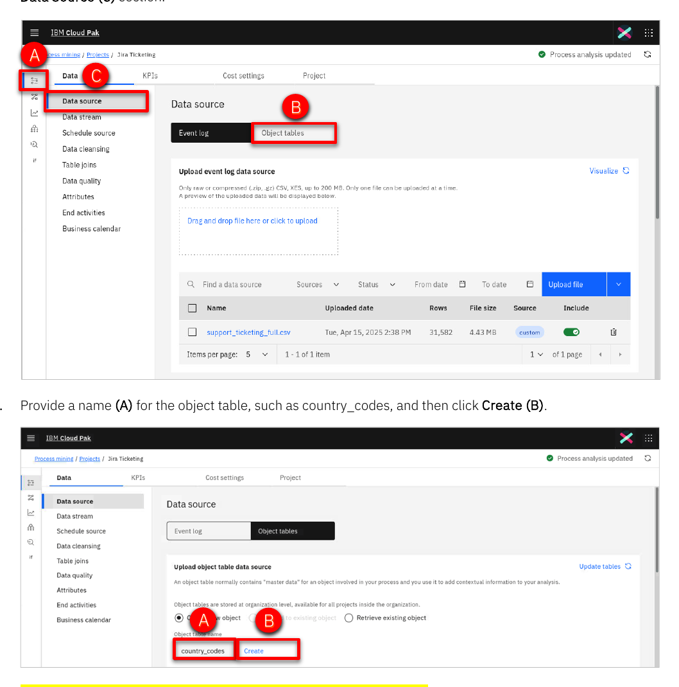

3. `Drag and drop file here` 프롬프트(A)를 클릭하여 이전에 다운로드한 labfiles 폴더로 이동한 다음 country_codes.csv 파일을 선택하여 업로드합니다.

4. `Edit data mapping` (A)을 클릭합니다.

   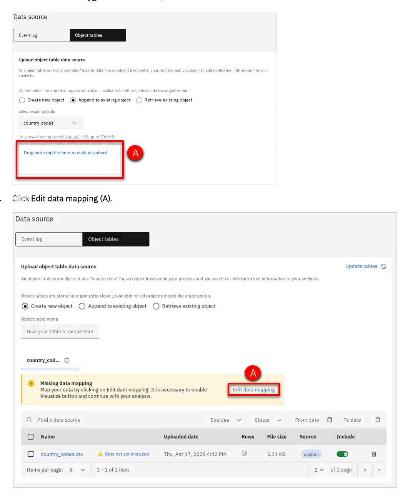

5. COUNTRY 및 COUNTRY CODE 열을 모두 Text (A)로 매핑하고 `Next` (B)를 클릭합니다.
   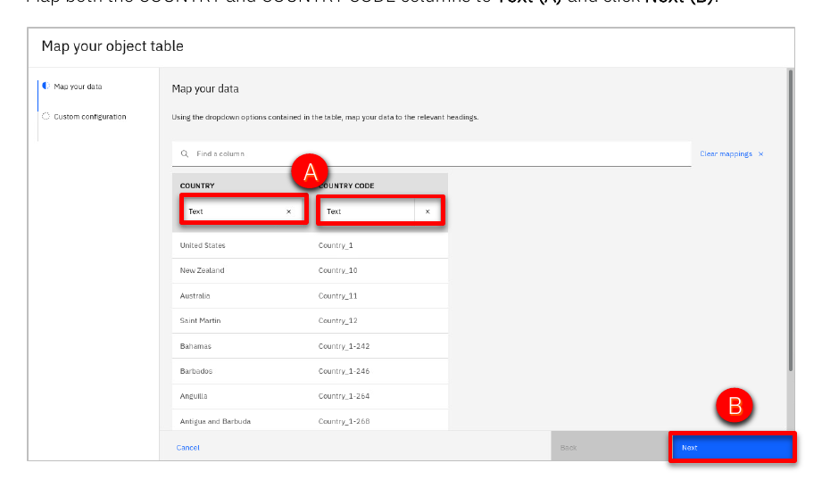

6. `Custom configuration` 섹션에서 COUNTRY CODE (A)를 기본 키로 선택합니다. IBM Process Mining이 해당 필드를 필수 필드(B)로 자동 선택합니다. 그런 다음 `Save` (C)를 클릭합니다.
   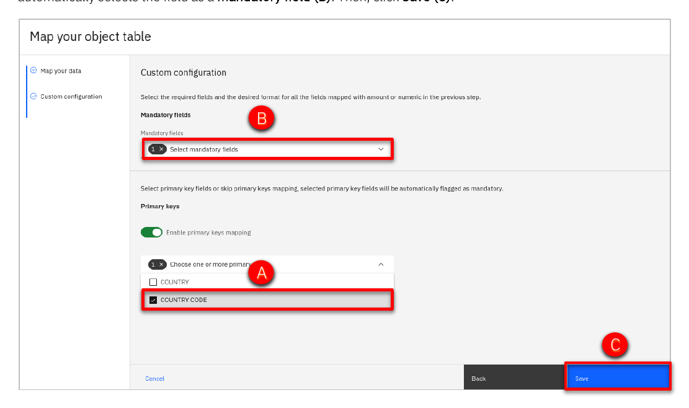

7. 왼쪽 탐색 섹션에서 `Table joins` (A)를 클릭합니다.

   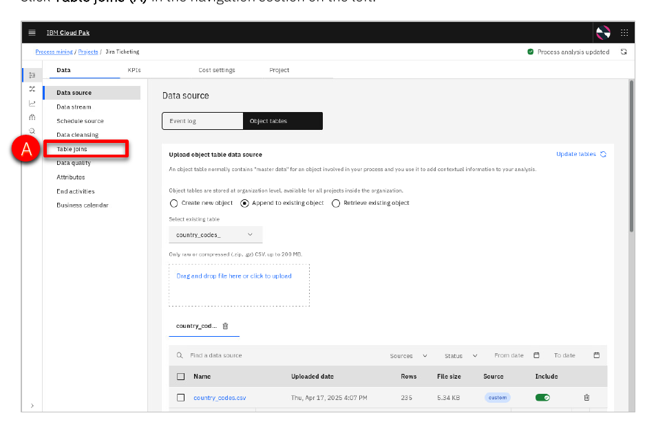

8. 두 테이블(A)을 모두 선택한 다음 `Join tables` (B)를 클릭합니다.

   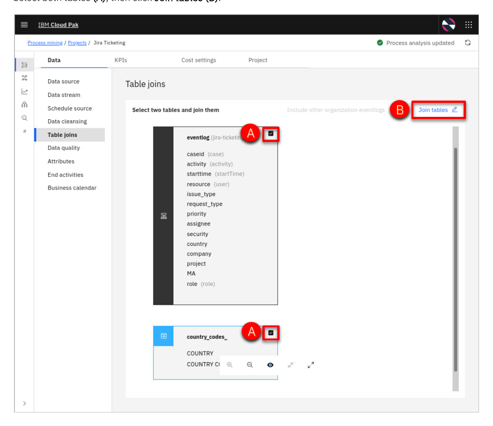

9. 아래로 스크롤하여(A) Jira-ticketing 테이블에서 country (B)를 선택합니다. 그런 다음 `Save` (C)를 클릭합니다.

   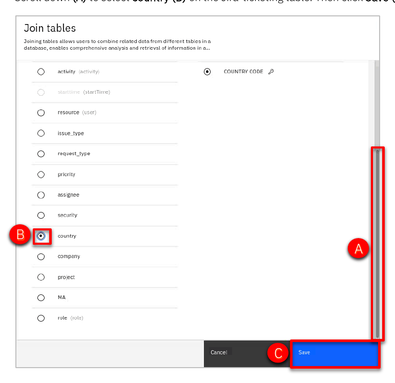

10. 테이블 가져오기의 마지막 단계로 `Apply` (A)를 클릭합니다.
   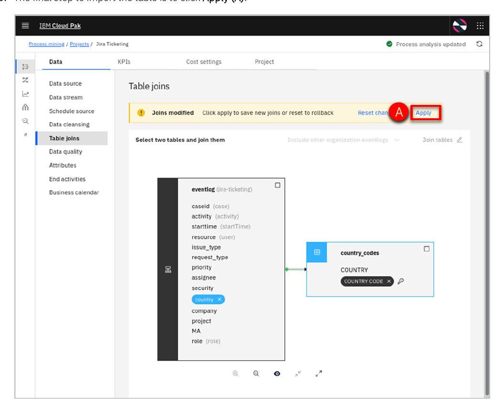

### 객체 테이블을 사용하여 위젯에서 데이터 한정

> 이 섹션에서 하는 일 :    
>  Resource Monitoring 대시보드의 `Tickets by country` Pie 차트 위젯을 편집해 **From** 에 `country_codes` 객체 테이블을 추가하고, Dimensions의 드롭다운에서 `country_codes` 섹션의 COUNTRY 컬럼으로 차원을 교체합니다. `Help` 버튼으로 테이블 조인 관계(색상 매칭)도 시각적으로 확인합니다.

> 왜 필요한가 :   
>  객체 테이블은 **"가져온다"** 와 **"활용한다"** 가 별개의 단계입니다. 가져오기만 해서는 기존 위젯은 여전히 이벤트 로그만 참조합니다. 위젯의 Dimension을 **객체 테이블 컬럼으로 교체**해야 비로소 외부 데이터가 시각화에 반영됩니다. 더 중요하게는, 여러 객체 테이블이 연결된 복잡한 프로젝트에서 **`Help` 다이어그램의 색상 매칭**이 **"어느 테이블이 어떻게 조인됐는가"** 를 직관적으로 보여주는 **데이터 모델 문서**의 역할을 합니다 — 분석가가 쿼리 결과를 잘못 해석하는 사고를 예방하는 장치입니다.

객체 테이블을 가져왔으므로 이제 Resource Monitoring 대시보드의 Country Pie Chart 위젯에서 국가 데이터를 활용할 수 있습니다.

1. 왼쪽 탐색 바에서 `Analytics` (A)를 선택합니다. 그런 다음 `Resource Monitoring` (B) 대시보드를 선택하고 `Edit` (C)를 클릭합니다.

2. Tickets by country 위젯의 툴바에서 `Edit` (A)를 클릭합니다.

   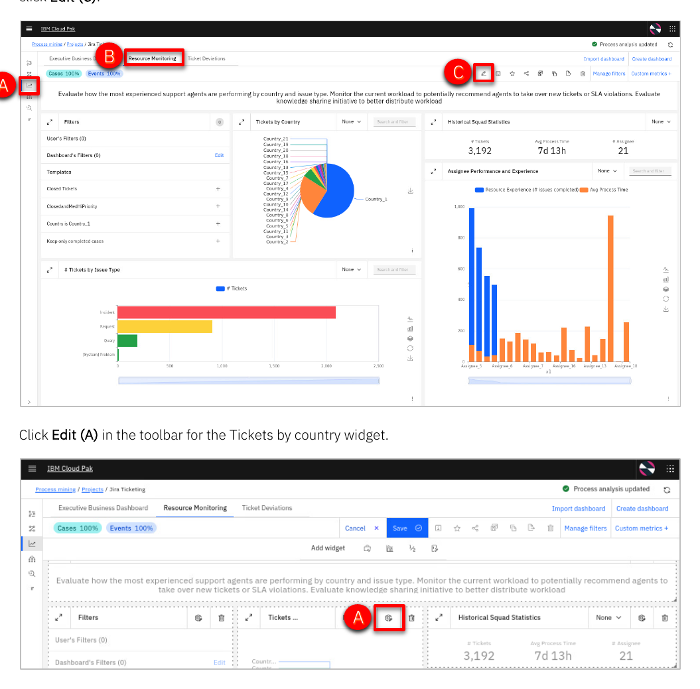

3. `country_codes` (A) 객체 테이블을 선택합니다. Dimensions의 드롭다운 필드를 클릭하여 목록 끝의 country_codes 섹션에서 COUNTRY를 선택합니다. 그런 다음 `Help` (C)를 클릭합니다.
   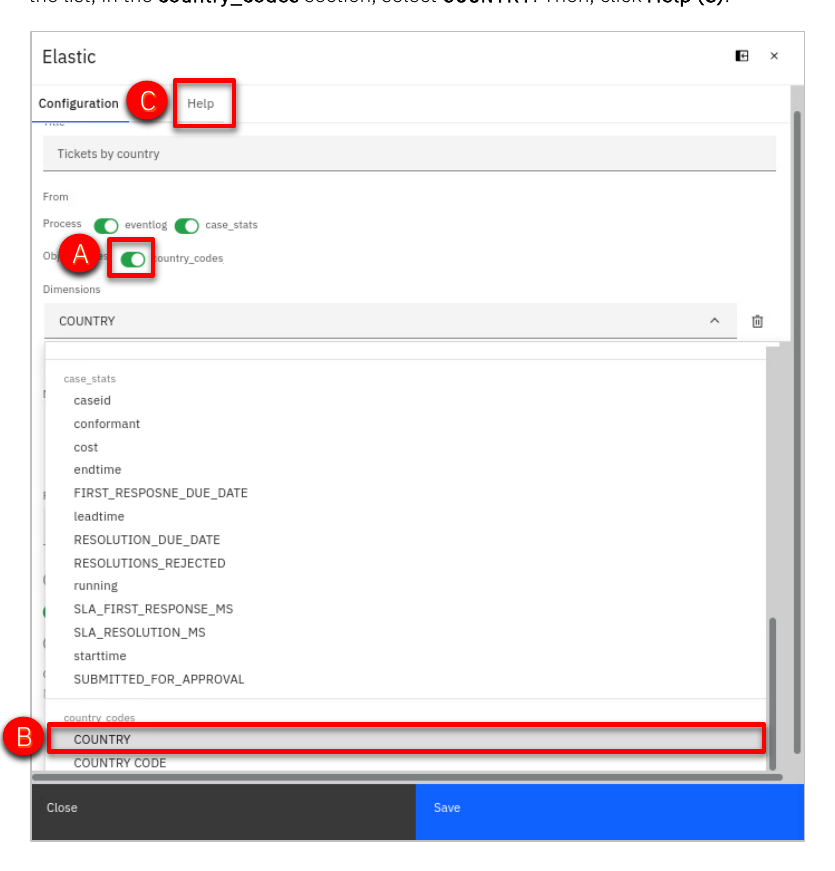

   더 많은 객체 테이블이 추가되고 이벤트 로그 테이블에 연결될수록 관계를 시각적으로 확인하면 쿼리가 반환하는 데이터를 이해하는 데 도움이 됩니다.

   > **참고:** 전체 다이어그램을 보려면 화면을 최대화해야 할 수 있습니다.

4. 테이블 색상(A)과 연결된 테이블의 기본 키 색상(A)을 확인합니다. 이를 통해 테이블이 어떻게 연결되어 있는지 쉽게 파악할 수 있습니다. 그런 다음 `Save` (B)와 `Close` (C)를 클릭합니다.

   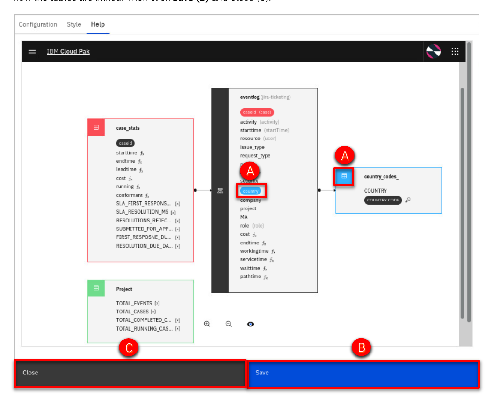

5. `Save`를 클릭하여 대시보드를 저장하고, 확인 메시지가 나타나면 `Refresh`를 클릭합니다.
6. 파이 차트 위젯에 국가가 표시되는지 확인합니다.
   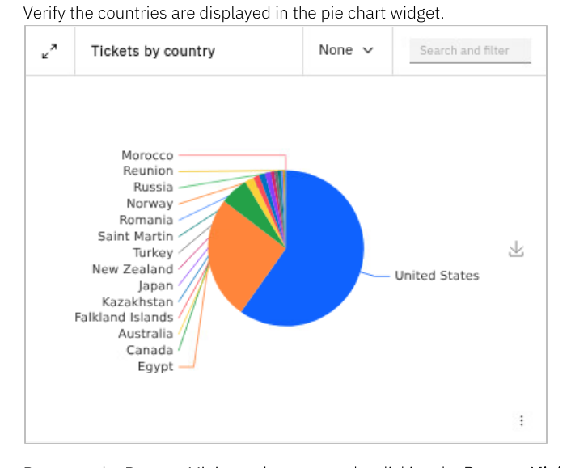
7. `Process Mining` breadcrumb (A)를 클릭하여 Process Mining 시작 페이지로 돌아갑니다.

이 실습을 완료했습니다.

### 요약

#### 이 실습이 만든 변화

실습 2가 **"프로세스의 보편적 진단"**을 완성했다면, 실습 3은 그 진단을 **"Jira 티켓팅이라는 특정 사용 사례의 운영 언어"**로 번역했습니다.

| 구분 | 실습 3 이전 | 실습 3 이후 |
|------|------------|------------|
| **고객 약속(SLA)** | 이벤트 로그에 없어 분석 불가 | 사용자 정의 지표로 **케이스별 SLA 기준값 자동 할당** |
| **SLA 이탈 근거** | "요청이 좀 느린 것 같다" (감) | **High Request +2일 22시간**, Medium Request +1일 15시간 초과 (정량) |
| **리드타임 병목** | 추정 | **Change in request type 39%**, **Change in person assigned 35%** — 합 74%가 2개 활동에 집중 |
| **비용 낭비** | "비효율적" | **전체 인건비의 약 10%(€9,770) = 예방 가능 낭비**, 직원 685명 중 **68명분 인건비 규모** |
| **운영 의사결정** | "누구에게 줄지 모름" | Country_1 티켓 → 경험·업무량 교차 비교 → **Assignee_2 추천** (경험 적지만 여유·Low 우선순위 중심) |

> 한 줄로: **"문제를 안다"에서 "어느 유형·우선순위·담당자에서 얼마의 SLA·비용이 새는지, 지금 이 티켓을 누구에게 배정할지"까지 바뀌었습니다.**

---

#### 도출한 4가지 운영 자산

##### 1. 사용자 정의 지표 — 이벤트 로그에 없는 비즈니스 기준을 주입

백업에 포함된 `Resolution SLA`·`First Response SLA`·`Resolutions Rejected` 등 사용자 정의 지표는 **이벤트 로그를 건드리지 않고** 케이스 단위로 비즈니스 규칙을 붙이는 메커니즘.

**핵심 발견**

- 우선순위별 SLA 기준값(High 2일 / Medium 5일 / Low·Lowest 40일)이 **각 티켓에 자동 할당**되어 "기준 대비 초과"를 바로 측정 가능
- Code Test 기능은 **Dry-run 검증** 단계 — 괄호·단위·컬럼명 오류로 생기는 **"잘못된 KPI가 이사회에 올라가는 사고"**를 원천 차단

**→ 얻은 것** : 이벤트 로그 + 비즈니스 규칙이 **한 화면에서 동시 분석 가능**한 환경. "프로세스 마이닝 = 이벤트 로그만 본다"의 한계 돌파.

---

##### 2. 사전 구성 대시보드 2종 — SLA · 비용 이중 진단

`Executive Business Dashboard`와 `Ticket Deviations` 두 대시보드를 import해 **시간 관점**과 **비용 관점**을 동시에 진단.

**측정 결과**

| 관점 | 대시보드 | 핵심 숫자 |
|------|---------|----------|
| **시간 (SLA)** | Executive Dashboard | High Request 해결 **+2일 22시간** 초과, 리드타임의 **74%가 2개 Change 활동**에 집중 |
| **비용** | Ticket Deviations | Total Human Cost **€113,902.50** 중 Changes 관련 비용 **€9,770.83 (≈10%)** = 예방 가능 낭비 |
| **지역화** | Changes Statistics 매트릭스 | `Change in request type`은 자동화율 42%인데도 **발생 빈도 때문에 최고 비용 변경** |

**→ 얻은 것** : 실습 2의 **"두 Change 활동이 문제"**라는 감을 **시간(74%) + 비용(10%) 두 관점에서 동시 검증**. 경영진 설득용 **€ 단위 비즈니스 케이스** 완성.

---

##### 3. Resource Monitoring 대시보드 — 과거 경험 + 현재 업무량의 교차 조회

빈 템플릿에서 시작해 **Annotation · Filter · Card · Elastic(Pie/Bar/Row) · Table (Legacy)** 6가지 위젯을 직접 조합하여, 상단 `IS_RUNNING = 0`(과거) · 하단 `IS_RUNNING = 1`(현재) 구조로 구축한 **운영 의사결정용 대시보드**.

**핵심 설계 원리**

- **Pie(국가 비중) + Bar(담당자 경험·성능) + Row(이슈 유형)** — 과거 성과 분석 영역
- **Table(열린 티켓 상세) + Row(현재 업무량)** — 현재 상태 영역
- `Keep last event for each case` 옵션은 **"티켓을 최종 해결한 담당자"** 기준 집계를 보장 — 중간에 잠깐 건드린 사람까지 세는 오류 차단
- `now()` 또는 고정 타임스탬프(`1667170800000`)로 **"지금 경과된 시간"**을 계산 → 실시간 SLA 위반 감시 가능

**→ 얻은 것** : "경험 많은데 과부하 vs 경험 적지만 여유"를 **한 화면에서 교차 조회**하는 배정 판단 도구. Country_1 시나리오에서 **Assignee_2 추천**이라는 구체적 결론을 즉시 도출.

---

##### 4. 객체 테이블 — 외부 마스터 데이터 수평 확장 메커니즘

`country_codes.csv`를 객체 테이블로 업로드 → 데이터 매핑(Text) → 기본 키(COUNTRY CODE) 지정 → `Table joins`에서 `country` 컬럼과 조인 → 위젯 Dimension을 객체 테이블 컬럼으로 교체.

**왜 중요한가**

- 이벤트 로그에는 **"Country_1, Country_2…"** 같은 코드만 있고, 실제 마스터 정보는 **별도 시스템(ERP·인사 DB)**에 분산
- 객체 테이블은 **이벤트 로그를 수정하지 않고** 분석 시점에 외부 데이터를 **즉시 결합** — 데이터 파이프라인 변경 없이 **분석 범위 수평 확장**
- `Help` 다이어그램의 **색상 매칭**은 여러 객체 테이블이 얽힐 때 **"어느 테이블이 어떻게 조인됐는가"**를 시각화하는 **데이터 모델 문서** 역할

**→ 얻은 것** : 같은 원리로 **벤더·자재·고객 등급·계약 조건** 등 어떤 마스터 데이터도 연결 가능. IBM Process Mining 2.0의 **객체 중심 데이터 모델**의 실전 적용.

---

#### 왜 이 4자산이 모두 필요한가

넷은 **"기준 주입 → 이중 진단 → 운영 도구화 → 확장"**의 연쇄입니다. 하나라도 빠지면 사이클이 끊어집니다.

- **사용자 정의 지표 없음** → SLA 기준값이 분석에 들어오지 못함 → **"약속 대비 얼마나 늦었나"** 측정 불가
- **사전 구성 대시보드 없음** → 시간·비용 이중 검증 없이 단일 관점만 봄 → **경영진 설득 근거 부족**
- **Resource Monitoring 없음** → 분석은 끝났어도 **"지금 이 티켓을 누구에게 줄지"**라는 일상 운영에 못 씀
- **객체 테이블 없음** → 이벤트 로그에 갇힌 분석 → 지역·벤더·자재 등 **비즈니스 맥락 확장 불가**

네 자산이 모두 있어야 **"기준 설정 → 문제 정량화 → 현장 적용 → 외부 확장"**의 완전 사이클이 작동합니다. 이것이 프로세스 마이닝이 "분석 결과물"에서 **"매일 쓰는 운영 도구"**로 진화하는 지점입니다.

---

#### 다음 실습에서의 활용

| 다음 실습 | 이 실습의 자산 사용 | 얻게 되는 것 |
|----------|------------------|------------|
| **실습 4** What-if 시뮬레이션 | Change 활동의 **시간 74% · 비용 10%** 수치 + 이탈률 70% | "Change 활동을 **50% 줄이면 SLA 얼마 상승 / 비용 얼마 절감?**" 정량 ROI 시나리오(연간 ≈ $18K) |
| **실습 5** 운영 우수성 모니터링 | **SLA 사용자 정의 지표** + 5종 대시보드 템플릿 | 위반 발생 시 **Slack 자동 호출** + 실행 중 티켓 감시 뷰(IS_RUNNING = 1) |

---

범용 분석에서 사용 사례 맞춤형 운영 분석으로의 전환이 끝났습니다. 이제 실습 4에서 이 발견들을 바탕으로 **"얼마를 개선하면 얼마를 얻는가"**를 시뮬레이션하고, 실습 5에서 이 대시보드를 **실시간 운영 감시 체계**로 확장할 차례입니다.