[← 소개로 돌아가기](10_Introduction.md)

---

## 실습 4. What-if 분석 및 시뮬레이션

실습 3이 **"현실을 대시보드로 운영화"**하는 단계였다면, 실습 4는 한 단계 앞으로 가 **"아직 실행하지 않은 개선안의 효과를 실행 전에 숫자로 예측"**하는 단계입니다. 실제 프로세스 변경에는 수만 달러의 투자와 수개월의 리스크가 따르므로, 구현 전에 **컴퓨터 안에서 가상으로 돌려보는 것**이 가장 안전하고 설득력 있는 의사결정 방식입니다.

- **1단계 What-if 시나리오 설계 (Ideate)** — "어느 활동을, 어떻게 바꿀 것인가" — 실습 2·3에서 확정된 두 범인 Change 활동을 놓고 **증상 완화 vs 근본 원인 제거** 중 후자를 택해 개선안 설계
- **2단계 기준선 식별 (Baseline)** — "지금 상태를 먼저 찍는다" — 필터·Variant 선정으로 As-Is 프로세스를 동결하여 비교 기준 확보
- **3단계 To-Be 시뮬레이션 (Quantify)** — "바꾸면 얼마 좋아지나" — 자동화율·로봇 수·처리 시간만 수동 입력하고, 도착 분포·직원 가용성·활동 통계는 실제 로그에서 자동 추출한 상태로 시뮬레이션 실행
- **4단계 ROI 계산 (Justify)** — "이 투자가 돌아오는가" — 연간 절감액과 회수 기간을 계산해 경영진이 승인 가능한 비즈니스 케이스로 전환

이 실습을 완료하면 **"자동화하면 좋을 것 같다"**는 막연한 제안이 **"봇 1개·자동화율 80%로 연간 약 $18,000 절감, 투자 $15,000이 첫해 내 회수"**라는 의사결정 가능한 숫자로 바뀝니다.

#### 시뮬레이션이 추측이 아닌 "예측"인 이유

일반적 스프레드시트 What-if는 분석가가 **모든 변수를 가정으로 입력**하므로 결과가 가정에 휘둘립니다. IBM Process Mining의 시뮬레이션은 다릅니다 — **도착 분포·직원 가용성·활동별 평균 시간·대기 시간** 등 네 가지 핵심 입력이 **실제 이벤트 로그에서 자동 추출**되고, 분석가는 **바꾸려는 변수(자동화율·봇 수·처리 시간)만** 지정합니다. 즉 시뮬레이션은 **"과거 패턴의 연장선에서 특정 변수만 바뀐 미래"**를 계산하므로, 결과는 추측이 아닌 **현실 데이터에 기반한 조건부 예측**이 됩니다. 이것이 경영진 설득에 시뮬레이션 결과가 "가정"보다 훨씬 강한 이유입니다.

> **참고:** What-if 분석 및 시뮬레이션 기능은 버전 2.0의 기술 미리보기입니다.

### 목차

- [분석을 기반으로 What-If 개선 시나리오 설계](#분석을-기반으로-what-if-개선-시나리오-설계)
- [얻을 수 있는 이점 수량화](#얻을-수-있는-이점-수량화)
  - [기준선 식별 (As-Is 프로세스)](#기준선-식별-as-is-프로세스)
  - [To-Be 시나리오 정의](#to-be-시나리오-정의)
  - [대시보드 가져오기](#대시보드-가져오기)
- [요약](#요약)

---

### 분석을 기반으로 What-If 개선 시나리오 설계

> 이 섹션에서 하는 일 :    
>  `Rework` 뷰에서 두 범인 활동의 **자동화율**(Change in request type 42%, Change in person assigned 0%)을 다시 확인하고, 이를 해결할 **두 가지 개선 방안**을 설계합니다. 방안 A는 자동화율 추가 상향, 방안 B는 **First Assigned에 자동 할당 도입**으로 Change in person assigned 활동 자체를 제거.

> 왜 필요한가 :   
>  시뮬레이션은 **"무엇을 어떻게 바꿀지"가 먼저 정해진 뒤**에야 돌릴 수 있습니다. 방안 B처럼 **근본 원인(잘못된 담당자 배정)을 제거**하는 안이 방안 A처럼 **증상(변경 활동)을 완화**하는 안보다 구조적 이득이 큽니다 — "첫 배정이 올바르면 담당자 변경 자체가 필요 없다"는 논리. 이 선택은 시뮬레이션 엔진이 할 수 없는 **분석가의 판단 영역**이며, 현업 전문가·엔터프라이즈 디자인 씽킹과의 협업이 결정적입니다.

지금까지 SLA 및 비용, 특히 `Change in Request Type`과 `Change in Person Assigned` 활동과 관련된 문제를 식별했습니다.

이제 프로세스에서 몇 가지 개선 사항을 설계할 때입니다. 이 단계는 프로세스 분석가의 역량과 경험에 크게 의존하므로, 분석 결과를 꼼꼼히 문서화하고 프로세스 담당자나 주제 전문가와 긴밀히 협업하는 것이 중요합니다.

엔터프라이즈 디자인 씽킹 방법론을 활용하면 효과적이고 혁신적인 솔루션을 도출하는 데 큰 도움이 됩니다.

1. Process Mining 시작 페이지에서 `Jira Ticketing` (A)을 클릭하여 프로젝트로 돌아갑니다.
   IBM Process Mining이 `Frequency` 모델 뷰를 엽니다.

   

2. `Frequency`를 클릭하고 `Rework` (A)를 선택하여 `Rework` 뷰를 엽니다.

   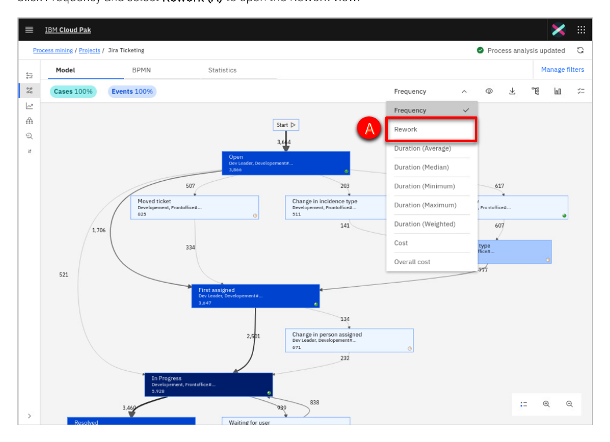

3. `Rework` 뷰를 검토하면서 다음을 관찰합니다:
   - `Change in request type` (A) 활동은 자동화 비율이 42%입니다.
   - `First assigned`와 `Change in person assigned` 활동 (B)은 자동화 비율이 0%이므로 지원 담당자가 완전히 처리합니다.
   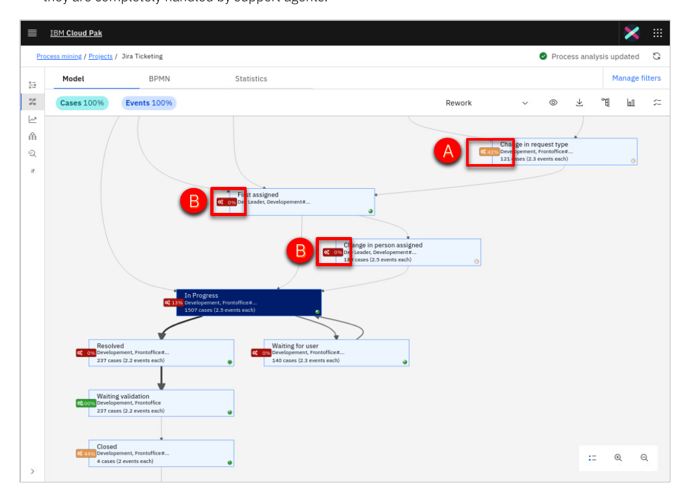

4. 이 시나리오를 고려하여 선택한 개선 솔루션은 다음과 같습니다:
   a. `Change in request type` 활동의 자동화 비율을 높입니다. 이를 위해서는 이 자동 분류가 어떻게 구현되었는지, 개선의 여지가 있는지 분석이 필요합니다.
   b. 프로세스 내에 자동 할당을 도입합니다. 첫 번째 할당을 올바르게 자동화하면 `Change in person assigned` 활동을 수행해야 할 필요성을 최소화합니다. 이는 IBM Business Automation Workflow와 같은 워크플로우 도구를 사용하여 달성할 수 있으며, 고객이 각 티켓 유형에 대한 역할과 책임을 정의하고 할당을 자동화할 수 있습니다. 대안으로, IBM Process Mining 자체를 사용하여 다양한 티켓 유형 및 주제에 대한 각 담당자의 경험을 분석하고 담당자의 현재 대역폭을 모니터링하여 업무량을 더 잘 분배할 수 있습니다.

   IBM Process Mining의 시뮬레이션 기능을 사용하면 첫 번째 할당 자동화(b)를 시뮬레이션하는 What-if 분석을 수행할 수 있습니다.

### 얻을 수 있는 이점 수량화

> 이 섹션에서 하는 일 :    
>  설계한 개선안의 이점을 **시간·비용 숫자로 번역**합니다. 두 단계로 나뉩니다 — 먼저 **기준선(As-Is)**을 찍어 비교 기준을 동결하고, 이어 **To-Be 시뮬레이션**을 돌려 개선 효과를 얻습니다.

> 왜 필요한가 :   
>  경영진 의사결정의 언어는 **%가 아닌 금액**입니다. "43% 빨라집니다"보다 **"연간 $18,000 절감, 10개월 내 투자 회수"**가 승인 확률이 월등히 높습니다. 시뮬레이션은 이 번역을 가능하게 하는 **유일한 수단** — 실제로 바꿔 보기 전에 **ROI·회수 기간·순이익 시점** 같은 경영 용어로 개선안을 표현할 수 있게 합니다.

개선 솔루션을 설계했다면, 그 잠재적 이점을 구체적으로 측정하고 구현 투자의 타당성을 뒷받침하는 근거를 마련하는 것이 중요합니다. IBM Process Mining은 To-Be 프로세스의 이점을 측정하기 위한 다양한 기능을 제공합니다.

특히, 시뮬레이션 기능을 사용하여 프로세스에 새로운 동작과 관행을 도입하고 미래 성능에 어떤 영향을 미칠지 확인할 수 있습니다.

#### 기준선 식별 (As-Is 프로세스)

> 이 섹션에서 하는 일 :    
>  `Change in person assigned` 활동을 제외하는 필터를 추가하고, 상위 2개 프로세스 Variant를 선택해 기준선을 생성합니다. 진행 중 케이스 필터는 **시스템이 자동으로 추가**합니다.

> 왜 필요한가 :   
>  기준선은 **"Before 사진"** 입니다. 이게 없으면 To-Be 예측값이 얼마를 개선했는지 측정할 기준 자체가 없어 **ROI 계산이 성립하지 않습니다**. 또 기준선을 **To-Be와 최대한 유사한 조건**으로 맞춰야 비교가 공정해집니다 — 방안 B에서 Change in person assigned 활동이 제거될 것이므로, 기준선에서도 **그 활동을 제외한 나머지 프로세스**를 비교 대상으로 잡는 것. 상위 2개 Variant만 쓰는 이유는 **희귀 경로의 노이즈가 시뮬레이션 예측을 흐리는 것**을 막기 위함입니다.

시뮬레이션을 생성하는 첫 번째 단계는 To-Be 프로세스의 기준선으로 사용할 As-Is 프로세스를 만드는 것입니다. 시뮬레이션을 수행할 때는 To-Be 프로세스와 최대한 유사한 조건을 기준선으로 설정하는 것이 좋습니다.

1. 왼쪽 탐색 바에서 `What-if` (A) 아이콘을 클릭합니다. 그런 다음 `Create new simulation` (B)을 클릭합니다.

   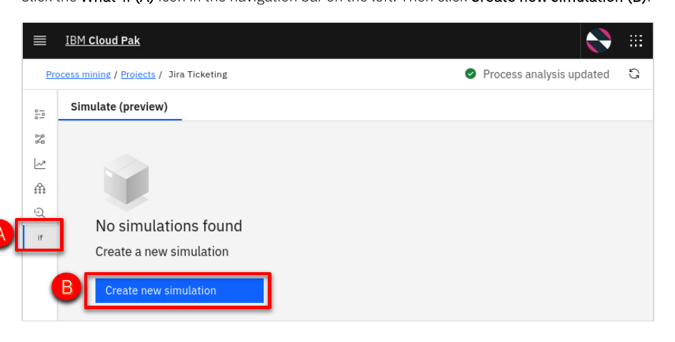

2. 시뮬레이션에 대한 제목 (A)(**Automation simulation** 등)과 설명 (B)을 입력한 다음 `Next` (C)를 클릭합니다.
   오른쪽의 모델은 식별 중인 기준선의 표현입니다.
   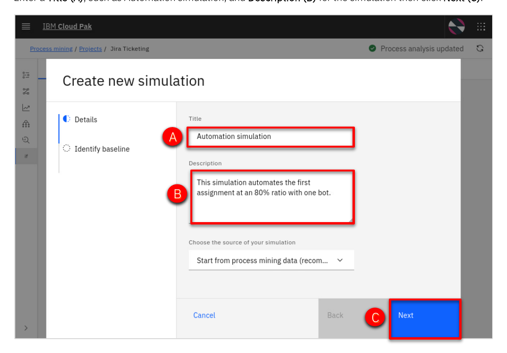

3. "First assigned" 활동까지 스크롤하여 그 이후에 발생하는 "Change in person assigned" (A) 활동을 확인합니다. "First assigned" 활동의 자동화를 도입하면 이 활동의 필요성이 없어지므로 필터링할 수 있습니다.

   > **참고:** 스크롤을 내리려면 스크롤바를 사용하지 마십시오. 모델을 잡고 아래로 이동하고 마우스 휠을 사용하여 확대하거나 축소해야 합니다.

4. `Manage filters` (B)를 클릭합니다.
   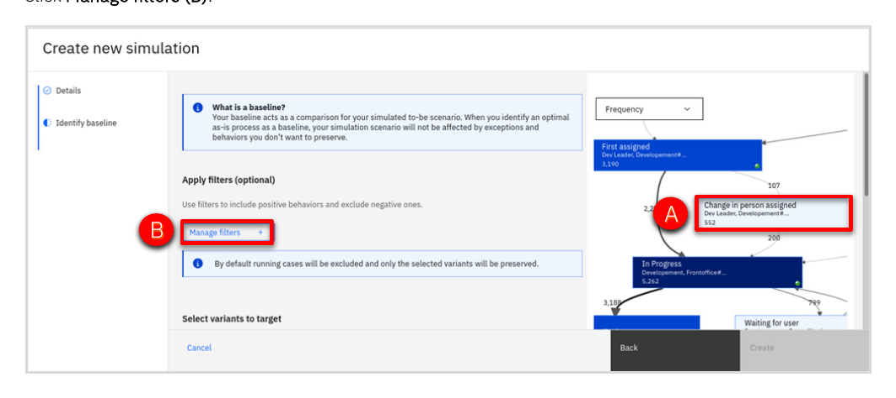

5. `Add filter`를 클릭합니다.

6. 필터 선택 창에서 `Process Flow` (A)를 선택합니다. 필드 목록에서 `Activity occurrence` (B)를 선택하고, 필터 조건을 `Exclude matched cases` (C)로 설정한 다음 `Filter fields`에서 **Change in person assigned** (D)를 선택합니다. 필터 작성을 완료한 후 `Add` (E)를 클릭합니다.

   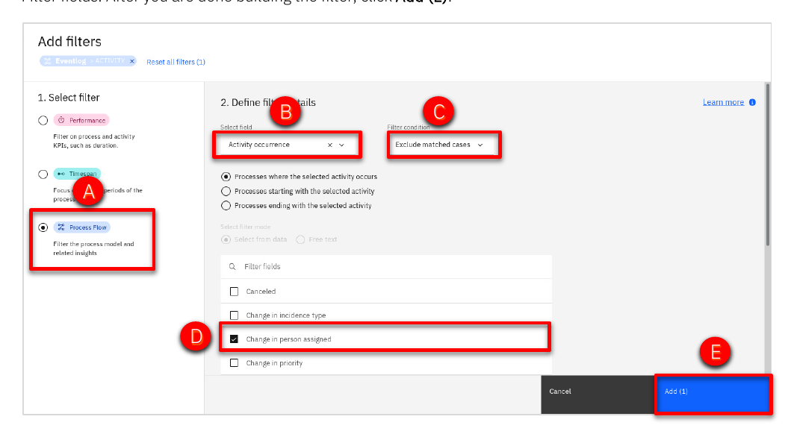

7. 필터가 "Activity is not 'Change in person assigned'" (A)임을 확인하고 `Update filters` (B)를 클릭합니다.
   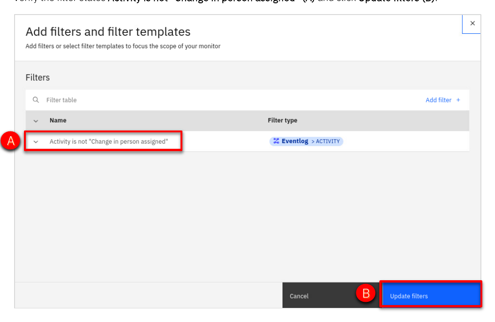

8. 모델이 새로 고침된 후 `First assigned` (A) 활동으로 다시 스크롤하여 "Change in person assigned" 활동이 표시되지 않는지 확인합니다.
   프로세스와 미리보기는 구성이 조정될 때마다 자동으로 업데이트됩니다. `Frequency` 드롭다운 메뉴를 클릭하여 다른 모델도 볼 수 있습니다.

   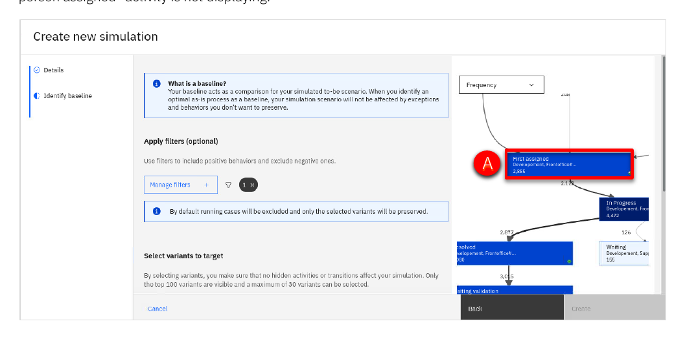

9. IBM Process Mining이 시뮬레이션의 일부로 해당 필터를 자동으로 추가하기 때문에 (A) 진행 중인 케이스를 제외하는 필터를 만들 필요가 없습니다.
   진행 중인 케이스를 제외하는 필터를 적용하면 완료된 티켓만 대상으로 분석하므로, 리드 타임 측정의 일관성도 확보됩니다.

10. 기준선 프로세스와 더 유사하게 만들기 위해 `Select variants to target` 섹션에서 처음 두 변형 (B)을 선택한 다음 `Create` (C)를 클릭하여 기준선을 생성합니다.
   이전 실습에서와 마찬가지로, 이 두 변형은 프로세스에서 가장 빈번한 동작을 반영하는 케이스 하위 집합을 나타냅니다.

#### To-Be 시나리오 정의

> 이 섹션에서 하는 일 :    
>  `Automated activities`에 진화 하나를 추가하여 **자동화율 80% · 로봇 1개 · 처리 시간 1분**을 입력하고, `Configuration`에서 **Number of instances = 962 · 도착 분포 = historical**로 맞춘 뒤 `Simulate`를 실행합니다.

> 왜 필요한가 :   
>  To-Be의 4가지 설정 각각에는 **설득력의 근거**가 들어가야 합니다. **80%**는 현실적으로 달성 가능한 자동화율(42% → 80%는 AI 분류기 수준), **1 minute**는 봇 처리 속도의 합리적 가정, **962 instances**는 기준선과 동일한 모수로 공정 비교 확보, **historical 도착 분포**는 시뮬레이션이 **가정이 아닌 현실 패턴의 연장선**에서 돌아가게 하는 결정적 설정. historical이 아닌 인공 분포를 쓰면 결과는 **"예쁜 가상 숫자"**가 될 뿐 경영진을 설득할 수 없습니다.

시뮬레이션 설정은 필터링된 기준선 프로세스에서 자동으로 가져온 정보로 미리 채워져 있습니다. 시뮬레이션하려는 시나리오에 맞게 각 항목을 조정할 수 있습니다.

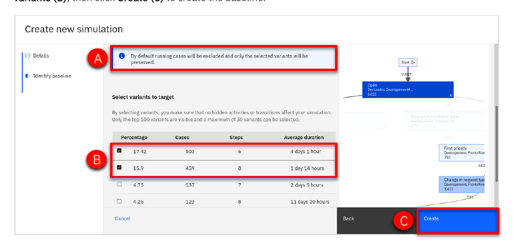

1. 오른쪽 상단의 필터 (A)를 클릭하여 프로세스에 적용되는 필터를 봅니다. 생성한 두 필터 외에 IBM Process Mining이 자동으로 적용한 `Exclude running cases` (B) 필터가 추가된 것을 확인합니다.
2. `Workforce availability` (C)를 클릭합니다.

3. IBM Process Mining이 인력 가용성에 대한 기본값을 입력했음을 확인합니다 (A).
   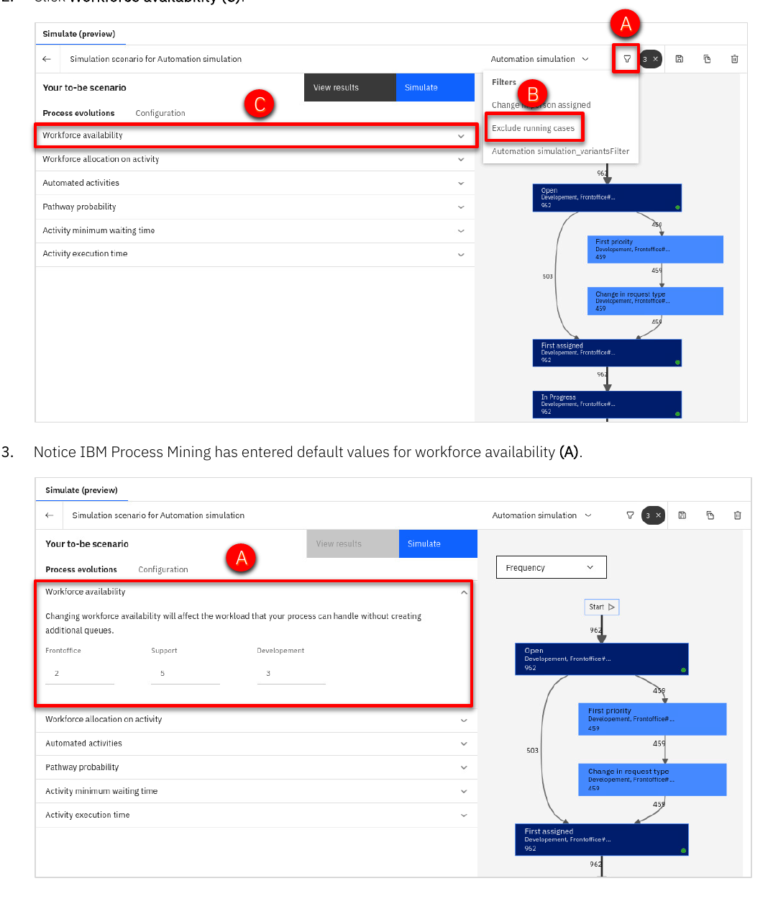

   이 값들은 시뮬레이션을 수행할 때 사용됩니다.

4. `Automated activities` (A)를 클릭하여 펼친 다음 `Add evolution` (B)를 클릭합니다.
   프로세스 진화는 다양한 개선 시나리오를 시뮬레이션하는 데 사용할 수 있습니다.

   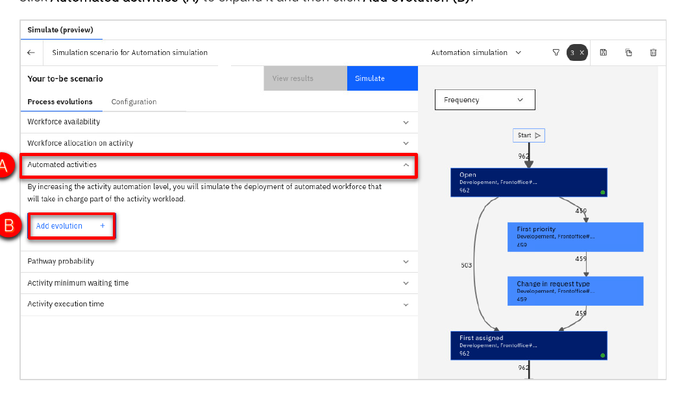

5. 자동화 시나리오에 대해 다음을 입력합니다:
   - `Robotic quote`: **80%** (A)
   - `Number of robots`: **1** (B)
   - `Working time`: **1 minute** (C)

6. `Configuration` (D)를 클릭합니다.

   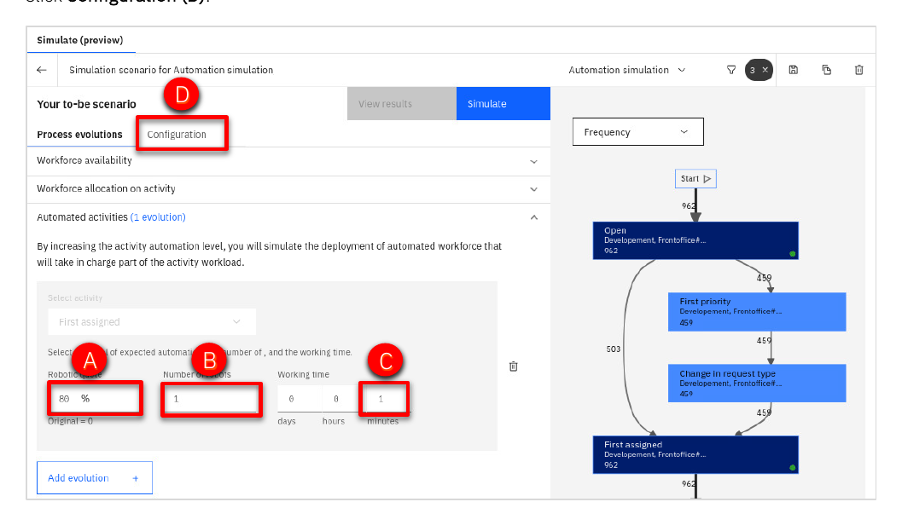

7. 모델이 962개의 케이스 (A)를 표시하고 있음을 확인합니다. 일치하도록 `Number of instances`를 **962** (B)로 변경할 수 있습니다.
8. 실제 데이터를 기반으로 시뮬레이션하려면 도착 분포에서 `historical` (C)을 선택합니다. historical을 선택할 때 기간도 변경할 수 있습니다.
9. To-Be 시나리오 구성이 완료되면 `Simulate` (D)를 클릭합니다.
10. 시뮬레이션이 완료되면 `View results` (E)를 클릭합니다.
   시뮬레이션은 프로세스 마이닝 데이터 기반 모델에서 대부분의 입력 데이터를 자동으로 가져옵니다. 여기에는 As-Is 프로세스의 추세와 피크를 재현하는 도착 분포, 직원 가용성, 대기 시간 등 모든 활동 통계가 포함됩니다.   

      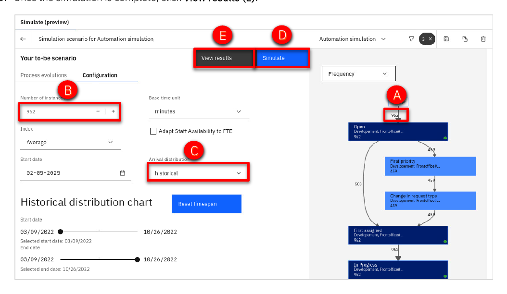

11. 결과를 확인합니다. `Avg Process Cost`와 `Avg Process Time` (A)에 개선이 있는지 관찰합니다.   
   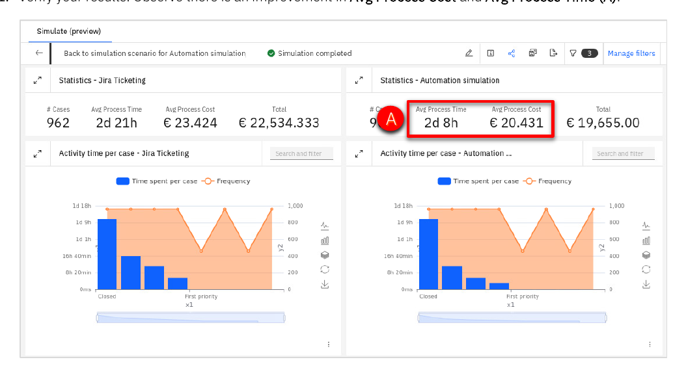    

      **화면을 읽는 법** — 왼쪽은 **지금의 모습(As-Is, Jira Ticketing)**, 오른쪽은 **자동화 도입 후의 모습(To-Be, Automation simulation)**입니다. 두 카드를 좌·우로 나란히 놓고 같은 962건의 티켓이 얼마나 달라지는지 비교합니다.

      **무엇이 얼마나 좋아졌나 — 한눈에 보기**

      | 지표 | 지금 (As-Is) | 자동화 후 (To-Be) | 차이 | 의미 |
      |------|-------------|-------------------|------|------|
      | 티켓 한 건 평균 처리 시간 | **2일 21시간** | **2일 8시간** | **−13시간** (≈ 19% 단축) | 한 건당 반나절 이상 빨라짐 |
      | 티켓 한 건 평균 처리 비용 | **€ 23.42** | **€ 20.43** | **−€ 2.99** (≈ −$3) | 한 건당 약 $3 절감 |
      | 962건 전체 누적 비용 | **€ 22,534** | **€ 19,655** | **−€ 2,879** | 6개월 분 비용이 약 €2,879 줄어듦 |

      즉, **봇 1개가 First Assigned를 자동으로 처리**하는 것만으로 티켓 한 건당 **시간은 약 19% · 비용은 약 $3 줄어듭니다.** 이 수치는 컴퓨터가 **실제 로그의 도착 분포·담당자 가용성을 반영**해 돌린 결과라 "대략 이럴 것"이 아닌 **근거 있는 예측**입니다.

      ---

      **그럼 이게 돈으로 얼마나 되나 — ROI 계산 3단계**

      단계 1 — **연간 티켓 수 추정**    
      데이터는 **6개월치 3,200건**이 들어 있으므로, 1년이면 대략 **2배 = 6,400건**으로 가정합니다.

      단계 2 — **연간 절감액 계산**    
      티켓 한 건당 $3 절약이면 **6,400 × $3 = $19,200 ≈ $18,000/년**.

      단계 3 — **투자 회수 기간 계산**    
      자동화 구현에 **$15,000이 든다**고 가정하면,

      ```
      첫해 순익  = $18,000 (절감) − $15,000 (투자) = +$3,000
      2년차부터 = $18,000/년 전액 순이익
      ```

      **→ 첫해 안에 투자 원금을 회수하고, 2년차부터는 매년 $18,000이 그대로 남습니다.**

      ---

      **왜 이 숫자가 중요한가**

      "자동화하면 좋을 것 같습니다"라고 말하면 경영진은 다음 질문을 합니다 — **"얼마 들고 얼마 남는데?"**. 이 시뮬레이션 결과표가 바로 그 질문에 대한 **1쪽짜리 답안**입니다. 숫자가 있으면 투자 승인, 숫자가 없으면 "나중에 다시 보자"로 끝납니다. 시뮬레이션의 진짜 가치는 **예쁜 차트**가 아니라 **"$15K 넣으면 10개월 내 회수"** 같은 경영진용 한 문장을 만드는 데 있습니다.

      
      > **선택 사항 – 챌린지:** 숫자에 소수점 두 자리 이하를 사용하도록 카드를 업데이트합니다. 상단 두 카드의 일부 계산에서 소수점이 두 자리 이상 표시되고 있습니다. 이를 수정하려면 대시보드를 편집하여 해당 위젯의 유형을 `Amount`에서 `Number`로 변경합니다. 업데이트 후에는 숫자가 일반 소수 자리로 표시됩니다.

#### 대시보드 가져오기

> 이 섹션에서 하는 일 :    
>  사전 제작된 `Automation simulation.dashboard` 파일을 `Analytics > Import dashboard`로 업로드합니다. 이 대시보드는 Annotation 카드가 추가되고 **필터가 없는** 동일한 시뮬레이션 대시보드입니다.

> 왜 필요한가 :   
>  시뮬레이션 결과 대시보드는 시뮬레이션 구성 창 안쪽에 묶여 있어 공유·비교가 불편합니다. **Analytics 영역의 일반 대시보드로 import**하면 이해관계자와 **링크로 공유**하고, 필터를 자유롭게 바꿔 **다양한 각도로 결과 탐색**이 가능합니다. 단, 가져온 대시보드는 **필터가 없어 모든 케이스를 고려**하므로 **기준선과 1:1 비교 기준이 아니라는 점**에 유의해야 합니다 — 비교 해석용이 아닌 **결과 공유·관전용**.

1. 편집 (A)하고 내보낼 (B) 수 있음을 확인합니다. 대시보드를 검토한 후 `Back` (C)를 클릭하여 시뮬레이션 구성으로 돌아갑니다.

   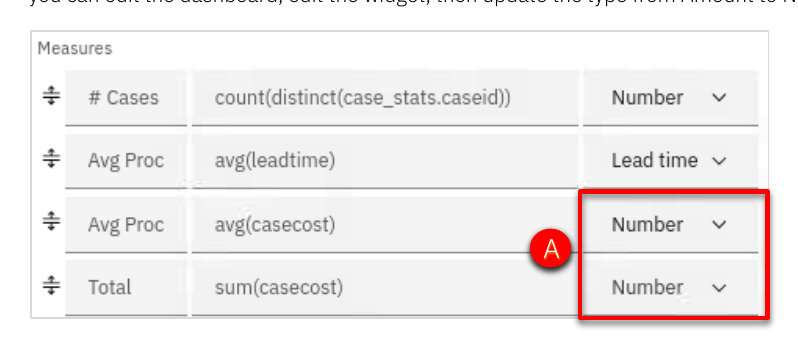

2. 왼쪽 탐색 바에서 `Analytics` (A)를 클릭합니다.

3. `Import dashboard` (A)를 클릭합니다.

   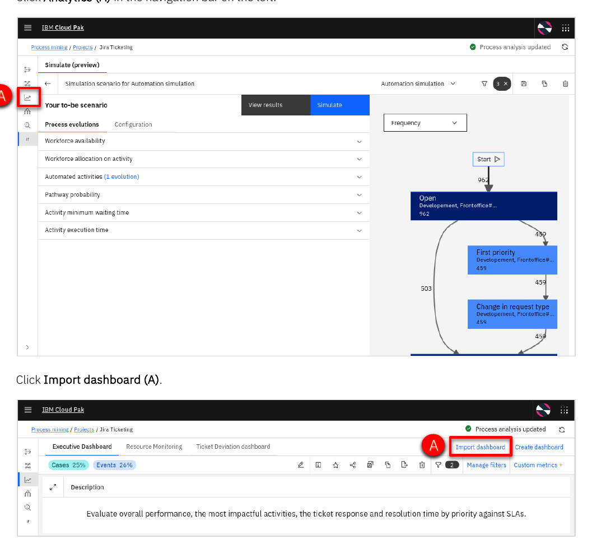

4. 이름에 **Automation simulation** (A)을 입력하고 `Browse` (B)를 클릭합니다. 그런 다음 **Automation simulation.dashboard** 파일을 선택하고 대화 상자에서 `Open`을 클릭합니다. 그런 다음 `Import dashboard` 대화 상자에서 `OK` (C)를 클릭합니다.

   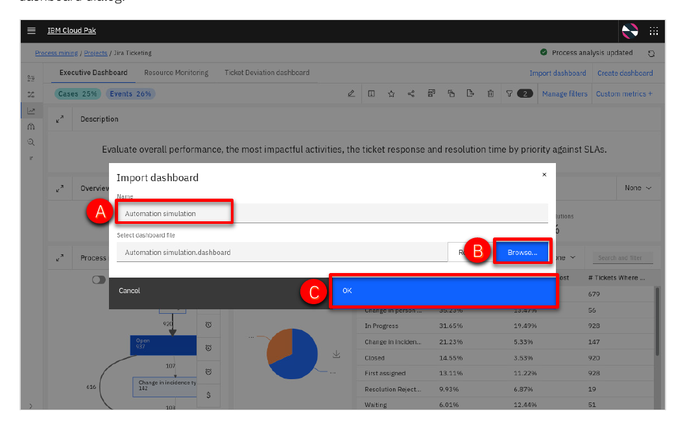

5. 이 대시보드는 `Annotation Card`가 추가되고 필터가 없는 동일한 대시보드입니다. 이 대시보드는 모든 케이스를 고려하지만, 기준선 프로세스를 기준으로 측정하지 않는다는 점을 명심하십시오.
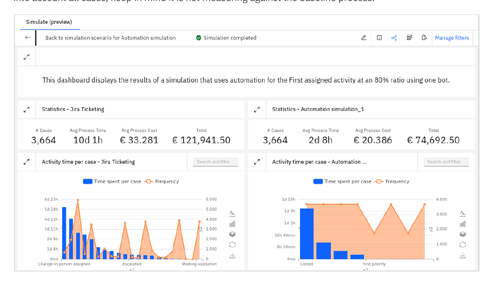
6. 이동 경로의 `Process Mining` (A)을 클릭하여 Process Mining 시작 페이지로 돌아갑니다.

   

이 실습을 완료했습니다.

### 요약

#### 이 실습이 만든 변화

실습 3이 **"현실을 대시보드로 운영화"**했다면, 실습 4는 그 운영 기반 위에 **"아직 실행하지 않은 개선안의 효과를 미리 계산"**하는 예측 능력을 얹었습니다.

| 구분 | 실습 4 이전 | 실습 4 이후 |
|------|------------|------------|
| **개선안의 성격** | "자동화하면 좋을 것 같다" (의견) | **"자동화율 80% · 봇 1개 · 처리 1분"** 구체적 설계도 (실행 가능) |
| **효과 추정** | 경험·직관 | **실제 로그 도착 분포 + 활동 통계 기반 시뮬레이션** (현실 연장선) |
| **경영 언어** | "리드타임이 줄겠지" | **연간 ≈ $18,000 절감 · 투자 $15,000 첫해 회수** (ROI) |
| **해결 전략** | 증상 완화(자동화율 올리기) | **근본 원인 제거**(First Assigned 자동 할당으로 담당자 변경 자체를 없앰) |
| **리스크** | 구현 후 실패 시 매몰 비용 | **구현 전 가상 검증**으로 실패 비용 사전 차단 |

> 한 줄로: **"바꾸면 좋겠다"에서 "$15,000 투자가 첫해에 회수된다"로 바뀌었습니다.**

---

#### 도출한 3가지 의사결정 자산

##### 1. 근본 원인 제거형 개선 시나리오

Change in Request Type 자동화(방안 A)와 First Assigned 자동 할당(방안 B) 중 **방안 B를 선택**한 것은 단순 절약이 아닌 **구조 설계의 선택**이었습니다.

**선택 근거**

- 방안 A는 **증상**(변경 활동 자체)을 완화할 뿐, 담당자 재배정이 필요한 원인(잘못된 첫 배정)은 그대로
- 방안 B는 **"첫 배정이 올바르면 담당자 변경이 애초에 필요 없다"** — 근본 원인 제거
- Change in person assigned(리드타임 35% · 자동화 0%)가 한 번에 사라지므로 **효과가 더 큼**

**→ 얻은 것** : 시뮬레이션에 앞서 **"무엇을 바꿀지"를 결정하는 분석가 판단 영역**의 실전 예. 시뮬레이션은 이 판단이 옳았는지를 **숫자로 검증**하는 도구일 뿐, 판단 자체는 사람이 해야 합니다.

---

##### 2. As-Is 기준선 — 공정 비교의 토대

`Change in person assigned` 제외 필터 + 상위 2 Variant + 자동 적용되는 `Exclude running cases` 필터로 구성된 기준선.

**핵심 설계 원리**

- **To-Be와 유사한 조건으로 맞춤** — 방안 B에서 제거될 활동은 기준선에서도 제외해야 공정 비교
- **상위 2 Variant만 사용** — 희귀 경로의 노이즈가 시뮬레이션 예측을 흐리지 않도록
- **Exclude running cases 자동 추가** — 완료된 962개 케이스만 대상으로 리드타임 측정 일관성 확보

**→ 얻은 것** : **"Before 사진"**이 없으면 ROI 계산이 성립하지 않습니다. 이 기준선이 곧 **개선 효과 = To-Be - As-Is** 공식의 **As-Is 값**으로 기능합니다.

---

##### 3. Historical 기반 시뮬레이션 + ROI

수동 입력(80% · 1봇 · 1분 · 962 instances · historical)을 제외한 **모든 입력이 실제 로그에서 자동 추출**된 시뮬레이션.

**자동 입력되는 4가지**

| 입력 | 출처 | 역할 |
|------|------|------|
| 도착 분포 | 실제 로그 | 시간대·요일별 티켓 유입 패턴 재현 |
| 직원 가용성 | 실제 로그 | 담당자 업무 시간 반영 |
| 활동 통계 | 실제 로그 | 활동별 평균 시간·분산 |
| 대기 시간 | 실제 로그 | 활동 간 대기 시간 반영 |

**ROI 계산**

```
6개월 3,200건 → 연간 ≈ 6,400건
건당 평균 $3 절감 → 연간 ≈ $18,000 절감
자동화 구현 비용 $15,000 → 첫해 내 투자 회수
2년차부터 $18,000/년 전액 순이익
```

**→ 얻은 것** : "자동화하면 좋을 것 같습니다"가 **"첫해 회수 · 2년차 순이익 전환"**이라는 경영 언어로 번역. 프로세스 마이닝이 **분석 도구에서 투자 의사결정 도구로 진화**한 증거.

---

#### 왜 이 세 자산이 모두 필요한가

셋은 **"방향 → 기준 → 숫자"**의 연쇄입니다. 하나라도 빠지면 사이클이 끊어집니다.

- **개선 시나리오 없음** → 시뮬레이션이 돌아갈 대상 자체가 없음 → **"뭘 개선할지 모름"**
- **As-Is 기준선 없음** → To-Be 결과값을 비교할 대상이 없음 → **개선 효과를 숫자로 말할 수 없음**
- **Historical 시뮬레이션 + ROI 없음** → 예측은 나와도 경영 언어(금액·회수 기간)로 번역 불가 → **투자 승인 불가**

세 자산이 모두 있어야 **"구조적 개선안 → 공정 기준선 → 검증된 ROI"**의 완전 사이클이 작동합니다. 이 사이클이 프로세스 마이닝을 **"사후 분석 리포트"**가 아닌 **"사전 의사결정 시스템"**으로 만드는 지점입니다.

---

#### 다음 실습에서의 활용

| 다음 실습 | 이 실습의 자산 사용 | 얻게 되는 것 |
|----------|------------------|------------|
| **실습 5** 운영 우수성 모니터링 | To-Be 시나리오 예측값 + As-Is 기준선 | 자동화 배포가 완료되기 **전에도** 즉시 실행 가능한 **단기 개선** 확보 |
| **실무 확장** | 시뮬레이션 프레임 + 기준선 설정 패턴 | 새 개선안마다 **동일 프레임으로 반복 시뮬레이션** → What-if가 **조직의 상시 능력** |

---

"발견(실습 2)" → "운영화(실습 3)" → "예측(실습 4)"이 끝났습니다. 이제 실습 5에서 장기 자동화 프로젝트를 기다리지 않고 **지금 당장 실현 가능한 단기 개선**으로 이어갈 차례입니다.