[← 소개로 돌아가기](10_Introduction.md)

---

## 실습 5. 운영 우수성 모니터링

실습 4가 <strong>"수개월 뒤 구현될 개선안의 효과"</strong>를 시뮬레이션으로 예측했다면, 실습 5는 <strong>"그 자동화가 실제로 배포되기 전까지, 지금 당장 SLA 위반을 잡아내는"</strong> 단기 운영 구조를 만듭니다. 자동화 프로젝트가 끝날 때까지 기다리지 않고, 데이터 수집 파이프라인만 갖추면 **첫날부터 가동되는 즉시 실행형 모니터링 체계**입니다.

- **1단계 레거시 대시보드 재활성화 (Recover)** — "과거 산출물을 2.x 환경에 맞춘다" — 오브젝트 모델이 바뀐 버전에서 레거시 위젯의 데이터 소스·필드 한정·식별자 오탈자를 **위젯 단위로 수동 교정**
- **2단계 실행 중 케이스 모니터링 (Observe)** — "지금 진행 중인 티켓 중 위험 대상을 골라낸다" — `Keep only running cases` 필터로 **IS_RUNNING = 1** 상태만 남기고 SLA 기한 초과·임박 티켓을 우선순위·기한 순으로 정렬
- **3단계 모니터 & 서비스 연결 (Act)** — "화면 위 신호를 현장 행동으로 전환" — Analytics 테이블 위젯의 **항목 존재 여부를 트리거**로 삼아 Slack · 이메일 · IBM AppConnect로 자동 알림 발송

이 실습을 완료하면 <strong>"대시보드를 열어봐야만 발견되는 SLA 위반"</strong>이 <strong>"위반 발생 즉시 Slack으로 도착하는 알림"</strong>으로 바뀌어, 담당자는 수십 개 대시보드를 상시 주시하지 않고도 **위험 티켓만 골라 즉각 대응**할 수 있게 됩니다.

#### 왜 "근본 해결"과 "즉시 대응"이 둘 다 필요한가

실습 4는 <strong>"왜 담당자 변경이 자꾸 일어나지"</strong>라는 근본 원인을 제거하는 **장기 구조 개선**입니다. 하지만 구조 개선은 수개월의 개발·배포·변화 관리를 요구합니다. 그 기간 동안에도 SLA 위반은 **매일 새로 발생**합니다. 실습 5의 운영 우수성은 <strong>"구조가 고쳐질 때까지 문제가 터질 때마다 사람을 호출"</strong>하는 **반응형 접근** — 근본 해결의 보완재입니다. 자동화가 완성되면 이 모니터링은 감시 대상을 **다른 위험 신호**로 옮겨 계속 유효합니다. 두 접근은 경쟁이 아니라 **시간축이 다른 동시 전개**입니다.

### 목차

- [레거시 대시보드 가져오기](#레거시-대시보드-가져오기)
  - [대시보드 오류 해결](#대시보드-오류-해결)
- [진행 중인 티켓 및 SLA 위험 또는 위반 모니터링](#진행-중인-티켓-및-sla-위험-또는-위반-모니터링)
- [선택 사항](#선택-사항)
- [챌린지](#챌린지)
- [모니터 및 서비스](#모니터-및-서비스)
- [요약](#요약)

---

### 레거시 대시보드 가져오기

> 이 섹션에서 하는 일 :    
>  사전 제작된 `Resolution SLA.dashboard` 파일을 `Analytics > Import dashboard`로 업로드합니다. 가져온 직후에는 위젯 일부가 오류 상태로 보이며 이어지는 "대시보드 오류 해결" 섹션에서 수정합니다.

> 왜 필요한가 :   
>  현장에서 이미 검증된 **SLA 위반 감시용 대시보드**를 매번 처음부터 만드는 대신 **import로 재사용**합니다. 단, IBM Process Mining 2.x의 **객체 중심 데이터 모델**과 과거 단일 테이블 기반 레거시 대시보드 사이에 호환성 간극이 있어, **"가져오기만 하면 끝"이 아니라 "가져와서 교정"**이 운영 대시보드 재사용의 실전 패턴입니다. 이 간극을 이해해야 조직에 쌓여 있는 수십 개의 레거시 대시보드 산출물을 **버전 업그레이드 이후에도 살려낼** 수 있습니다.

이 섹션에서는 업데이트할 때까지 올바른 통계를 표시하지 않는 레거시 운영 우수성 대시보드를 가져옵니다. 대시보드를 가져오고 업데이트한 다음 실행 중인 티켓을 모니터링하는 데 사용합니다.

세부 사항이 없는 단계의 경우 필요시 이전 실습을 참조할 수 있습니다.

1. Process Mining 시작 페이지에서 타일 (A)을 클릭하여 `Jira Ticketing` 프로젝트를 엽니다.
   IBM Process Mining이 `Frequency` 모델 뷰를 엽니다.

   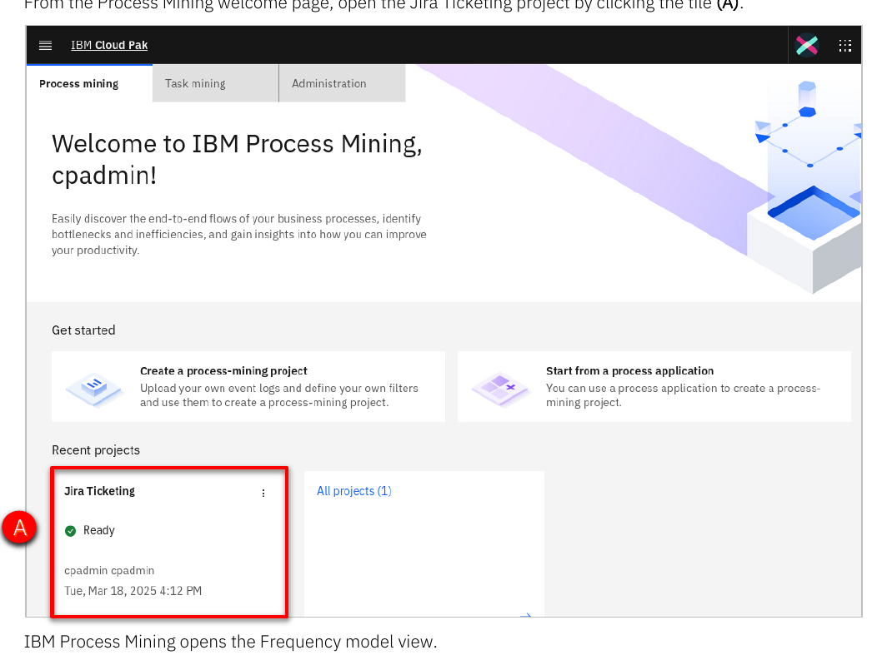

2. 왼쪽 탐색 바에서 `Analytics` (A)를 클릭합니다. 그런 다음 `Import dashboard` (B)를 클릭합니다.   
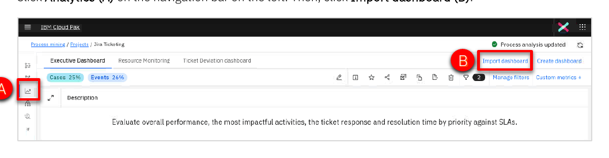

3. 이름에 **Resolution SLA** (A)를 입력하고 `Browse` (B)를 클릭합니다. 그런 다음 **Resolution SLA.dashboard** 파일을 선택하고 대화 상자에서 `Open`을 클릭합니다. 그런 다음 `Import dashboard` 대화 상자에서 `OK` (C)를 클릭합니다.   
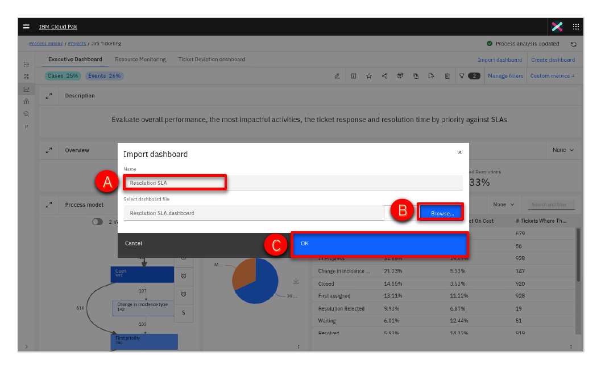

#### 대시보드 오류 해결

> 이 섹션에서 하는 일 :    
>  오류 위젯을 열어 **4가지 교정**을 적용합니다 — ① 식별자 오탈자 수정(`asignee` → `assignee`), ② 데이터 소스로 `eventlog`와 `case_stats` 둘 다 재선택, ③ 양쪽 테이블에 공통 존재하는 필드는 **테이블명 한정**(`starttime` → `eventlog.starttime`), ④ `Keep last for each case` 체크. 오류가 보이지 않는 위젯에도 같은 작업을 적용합니다.

> 왜 필요한가 :   
>  IBM Process Mining 2.x는 **이벤트 로그 + 객체 테이블**이 공존하는 멀티 테이블 모델입니다. `starttime`·`caseid` 같은 컬럼명이 두 테이블에 동시에 존재할 수 있어, 파서는 **"어느 테이블의 것인지"를 명시적으로 한정**받지 않으면 해석을 포기합니다. 레거시 대시보드는 단일 테이블 가정 하에 만들어졌기에 이 한정이 빠져 있어 오류가 발생. **겉으로 오류가 없어 보이는 위젯도 같은 내부 구조**이므로 필터·조인을 나중에 추가할 때 예외가 터집니다 — 운영 대시보드는 <strong>"지금 작동하는 것"</strong>이 아니라 <strong>"내일도 작동할 것"</strong>으로 만들어야 합니다.

현재 대시보드에는 필터가 없습니다. 운영 대시보드이므로 실행 중인 케이스만 표시하도록 필터를 적용해야 합니다. 또한 이 대시보드에는 오류가 있습니다. 레거시 대시보드가 IBM Process Mining 2.x의 새로운 오브젝트 모델과 호환되지 않기 때문입니다. 이 섹션에서는 레거시 대시보드의 오류를 수정하여 Jira 티켓팅 프로젝트에서 사용할 수 있도록 만들겠습니다.

대시보드를 수정하기 위해 위젯에서 수행하는 일부 작업은 대시보드를 새 프로젝트와 계속 사용하기 위해 대시보드의 다른 위젯에도 수행해야 합니다. 대시보드에 표시된 것처럼 이 실습의 목적상 모니터링 날짜는 2022년 10월 31일입니다.

1. 위젯의 오류 (A)를 확인합니다.
2. 도구 모음 상단의 `Edit` (B)를 클릭합니다.

   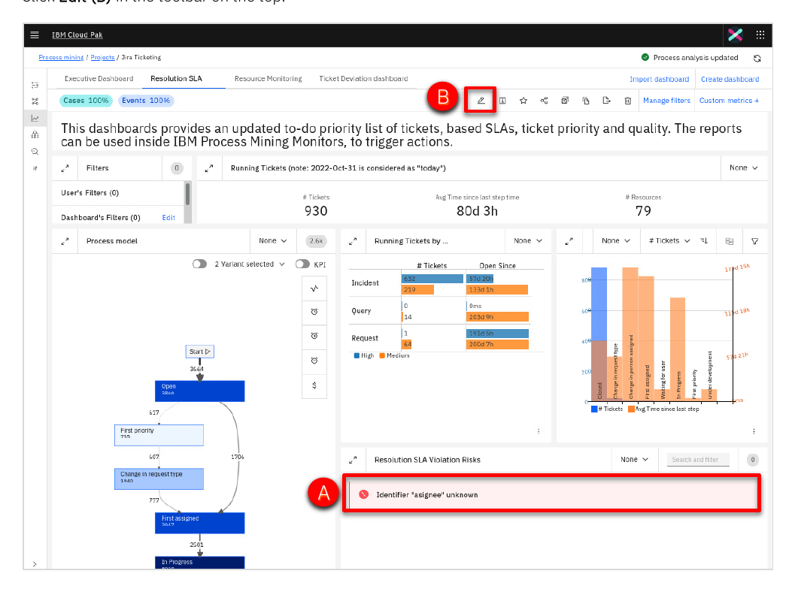

3. 위젯 제목 표시줄의 `Edit` (A)를 클릭합니다.

   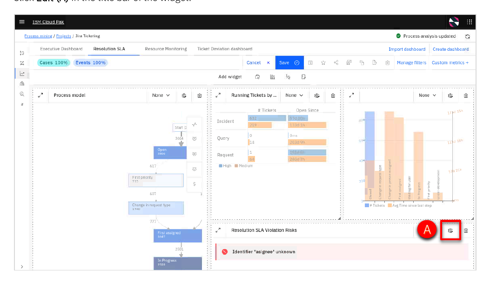

4. 위젯의 문제를 확인합니다.
   - 식별자 "asignee"가 알 수 없음 (A)
   - 데이터 소스로 선택된 엔티티 없음 (B)
   언급한 바와 같이, IBM Process Mining의 새 버전이 오브젝트 모델 아키텍처를 기반으로 하기 때문에 대시보드의 각 위젯 내의 소스를 수정해야 합니다. 다른 위젯에 오류가 표시되지 않더라도 대시보드 안정성을 유지하기 위해 각 위젯에 대해 이 작업을 수행해야 합니다.   
      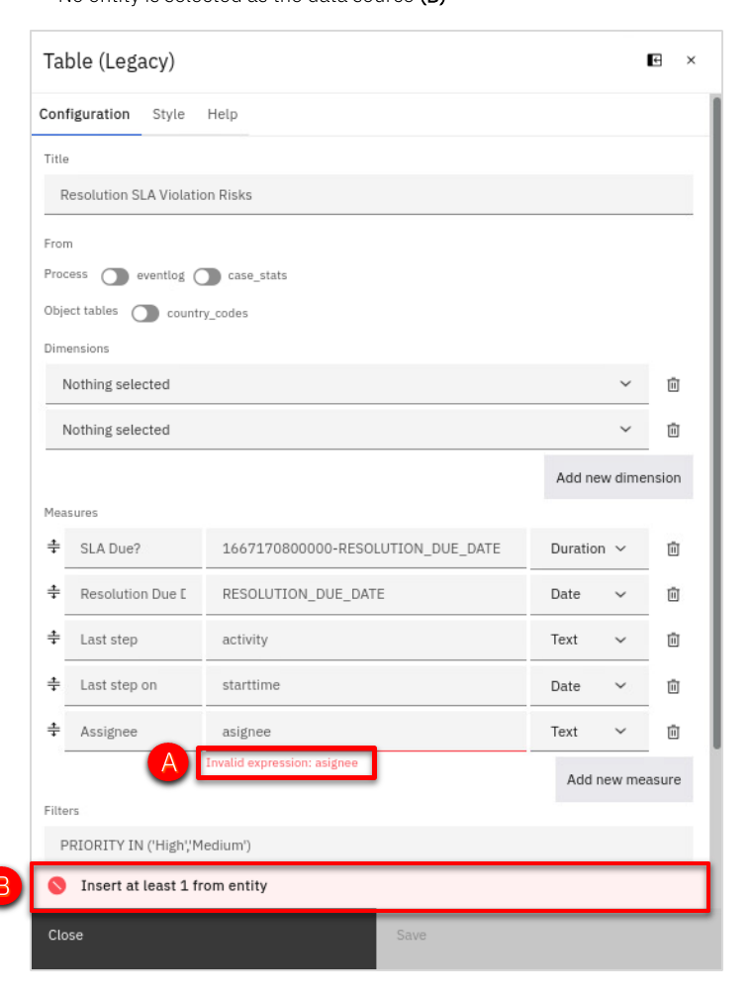

5. assignee (A)의 철자를 수정한 다음 데이터 소스로 **eventlog**와 **case_stats** (B)를 선택합니다. `Dimensions` (C)가 자동으로 채워집니다. 두 데이터 소스를 모두 추가했으므로 `starttime`을 한정해야 합니다. `starttime`을 `eventlog.starttime` (D)으로 변경합니다. `Keep last for each case` (E)를 선택한 다음 `Save` (F)와 `Close` (G)를 클릭합니다.
   다른 위젯에 데이터가 표시되고 있지만 대시보드를 계속 사용하려면 올바른 엔티티를 선택하고 각 위젯을 업데이트해야 합니다. 이 레거시 대시보드는 IBM Process Mining 2.x의 새로운 기능을 완전히 활용하는 데 제한이 있습니다.

   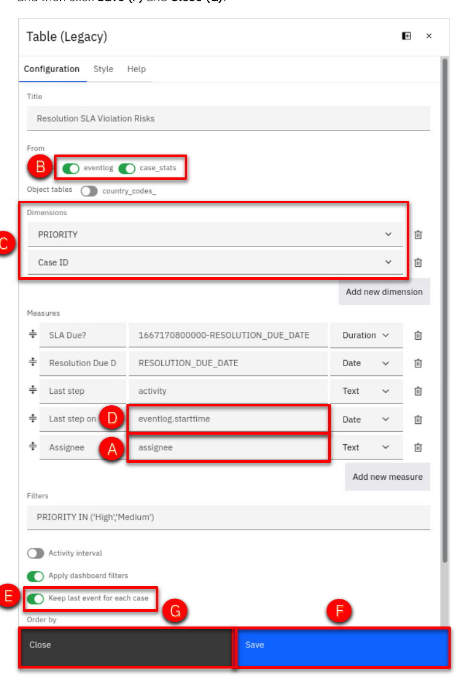

6. 대시보드로 돌아가서 `Save` (A)를 클릭합니다.

### 진행 중인 티켓 및 SLA 위험 또는 위반 모니터링

> 이 섹션에서 하는 일 :    
>  `Keep only running cases` 필터(IS_RUNNING = 1 계열)를 적용해 **진행 중 47개 티켓**만 남긴 뒤, High 7건·Medium 일부의 **평균 개방 기간**(High 평균 18일, Medium 일부 200일+)을 확인하고 `Resolution SLA Violation Risks` 테이블을 **`SLA Due?` + `PRIORITY`** 순으로 정렬해 **즉시 대응 큐**를 만듭니다.

> 왜 필요한가 :   
>  실습 2·3은 **IS_RUNNING = 0** 기반의 **과거 평균 분석**이었습니다 — "우리 프로세스는 평균 이런 모습"을 파악하는 전략 도구. 이 섹션은 정반대로 **IS_RUNNING = 1** 기반의 **현재 위험 감시** — "지금 이 순간 몇 번 티켓이 몇 시간 늦었나"를 분 단위로 보는 운영 도구입니다. 같은 데이터, 다른 필터, 다른 결론 — 대시보드의 **시간축을 바꾸는 것만으로 전략 분석이 운영 감시로 전환**됩니다. "오늘 = 2022년 10월 31일" 가정은 실습용 정적 데이터 기준이며, 실시간 파이프라인에서는 `now()`로 자동 대체됩니다.

대시보드의 오류를 수정했으므로 이제 실행 중인 케이스만 표시하는 필터를 적용할 수 있습니다.

1. `Resolution SLA` 대시보드에서 `Manage filters` (A)를 클릭합니다.
   IBM Process Mining은 대시보드에 적용된 활성 필터 목록과 필터 템플릿 목록을 나열합니다.
   필터 템플릿은 특정 프로세스 동작을 식별하는 데 사용되는 필터 세트임을 기억하십시오.

   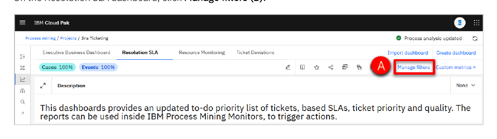

2. `Add filter` (A)를 클릭합니다.

   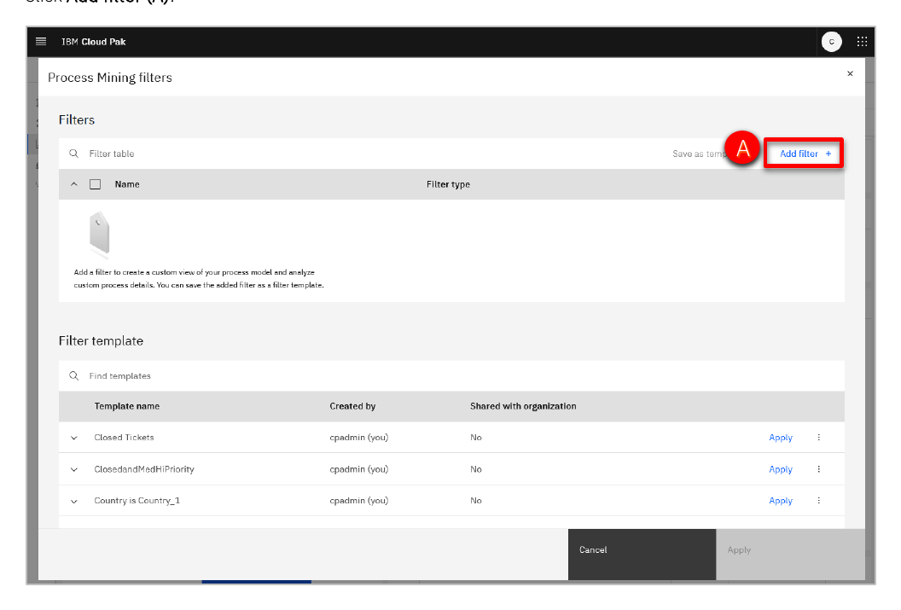

3. 필터로 왼쪽에서 `Process Flow` (A)를 선택합니다. 그런 다음 필터 세부 정보로 `Completed cases` (B)를 선택하고 `Keep only running cases` (C)를 선택합니다. 그런 다음 `Add` (D)를 클릭합니다.

   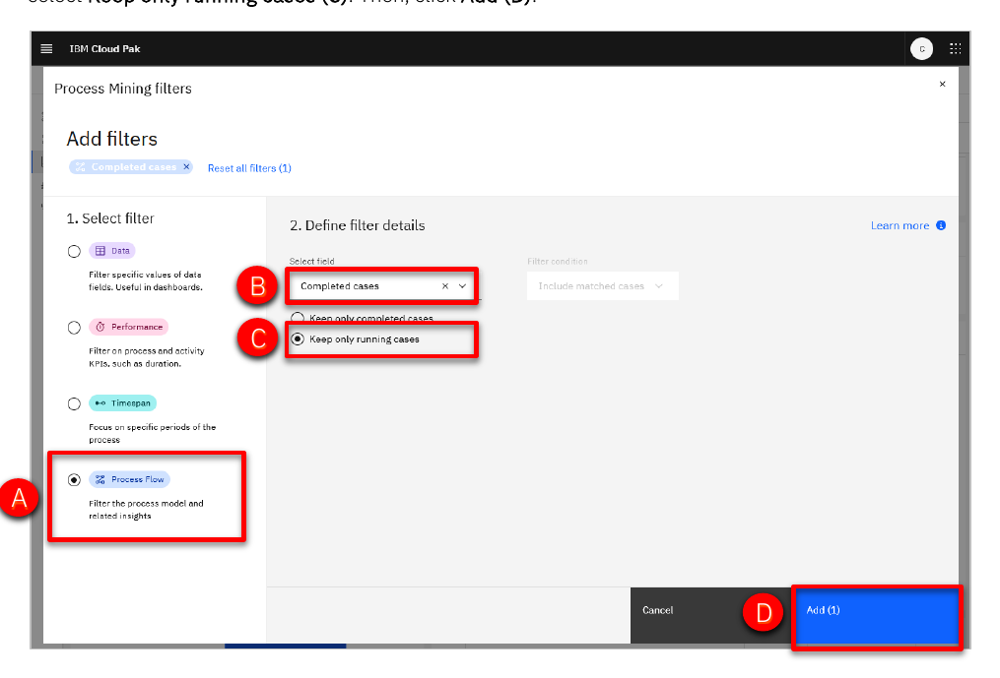

4. `Apply` (A)를 클릭합니다.

   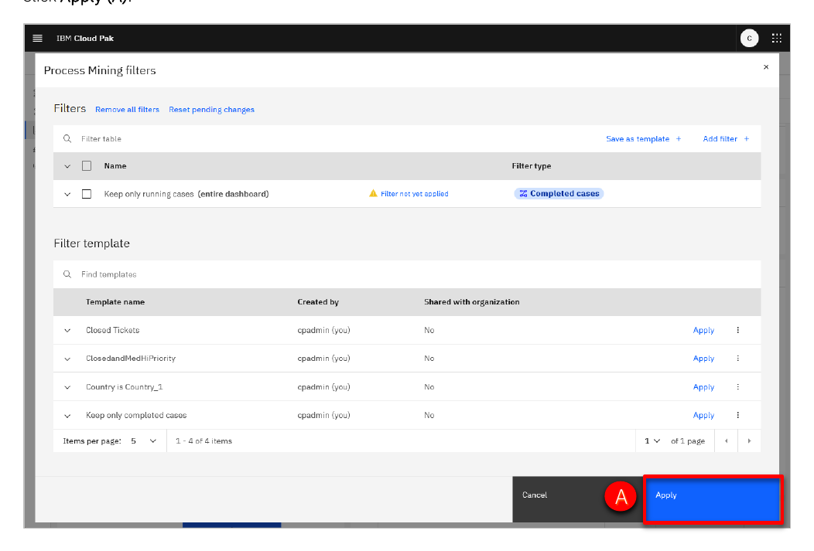

5. 확인 메시지가 나타나면 `Go to the analysis` (A)를 클릭합니다.
   이제 이벤트 로그에서 실행 중인 케이스만 보고 있습니다.

   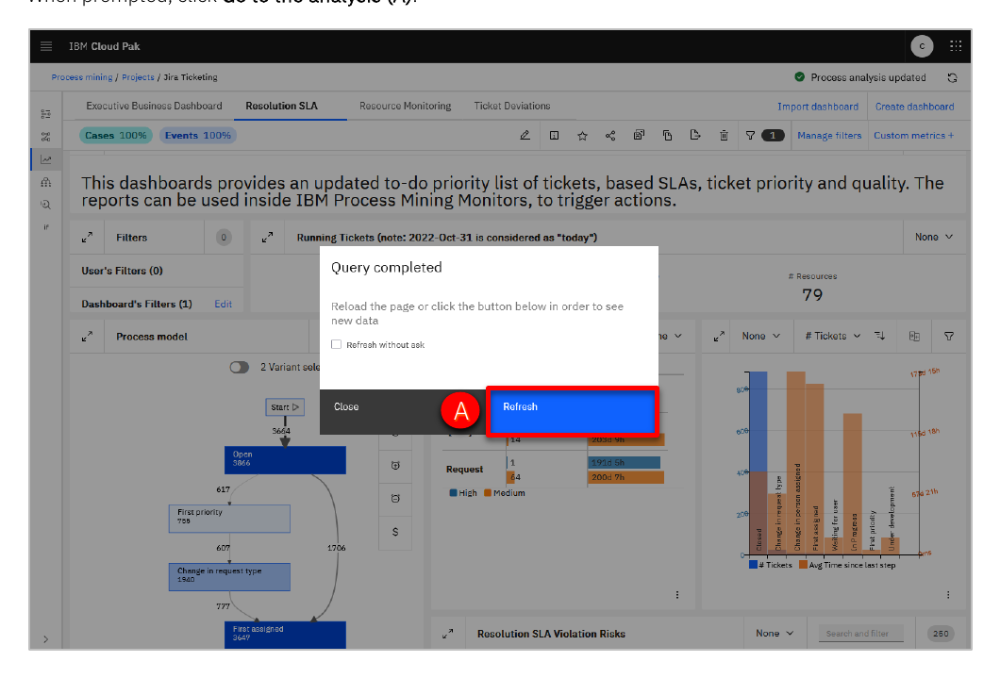

6. 높은 우선순위 티켓의 SLA 위험 또는 위반을 평가합니다. 이 대시보드는 높은 우선순위와 중간 우선순위 티켓, 그리고 해결되지 않은 티켓만 표시합니다. 측정값을 SLA와 비교하여 티켓이 이미 늦었는지, 아니면 늦게 해결될 위험이 있는지 확인합니다. 이 데이터 세트의 목적상 오늘 날짜는 2022년 10월 31일임을 명심하십시오.

   대시보드를 보면 47개 (A)의 실행 중인 티켓이 있고 그 중 7개 (B)가 높은 우선순위임을 알 수 있습니다. 티켓이 얼마나 오래 열려 있었는지도 볼 수 있습니다. 높은 우선순위 티켓의 평균 개방 기간은 18일 (B)입니다. 중간 우선순위 요청을 보면 200일 (B) 이상 개방되어 있습니다. 이는 오랫동안 방치된 티켓일 가능성이 높습니다.

   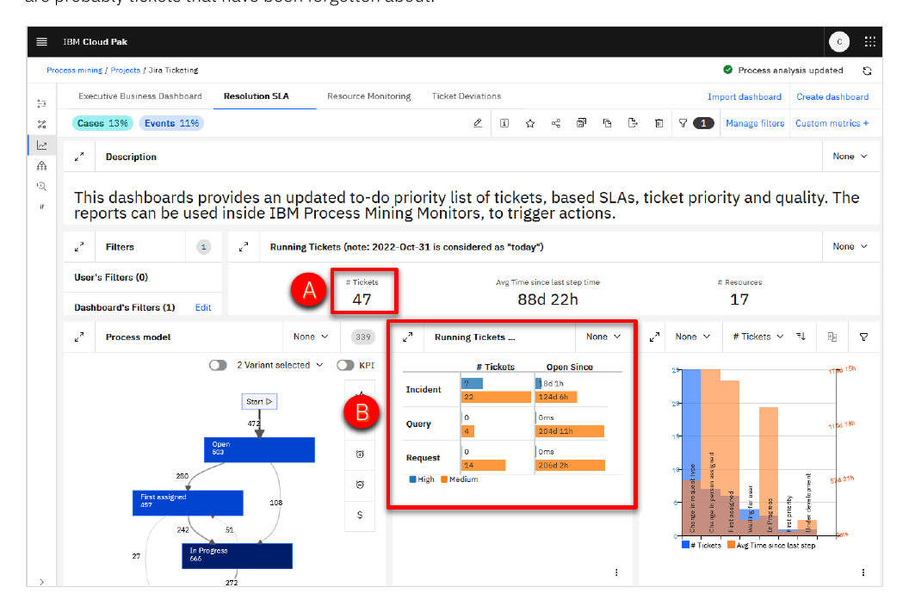

7. 스크롤 (A)을 내려 `Resolution SLA Violation Risks` 테이블을 봅니다. `SLA Due?` (B)를 클릭한 다음 `PRIORITY` (C)를 클릭하여 테이블을 정렬합니다.

   이 테이블은 티켓과 SLA 기한 여부를 나열합니다. 예를 들어, 대부분의 티켓에 SLA 기한이 지난 것을 볼 수 있습니다. 높은 우선순위 항목의 SLA는 2일이므로 높은 우선순위 티켓을 보면 모두 SLA 기한이 지났음을 알 수 있습니다.
   추가 조사에는 특정 티켓을 필터링하고 관련 프로세스 모델을 확인하여 무슨 일이 있었는지 확인하는 것이 포함될 수 있습니다. 클라이언트는 이 테이블을 활용하여 티켓의 해결 우선순위를 효과적으로 결정할 수 있습니다.

   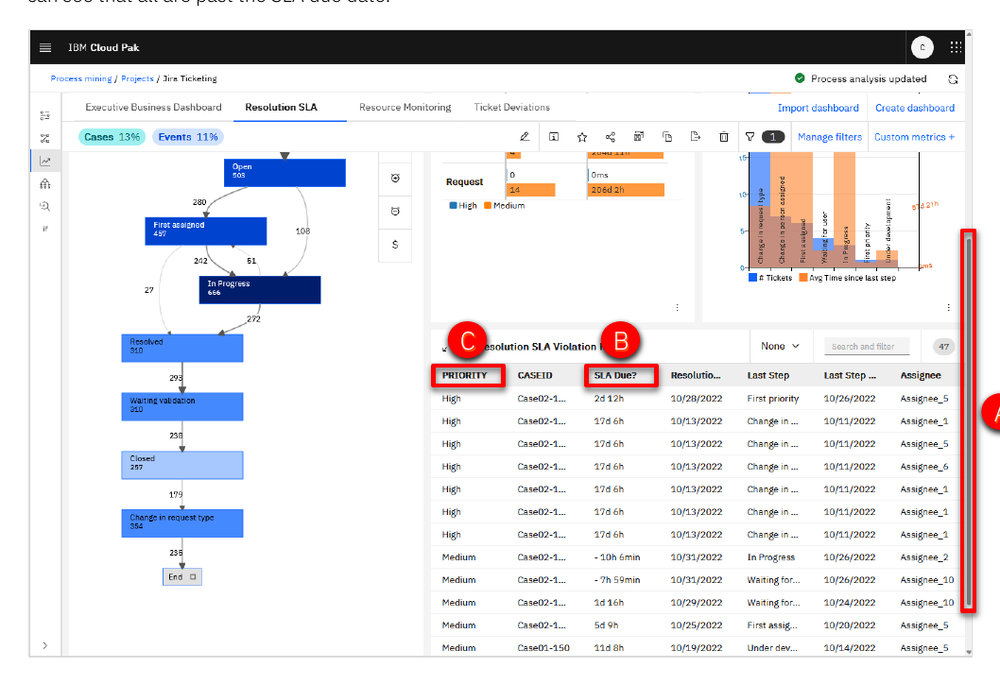

### 선택 사항

> 이 섹션에서 하는 일 :    
>  `Resolution SLA Violation Risks` 테이블에서 **특정 티켓 행을 클릭 → Apply filter**로 해당 티켓 하나만 모든 위젯에 반영해 드릴다운합니다.

> 왜 필요한가 :   
>  위반 알림을 받은 담당자가 해야 할 다음 질문은 <strong>"이 티켓은 어느 단계에서 막혔나"</strong>입니다. 별도의 화면 전환 없이 **테이블 → 위젯 전체**로 컨텍스트가 단일 티켓에 맞춰져야 **알림 → 원인 파악 → 액션**이 1분 내로 끝납니다. 이 흐름이 깨지면 알림 자체의 가치가 반감됩니다.

1. 특정 티켓에 대한 대시보드를 필터링하려면 `Resolution SLA Violation Risks` 테이블의 행 중 하나를 왼쪽 클릭하고 `Apply filter` (A)를 선택합니다.

   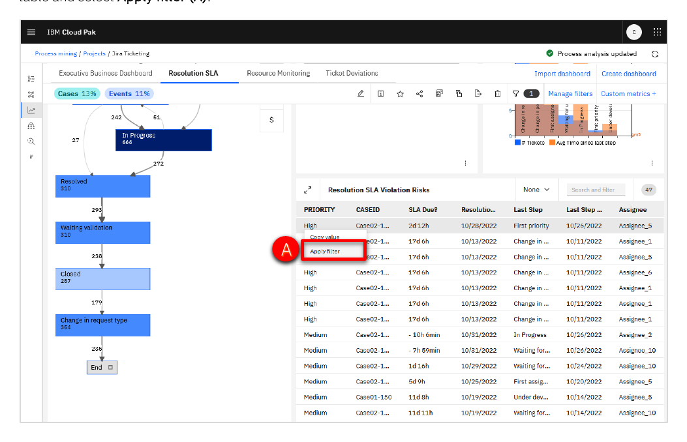

2. 확인 메시지가 나타나면 `Refresh` (A)를 클릭합니다.

   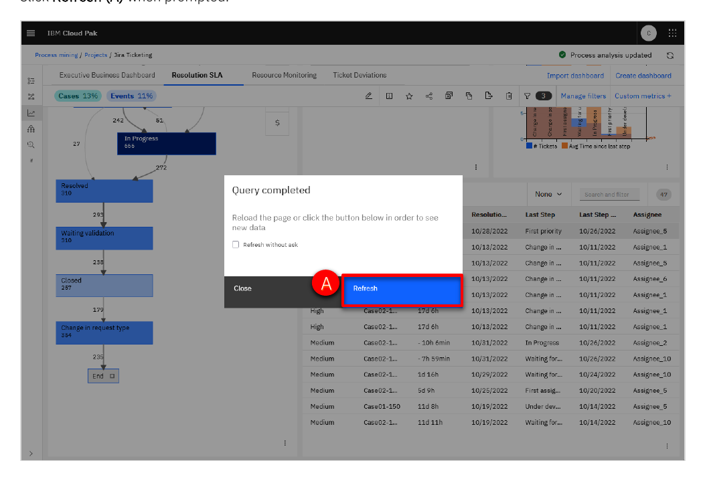

3. 대시보드가 새로 고침된 후 다른 위젯에 오류가 표시됩니다.

   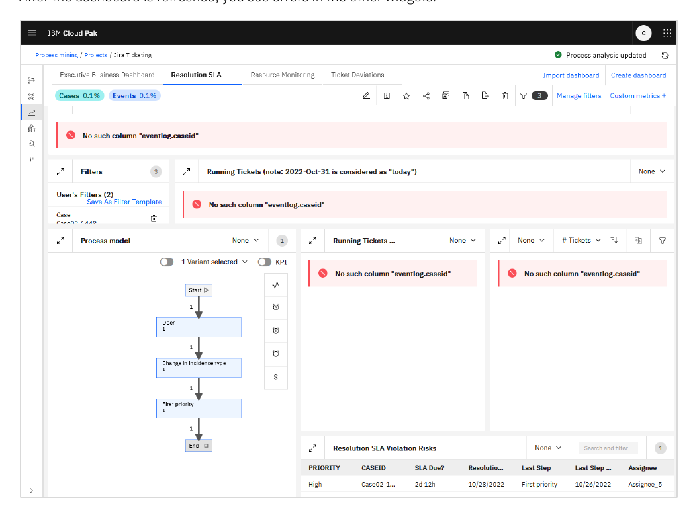

### 챌린지

> 이 섹션에서 하는 일 :    
>  Apply filter로 드러난 **잔존 오류**들을 실습자 스스로 찾아 고치고, `Last activity distribution` 위젯은 **Dimensions 미지정** 상태이므로 처음부터 다시 구성합니다.

> 왜 필요한가 :   
>  레거시 대시보드 마이그레이션은 **한 번에 끝나지 않는 이터레이션** 작업입니다. 기본 사용 시나리오에서 멀쩡해 보이던 위젯도 **필터·드릴다운 경로에 진입하면** 숨어 있던 제약이 드러납니다. 이 챌린지는 실무에서 마이그레이션을 <strong>"완료"</strong>했다고 보고한 뒤 한 달 후 "일부 시나리오에서 깨진다"는 보고가 들어오는 전형적 패턴을 **체험으로 예방**합니다.

나열된 오류를 수정하여 대시보드를 일시적으로 사용할 수 있도록 수정할 수 있습니다. 그러나 `Last activity distribution` (A) 위젯은 원래 위젯에서 `Dimensions`가 선택되지 않아 재구축이 필요합니다.
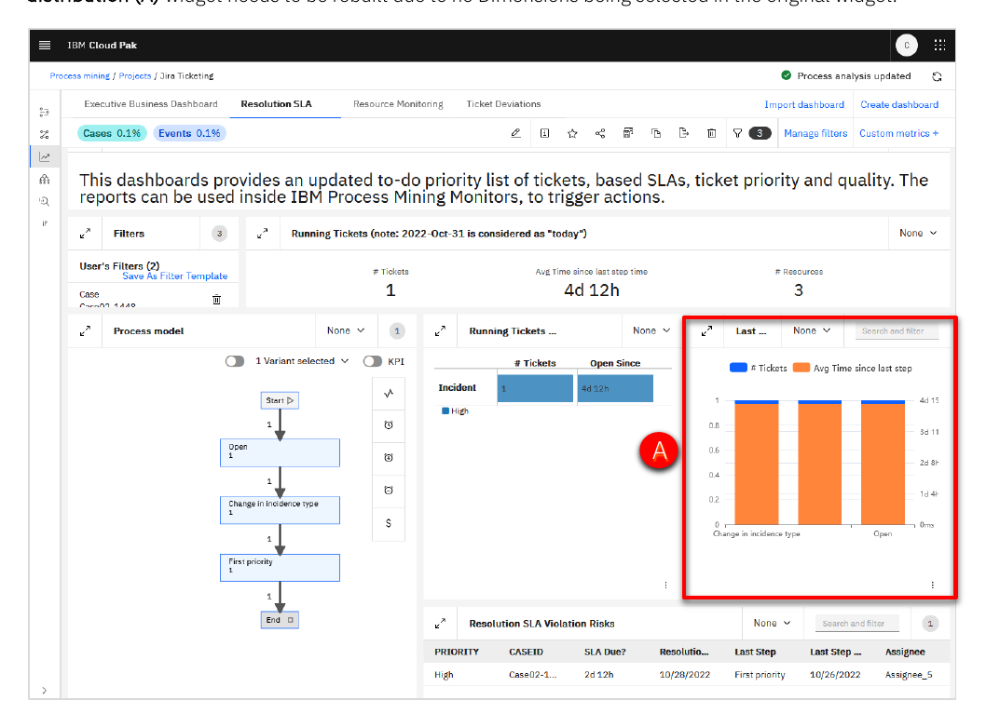

### 모니터 및 서비스

> 이 섹션에서 하는 일 :    
>  **모니터의 트리거 소스 4가지**(프로세스 KPI 위반 · 활동 KPI 위반 · 특정 활동/전환 발생 · **Analytics 테이블 위젯의 항목 존재**)와 **서비스 3가지**(이메일 · Slack · IBM AppConnect)의 연결 구조를 검토하고, `Resolution SLA Violation Risks` 테이블을 트리거 삼아 Slack 메시지를 자동 발송하는 패턴을 이해합니다.

> 왜 필요한가 :   
>  분석을 <strong>"사람이 시간 내서 봐야 작동하는 시스템"</strong>에서 <strong>"이벤트가 사람을 호출하는 시스템"</strong>으로 뒤집는 단계입니다. 대시보드를 매일 열어보는 관성은 2주면 잊혀지지만, **Slack 알림은 놓치기 어렵습니다**. 특히 **Analytics 테이블 위젯 기반 트리거**는 가장 유연해서 — 사용자 정의 지표로 계산한 어떤 조건이든 테이블에 행이 들어오는 순간 알림이 발송되므로 **표준 KPI로 표현하기 어려운 복합 규칙**도 모니터링 가능합니다. Slack 메시지의 링크를 클릭하면 필터가 적용된 대시보드로 바로 착지하도록 구성하면 <strong>"알림 → 원인 조회 → 조치"</strong>가 단일 흐름으로 완성됩니다.

> 전제 조건 :   
>  운영 우수성 모니터링이 의미를 가지려면 **지속적인 데이터 수집 파이프라인**이 먼저 구축되어 있어야 합니다. 이벤트 로그가 하루 단위 배치라면 "즉시 알림"의 즉시성이 하루로 떨어집니다. 알림 체계의 실시간성은 **데이터 파이프라인의 실시간성 상한**을 넘지 못합니다.

이 시점에서 클라이언트와 함께 인사이트에서 행동으로 이어지는 모니터를 구축할 수 있습니다. 먼저 서비스, 즉 실행하고자 하는 작업을 구축해야 합니다.

간단한 서비스에는 경고 및 메시지 전송, 예를 들어 이메일 또는 Slack 메시지 전송이 포함됩니다. 더 고급 메시지 요구 사항의 경우 IBM AppConnect와 같은 제품을 사용하여 복잡한 작업 및 논리 시퀀스를 실행할 수 있습니다.

IBM Process Mining을 사용하면 프로세스 또는 활동 KPI가 위반될 때, 일부 활동이나 전환(일반적으로 비준수)이 발생할 때, 또는 Analytics 테이블 위젯에 항목이 있을 때마다 모니터를 설정할 수 있습니다.

Analytics 테이블 위젯을 사용하여 모든 종류의 동작을 모니터링할 수 있으므로, 매우 특정한 동작과 사용자 정의 KPI를 평가하려는 경우 가장 좋은 옵션입니다.

Resolution SLA를 예로 들겠습니다:
- 높은 우선순위나 중간 우선순위의 미해결 티켓이 있을 때마다 대시보드 위젯에 나타납니다.
- 모니터는 대시보드 위젯에 적어도 하나의 티켓이 있는지 확인합니다. 그렇다면 서비스를 트리거합니다.

모니터 내에는 일정 및 과거 확인과 관련된 여러 구성이 있습니다. 예를 들어, 대시보드에 새 티켓이 나타날 때만 서비스를 트리거하거나 전체 티켓 목록을 고려하도록 서비스를 구성할 수 있습니다.

이 예에서 `Resolution SLA` (A) 모니터는 해결 SLA를 위반하거나 위험에 처한 티켓이 있는 보고서를 전송합니다. 모니터에 연결된 서비스는 위험에 처한 티켓이 발견될 때마다 Slack 메시지를 트리거합니다.

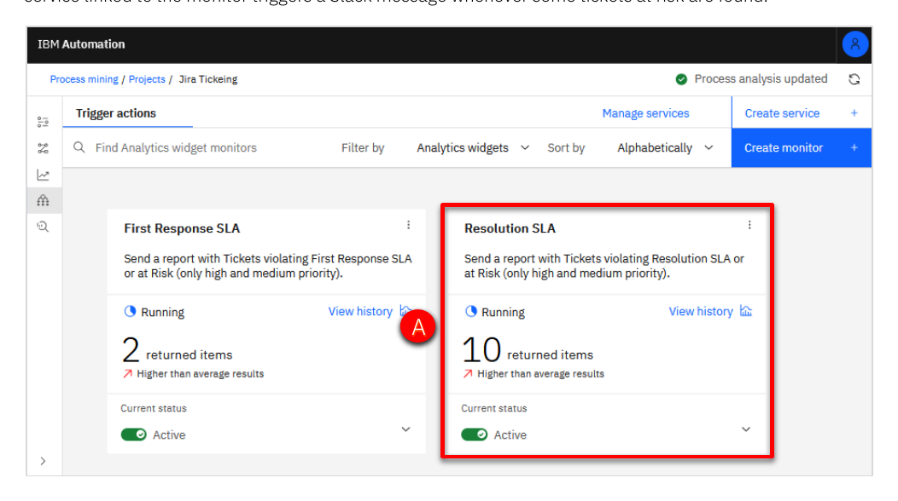

Slack과 같은 채팅 애플리케이션을 사용하여 경고를 수신하는 담당자를 상상해 보십시오. Slack 메시지에서 링크 (A)를 클릭하여 대시보드로 이동할 수 있습니다.
이를 통해 지원 담당자는 해결 우선순위를 신속히 파악하고 처리 속도를 높일 수 있습니다. 담당자는 주목해야 할 티켓을 안내해 주는 가상 비서의 지원을 받는 셈입니다. 이는 문제를 근본적으로 해결하는 자동화와 달리, 즉각적인 대응을 가능하게 하는 반응적 접근 방식입니다.

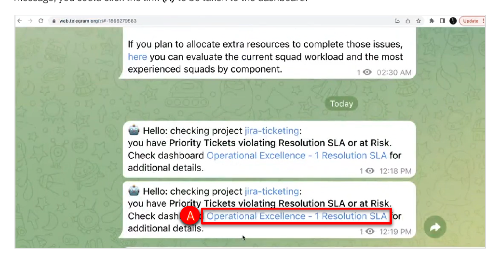

이러한 솔루션은 지속적인 데이터 수집 파이프라인만 구축하면 바로 도입할 수 있어, 단기 성과를 빠르게 실현할 수 있는 방안으로 권장됩니다.

### 요약

#### 이 실습이 만든 변화

실습 4가 <strong>"개선안의 미래 효과"</strong>를 숫자로 예측했다면, 실습 5는 그 개선안이 배포되기 전의 오늘·내일도 <strong>"위반이 발생하는 순간 담당자를 호출"</strong>하는 운영 안전망을 만들었습니다.

| 구분 | 실습 5 이전 | 실습 5 이후 |
|------|------------|------------|
| **감시 방식** | 사람이 시간 내서 대시보드를 열어봐야 인지 | **이벤트가 사람을 호출** — Slack 알림이 위반 즉시 도착 |
| **시간축** | IS_RUNNING = 0 기반 **과거 평균** | IS_RUNNING = 1 기반 **현재 위험 감시** |
| **대응 속도** | 주간 리포트에서 뒤늦게 발견 | 위반·위험 **발생 즉시** 알림 → 분 단위 대응 |
| **레거시 산출물** | 2.x 업그레이드 후 사용 불가 | `asignee→assignee`·테이블 한정·Keep last 교정으로 **재활성화** |
| **개선 전략과의 관계** | "자동화 완료까지 속수무책" | **근본 해결(실습 4) + 반응 대응(실습 5) 동시 전개** |

> 한 줄로: **"보고 → 인지 → 대응"이 "알림 → 클릭 → 대응"으로 바뀌었습니다.**

---

#### 도출한 3가지 운영 산출물(Asset)

이 실습은 "자동화 배포 전의 대기 시간"을 세 가지 산출물로 바꿔 첫날부터 가동되는 운영 안전망을 만들었습니다. 먼저 전체를 한눈에 훑은 뒤, 각 산출물의 상세를 이어갑니다.

##### 3개 산출물 요약

| 산출물 | 무엇을 했나 | 핵심 수치·설정 | 얻은 가치 |
|------|------------|-----------|-----------|
| **① 재활성화된 레거시 대시보드** | `Resolution SLA.dashboard`를 import 후 2.x 객체 모델에 맞춰 4가지 교정 | 오탈자 · 데이터 소스 · 필드 한정 · Keep last — 모든 위젯에 적용 | <strong>"레거시 대시보드 정형화된 교정 패턴"</strong> 확보 — 조직 누적 산출물을 살려내는 공식 |
| **② 실행 중 케이스 감시 뷰** | `Keep only running cases` 필터 한 줄로 대시보드 시간축을 IS_RUNNING=0 → 1로 전환 | 실행 중 47건 · High 7건 평균 18일(SLA 9배 초과) · Medium 일부 200일+ | <strong>"필터 한 줄로 전략 분석 → 운영 감시"</strong>로 성격 전환하는 구조 확보 |
| **③ 모니터 + 서비스** | Analytics 테이블을 트리거로 삼고 Slack·이메일·AppConnect 중 선택해 자동 발송 | 4가지 트리거 소스 × 3가지 서비스 매트릭스 구성 | <strong>"위반이 사람을 호출"</strong>하는 자동 체계로 전환 — 대시보드 수동 주시 탈피 |

세 산출물은 <strong>"복구 → 감시 → 호출"</strong>의 연쇄를 이룹니다 — 레거시를 복구해 살려 두고, 그 위에 실시간 감시 뷰를 올리고, 감시 결과가 사람을 직접 호출하게 만듭니다.

---

##### ① 재활성화된 레거시 대시보드 — 과거 산출물의 복구

**무엇을 했나**    
`Resolution SLA.dashboard`를 `Analytics > Import dashboard`로 가져온 뒤, 2.x 객체 모델에 맞춰 위젯마다 수동 교정을 적용했습니다.

**4가지 교정 패턴**

- 식별자 오탈자(asignee → assignee) — 레거시 대시보드에 남은 단순 타이핑 이슈
- 데이터 소스 재선택(eventlog + case_stats) — 단일 테이블 가정에서 멀티 테이블 모델로 전환
- 필드 한정(starttime → eventlog.starttime) — 양쪽 테이블에 공통 존재하는 컬럼은 명시적 테이블명 필요
- Keep last for each case — 케이스당 마지막 이벤트 기준 집계 보장

**얻은 것**    
조직이 누적한 <strong>"수십 개의 레거시 대시보드 산출물을 버전 업그레이드 후에도 살려내는 정형화된 교정 패턴"</strong>을 확보했고, 오류가 안 보이는 위젯도 같은 방식으로 교정해야 이후 필터·조인 충돌이 없다는 실전 원칙도 함께 체득했습니다.

---

##### ② 실행 중 케이스 감시 뷰 — 시간축을 뒤집는 대시보드

**무엇을 했나**    
`Keep only running cases` 필터 하나를 적용해 동일 대시보드를 과거 분석 도구에서 현재 감시 도구로 전환하고, `Resolution SLA Violation Risks` 테이블을 `SLA Due?` + `PRIORITY` 순으로 정렬해 즉시 대응 큐를 만들었습니다.

**측정 결과** (실습 기준 2022-10-31)

| 지표 | 값 |
|------|-----|
| 실행 중 티켓 총량 | 47건 |
| High 우선순위 | 7건 — 평균 개방 18일 (SLA 2일의 9배 초과) |
| Medium 일부 | 200일+ 개방 — 장기 방치 의심 |
| 대응 큐 정렬 | `SLA Due?` + `PRIORITY` — "가장 늦었고 가장 중요한 순" |

**얻은 것**    
실습 3의 IS_RUNNING = 0 과거 분석 대시보드와 동일한 소스로부터 <strong>"IS_RUNNING = 1 현재 감시 뷰"</strong>를 만들어, 하나의 프로젝트가 전략 분석과 운영 감시를 동시에 수행할 수 있게 되었습니다. 필터 한 줄로 시간축이 뒤집히는 구조의 단순함이 운영 대시보드 재설계 비용을 크게 줄여줍니다.

---

##### ③ 모니터 + 서비스 — 화면 밖으로 나간 알림 자동화

**무엇을 했나**    
`Resolution SLA Violation Risks` 테이블을 트리거로 삼고, Slack 메시지 서비스를 연결하는 **Insight-to-Action** 체계를 검토했습니다.

**트리거 · 서비스 매트릭스**

| 트리거 소스 | 사용처 |
|-------------|--------|
| 프로세스 KPI 위반 | 전체 평균 리드타임 임계치 초과 |
| 활동 KPI 위반 | 특정 활동의 평균 처리 시간 초과 |
| 활동/전환 발생 | 비준수 활동(예: `Waiting for user`) 발생 |
| Analytics 테이블 항목 | 사용자 정의 조건 — 가장 유연한 모니터링 |

| 서비스 | 사용처 |
|--------|-------|
| 이메일 | 관리자 일간 보고 |
| Slack | 담당자 실시간 호출 |
| IBM AppConnect | 복잡한 조건부 로직·다단계 워크플로 |

**얻은 것**    
담당자가 "대시보드를 열어봐야 인지"하는 수동 체계에서 <strong>"위반이 Slack으로 걸어오는"</strong> 자동 체계로 전환했고, Slack 메시지의 링크가 필터 적용된 대시보드로 착지하면 알림 → 원인 조회 → 조치가 단일 흐름으로 1분 내 완성되는 구조를 확보했습니다.

---

#### 왜 이 세 산출물이 모두 필요한가

셋은 <strong>"복구 → 감시 → 호출"</strong>의 연쇄입니다. 하나라도 빠지면 사이클이 끊어집니다.

- **레거시 복구 없음** → 2.x 환경에서 기존 대시보드 산출물이 **죽은 산출물**으로 남음
- **실행 중 감시 뷰 없음** → 대시보드가 여전히 과거 분석용에 머물러 <strong>"지금 이 순간의 위반"</strong>을 보지 못함
- **모니터-서비스 없음** → 위반을 보여주는 대시보드가 있어도 **사람이 안 열면 무의미** → 인지의 병목

세 산출물이 모두 있어야 <strong>"살아있는 대시보드 → 실시간 감시 → 자동 호출"</strong>의 완전 사이클이 작동합니다. 이 사이클이 프로세스 마이닝을 <strong>"사후 보고 리포트"</strong>에서 <strong>"상시 가동되는 운영 안전망"</strong>으로 격상시키는 지점입니다.

---

#### 실습 1~5가 만든 완전 사이클

실습 5는 독립 실습이 아니라 **실습 1~4가 쌓아온 모든 산출물을 운영 현장으로 보내는 마지막 관문**입니다.

| 실습 | 만든 것 | 실습 5에서의 쓰임 |
|------|--------|---------------------|
| **실습 1** | 이벤트 로그 · 비용 모델 · BPMN 참조 모델 | 운영 대시보드의 **비용·시간 단위 계산 기반** |
| **실습 2** | Change in Request Type · Person Assigned 진단 | **어느 활동을 모니터할지**의 선택 근거 |
| **실습 3** | SLA 사용자 정의 지표 · 운영 대시보드 · 객체 테이블 | 이번 실습의 **Resolution SLA 테이블 트리거 재료** |
| **실습 4** | What-if 시뮬레이션 ROI · 근본 원인 제거 설계 | **장기 개선**과 **단기 모니터링**의 역할 분담 |
| **실습 5** | 레거시 복구 · 실행 중 감시 · 자동 알림 | **분석 → 현장 행동**의 마지막 고리 완성 |

---

#### 이 시리즈를 마치며

IBM Process Mining 5개 실습의 흐름을 한 문장으로:

> **데이터 입력(실습 1) → 현실 진단(실습 2) → 운영화(실습 3) → 개선 예측(실습 4) → 현장 호출(실습 5).**

각 단계는 이전 단계의 출력물을 입력으로 받아 <strong>"막연한 감 → 정량 진단 → 운영 도구 → 경영 의사결정 → 현장 액션"</strong>의 질적 전환을 만들어 냅니다. 여기까지 왔다면 프로세스 마이닝은 더 이상 <strong>"분석 도구"</strong>가 아니라 <strong>"조직을 움직이는 언어"</strong>입니다. 이제 조직의 실제 프로세스에 같은 사이클을 적용하면 됩니다 — 같은 패턴, 다른 데이터.
